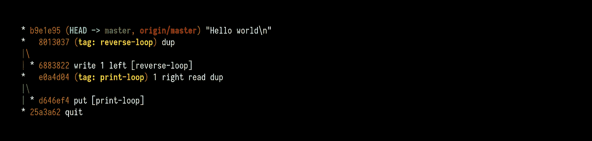
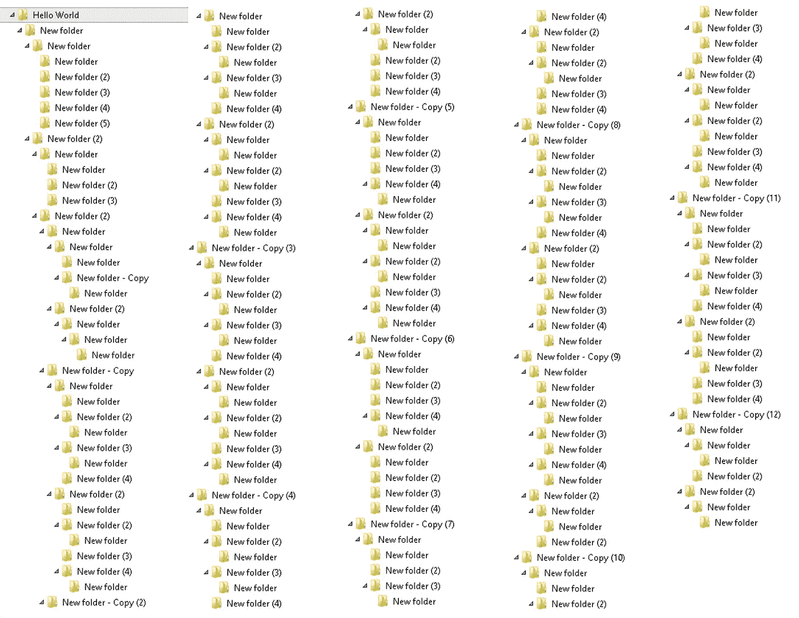
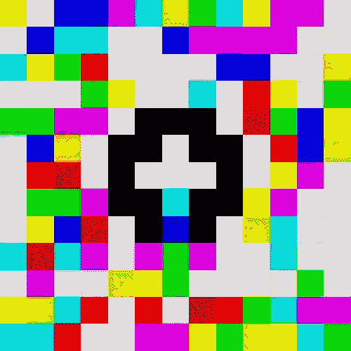
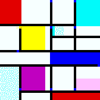

# 奇怪的编程语言

> 原文：<https://medium.com/hackernoon/weird-programming-languages-that-you-may-have-not-heard-8ddce12bab66>


已经发明了 1000 多种编程语言，其中只有大约 100 种被普遍使用。其中，有一些奇怪的，因为它们的语法和表示代码的方式而被贴上标签。在本文中，我们将研究其中的一些语言和语法。

# 合法的



你有没有登陆过一个 Github 项目，打印“hello world”程序，但是没有任何可见的代码或者任何内容。检查这个链接[https://github.com/blinry/legit-hello](https://github.com/blinry/legit-hello)，你将在这个库中看不到任何东西。但是相信我，这个项目里有一个隐藏的代码。

如果你看到[提交](https://github.com/blinry/legit-hello/commits/master)部分，你就可以揭示其中的神奇之处。它将“hello world”代码存储在 git 提交历史中。如果您克隆这个项目并运行下面的命令，那么您可以看到这个项目中隐藏的代码。

```
git log --graph --oneline
```

以下是支持的说明。

*   "[ <tag>]":跳转到指定的 Git 标签。例如，[loop]会跳转到标签循环。</tag>
*   “退出”:停止程序。
*   “get”:从标准输入中读取一个字符，并将其 ASCII 值放入堆栈。在 EOF 上，按 0。
*   " put:'弹出堆栈值，并将其作为 char 写入标准输出。该值总是被截断为无符号字节。
*   "<number>":将指定的整数压入堆栈。例如，42 将推动值 42。</number>
*   "<letters>":取消字符串转义，然后将各个 ASCII 字符压入堆栈。例如，“Hi\n”将推动数字 72、105 和 10。</letters>
*   “dup”:重复的顶部堆栈值
*   “pop”:弹出栈顶值并丢弃它
*   “add”:弹出两个最上面的堆栈值，将它们相加，将结果压入堆栈
*   “sub”:弹出两个最上面的堆栈值，从最下面的值中减去最上面的值，将结果压入堆栈
*   “cmp”:弹出两个最上面的堆栈值，如果最下面的值较大，则推 1，否则推 0
*   “读取”:将当前磁带单元的值放入堆栈
*   “写入”:弹出顶部堆栈值，并将其写入当前磁带单元
*   “左”:弹出顶部堆栈值，将磁头向左移动那么多位置
*   “右”:弹出顶部堆栈值，将磁头向右移动那么多位置

合法的编程语言源代码托管在 [Github](https://github.com/blinry/legit) 中，你可以自己尝试一下。读出更多关于[合法](https://morr.cc/legit/)的信息。

# 文件夹



这是另一个不在仓库中维护任何代码的例子。这种语言将其代码保存为文件夹。根据文件夹的顺序阅读说明。在这些文件夹中，有三个文件夹来表示类型、命令和表达式。这些文件夹中的文件夹数量表示与类型、命令或表达式的相关映射。

阅读这种语言的完整描述[这里](https://esolangs.org/wiki/Folders)

# Befunge

这是另一种有趣的编程语言，用二维空间表示它的代码。看看下面的无限循环代码。

```
>v
^<
```

你明白了吗？执行从第一行“>”字符开始。意思是执行右边的下一条指令，右边的指令是“v”。这意味着执行向下指令。这是一个无限循环。在这里，我添加了一些说明。

*   “+”加法:弹出 a 和 b 两个值，然后推 a+b 的结果
*   “-”减法:弹出 a 和 b 两个值，然后推 b-a 的结果
*   *“*”乘法:弹出 a 和 b 两个值，然后将 a 的结果推* b
*   “/”整数除法:弹出 a 和 b 两个值，然后将 b/a 的结果下推，四舍五入。根据规范，如果 a 是零，问用户他们想要什么结果。
*   “%”模:弹出两个值 a 和 b，然后推 b/a 的整数除法的余数。
*   "!"逻辑非:弹出一个值。如果值为零，则按 1；否则，按零。
*   “`”大于:弹出两个值 a 和 b，如果 b>a 则按 1，否则为零。
*   " > " PC 方向向右

*   “^” PC direction up
*   “v” PC direction down
*   “?” Random PC direction
*   “_” Horizontal IF: pop a value; set direction to the right if value=0, set to left otherwise

Read complete language specifications [此处](https://esolangs.org/wiki/Befunge)。3D 代表的语言也建立在这种语言的基础上，叫做“Suzy”。下面是一个用 Befunge 语言求阶乘的例子

```
&>:1-:v v *_$.@ 
 ^    _$>\:^
```

# 脑残

这种语言是在 1993 年发明的，试图创造出最小的编译器。这个编译器只允许八个命令编写一个程序，并基于存储单元(也称为磁带)进行操作。以下是 Brainfuck 支持的命令列表。

*   ">"向右移动指针
*   "
*   "+"递增指针下的存储单元
*   "-"减少指针下的存储单元
*   "."输出指针处单元格所表示的字符
*   “，”输入一个字符，并将其存储在指针所在的单元格中
*   "["跳过匹配项]如果指针下的单元格为 0
*   "]"跳回匹配的[如果指针下的单元格不为零

下面是如何用 Brainfuck 语言实现 hello world 应用程序。

```
1 +++++ +++               Set Cell #0 to 8
 2 [
 3     >++++               Add 4 to Cell #1; this will always set Cell #1 to 4
 4     [                   as the cell will be cleared by the loop
 5         >++             Add 4*2 to Cell #2
 6         >+++            Add 4*3 to Cell #3
 7         >+++            Add 4*3 to Cell #4
 8         >+              Add 4 to Cell #5
 9         <<<<-           Decrement the loop counter in Cell #1
10     ]                   Loop till Cell #1 is zero
11     >+                  Add 1 to Cell #2
12     >+                  Add 1 to Cell #3
13     >-                  Subtract 1 from Cell #4
14     >>+                 Add 1 to Cell #6
15     [<]                 Move back to the first zero cell you find; this will
16                         be Cell #1 which was cleared by the previous loop
17     <-                  Decrement the loop Counter in Cell #0
18 ]                       Loop till Cell #0 is zero
19 
20 The result of this is:
21 Cell No :   0   1   2   3   4   5   6
22 Contents:   0   0  72 104  88  32   8
23 Pointer :   ^
24 
25 >>.                     Cell #2 has value 72 which is 'H'
26 >---.                   Subtract 3 from Cell #3 to get 101 which is 'e'
27 +++++ ++..+++.          Likewise for 'llo' from Cell #3
28 >>.                     Cell #5 is 32 for the space
29 <-.                     Subtract 1 from Cell #4 for 87 to give a 'W'
30 <.                      Cell #3 was set to 'o' from the end of 'Hello'
31 +++.----- -.----- ---.  Cell #3 for 'rl' and 'd'
32 >>+.                    Add 1 to Cell #5 gives us an exclamation point
33 >++.                    And finally a newline from Cell #6
```

这可以用一行来表示，如下所示。

```
++++++++[>++++[>++>+++>+++>+<<<<-]>+>+>->>+[<]<-]>>.>---.+++++++..+++.>>.<-.<.+++.------.--------.>>+.>++.
```

# 饶舌的人



正如你所看到的，它是一种编程语言，程序员需要给网格着色，而不是编码单词。用于在位图图像中移动并执行与每个颜色代码相关的命令的指针。有二十种颜色用来表示命令，白色不表示任何操作。当指针试图进入黑色区域时，选择下一个块的规则会改变。下面是打印“Piet”的示例程序。



# 马尔博尔格

最后但同样重要的是，这种语言被称为“来自地狱的编程”。这个想法是编程应该很难。因此，进一步讨论语言语法是没有意义的。这种语言的一个有趣的事实是，即使是这种语言的发明者也不能自己编写程序。然而，这里有一个 Malbolge 语言的 hello world 的示例程序。如果你知道如何解码，请在这里评论。

```
(=<`#9]~6ZY32Vx/4Rs+0No-&Jk)"Fh}|Bcy?`=*z]Kw%oG4UUS0/@-ejc(:'8dc
```

# 结论

我在下面列出了我发现的其他编程语言，以供进一步阅读。关于这些语言中的大多数，一个有趣的事实是它们是图灵完备的，这意味着你可以实现其他编程语言可以实现的任何计算机程序。尽管这些编程语言看起来毫无用处，但它打开了我们的思维，让我们以不同的方式看待事物。

*   [木炭](https://github.com/somebody1234/Charcoal)
*   [厨师](http://www.dangermouse.net/esoteric/chef.html)
*   [鸡](https://esolangs.org/wiki/Chicken)
*   [圆点](https://github.com/josconno/dots)
*   [Ook](http://www.dangermouse.net/esoteric/ook.html)
*   [苏西](https://github.com/gvx/suzy)

希望你喜欢阅读这篇文章。有什么意见可以在 Twitter 找[我。关注我更多有趣的故事。请随意评论你的想法。另一篇文章再见。干杯:)](https://twitter.com/Dhanushkamadus2)


[现在你可以在亚马逊上预订芭蕾舞书的云原生应用。点击此处预购该书。](https://www.amazon.com/-/en/Dhanushka-Madushan-ebook/dp/B0912GTBPQ/)