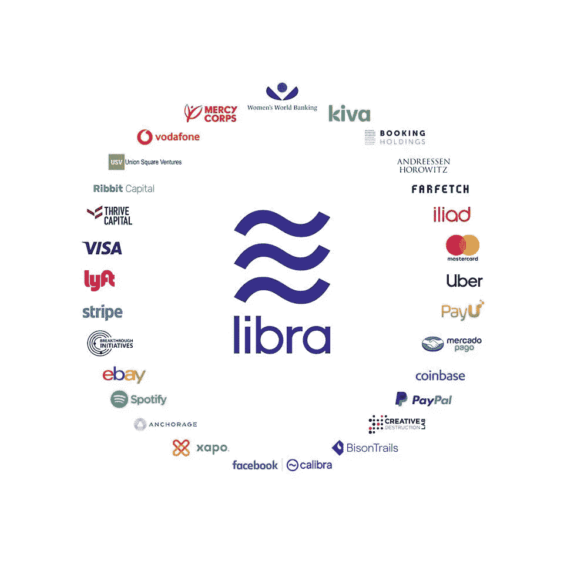

# 欢迎，天秤座:脸书加密货币

> 原文：<https://medium.com/hackernoon/welcome-libra-the-facebook-cryptocurrency-aa024cc7161>

## 脸书领导创造了一种新货币，叫做天秤座，由区块链提供动力。

硅谷巨头脸书终于公布了它的新项目！马克·扎克伯格创办的公司将与世界各地的 27 个组织一起成立非营利性的 Libra 协会，并创造一种名为 Libra 的新货币。

“Libra 的使命是创建一个简单的全球金融基础设施，让全球数十亿人受益，”扎克伯格在脸书的一篇帖子中写道。"它由区块链技术提供动力，计划于 2020 年推出."

 [## 天秤座|一种新的全球货币

### Libra 是一种基于区块链的全球加密货币，旨在促进金融包容性。天秤座是数字化的，移动的，稳定的…

libra.org](https://libra.org/en-US/) 

根据天秤座协会网站的说法，天秤座希望“重新发明货币，改造全球经济，让世界各地的人们都能过上更好的生活。”

扎克伯格解释说:“能够使用移动货币可以对人们的生活产生重要的积极影响，因为你不必总是携带现金，这可能是不安全的，或者为转账支付额外的费用。”“这对于无法获得传统银行或金融服务的人来说尤其重要。现在，大约有 10 亿人没有银行账户，但却有手机。”

Libra 的主要创始成员是金融巨头，如[万事达](https://medium.com/u/10924fd16ff8?source=post_page-----aa024cc7161--------------------------------)、Paypal、Visa 和 [Stripe](https://medium.com/u/3ecae35d6d66?source=post_page-----aa024cc7161--------------------------------) ，硅谷公司，如[优步](https://medium.com/u/b97b1b381b5a?source=post_page-----aa024cc7161--------------------------------)、 [Lyft](https://medium.com/u/54708edc644b?source=post_page-----aa024cc7161--------------------------------) 、易贝，以及风险投资公司[安德森·霍洛维茨](https://medium.com/u/df45fd4a749d?source=post_page-----aa024cc7161--------------------------------)。

据 Techcrunch 报道，每个创始成员至少要支付 1000 万美元才能加入。加入 Libra 后，他们在 Libra 协会理事会中获得一票(或 1%的总投票权，以较大者为准)，并有权从 Libra 储备用户向 Libra 支付法定货币获得的利息中获得一份红利(与其投资成比例)。

Techcrunch 写道，脸书希望在正式推出 Libra 之前达到 100 个创始成员，它向任何符合要求的人开放，包括谷歌或 Twitter 等直接竞争对手，并解释说，总部位于瑞士日内瓦的 Libra 协会将每半年举行一次会议。据 Techcrunch 报道，“该国被选中是因为它的中立地位和对包括区块链技术在内的金融创新的大力支持。”。

天秤座的理念基于几个要素和特征:

*   移动:任何人只要有一部入门级的智能手机和数据连接，就可以访问 Libra。
*   稳定:天秤座是由储备支持，以保持其价值稳定。
*   快速:天秤座的交易快速简单，无论你把钱寄到哪里，或者花到哪里。
*   面向全球:Libra 是一种全球加密货币，将在全球范围内发售。
*   可扩展:Libra 将培育一个产品和服务的生态系统，帮助人们在日常生活中使用 Libra。
*   安全:Libra 是一种加密货币，建立在考虑安全的区块链上。

据《纽约时报》报道，脸书对 Libra 寄予厚望，希望它能成为一个新的金融体系的基础，不受当今华尔街权力掮客或中央银行的控制。

“感觉是时候建立一个更好的系统了，”[脸书区块链技术研究的负责人 David Marcus](https://medium.com/u/2df0de7546a0?source=post_page-----aa024cc7161--------------------------------) 在一次采访中说道。“这对整个世界来说可能是一场深刻的变革。”

马库斯在推特上解释说:“旅程从今天开始，我们很高兴有这么一群杰出的天秤座协会共同创始人——独立的非营利实体，将管理这个新的网络和货币，我们希望它能成为世界的公益物。”

除了天秤座协会，脸书还创建了一个名为卡利布拉的子公司。它将由马库斯领导，并将在 Libra 网络和货币的基础上建立服务，从钱包开始——Libra 上将推出的众多服务之一。

马库斯在推特上写道:“创建 Calibra 的原因之一是有一个专门的、受监管的实体，该实体将向其客户做出强有力的隐私承诺，因为我们已经清楚地听到你不希望社交和金融数据混合在一起。”

> 我们明白我们必须赢得你的信任。

他继续说:“虽然脸书/卡利布拉将继续为这个项目做出贡献和工作，但在 libra 协会和网络启动时，我们不会拥有任何特殊权利或特权。换句话说，我们将拥有与任何其他成员相同的治理权利。”

据马库斯说，天秤座有三个不同的组成部分:

1.  一个基于 BFT 的(LibraBFT)许可(开始)可扩展的区块链；
2.  一种储备支持的加密货币，旨在作为交易媒介；
3.  一种新的编程语言(Move)。

Libra 白皮书除了解释结构和目标之外，还强调了加密和区块链社区参与的必要性。

*   如果你是一名研究人员或协议开发人员，那么可以在 Apache 2.0 开源许可下获得 Libra testnet 的早期预览版，并附带文档。这只是过程的开始，testnet 仍然是开发中的早期原型，但是您可以立即阅读、构建和提供反馈。由于当前的重点是稳定原型，项目最初可能会较慢地接受社区的贡献。然而，我们致力于建立一个面向社区的开发流程，并尽快向开发者开放平台——从拉式请求开始。
*   如果你想了解天秤座协会，在这里阅读更多。
*   如果你的组织有兴趣成为 Libra 协会的创始成员或申请社会影响力资助，请在此阅读更多。

欢迎，天秤座！