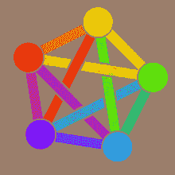

# 欢迎来到 Fe diversity！

> 原文：<https://medium.com/hackernoon/welcome-to-fediverse-2e66873c5e17>

## 一个新的脸书，新的推特，新的 Instagram 等等

关于目前可用的社交媒体平台表现有多差，已经有很多讨论。过去的每一周，我们都发现我们的隐私被随意丢弃，我们的数据被出售，我们的信息被监管，观点被操纵。

当我们这样做的时候，人们一次又一次地意识到需要更多*开放、可信和免费的平台*。我很高兴为那些渴望改变的人分享这样一个平台网络。

**这叫多样性。**

Fediverse

> “ **Fediverse** 是用于网络发布(即[社交网络](https://en.wikipedia.org/wiki/Social_networking)、[微博](https://en.wikipedia.org/wiki/Microblogging)、[微博](https://en.wikipedia.org/w/index.php?title=Macroblogging&action=edit&redlink=1)或[网站](https://en.wikipedia.org/wiki/Websites))和文件托管的联合服务器的集合。在不同的服务器(实例)上，用户可以创建所谓的身份。这些身份能够跨越实例的边界进行通信，因为运行在服务器上的软件支持一个或多个遵循[开放标准](https://en.wikipedia.org/wiki/Open_standard)的[通信协议](https://en.wikipedia.org/wiki/Communication_protocol)。作为 Fe diversity 上的一个身份，您可以发布文本和其他媒体，或者关注其他身份的帖子。在某些情况下，您甚至可以公开显示或共享数据(视频、音频、文本和其他文件)或向选定的一组身份显示或共享数据，并允许其他身份编辑您的数据(如日历或通讯录)。”

因此，通俗地说，它是社交媒体的分布式版本，即没有一个中央服务器，而是一个实例池。您可以加入任何现有的或创建自己的。此外，这里还有一些令人惊讶的功能:无论你在一个平台上分享什么，或者你在一个 fediverse 应用程序上进行什么对话，都会反映在属于这个世界的其他应用程序上，因为它们都可以使用一种叫做“[活动发布](https://en.wikipedia.org/wiki/ActivityPub)的协议相互通信。

下面用一个简短的视频来更好的解释你~

因此，你可以为现有的应用程序找到真正酷的替代应用程序:

Twitter ->乳齿象，Friendica，Misskey，ple Roma[微博]

YouTube -> PeerTube，funk whale[视频托管]

脸书-> Hubzilla，GnuSocial[社交媒体]

Medium -> Plume，write . as[常规博客]

insta gram-> pixel feed[图片托管]

点击此处查看更多应用:

 [## 多元的

### 多元化指南

Fe diversity . party](https://fediverse.party/en/miscellaneous/) 

最棒的是，所有这些应用都是开源的，功能丰富。

那么，为什么这个还没有被采用呢？

我们的互联网需要一种替代的可持续创收模式。Fediverse 有“无广告”。因此，托管实例的人通常依靠用户的捐赠来维持服务器的运行。虽然每人的数量不多，但我们中的大多数人还没有适应付费版本的互联网。此外，我相信，当你把所有的网络都转移到社交媒体上时，社交媒体也会运行起来。鉴于脸书等已经成为你的联系人的巨大目录，在短时间内完成整个网络的过渡变得非常困难。

但好消息是，我们有一个替代方案，而且我们已经开始了！

*打我@aditiBhatnagar@fsmi.social*

在网络那一边见，

干杯