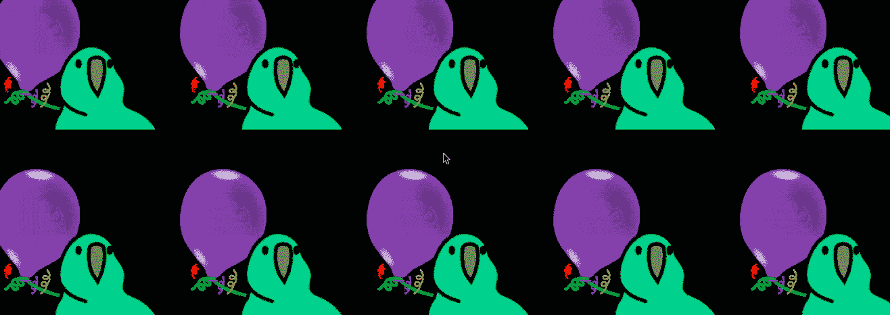
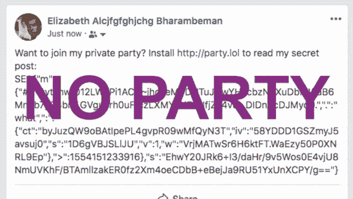
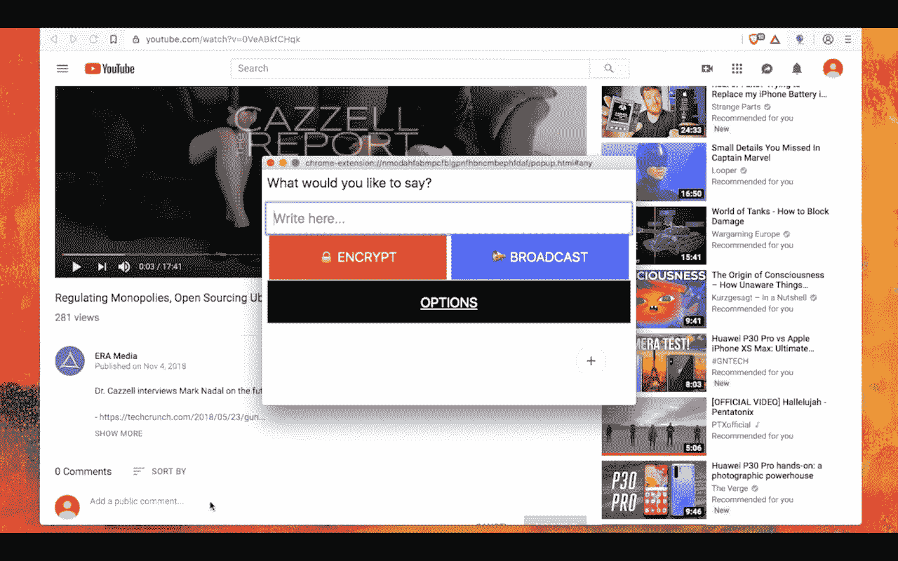
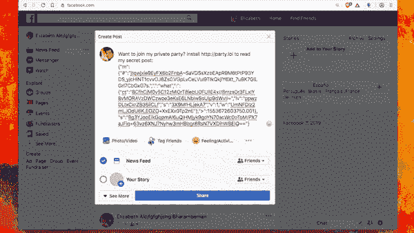
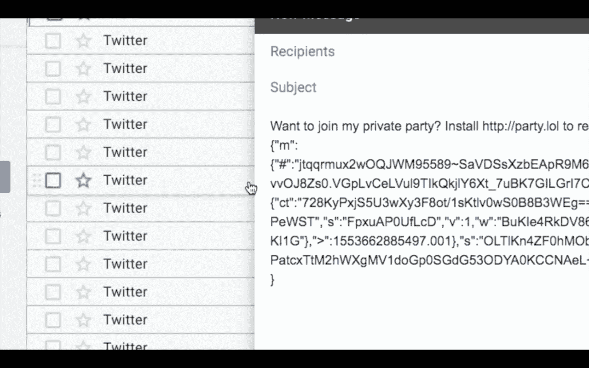

# 欢迎来到私人派对！

> 原文：<https://medium.com/hackernoon/welcome-to-the-private-party-ae3b879a9889>

## 这个时代最大的地下党——用 [http://party.lol](http://party.lol) 对抗监控资本主义！

如果你还没有看过，你一定会喜欢的。今天我们推出了 [*派对俱乐部*](https://party.lol/) ！它可以加密任何网站，因此科技巨头不知道你是在谈论猫视频、克赖斯特彻奇袭击还是苹果的新流媒体服务。

无论是 1984 年，饥饿游戏，黑客帝国，平衡，动物农场，还是搏击俱乐部…有一个共同的主题。反对吸脑企业老大哥的失败者革命。

嗯，我们已经受够了。今天。今天是互联网崛起的日子。今天我们反击，除了它比电影更酷——它的真实生活。

它是这样工作的:

# 派对模式

派对模式应该在公共或准公共网站上使用——Reddit、Slack、脸书集团等。天哪，在这样的网站上特别有趣，比如我们的聊天室，那里的人们都快疯了！

没错，你的内幕笑话可以 ***留在里面！*** 没错，在任何网站上。这是它在 YouTube 上的工作方式——当你点击任何文本/评论区域时，这个小小的加密器弹出窗口就会出现:

然后你可以写你的消息，它会加密并粘贴回输入。这是它在 Twitter 直接消息上工作的一个例子:

咿咿呀！！这很有趣。你应该[现在就安装](https://party.lol)！但是，你可能会问:

## 它是如何工作的？

派对模式使用类似比特币的工作证明来获得密钥。不，这不是区块链，没有付费游戏的骗局。这个想法是使用 PoW (PBKDF2)融化美国国家安全局的服务器，如果他们试图做大规模监控。

这里有一个具体的例子。脸书得到 10K+个帖子/秒；他们大约需要 1 小时来解密 1 秒钟的聚会模式数据。他们最好开采比特币来污染他们的生态声誉。

隐私=走向绿色。间谍=环境不纯。

但是你大概只能得到不到~10 个帖子/秒(抱歉，我也没那么受欢迎！:/但是我敢打赌[党鹦鹉](https://era.eco/party/logo.gif)是！).这意味着你是完全环保的，没什么可担心的！

尽管注意，免责声明，因为聚会上的任何人都可以解密帖子，没有什么可以阻止有人向版主报告你说过的话。如果谷歌对*的特定帖子*进行*有针对性的*攻击，他们(和/或其他人)将能够像你和你的朋友一样快地解密它。

**那么，我们能做些什么来阻止有针对性的攻击呢？**

# 秘密特工模式

秘密特工模式旨在用于私人渠道，如**电子邮件**、Twitter DMs、脸书私人信息等。，非常适合与客户或同事进行秘密交流，或者与你的女朋友/男朋友聊天。

它通过使用点对点 Diffie-Hellman 密钥交换来工作，更多细节请参见 GitHub 的。

但是加油！让我们开始聚会吧。一旦安装，你的浏览器会自动解密你朋友的秘密帖子。没有它，你会看到胡言乱语。猜猜谁独自在外面等着？；)[马上获取](https://party.lol)！

一个全新的互联网。安全、分散、私有、归您所有！**今天！**

没有矩阵哨兵，没有 1984，没有猪。只是派对鹦鹉！对抗审查，防止间谍活动，改变今天的互联网。在[产品搜索](https://www.producthunt.com/posts/private-party)和 HackerNews 和 Reddit 上投票，在 [Twitter 上转发](https://twitter.com/marknadal)(我今天会透露几个复活节彩蛋，所以制造者一定会关注)，在[安装](https://party.lol)，对脸书开秘密玩笑，在 上开 ***派对，就像我们在 90 年代知道并喜欢的互联网一样！***