# 欢迎来到狂野网络 3

> 原文：<https://medium.com/hackernoon/welcome-to-the-wild-wild-web3-4dcb6eb0bb75>

# 建立自己的加密奖励计划。把你的区块链项目带到“真实世界”

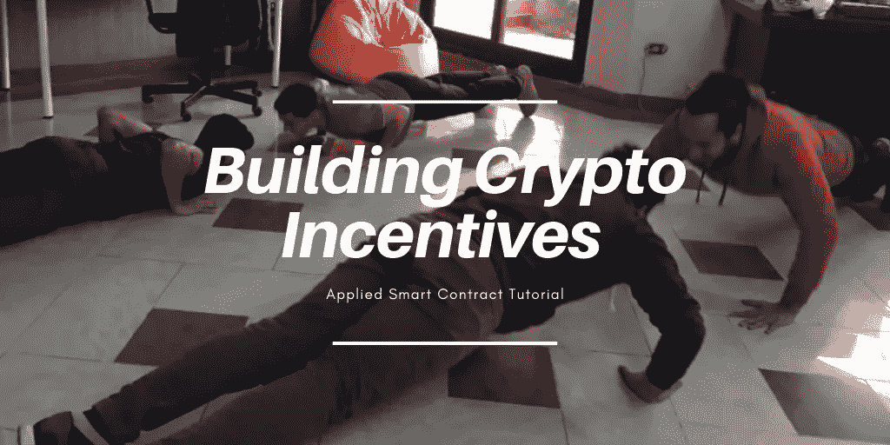

声明:我正在 Elk.cc 上举办一个免费训练营，我希望这篇文章能激发你和我一起深入了解区块链和物联网！

上面的图片是我工作的 ELK 办公室的人的照片，他们正在做俯卧撑，争夺我做的一个叫做 Elk 硬币的加密令牌。麋鹿币不值钱吗？也许吧，虽然我有时会给别人一些帮助，如果他们送我一些的话。令人好奇的是，当你提出价值主张并拥有可证明的交易时，这种动态开始发生。

当智能合约与嵌入式系统连接时，你能设计出什么样的激励方案？这些是我在 Elk 的挑衅中提出的一些问题，我将通过这篇博客帖子和下周我将举办的训练营展开更大的对话。

理解一个变化中的世界的最好方式是成为发展它的一部分。在本教程中，我想介绍一下帮助我建立关于去中心化网络(有时被称为 Web3)的心智模型的过程。本教程将帮助你建立一个分散的心态，同时带你一步一步地建立你自己的代币为基础的办公室奖励计划。

Web3 带来了一些新功能，让我们来分析一下这意味着什么:

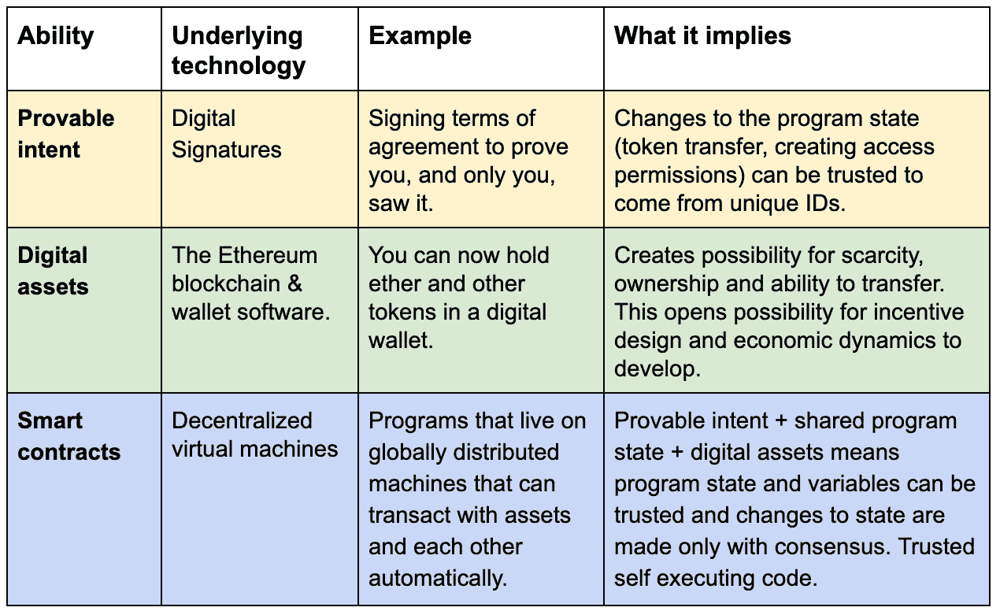

Matrix of new abilities

与其罗列一大堆事实，不如让我们实事求是地把它分解开来。通过制作我们自己的基于以太坊的密码令牌，并通过将 Elk 办公室游戏化来创造令人敬畏的激励。要加入这次冒险，你需要:

1.  你自己的以太坊钱包
2.  一些以太(以太坊的货币)
3.  30 分钟。

# 第一步——拿一个钱包

## 拿起钱包，简单的道:

## 为[火狐](https://addons.mozilla.org/en-GB/firefox/addon/ether-metamask/)、 [Chrome](https://chrome.google.com/webstore/detail/metamask/nkbihfbeogaeaoehlefnkodbefgpgknn?hl=en) 安装[元蒙版](https://metamask.io/)插件，或者在新[勇者浏览器](https://brave.com/)中使用板载插件。

## 关于如何做到这一点的一步一步的细节，请遵循这个[伟大的教程](/publicaio/a-complete-guide-to-using-metamask-updated-version-cd0d6f8c338f)。

## 拿到钱包，数学道:

一些令人惊奇的数学为许多特殊能力提供了基础，这些能力现在可以在 Web3 的世界中实现。虽然您不需要理解它就能使用它，但我在这里包含它的原因是，在没有中央服务器管理地址的情况下，直观地了解它是如何工作的是非常必要的。还因为学习很牛逼！

对于以太坊来说，你正在使用美丽图形的特性:

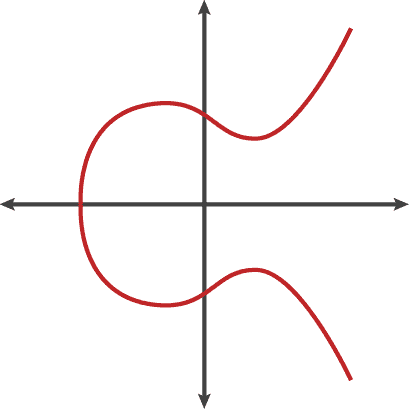

以生成[公钥/私钥对](https://en.wikipedia.org/wiki/Public-key_cryptography)。密钥对允许你在网上与人分享秘密信息，也可以证明你打算签署数字文件。这是分散技术的核心，我们希望你不要错过理解它的机会。以太坊的地址是通过对公钥进行哈希运算得到的。散列是一个从各种输入中创建一个**唯一的**固定长度字符串的函数。

如果你想通过生成你的公钥/私钥对和散列你的公钥来生成你自己的以太坊地址，你可以跟随[这个教程](https://kobl.one/blog/create-full-ethereum-keypair-and-address/)，代码[这里](https://github.com/vkobel/ethereum-generate-wallet)。如果你想更深入地研究如何从上面的椭圆曲线创建一个单向函数，[阅读这个](https://blog.cloudflare.com/a-relatively-easy-to-understand-primer-on-elliptic-curve-cryptography)。

公钥/私钥对是解锁您的钱包和发送资金的基本要素，与您的以太坊地址的身份相关，并且是您可以签名和证明意图的方式，因为只有您可以访问这些密钥。所以要保证他们的安全！

# 第二步——拿些乙醚。

所以现在你应该有一个看起来很有趣的数字串，比如:0x 21 ab 0b 3527326 DCA 4469245654 cf 881 f 5 f 7 A8 C5 e

编写区块链并与之交互的一个独特之处在于，由于您不拥有运行代码的计算机，也不需要为托管服务器付费来为您运行代码，因此您必须激励分散式网络来托管和运行您的合同。这意味着每当你想发布或运行你的分散代码时，你都需要为此付费。所以，让我们给你一些测试乙醚玩。

点击你的 Meta Mask 图标打开插件。点击顶部显示“主以太网”的区域，将其更改为“Ropsten 测试网络”，然后可以前往此处:[https://faucet.metamask.io/](https://faucet.metamask.io/)并点击“请求一个以太网”。交易完成后，点击 Meta Mask 图标，查看您全新的闪亮以太！

# 第三步——发布你的合同。

太神奇了！你有你的钱包，你有你的乙醚，现在让我们做我们的象征性合同！正如我们之前提到的，以太坊是一个拥有自己的以太币的平台。以太可以被视为运行生活在区块链上的契约代码的燃料。由于我们使用的计算资源来自其他人的计算机，使用任意长度的代码，我们需要一种方法来收取可变的金额。这个量被称为“汽油”——类似于你可能加到汽车里让它跑起来的汽油。

为了给 Elk 办公室制定我们自己的激励方案和货币，让我们考虑一下哪些功能和特性是必要的:

1.  有限的代币供应造成稀缺
2.  令牌可以被发送和接收
3.  可以查看合同中的令牌数…

现在，我们可以利用这些特性编写我们自己的智能契约，尽管由于这些代码也管理在某个时候可能有价值的令牌，所以最好使用考虑到我们可能无意中引入的漏洞和错误的审计契约。

[Open Zeppelin](https://openzeppelin.org) 已经创建了一个开放源代码并审核了 [ERC20 标准](http://eips.ethereum.org/EIPS/eip-20)的实现。以太坊的创始人 Vitalic 曾在 github、社区论坛 [reddit](https://www.reddit.com/r/ethereum/comments/3n8fkn/lets_talk_about_the_coin_standard/) 和其他地方对 ERC20 标准进行过[讨论，然后才形成目前的形式。我提到这段历史的原因是为了强调标准的设计考虑是共同产生的，你的声音很重要！](https://github.com/ethereum/wiki/wiki/Standardized_Contract_APIs/499c882f3ec123537fc2fccd57eaa29e6032fe4a)

所以，现在我们知道了一些关于 ERC20 的背景，让我们制作第一个令牌！

首先在一个单独的标签中打开[混音编辑器](https://remix.ethereum.org/#optimize=false)。现在为了简单起见，我将来自标准的 [Zeppelin 实现的所有不同模块的代码合并到一个代码块中，以简化复制和粘贴。你可以在这个](https://github.com/OpenZeppelin/openzeppelin-solidity/tree/master/contracts/token/ERC20)[粘贴框](https://pastebin.com/raw/rupPDcQ8)中找到这个斑点。这是制作您自己的令牌所需的所有代码。复制该文件并将其粘贴到 ballot.sol 中。在 remix 编辑器中，您可以将该文件重命名为 exampleToken.sol 或您喜欢的任何名称。

为了防止错误，最好选择与代码匹配的编译器，你可以在第一行看到:“pragma solidity ^0.5.2—从“**选择新编译器**”下拉列表中选择 0.5.2 提交。

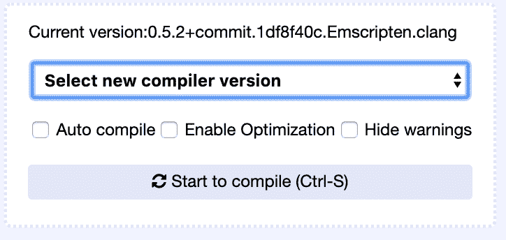

现在让我们为您的应用程序定制您的令牌。向下滚动到我分享的代码的底部，找到这一部分:

```
contract SimpleToken is ERC20, ERC20Detailed {uint8 public constant DECIMALS = 2;uint256 public constant INITIAL_SUPPLY = 1000 * (10 ** uint256(DECIMALS));constructor () public ERC20Detailed(“SimpleToken”, “SIM”, DECIMALS) {
_mint(msg.sender, INITIAL_SUPPLY);}
```

你可以把名字从**简单令牌**和简称 **SIM** 改成你喜欢的任何名字。然后，您可以将 **INITIAL_SUPPLY** 变量修改为您想要的任意多的令牌，将 **DECIMALS** 修改为您想要的任意多的小数位数。例如，如果你想要 10，000 个可以分成“便士”的代币，你可以说 10000 个用于供给，2 个用于小数。

这样，一旦部署了合同，总供应函数将返回:“1000000”，小数函数将返回:“2”。万岁！

现在我们准备发布您的合同！请仔细遵循以下步骤:

在编译器选择器的正下方，你会看到一个按钮，上面写着“**开始编译**”，如果它还没有编译你的代码，请按下这个按钮。

接下来，单击窗口右上角的“运行”选项卡。选择 Injected Web3(对于我们的目的来说，这意味着元掩码)，最后确保选择您的令牌的名称作为要发布的契约。如果你没有修改代码，它应该叫做 SimpleToken，如果你修改了，你会在这里看到你的令牌的名字。不要担心其他名称(ERC20、SafeMath 等)，它会根据需要引用其他已编译的契约模块，我们只需要运行我们令牌的契约。

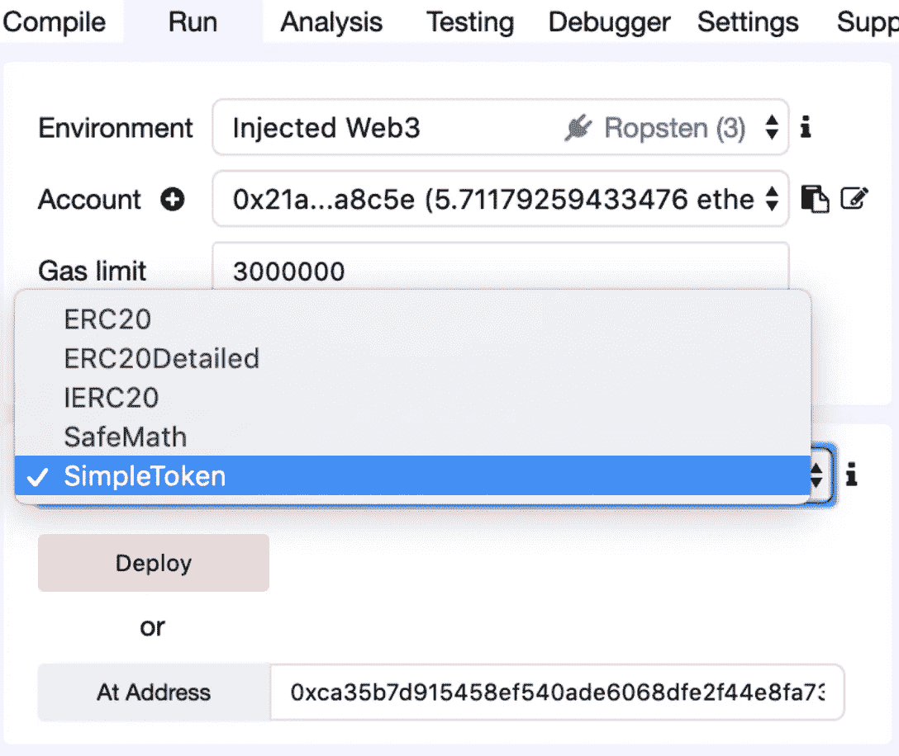

现在有趣的部分来了！玩你的代币，送一些给你的朋友！

# 将您的令牌添加到元掩码！

一旦你点击部署，它将被部署使用帐户选择在上面的下拉菜单中，它应该是一个你创建和燃料与 Ropsten 乙醚。Meta Mask 插件会弹出来让你确认。现在，由于这是上升，实际上要驻留在一个活生生的测试网络，它将需要一些时间来为矿工确认您的交易，请耐心等待。一旦它被确认，这意味着你支付了足够的汽油，让矿工认为把你的代码添加到区块是有价值的。万岁！现在，您应该会在调试窗口中看到确认信息。

向下滚动“Run”选项卡，您应该会在“Deployed contracts”列表中看到您的令牌。打开它，你可以开始点击蓝色按钮与你的合同互动。

为了确保你的合同已经公布于众，请查看你的以太扫描链接的调试屏幕。Etherscan link 是区块链上公开内容的查看器。

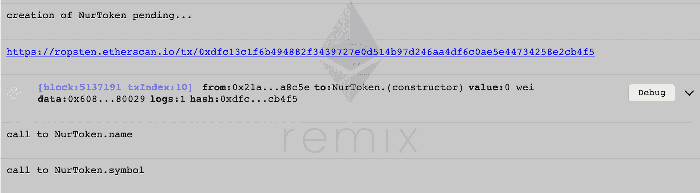

Hello Nur Token

这里是我新创建的 Nur 令牌的链接。

您可能希望使用元掩码来更容易地发送和接收令牌，并帮助其他人也发送/接收令牌。首先要做的是找出你的合同地址。需要注意的是，你的合同地址是**而不是**你的地址。它是自己的实体，如果被编程，它可以自己做出决定。您可以在以下几个地方找到您的合同:

1.  在 remix 编辑器中，在你部署的合同名称的右边是一个“复制”符号，按下它会把合同地址复制到你的剪贴板上。
2.  如果你从调试控制台进入以太网扫描页面，你可以看到这个格式的合同地址:“[合同[0x c 84 a 29 BF 11934172131067503 a 5762 aa 19d 18429](https://ropsten.etherscan.io/address/0xc84a29bf11934172131067503a5762aa19d18429)创建]”

复制你的地址并点击 Meta Mask 插件。点击左上方的三栏三明治图标，滚动直到你看到底部的“添加令牌”。点击它，然后在下一个窗口选择“自定义令牌”，并添加您从上一步复制的合同地址。它应该自动填写名称和小数位数。单击“下一步”后，您将看到您的帐户已设置为发送代币！

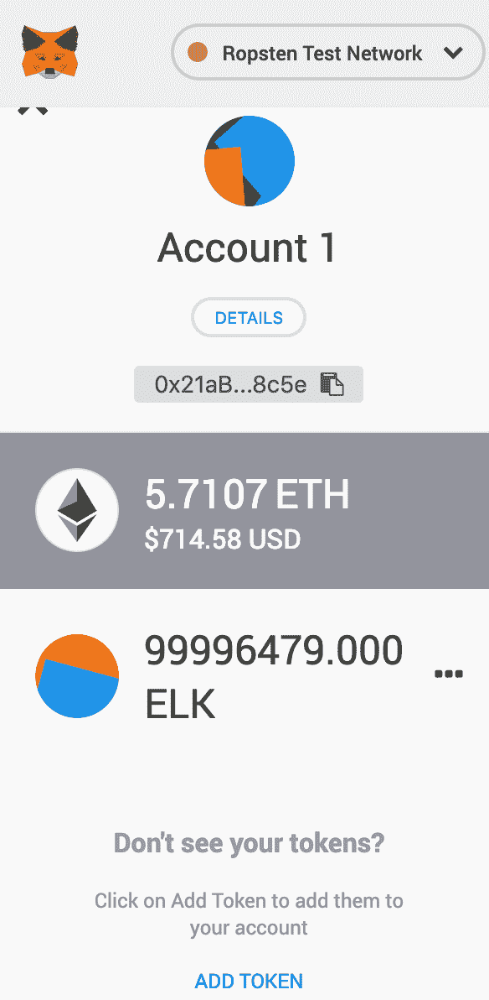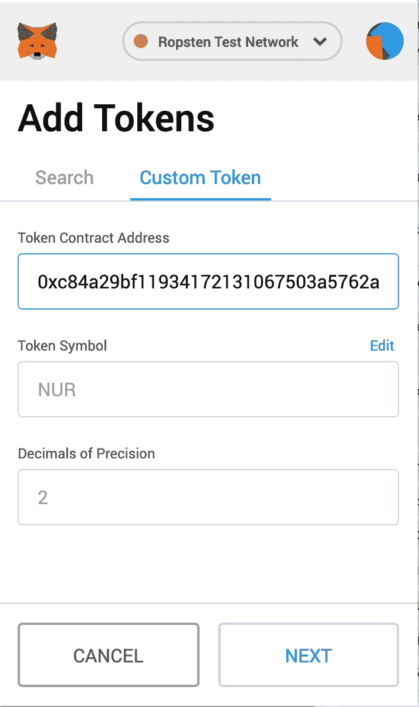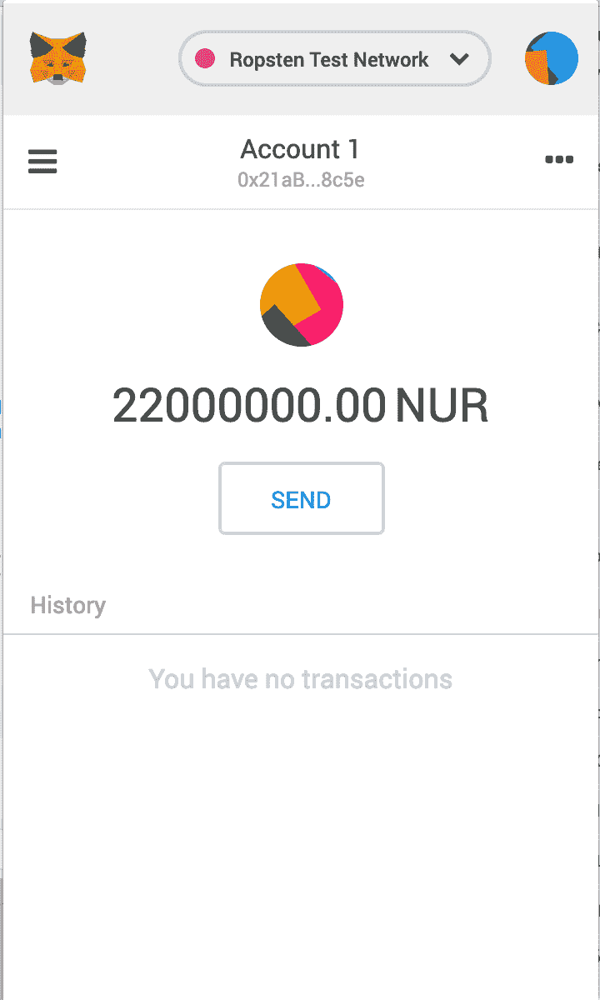

所以现在有趣的事情开始了。这些代币令人难以置信的是，当你把它们送给别人，一旦他们拥有了它们，你就再也不能收回它们了。他们可以向世界证明他们在以太扫描上拥有这些令牌，而无需信任中央服务器、银行，甚至是令牌的制造者！这为探索激励机制和游戏开辟了道路。我用我在办公室创造的麋鹿代币来挑战这里的团队，让他们爬楼梯、解谜和完成其他有趣的任务，作为交换，我送给他们麋鹿。

**提前来办公室的照片证明:**


**和“锻炼证明”:**

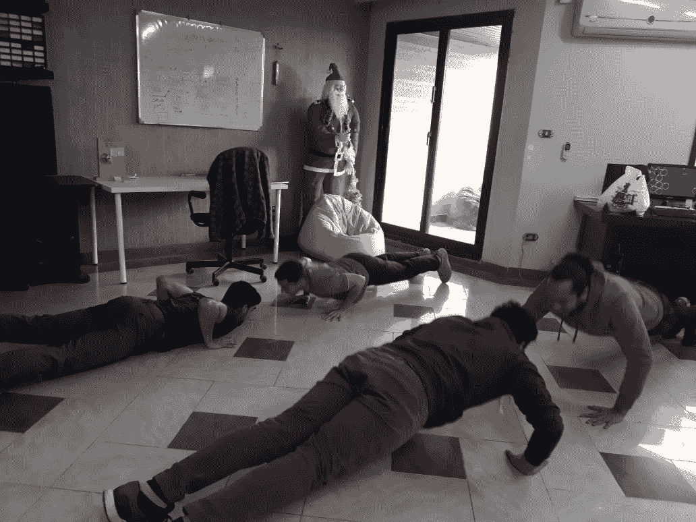

## 后续步骤:

这仅仅是开始。目前，我正在协调记录人们提出的挑战，并在一个共享的电子表格中完成这些挑战，并在办公室使用照片和对话进行验证，大量的面对面信任。

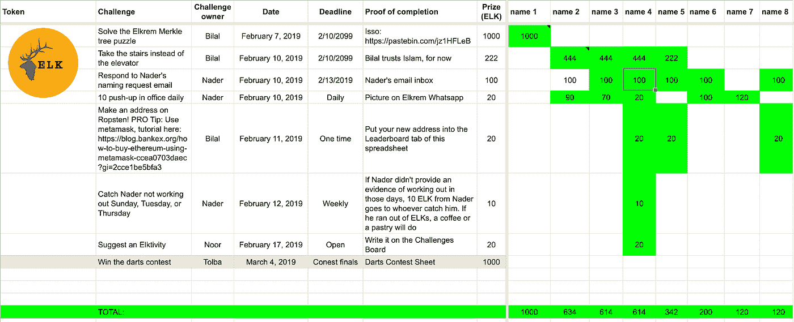

这是一个集中的失败点，不是自动化的，也没有给整个团队分配激励。更不用说，我个人是一个瓶颈，需要收到行动的证据，需要去 Metamask，给每个人发送适量的令牌。我提议使用一个 [ERC721](http://erc721.org/) 令牌规范来扩展 office 游戏化项目。你对如何创建一个更好的系统有想法吗？你将如何创建一个办公室令牌游戏化方案？

最重要的是，有了推动 Web3 的技术释放出的这些新的超能力，你会创造出什么？当我们将自动执行代码与电子系统连接时会发生什么？当你处理可黑客攻击的电子产品时，可以在区块链证明的验证变得混乱。对此我们能做些什么？这些都是开放性的问题，我已经建立了一个简短的训练营，帮助对区块链和物联网感兴趣的人发展基本技能，开始询问这个领域。

要了解更多并加入我们为期 3 周的免费训练营，请查看 elk.cc/bootcamp

我是研讨会的主持人，我也为 Elk 工作，这是一家制作开源板以简化物理世界与区块链世界的连接的公司。很高兴你能加入我们的学习之旅！

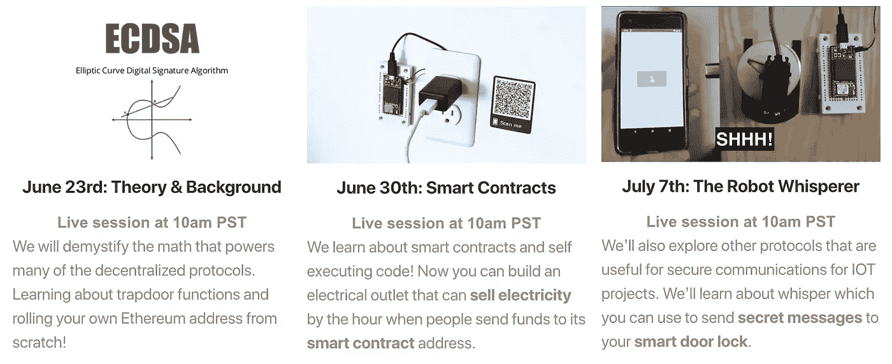

Schedule of events, join us free at: [elk.cc/bootcamp](http://elk.cc/bootcamp)

我希望这篇教程已经激起了你学习欲望。一旦区块链与嵌入式系统和物联网连接，区块链在现实世界中影响激励、创造和共享数字/物理价值并导致可信的人与人、人与计算机和计算机与计算机交易的交集将会增长。那个世界是什么样子，我们不知道。我所知道的是，它需要更多愿意学习、实验和建立这些系统的人的声音，这就是本教程和训练营的全部内容。迫不及待想和你一起打开一罐作品！

热烈地，
比拉尔·迦利布