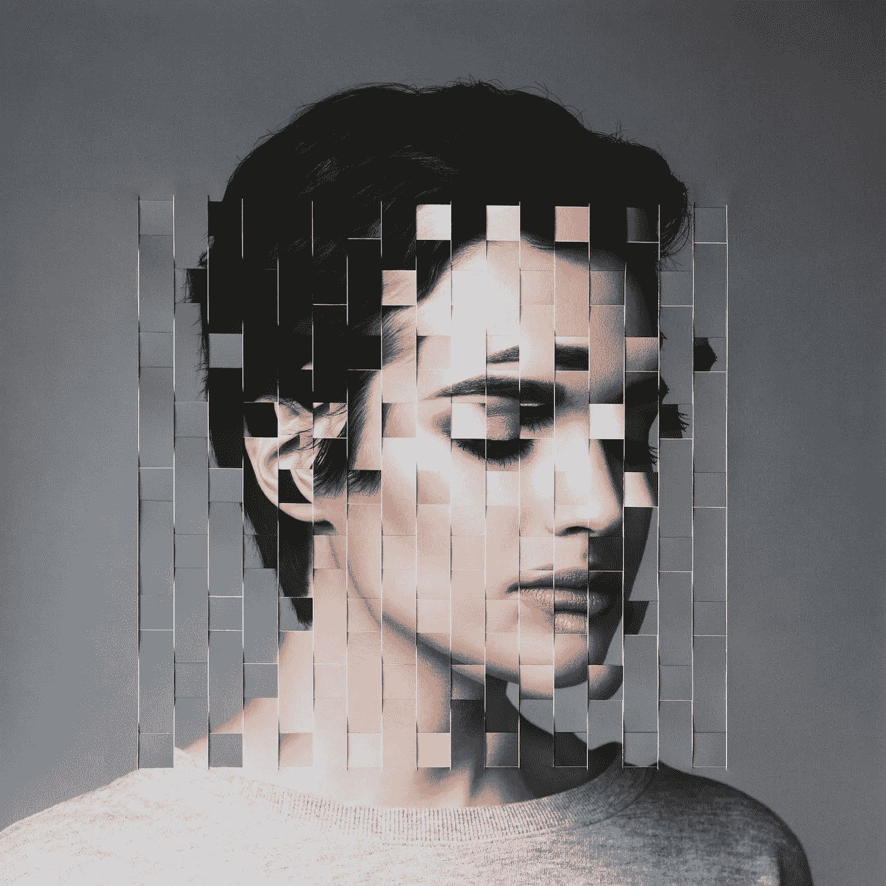

# 好吧，那完全是假的

> 原文：<https://medium.com/hackernoon/well-thats-deeply-fake-64e08d6a1040>

## 合成媒体和错误信息

我们的数据被出售，我们每天都在被操纵。你在社交媒体上表达得越多，他们就越了解你。不太同意？看看扎克伯格坦白同样的事情:

数据是一个强大的工具，社交媒体只是收集数据的调查形式。它有能力改变政府，影响政治。甚至特朗普也告诉我们同样的事情:

很惊讶吗？

嗯，你刚才看到的两个视频是假的，或者准确地说是非常假的。什么是深度假？

这是一种使用深度神经网络创建的假媒体(音频/视频/图像)。生成对抗网络(GANs)是 deepfakes 中使用的技术。两个神经网络竞争产生和辨别高质量的伪造图像。一个是“生成器”(创建看起来像原始图像的图像)，另一个是“鉴别器”(试图判断图像是真实的还是模拟的)。

你想知道 GAN 能生成什么样的图像，看看这个网站，这里显示的所有图像都是由机器生成的，没有一个是真实的人:

 [## 此人不存在

### 此人不存在

这个人不是 Existthispersondoesnotexist.com](https://thispersondoesnotexist.com) 

由于训练数据、计算能力和有效的公开共享方法和代码的数量不断增加，生产这些新形式的合成媒体的成本在过去几年中已经显著降低。

那么在深度伪装中能做些什么呢？

1.  模拟声音:增强的模拟个人声音的能力，可通过提供商开发和购买
2.  编辑视频元素:有一些工具可以在图像/视频中删除或添加额外的元素。通过使用一些工具，一个人可以完全安全地从整个闭路电视画面中消失。
3.  你想让某人说些什么或者给出一个特定的表情，你明白了。一些工具允许将一个人的面部和上身运动转移到另一个真人的面部和上身的真实外观上。
4.  围绕现有音频创建逼真的面部重建和唇同步

还有很多其他人，想看看这些功能的组合，看看这个奥巴马告诉我们这项技术的危险的假视频

> 直到 2017 年底，这种机器学习技术的使用主要限于人工智能研究社区，当时一位昵称为“Deepfakes”(深度学习和“假”的组合)的 Reddit 用户开始发布经过数字修改的色情视频。他正在使用谷歌的免费开源机器学习软件 TensorFlow 构建 GANs，将名人的脸叠加在色情电影中女性的身体上。
> 
> 一些媒体报道了这些色情视频，这些视频被称为“深度假货”。作为回应，Reddit 封杀了他们，因为他们违反了该网站反对非自愿色情的内容政策。然而，在这个阶段，视频的创作者已经发布了 FakeApp，这是一个易于使用的制作伪造媒体的平台。自由软件有效地民主化了 GANs 的力量。突然之间，任何人只要能接触到互联网和一个人的脸部照片，就能制作出他们自己的深度赝品。(来源:[《卫报》文章](https://www.theguardian.com/technology/2018/nov/12/deep-fakes-fake-news-truth))

那么，与这种情况相关的所有危险是什么呢？

除了创造非自愿的性意象，侵犯人权和隐私，还有更多。

编辑软件以及手动和自动合成可以越来越多地创建感知上真实的图像，这些图像通过肉眼操纵和视觉分析是不可见的。你没看错。此外，到目前为止，还没有有效的技术可以确定地检测媒体是假的还是人为制造的。因此，如果明天有人在社交媒体上上传一个假视频，一个政治领导人说的话可能会造成严重破坏，社交媒体没有能力识别视频是假的，并阻止它被上传。这样的抓取内容可以很容易地被用来在疯狂的高水平上操纵人们。

此外，这种技术的存在给依赖视频作为事件发生证据的记者带来了巨大的麻烦。

根据[这篇](https://blog.witness.org/2018/07/deepfakes/)见证者博文

这种不断变化的格局为人权和可靠的新闻报道带来了新的挑战，其中可能包括各类干扰，包括:

*   **现实编辑**删除或添加照片和视频，挑战我们记录现实和保存图像证据价值的能力，并增强犯罪者质疑侵权真相的能力。
*   **真实人物的可信复制品**，增强操纵公众或个人实施侵权行为或煽动暴力或冲突的能力。
*   **新闻混合**利用可信度的外围线索和快速的新闻循环来扰乱和改变公共叙事。
*   **似是而非的否认**犯罪者反射性地声称，在犯罪镜头周围“这是一个严重的假新闻”,或者更进一步，将任何有争议的信息视为另一种形式的假新闻而不予理会。
*   **通过计算机宣传和个性化的微观目标制造的虚假洪流**,导致剩余的公共领域被扰乱，并压倒了事实调查和核实方法。

与所有其他技术问题一样，首要问题又回来了，谁负责？确保遏制错误信息的方法是社交媒体、科技巨头还是政府的责任？能否以一种不损害我们言论自由的方式做到这一点？这种技术的生产和使用能被限制在有限的人和组织中使用吗？我们还能依靠视频作为事件发生的证据吗？

假新闻仍然是一个悬而未决的问题，在这种情况下，获得先进的深度造假技术只会增加这个问题的严重性。

技术总是有优点和缺点，但对于这一个，缺点显然更重要。尤其是在没有相关法律的情况下。

作为网民，我们有什么选择？不要相信任何东西，保持警惕，交叉验证信息。我们比以往任何时候都更需要可靠的新闻来源，我们比以往任何时候都更需要人们意识到这些事情。

> 这篇文章是在 90 年代夏天的概念下撰写的。
> 
> “90 年代的夏天”是一个有意识地分析我们对技术的使用，并传播对它带来的问题的认识的倡议，如数字隐私，安全，技术成瘾和设计道德。
> 
> 欢迎你加入我们的行列！
> 
> 在媒体上关注我们，在[脸书](https://www.facebook.com/summer.of.90s)或者在 Instagram 上关注[@ 90 年代的夏天，因为我们需要传播消息。](https://www.instagram.com/summer.of.90s/)