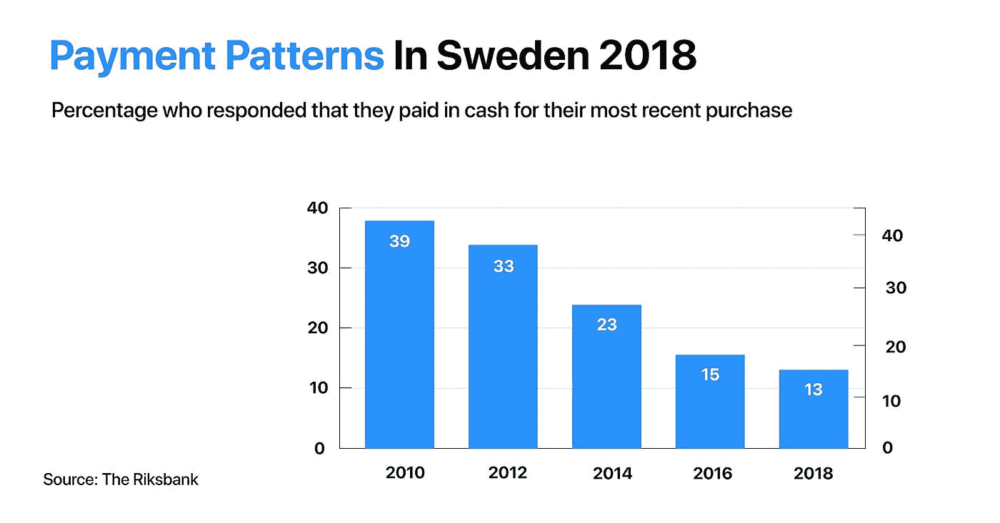
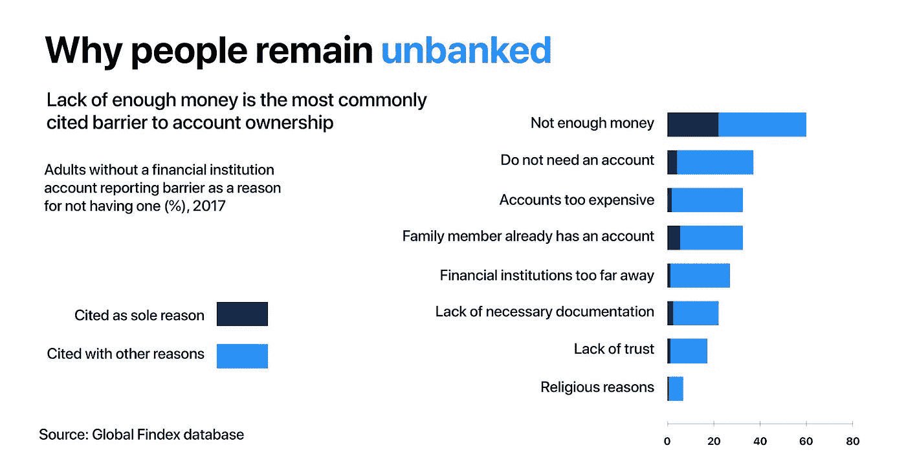
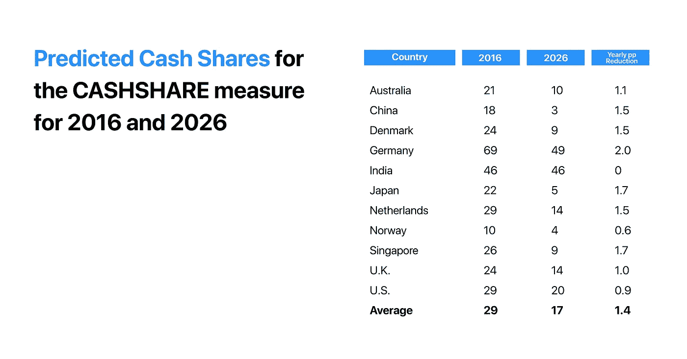

# 我们要更少-现金，而不是无现金

> 原文：<https://medium.com/hackernoon/were-going-less-cash-not-cashless-f1a97f912dff>

## 纸币还没有消亡。

对我们大多数人来说，用借记卡或信用卡支付没什么大不了的。咖啡？刷一下。超市？刷一下。公交车？无论你想要什么，你只要刷一下就行了！用信用卡支付既简单又安全，而且它让我们在城市里四处走动时，不用把装满现金的大钱包放在口袋里。但是，我们离“无现金社会”真的有多远？

在一些发达国家，尤其是斯堪的纳维亚国家，留下现金的想法正在迅速流行。瑞典是一个公民社会和企业如何走向无现金现实的完美例子。

去年，瑞典央行瑞典央行(Riksbank)进行的一项全国性研究显示，瑞典人在 2018 年进行的几乎所有交易都经过了数字化处理，要么通过刷借记卡/信用卡，使用非接触式技术(NFC)，要么依靠移动应用程序，如 Apple Pay、Google Pay 或 Swish。哦，你没听说过那个吗？

早在 2012 年，瑞典的六大国家一起推出了 Swish——一款移动支付应用程序，可以实现点对点和点对点的即时数字转移。虽然这款应用已经成为一种便捷的支付方式，但它只在当地有效。

根据同一项研究，只有 13%的瑞典人在最近的购物中使用纸币，低于 2010 年的 40%。

与这一发现相一致的是，这项研究还强调了从自动取款机中提取现金的急剧减少。近 20%的受访者表示，他们在过去 12 个月中从未提取过现金，而 42%的受访者表示，他们每月使用自动取款机的次数少于一次。

皇家理工学院(KTH)工业动力学副教授 Niklas Arvidsson 预测，瑞典将在 2023 年成为第一个无现金经济体。但是，在这场无现金竞赛中，瑞典并不孤单。挪威、芬兰、冰岛和丹麦也走上了用数字货币取代实物货币的道路。

# 传统&糟糕的银行服务“挡住了门”

遗憾的是，北欧人接受日常生活无现金解决方案的方式与其他国家的货币关系形成了鲜明对比。

事实证明，在 75%的国家，现金仍然是首选支付方式。G4S 的'【2018 年世界现金报告'指出，这些国家近一半的金融交易是用纸币进行的。

为了衡量现金在社会中的相关性，研究人员将流通中的现金与当地的 GDP 进行了匹配。就现金依赖而言，南美仍居首位，其次是非洲，而亚洲和大洋洲是现金依赖程度最低的地区。

现金依赖在很大程度上与文化和可用的支付方式有关。在拉丁美洲，银行业危机、政府违约的历史，以及目前缺乏优质金融服务和数字工具，似乎可以解释为什么现金在南美消费者中为王。

难怪拉丁美洲和加勒比海地区是全球 20 亿人口中 20%以上无法进入传统金融系统的人的家园，他们被称为“无银行账户者”。2018 年，巴西中央银行发布了一项研究，证明该国超过一半的活跃人口以现金形式领取[工资](http://agenciabrasil.ebc.com.br/economia/noticia/2018-07/parte-da-populacao-ainda-guarda-moedas-em-casa-diz-banco-central)。

还有更多。巴西支持微型和小型企业服务机构的一份报告显示，60%的巴西企业没有接受卡支付的 POS 终端。换句话说，只有五分之二的商家会允许用银行卡支付货款。

根据世界银行【2017 年全球 Findex 报告，开设银行账户最常提到的三个障碍是缺乏足够的资金、不需要资金和成本。

从所有地区来看，报告银行账户太贵的受访者比例在 LATAM 地区是其他地区的两倍。在巴西、哥伦比亚和秘鲁，近 60%的人认为成本是一个障碍。距离也是一个重要因素，22%没有银行账户的成年人表示金融机构离他们太远。

对此，G4S 集团首席执行官阿什利·阿尔曼扎表示:

“人们信任现金；它可以免费使用，消费者随时可以获得，它是保密的，它不会被黑客攻击，也不会耗尽电池电量——这些独特的品质对生活在各大洲的人们来说仍然具有重要的价值。”

# 现金不再管用，银行家们也知道这一点

支持现金的最强有力的论据之一是，实物货币是金融包容性的基础。但真的是这样吗？现金让每个人都能进行金融交易。从在售货亭买可乐到缴税。然而，金融包容性远不止于此。例如，获得投资工具和贷款解决方案。

去年，国际货币基金组织(IMF)总裁克里斯蒂娜拉加德(Christine Lagarde)发表了一篇题为“货币的变化性质”的演讲，敦促各国央行开始更仔细地看待数字货币，因为对现金的需求继续下降。

“让我从金融普惠说起，在这方面，数字货币提供了巨大的前景，因为它能够接触到偏远和边缘化地区的人们和企业。我们知道，银行并不急于为穷人和农村人口服务。”

在这种情况下，数字化提供了独特的机会。世界银行的数据显示，银行服务不足的总人口中有三分之二拥有手机。由于数字货币的创新银行，如 [Crypterium](http://crypterium.com) ，这些人不仅可以获得安全、负担得起的账户来存放他们的资金，还可以获得金融服务，如低费用的[全球支付卡](https://preorder.crypterium.com/)，贷款，储蓄账户和投资产品。

另一方面，央行也很可能从向无现金社会的转变中受益。印刷实物货币对央行来说是一笔巨大的开支。在某些情况下，这种费用可能高达一个国家国内生产总值的 1.5%。

国际货币基金组织[的一份工作文件](https://www.imf.org/en/Publications/WP/Issues/2019/03/01/Cash-Use-Across-Countries-and-the-Demand-for-Central-Bank-Digital-Currency-46617)指出，数字货币有两大好处:

*   降低向公众提供现金的成本:如今，这涉及到印刷、储存和分发现金等多个过程
*   提高用户便利性:无需访问 ATM 来执行基本操作，如存款、取款或支付账单

正如你所料，瑞典在这方面没有浪费任何时间。中央银行正计划测试自己的数字货币:电子克朗。试点将于 2019 年开始。

# 少-现金，不是无现金

毫无疑问，从人们的生活、政府和企业中取出现金，并用数字版本的 it 取而代之，可以带来一系列好处，比如增强安全性、提高便利性和效率，以及降低成本。但要实现这一目标，还有许多挑战需要克服。

如何到达网络连接差的地方？如何帮助老年人在不应对挫折的情况下进入数字化环境？需要回答这些问题以及许多其他问题，以确保全面负责地采用数字解决方案。

“我们需要停下来想想这是好是坏，而不是坐视不管。如果现金消失，这将是一个巨大的变化，对社会和经济产生重大影响，”瑞典议会委员会主席马茨·迪伦说。

总而言之，赌注是在无现金世界一边，但数字支付技术的集成和实施可能会逐步进行。也就是说，我们满怀信心地说，我们正走向一个现金更少的现实，并希望实现一个无现金的现实。

## 关于[地穴](https://medium.com/u/3c3059b00067?source=post_page-----f1a97f912dff--------------------------------)

根据毕马威和 H2Ventures 的说法，Crypterium 是最有前途的金融科技公司之一。我们的目标很明确:有了 Crypterium，无论你用传统货币做什么，你都可以用数字资产来做。

该团队由 Visa 中欧和东欧[前总经理 Steven Parker](https://medium.com/u/d5786b203ba6?source=post_page-----f1a97f912dff--------------------------------) 和来自全球金融机构的高管领导，如复兴保险、伦敦衍生品交易所、美国运通等。

[网站](http://crypterium.com/) ๏ [电报](https://t.me/crypterium) ๏ [脸书](https://www.facebook.com/pg/crypterium.org) ๏ [推特](https://twitter.com/crypterium)๏[Reddit](https://www.reddit.com/r/crypterium_com/)๏[YouTube](https://www.youtube.com/channel/UChl-t3ilQK9mKj0jgXCdaxA)๏[LinkedIn](https://www.linkedin.com/company/crypterium/)