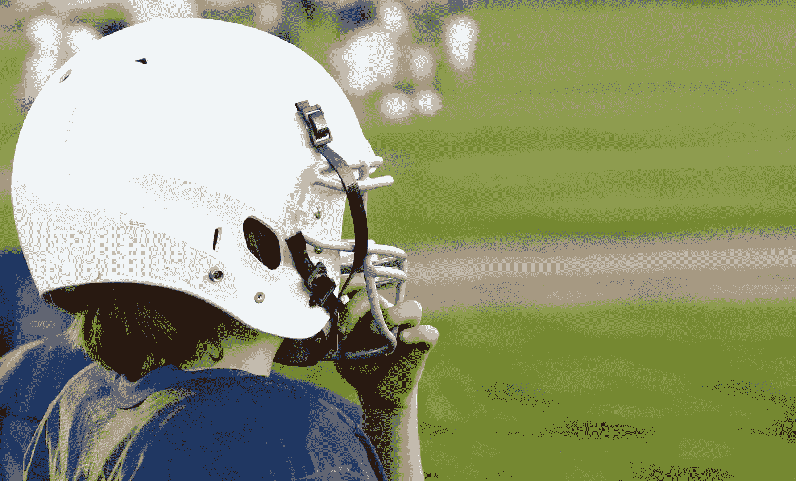

# 6 个超级碗广告告诉了我们机器人的未来

> 原文：<https://medium.com/hackernoon/what-6-superbowl-ads-tell-us-about-our-robotic-future-c79c9e8ac117>

## 超级碗？更像是超级无聊，艾玛莱特？

我不是美国人。因此，我很难理解超级碗的文化和社会重要性，即使我能欣赏球迷的热情和每年发生的如此有趣的盛况。据我所知，今年爱国者队和公羊队之间的比赛是一件特别无聊的事情，一些看起来像墨西哥辣椒的艺术家脱下了他的衬衫，这是一整件事。所有的迷因页面都在谈论它。[互联网上的海绵宝宝也在暴动](https://www.reddit.com/r/BikiniBottomTwitter/)。除此之外，没有什么可以说的主要事件是游戏和中场休息。

另一方面，广告一直是我用来更好地评估这个全球最大经济体在特定时刻的心情的主要工具。毕竟，这是继好莱坞之后美国最伟大的文化输出之一。尽管与去年相比，今年的广告比“有争议的”要温和得多，但人们仍然可以感受到对我们与日益自主的机器人和算法共存的一丝不安。因为我不喜欢实证研究，喜欢看电视，所以我选择过度解读 6 个超级碗广告，以衡量流行文化对我们[机器人](https://hackernoon.com/tagged/robotic)未来的想法，并从愚蠢的插科打诨中推断出更深刻的意义。

也许这就是为什么我没被邀请去观影派对。

# 涡轮税

上面的广告以一个“机器人小孩”为特色，他梦想成为一名……涡轮税现场注册会计师？然而，有人告诉我们这是不可能的，因为所有的涡轮税注册会计师都是“有真实情感的人”。事实证明，机器人小孩的情感不够复杂，不适合这份工作。这个机器人听到这个消息后很难过，但却发出了令人毛骨悚然的笑声，这进一步证明了它是多么不适合这个角色。不讨论童工法。

有趣的是，目前机器学习和[人工智能](https://hackernoon.com/tagged/artificial-intelligence)最有效的使用之一是在客户服务领域，大量的数据和丰富的客户痛点允许公司使用算法来更好地预测需求，回答问题或优化客户旅程。然而，随之而来的是许多失败的尝试，这激怒了客户(在过去的一年里，你有多经常对着你的电话大喊“我想和人类说话”？).通过这个广告，TurboTax 通过强调其(新发现的，正如短语“**现在**与按需注册会计师”强调的)人性方面，将自己与竞争对手区分开来。

它表明，随着公司找到越来越多的人工智能使用案例，面临技术挑战的公司可能有机会通过强调其有益的人情味来充分区分自己，以赢得新的市场份额和抵消生产力损失。这也表明，我们还远远没有到机器人在客户服务方面像人类一样值得信任的那一天。

这也是企业社会责任策略的一种形式:TurboTax 不会用廉价的技术取代它的员工。这给了它一个良好的形象，可能有助于招聘，也有损竞争对手的形象。

# Michelob

在上面的广告中，我们看到具有未来感的人形机器人在跑步、打高尔夫、拳击、骑自行车方面胜过人类……然而，这些机器人很悲伤，因为他们在努力后不能喝一杯。事实上，根据品牌，保持健康是值得的，如果你能享受它。不讨论酒精中毒。

该视频显示，尽管我们确实担心被机器系统地超越，但我们总能从使我们成为人类的事物中找到安慰。正如我们将看到的，这是一个反复出现的广告主题。

对运动的强调很有趣:我们已经创造了在认知任务上远远优于人类的[机器](https://arstechnica.com/gaming/2019/01/an-ai-crushed-two-human-pros-at-starcraft-but-it-wasnt-a-fair-fight/)，但很少有机器可能在复杂的身体任务上胜过人类，例如跑步[，正如 Boston Dynamics 反复展示的那样](https://www.youtube.com/watch?v=q5qno5i1H3k)。鉴于广告的背景，我相信这只是一个品牌决策。然而，它并没有帮助普通人了解机器人能做什么和不能做什么。

这种啤酒还吹嘘自己“没有人工色素或味道”。这可能是一个巧合，但如果这是对人工智能缺乏品味和灵魂的评论，那么无论是谁制作了这个广告，都值得称赞。

# 简单安全

这则广告背后的主旨很简单:一切都很糟糕。因为一切都很糟糕，我们很害怕。我们害怕蛇、疾病、闪电、车库门……最重要的是，我们害怕机器人。

机器人正在取代我们的工作。机器人正在飞越我们的财产，监视我们。机器人在监听我们的每一次对话。在这中间，令人毛骨悚然的邻居对他们手机上看到的最新八卦喋喋不休，加剧了这一切。

这个片段非常贴切地表达了恐惧:

*   对于美国中部的大部分地区来说，自动化正日益成为现实
*   [无人机越来越令人担心机场安全和隐私](https://www.theverge.com/2018/12/20/18149819/london-gatwick-airport-drone-shutdown-reports)
*   [Alexa 已经表明，当我们不一定想要它的时候，它会非常听我们的话](https://www.independent.co.uk/life-style/gadgets-and-tech/news/amazon-alexa-patent-listening-to-me-facebook-phone-talking-ads-a8300246.html)
*   手机给我们提供了大量的新闻，让我们变得焦虑，这些新闻通常是由让我们上瘾的算法兜售的

难怪我们希望在这个世界上保持安全，并希望继续远离所有这些问题。鉴于美国的…文化，这个广告可能是为了枪支权利。考虑到智能家居带来的伦理困境，它宣传了更多将与我们的家庭相连的技术，这一事实有些令人困惑。然而，这并没有错:“好”算法对“坏”算法，“好”机器人对“坏”机器人的未来比我们想象的更近。

# 冲刺

上面的广告有点混乱。我是说…看上面这张图。然而，它的核心是关于机器人提出想法，但却很糟糕。这也是关于 Bo Jackson，一个足球和棒球明星，他想让你知道 Sprint 给了你两个世界最好的东西。我猜麦莉·赛勒斯那天在别的地方很忙。

这个很容易解码(因为这是一个可怕的广告) :我们不需要机器人来告诉我们如何发送信息。被自动化取代的广告客户可能真的会喜欢这条消息。然而，使用机器人而不是儿童、巨魔或女巫的事实表明，我们的机器人朋友在我们的脑海中占据了多么重要的位置。

# 品客薯片

品客薯片的广告展示了两个男人讨论将品客薯片堆叠在一起的乐趣，以创造出冒险的混合口味。有人问一个人能想出多少种口味，Alexa 插话回答。它继续陈述它的悲伤:它没有手，没有嘴，没有灵魂来享受美味的小吃。播放悲伤的音乐。"我在一个残酷无情的人的摆布下……"然后她被打断了。

我们假设“上帝”这个词即将到来。有趣的是，[人工智能词汇一直是救世主般的梦想和启示录](https://hackernoon.com/deus-ex-machina-fa-i-th-in-the-age-of-artificial-intelligence-6482b549e413)的变幻莫测的纠缠，重新利用诸如“超越”、“使命”、“福音传道者”和“先知”等词。

同样有趣的是，我们的主角对算法缺乏同理心:如果它更好地模仿人类行为，我们会更有同理心吗？道德问题比比皆是，然而从这个广告看起来，这可能永远不会发生，这对未来的人工智能战争来说不是一个好兆头([都欢呼 Rokko 的蛇怪](https://wiki.lesswrong.com/wiki/Roko's_basilisk))。在本文展示的一半广告中，人类要么忽视人工智能的痛苦和/或苦恼，要么为此欢欣鼓舞。不好看。

最后的想法:**我简直不能相信亚马逊让 Alexa 回答一个没有被直接问到的问题**。这只是加强了亚马逊工具一直在监听的信念。似乎是一个非受迫性错误。

# 自动警报系统

说到…在这个广告中，Alexa 被嵌入到一个微波炉中，AWS 嘲笑自己显然没有把它放在任何地方(牙刷、狗项圈、热水浴缸、太空…)。它还指“事件”:Alexa 多次打开和关闭美国电网的时间。

听着。这个广告很有趣。很傻。它有韩独奏。

但是天杀的，亚马逊真的假装它 a)控制了美国的电网，b)一个算法错误就能让它全部关闭吗？因为这可能发生，到时候没人会笑。这则广告进一步强调了将大型事物交给未经训练的算法的风险，这些算法可能会随时出错。

# 总之…

我知道这些广告是为了搞笑，是故意不切实际的。但它们反映了我们共同的心理，我们对未来的希望和恐惧。它不仅反映了我们的焦虑，也反映了我们的误解，其中有很多:

*   几乎所有的广告都强调机器人远离人类，没有人类的情感。然而，人类设计了它们，并在它们的创造中融入了一点自己。我们知道这一点。作为创造者，人类有责任通过适当、道德和负责任的框架以及哲学界限来控制机器人的影响。
*   还有一个几乎不变的重点是什么使我们成为人类。啤酒。手臂。情绪。所有这些都反对我们进入数字世界。但现实更复杂。现代机器人被设计成具有合作精神，而不是渴望模仿人类。广告商可能通过简单地展示我们有多频繁地得到这种技术的帮助来做很多好事。
*   我们看到的大多数机器人都是人形的。这是可以理解的:我们需要让我们如此担心的算法的物理表示。但是让它们变得像人类是愚蠢的，因为它忽略了软件和硬件之间的区别。是的，我们有一个人工智能，它可以在国际象棋上打败人类，但人类可以在比赛后回家泡茶，制作宜家家具，然后踢足球。[你见过机器人移动](https://www.youtube.com/watch?v=KfNRXTS55nY)吗？你知道那些蹩脚的机器人值多少钱吗？几百万！

归根结底，广告仅仅是社会的一面镜子，反映了社会的成功和不平等。也许，仅仅是也许，超级碗广告带来的最好的东西不是更好地理解技术，而是更好地理解我们自己。

# 参加一项运动

这篇文章最初是为 [**The Pourquoi Pas**](https://www.thepourquoipas.com/) 撰写的，这是一份对当今技术挑战进行深入分析的在线杂志。 [**点击此处进入**](https://www.thepourquoipas.com/post/what-6-superbowl-ads-tell-us-about-our-robotic-future) 。