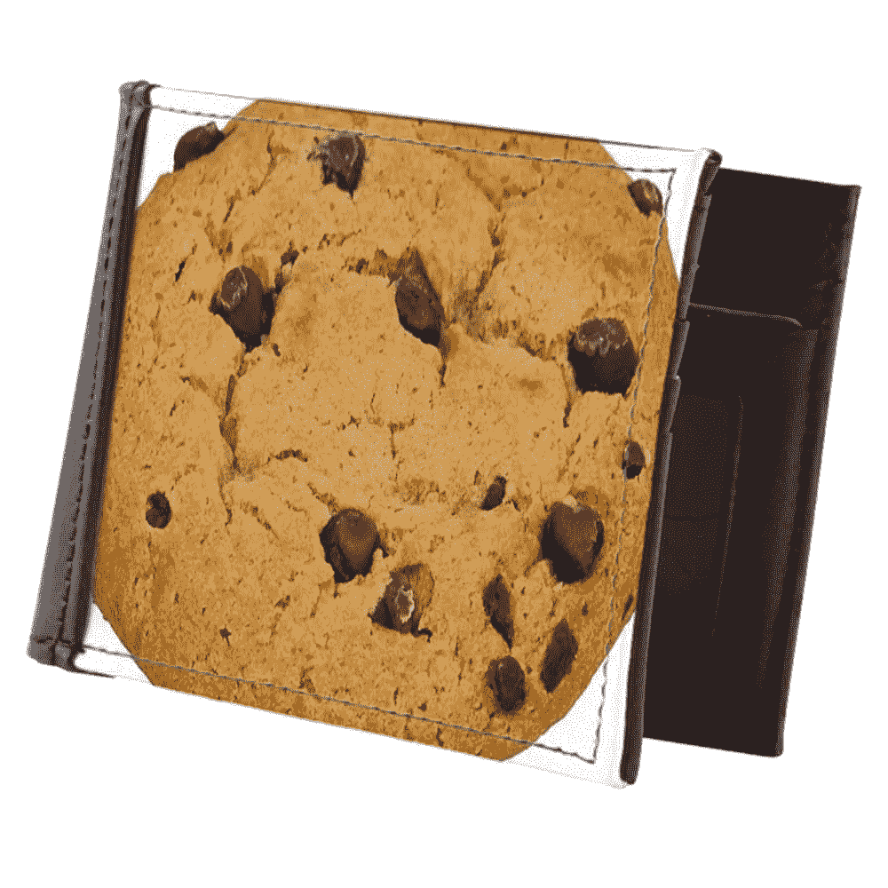
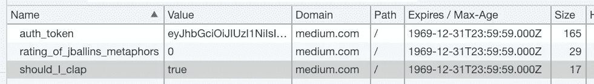

# 什么是 HTTP cookies？

> 原文：<https://medium.com/hackernoon/what-are-http-cookies-91359fd798b2>

## 打开你的钱包。看到里面有饼干吗？我知道。

**cookie 是网站在你的浏览器中存储信息的一种方式。**

gift idea for the web enthusiast in your life

# 我钱包里的饼干？？🤔

是的，你的 ID 就像一块饼干！🤯

政府(发行者)提供一个 ID (cookie)，你把它存储在你的钱包(网络浏览器的存储器)里，无论你去哪里都带着它(世界是你的网络浏览器/牡蛎)。

您的 ID 可以用于登机(请求):TSA 代理将验证您的 ID 的有效性，以确保它是由政府(发行人)提供的，而不是伪造或篡改的(授权令牌也验证有效性/篡改)。他们将确保您与身份证上的照片相符，并且姓名与机票相符(验证——“您是谁”)，如果没有问题，您将被允许(“授权”——您可以做什么”)进入登机区域。

身份证(cookies)是政府(发行者)存储和请求公民(用户)信息的一种强有力的方式。

授权只是使用 cookies 的一个例子——它们可以存储任何可以转换成文本的东西。

# 类比已经够多了…🤦‍♀️

🥺，你不喜欢我的比喻吗？好吧。技术术语传入…

## 饼干 vs. `localStorage`

`*localStorage*` *只是在浏览器中存储数据的另一种方式。*

Cookies 会随着每个 HTTP 请求(访问 URL、提交表单等)自动发送。)，而`localStorage`需要使用 JavaScript(代码)手动访问。Cookies 用于向服务器发送信息，而`localStorage`用于存储只需要在客户端(在浏览器中)使用的信息，并且(通常)不会发送到服务器(即游戏的高分)。

## 饼干是怎么用的？

Cookies 通常用于存储认证令牌(授权请求所需的密钥)、跟踪浏览历史(通常由广告商使用)或记录状态(即添加到您的购物车中的商品)。

## 我如何看到我的饼干？

你可以通过打开“开发者工具”在浏览器中查看(甚至修改)你的 cookies(针对当前域/网站)，在那里你会看到它们只是一个“字符串”(文本)的键/值对。

How cookies look in Chrome Developer Tools

没那么糟吧？**cookie 只是一种存储需要跨 http 请求保持的信息的方式。**💡

## 饼干不邪恶吗？

cookies 有时遭到恶评的原因是因为“第三方 cookies”。第三方 cookies 被嵌入到整个网络的广告中来跟踪你的浏览历史，用(noble🤑)提供目标广告的目标。

不要讨厌饼干…它们是让互联网如此伟大的重要部分。虽然它们可以用来收集数据，但它们也可以给你一个“难忘的”用户体验。浏览愉快。✌️

