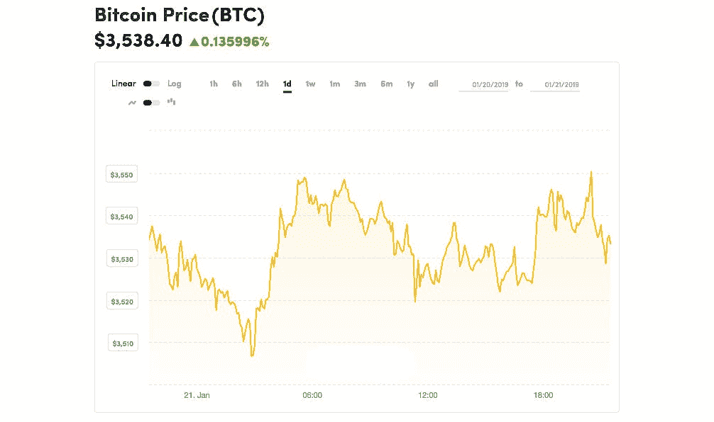
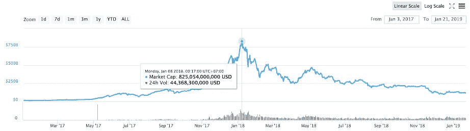
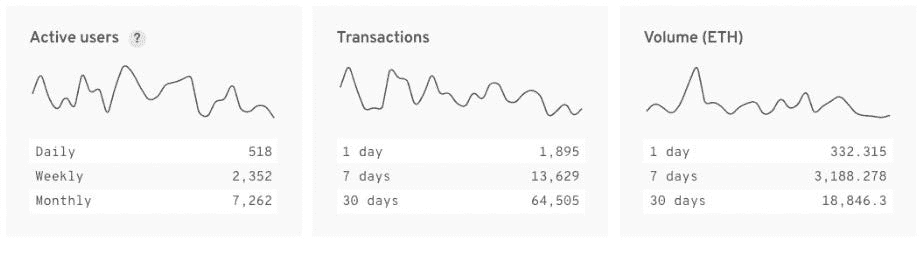

# 分散式交易所实现高流动性的要求是什么？

> 原文：<https://medium.com/hackernoon/what-are-the-requirements-for-decentralized-exchanges-to-achieve-high-liquidity-5783e3a2cdaa>

即使所有的集中交易所都关闭了，让我们除了分散交易所(dex)别无选择，这些平台能处理币安、比特币基地或比瑟姆如今面临的高流动性吗？

我们将更深入地研究这个问题，并确定 dex 实现高流动性的要求，同时尝试找出能够带来可行解决方案的潜在候选人。

# 流动性是整个加密货币市场面临的挑战

在加密货币市场中，[流动性](https://www.investopedia.com/terms/l/liquidity.asp)是指一种资产以公平价格买卖的难易程度。较低的流动性创造了一个更不稳定的市场，价格在较短的时间内大幅变化。更高的流动性有助于建立一个稳定、波动性更小的市场，价格不会大幅波动。高流动性总是可取的，不仅是在加密货币领域，在任何市场都是如此。

[https://www.coindesk.com/price/bitcoin](https://www.coindesk.com/price/bitcoin)

*低流动性导致价格滑移。*

在一个波动的市场中，下单和执行之间的延迟足以让价格大幅上涨或下跌。如果运动与你想要的交易相反，你可能会赔钱。理想情况下，订单价格(你要求的价格)应该接近执行价格(你实际得到的价格)。然而，在低流动性的交易所，由于缺乏交易者，这是不可能的，因此[增加了每次交易的风险](https://www.bloomberg.com/opinion/articles/2018-06-12/scarce-liquidity-is-a-growing-risk)。

目前，流动性最强的资产是[法定货币](https://corporatefinanceinstitute.com/resources/knowledge/economics/fiat-money-currency/)。市场能够轻易地吸收任何交易，而不会导致美元价值的剧烈变化。对买方或卖方来说，几乎没有任何风险。货币(美元、欧元、日元等)的价值。)以及与之相关的成本。

比如 100 万美元会在交易前后保值，佣金是基于中介(银行、经纪人等)计算的。)以同样稳定的货币。然而，对于同一笔交易，在低流动性市场上使用价值 100 万美元的比特币或任何其他加密货币，不仅对加密货币的价格有更大的影响，而且最终可能比交易时的原价多(或少)10 万美元。风险是双方的。

# 集中交易所

在过去的几年里，加密货币市场的流动性有其[起伏](https://strategiccoin.com/cryptocurrency-liquid-market/)。2017 年，在“炒作”开始之前，所有加密货币(包括比特币)的总市值只有 160 亿美元。仅在一年之内，它就上升到 8000 亿美元以上。目前，即使我们坐拥 1200 亿美元的 T2 市值和 160 亿美元的 24 小时交易量，我们也能感觉到价格处于历史最低点。这个数量在两年前是整个加密货币市场的代表，现在每天都在交易！

[https://coinmarketcap.com/charts/](https://coinmarketcap.com/charts/)

谁在处理这个交易量的流动性？大部分是集中交易，惊人的[所有市场交易的 99.8%](https://coinsutra.com/decentralized-vs-centralized-crypto-exchange/) 。另外 0.2%在 dex 上。

过去，大部分集中交易都被黑客攻击过，我们不能忽视使用分散交易的好处，因为每个用户都把资金放在自己的钱包里，所以不需要信任交易平台本身。更不用说增加的隐私和降低的服务器停机风险，这使得 DEXs 成为两者之间的明显赢家。

那么是什么让交易者不跳槽呢？dex 上的低流动性。

# 德克斯:一个废弃的市场

为了增加流动性，分散的对应方需要什么？有三个要求，缺一不可:

1.  可用性
2.  商人
3.  可量测性

让我们弄清楚，我们离拥有一个检查所有这些问题并提供高流动性的解决方案还有多远。

[https://www.stateofthedapps.com/](https://www.stateofthedapps.com/)

# 提供无缝的用户体验

最容易解决的问题是，至少提供与集中式用户体验相同的用户体验。如果他们希望交易者和普通用户考虑使用他们的平台，那么就应该尽可能降低转换到新平台的“成本”。

有几个要点需要考虑:

*   界面应该是熟悉的(市场领导者(币安、Bittrex 和 Bitfinex)目前正在设定标准)
*   为任何交易者提供相同的功能(条件订单、止损、访问报告等)。)
*   整合交易分析工具(必须将工具直接整合到交易所中)

一旦解决了这些问题，就需要考虑如何在市场中保持竞争力，例如提供更低的费用、支持其他加密货币以及各种交易对。

[ForkDelta 的](https://forkdelta.app/)解决方案是提供尽可能多的令牌，方法是提出一个无许可令牌列表系统来简化令牌提交流程。即使这种方法与他们的社区驱动的开源愿景一致，市场也没有接受使用这种分散交换带来的其他缺点。自去年年初以来，新用户界面的承诺就一直存在，但没有迹象表明他们即将实现这一承诺。ForkDelta 的流动性仍然很低，这加强了我们的信念，即用户体验是一个重要因素。

[BitSquare](https://bisq.network/) 也有了很大的发展，达到了 [126 种可交易的加密货币](https://bisq.network/faq/)，同时各个方面都去中心化了；从下订单到匹配或执行订单。那些能够降低从一个交易所切换到另一个交易所的障碍(允许用户在一个平台内交换任何令牌)的人可以在整体可用性方面获得高分。不幸的是，BitSquare 还没有出现，因为他们只将这些代币分为 11 个可交易的对。延迟向 BTC 出售一种货币，然后用 BTC 购买另一种代币，会让交易者损失惨重。

看起来有希望的是来自 [VDEX](https://volentix.io/) 的解决方案，它不仅消除了跨链流动性池的特定交易对，并提供了一个现代的颜色驱动的用户界面，而且，作为更复杂的 DAE(数字资产生态系统)的一部分，他们通过向用户提供分析引擎 [Vespucci](https://vespucci.site/) 向前迈进了一步。该引擎根据基本面、技术面和市场情绪分析数据，显示所有可用硬币的列表和排名靠前的硬币，交易者可以利用这些数据获得优势。这是我们第一次看到直观的 UI 交互来访问和查看用户对 exchange 感兴趣的数据，就用户体验而言，这可能会将标准推得更高。

[https://icons8.ru/ouch/illustration/marginalia-payment-processed](https://icons8.ru/ouch/illustration/marginalia-payment-processed)

# 带来了很多商人

具备所有功能并提供无缝的用户体验可能是第二个要求的一部分:让尽可能多的交易者使用他们的 DEX，这样流动性就会自然增加。

但是还有另一种方法，通过共享来有计划地解决流动性问题。

一种解决方案来自 [Dexdex](https://dexdex.io) ，这是一种搜索多个交易所、协议和做市商的服务，同时试图确保最佳的可用价格。他们能够通过自己的 API(应用程序编程接口)聚合来自其他平台的数据来实现这一点。利用他们的公开交易，它可能会给交易者提供与所有其他用户交易的体验，从而伪造内部流动性。这在理论上听起来可能很理想，尽管在公开的加密货币市场上，最好的价格并不总是最好的。只是聚合源之间的最优价格。

这种方法也被 [Easytrade](https://easytrade.io/) 采用，从多个 dex 集合订单。他们实际上为交易者自动化了这一过程:用户指出他或她希望购买或出售的代币数量，人工智能将以其他交易所的最佳价格执行订单。但是，事务时间是其他指标中最高的。对于只想以最优惠的价格购买代币的人来说，保证交易是一件重要的事情，但对于专业交易者来说，延迟是不可接受的。

在这种情况下，我们看到的解决方案介于两者之间。汇集其他 dex 的流动性，分享分散在众多可用选择中的交易者，同时确保平台上有足够多的交易者。在这些平台中，我们可以提到 [altcoin.io](https://altcoin.io/) ，他们为任何愿意加入他们的池的 DEX 或 dApp 提供白色标签的解决方案，以及 [VDEX](https://volentix.io/) ，他们将使用 [Bancor 算法](https://pdfs.semanticscholar.org/3d22/75ba6599f3d1ba0251ae3cd40cfbb8fd24c5.pdf)价格发现公式，以增加流动性并为他们的可交易资产带来稳定性。

# 能够扩展

顶级的用户体验将带来大量的交易者，这将带来缺失的流动性。但是少了什么呢？这并不是说缺少了什么，而是当交易量增加到远远超过 DEX 的容量时，需要什么。

分散交换允许以分散的方式安全地匹配和处理订单簿。这是在链上完成的[(在区块链上)。大量的交易意味着不是所有的订单都适合下一批。等待下一个会造成延迟，这将使价格变化问题再次出现。我们可能会得到流动资金，但如果下的订单没有在最短的时间内执行，那么我们仍然面临一个问题。](https://www.investopedia.com/terms/c/chain-transactions-cryptocurrency.asp)

解决这个问题的一个方法是使用“[原子互换](https://hackernoon.com/atomic-swaps-simply-explained-how-to-swap-cryptocurrencies-without-a-middleman-6cd29680c32e)进行订单匹配。原子互换是指一次交易，而不是分成两次单独的交易(买方先发送，卖方后发送)，订单在一次(原子)操作中完成。从技术上来说，智能合约就像一个无信任的托管协议，持有一种货币，直到另一个用户发送他们的货币。这提高了交易速度。

[BarterDex](https://github.com/KomodoPlatform/BarterDEX) ，一个运行在 Komodo 平台上的 Dex，最近实现了 60，000 个原子互换，但他们的交易量仍然很低，我们不确定他们的技术是否会自行扩展。BlockDX 有一个类似的方法运行在 Blocknet 协议之上，允许用户在原子交换期间保持对其令牌和私钥的控制。在前面提到的例子中， [VDEX](https://volentix.io/) 利用相同的原子交换技术和 [loopring 协议](https://loopring.org/resources/en_whitepaper.pdf)，使用 EOS。IO 收缩为节点，这允许它们在保持链上优势的同时进行链外扩展。

[https://dilbert.com/](https://dilbert.com/)

# 结论

大多数 DEX 的主要挑战是流动性。谁将拥有币安或比特币基地的交易量，谁就将设定标准。不管最终的解决方案是像 altcoin.io 提议的那样共享一个池，还是像 VDEX 那样结合多种技术。无论如何，后者在我们的研究中相当有趣。不仅 UI 达到了今天的标准，而且在解决流动性问题方面，他们正在建立一个具有互操作元素的生态系统，相互支持。例如，通过 Vespucci 分析引擎提取的易于理解的多区块链信息汇总了区块链时间表，以确定链之间的区块生产一致性，从而获得更大的流动性。多聪明啊。无论如何，2019 年可能是 dex 蓬勃发展的一年。关注最好的参赛者会很好！