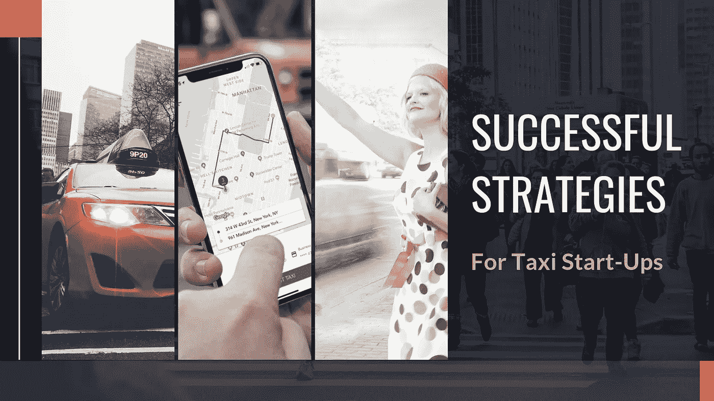
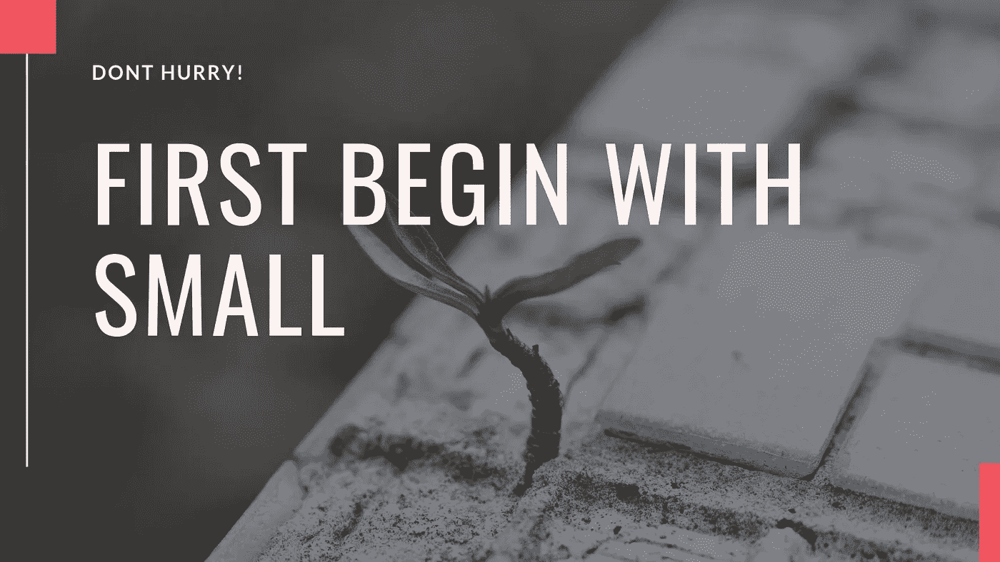
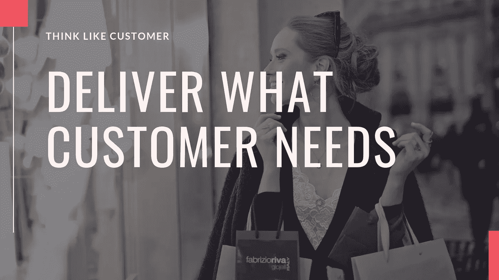

# 在目前的出租车行业中，初创企业应该遵循什么样的战略才能取得成功

> 原文：<https://medium.com/hackernoon/what-are-the-strategies-startups-should-follow-to-succeed-in-the-present-taxi-business-a092a0dc3d63>

你现在拥有一家随叫随到的出租车公司，如果它还处于起步阶段，现在是时候给业务注入一些策略了。策略取决于业务类型和业务环境。几年前适用于特定业务的东西现在可能不再适用。因此，考虑到基于应用的出租车业务的当前趋势和未来增长，我在这里为基于应用的出租车业务精心挑选了一些策略。

**品牌是关键**

一旦你创造了一个品牌，人们认可你的品牌服务，那么一切都会水到渠成。你可以通过提供一些利基和独特的服务来创建一个品牌。从目标受众开始。一旦他们完成了，就转移到其他人身上。出租车公司的名称和应用程序的设计在品牌塑造中扮演着重要角色。

我相信你正在使用[优步的应用解决方案](https://www.spotnrides.com)的克隆脚本。如果你是新手，我会推荐你使用优步克隆脚本，它类似于优步的应用程序。借助白标优步脚本，您可以轻松定制解决方案的名称和 UI/UX。所以，你可以通过试错法来建立一个品牌。但是，要警惕的是，你不经常定制应用程序。

**充分利用社交媒体**

社交媒体是在千禧一代中建立品牌的最佳工具。在社交媒体营销中不遗余力，因为没有额外的成本。所有的社交媒体平台都不尽相同，每个平台都需要不同类型的内容和营销。例如，Instagram 中的营销类型应该更多地确定图片而不是任何东西。您还可以向在社交媒体上更新骑行状态的骑行者提供忠诚度积分。

**还不赶紧下手小**

你不可能一夜之间变成优步或奥拉。迈出第一步，不要走得太远，直到你牢牢抓住这一点。你应该遵循这每一步。尝试和冒险是在商业中留下印记的必要条件，如果你的企业很小，这很容易做到。如果你盲目扩大出租车业务，你将失去对业务的控制，失去控制就意味着失去一切。所以，缩小你的关注点，把你的全部精力放在那上面。

**同一屋檐下的所有服务**

你可以扩展出租车业务，在常规服务的基础上提供专门的服务，如老年人护理、儿童出租车、残疾人出租车等。您可以允许乘客在应用程序中选择服务类型。这使得各种年龄的许多顾客更喜欢你的出租车服务。因为你在同一个屋檐下提供多种服务，服务应该与多种支付集成，容易乘坐预订和调度等无缝。

**最新技术**

将一部分收入投资于发展的公司将长期生存。出租车预订业务已经装载了像出租车调度系统和出租车应用程序解决方案这样的技术。此外，你必须在跟踪系统、支付系统、调度系统等方面投资新技术。这有助于重塑你的业务。

**站在客户的角度思考**

如果你真的想改善服务，站在客户的角度思考，拥有客户的心态。找出顾客倾向于预订出租车的地方和他们不愿乘坐出租车的地方。在车水马龙的街道上，他们会怎么想？他们会使用公共交通工具还是乘坐出租车？

与受欢迎的私人场所交往，如餐馆、酒店、商场、剧院和其他娱乐场所。将二维码放在这些地方，这样乘客就可以很容易地扫描它并预订出租车。这种工作可以在你和骑手之间建立联系。

**结论**

我上面提到的策略是万无一失的，可以很容易地遵循。你不一定要成为商业专家才能做到这一切。以上几点帮助你很好地把握经营，使你的生意稳定。

早些时候，我谈到了白色标签应用程序解决方案。这种打车应用解决方案提供商在全球范围内为数众多，其中只有少数能够提供顶级的打车应用，类似于优步和 Ola 等大型出租车公司。务必与此类解决方案提供商合作。

在打车 app 里做定制的同时，告知他们我提到的各种策略。这使他们能够在打车应用程序开发过程中更加具体。