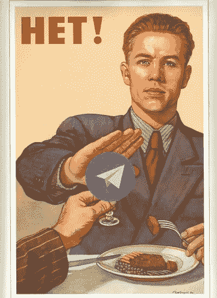
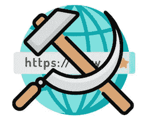
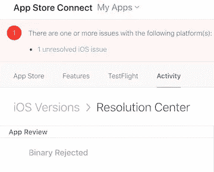

# 密码学家能从俄罗斯的电报战中学到什么

> 原文：<https://medium.com/hackernoon/what-crypto-can-learn-from-russias-war-on-telegram-febb841ea880>

## Telegram 与俄罗斯当局的战争可能很快就会变成 crypto 的战争——我们应该明智地吸取教训

*教训* [*电报*](https://telegram.org/) *和教训* [*曾戈*](https://www.zengo.com/) *:在一个集权的世界里建立分权和审查服务*

Telegram 一直是数据保护、隐私和开源软件之战中的白马。他们直面俄罗斯的审查制度，据说躲过了联邦调查局的多次渗透企图，并面临至少 6 个不同国家的镇压。许多 crypto 和区块链的支持者没有理解的是 Telegram 的战争将很快成为他们的战争。通过了解战场和双方采用的战术，我们可以了解分散技术在哪些地方仍然容易受到攻击。

我们仍在完善区块链的安保系统。我们已经建好了大楼，现在我们要启动警报。问题是，当谈到分散系统的安全性时，我们的关注点经常被误导。我们考虑了潜在的恶意行为——对区块链的攻击、采矿集中化、串通验证者。我们喋喋不休地谈论托管人的风险——交易所黑客、内部欺诈。我们甚至指出了个人的危险——钥匙丢失或被盗，自助银行的风险。但是最大的危险存在于我们数字世界的基础中。这些风险威胁着区块链的整个生存。如果我们不识别这些并准确地着手解决它们，它们很可能会摧毁去中心化的梦想。电报是我们的警告。

# 数字表亲:电报和区块链

电报和区块链没什么不同。虽然 Telegram 不是分散的，也不是完全开源的，但它的使命是相似的:为个人提供隐私和个人自主权，减少中央组织和政府的控制，并允许人们在没有强制和审查的情况下进行互动。就像加密一样，电报也引起了一些争议。

第一次真正的攻击发生时，俄罗斯官员以恐怖分子利用该平台协调攻击为借口，将 Telegram 作为目标——这是一句古老的谚语:*安全审查*。在联邦法院的支持下，他们要求 Telegram 交出他们平台的加密密钥。电报婉言拒绝。俄罗斯开始了一系列旨在消灭来自俄罗斯的电报的协同攻击。俄罗斯的这些审查尝试凸显了我们当前制度的失败之处。很可能有一天，这些相同的点会成为那些试图审查和控制加密和其他分散应用程序的实体的目标。

# 俄罗斯的战略

由于未能直接禁止 Telegram，俄罗斯将矛头指向了与 Telegram 相关的外国互联网服务提供商。电报流量的两个主要路由器？亚马逊和谷歌云服务。那么俄罗斯做了什么？它禁止了与这两家云提供商相关的 1580 万个 IPs 这些流量中有多少实际上与 Telegram 相关是无法确定的。

显然，附带损害是巨大的。与 Telegram 无关的网站关闭了，甚至支付门户网站也被证明没有反应，因为俄罗斯的禁令远远超出了其最初的范围。不止于此，俄国接着瞄准了[的 VPN 提供商](https://twitter.com/ITeadstudio/status/986165653815025664?ref_src=twsrc%5Etfw%7Ctwcamp%5Etweetembed%7Ctwterm%5E986165653815025664&ref_url=https%3A%2F%2Fpiunikaweb.com%2F2018%2F04%2F17%2Ftelegram-is-still-alive-in-russia-despite-huge-collateral-damage%2F)，要求他们禁止电报信息。接下来，他们联系应用商店提供商，要求他们从俄罗斯用户的应用商店中删除 Telegram。苹果遵守了多少还不清楚；他们没有立即或完全遵守，但他们显然不再允许 [Telegram 更新他们的应用](https://www.theverge.com/2018/5/31/17412396/telegram-apple-app-store-app-updates-russia)，甚至在俄罗斯以外。Telegram[的创始人兼首席执行官帕维尔·杜罗夫在 Telegram](https://t.me/durov/87) 上谈论了他的挫败感。在公众批评后不久，苹果再次开始允许更新。

最近，俄罗斯采取了更严格的行动，禁止来自外国服务器的任何互联网流量，这可以说是针对 Telegram 和其他有争议的服务的明确举措。这一禁令的影响尚未实现。

事实是，俄罗斯利用了我们数字世界的弱点，试图摧毁 Telegram。**注意了*同志们*！**审查正在向去中心化技术走来！

主要弱点出现在人与应用的连接点:集中式操作系统、集中式互联网服务提供商(ISP)、应用商店、VPN。正是通过这些入口，用户与 Telegram 和区块链应用程序建立了联系。正是通过这些点，信息自由和隐私是最脆弱的。

# 意想不到的失败点

传统上，在加密中，故障点围绕着协议错误、人为错误和端点攻击。但是退一步讲，你会发现这个行业正面临着来自其控制范围之外的相关威胁和攻击媒介；这些往往被忽视。

## **互联网服务提供商**

互联网服务提供商(ISP)是俄罗斯审查运动的第一批目标——这是理所当然的。ISP 沿其电子路径路由信息和消息——从您的计算机到目的计算机，反之亦然。不幸的是，这些集中点为政府或实体监控或限制互联网行为提供了方便。俄罗斯不是第一个利用 ISP 集中化的国家，也不会是最后一个。但是，即使在民主国家，互联网服务提供商仍然限制访问。像维基解密这样的网站，或者有争议话题的论坛，经常成为 ISP 审查的目标。《T2 法案》废除了网络中立性，这为进一步的审查以及收集用户数据敞开了大门。想象 crypto 可能成为类似打击的目标并不是不现实的。这也可能是一个重要的激励因素，尤其是当去中心化开始挑战各种中心化的实体，甚至是 ISP 本身的时候。互联网服务提供商甚至可能拒绝发送他们认为对其业务有潜在危害的信息。或者他们可以接受政府机构的指令来管理对分散服务的访问——就像 Telegram 发生的那样。

## **应用商店**

应用商店是俄罗斯政府的下一个目标。应用商店是客户的主要入门点。有了 crypto，客户将使用应用商店下载钱包、下载节点和下载去中心化的应用。除了苹果对 Telegram 惨败的处理有问题之外，他们还有审查的历史，既代表国家指令，也是为了他们自己的利益。据报道，根据中国政府的要求，苹果[从其中国应用商店移除了 VPN 应用](https://www.theverge.com/2017/7/29/16062172/apple-chinese-app-store-vpn-censorship-crackdown)，甚至[将 iCloud 操作和加密密钥](https://www.theverge.com/2018/2/28/17055088/apple-chinese-icloud-accounts-government-privacy-speed)转移给了一家中国的提供商。该网站报道称，苹果[在发表了一篇讨论 iPhone X 越狱的文章后，拒绝更新他们的应用](https://appleinsider.com/articles/17/12/19/app-store-review-ridiculousness-apple-rejects-appleinsiders-iphone-x-app-update-because-of-news-story-about-jailbreaking)。这样的案例不胜枚举:[苹果审查一款展示智能手机生产阴暗面的应用](https://appleinsider.com/articles/17/12/19/app-store-review-ridiculousness-apple-rejects-appleinsiders-iphone-x-app-update-because-of-news-story-about-jailbreaking)。[苹果审查一款试图提供安卓教育内容的教育应用](https://thenextweb.com/apps/2013/07/25/tech-education-startup-treehouse-branches-out-to-the-ipad/)。

The dreaded rejected update message

谷歌也好不到哪里去。Google Play 商店[禁止了这种另类社交媒体](https://mashable.com/2017/09/15/gab-sues-google-anti-trust-play-store/)网络，因为其言论自由监管不严。谷歌也有长期遵守各种国家禁令的历史。

应用商店批准或拒绝更新，甚至禁止某些应用程序的权力是巨大的。想象一下，您创建了一个加密应用程序，并且正在管理成千上万的用户？您发现了应用程序中的一个错误，并创建了一个更新来解决它；然而，谷歌或苹果拒绝你的更新，将你所有的用户置于风险之中。你没有追索权。这些情况反映了应用程序对苹果和其他应用商店运营商的依赖程度。分散的应用程序不能依赖于集中的服务而仍然期望被分散。如果没有安全且不受审查的登录地点，crypto 将很难被大规模采用。

## **操作系统**

Bill Gates at his deposition

应用商店本质上是移动操作系统。但是那些桌面操作系统呢？它们也为审查提供了一个脆弱的途径。这肯定是有先例的。在 21 世纪初，微软(T2)输掉了一场诉讼，因为它限制了用户可以在 Windows 操作系统上安装的应用程序类型。由于像 Java 和 Netscape 这样的第三方程序直接与像 Internet Explorer 这样的微软开发的产品竞争，微软受到了很大的激励去这样做。随着对去中心化的需求上升，这些新的解决方案肯定会与苹果和微软的利益发生冲突。当苹果和微软将去中心化应用视为对其商业模式的威胁时，会发生什么？

以 [ZenGo](https://www.zengo.com/) 为例——目前的项目致力于为移动用户建立一个分散的、无钥匙的加密钱包解决方案。如今，加入用户意味着按照用户的意愿与他们联系——通过应用商店，通过 ISP。创建方便的加密解决方案意味着处理这些集中点。只有当分散的应用程序商店、操作系统和 ISP 存在时，像 ZenGo 这样的应用程序才能完全不受审查，所有用户都可以访问。

# 结论

最后，俄罗斯采取措施禁止所有来自外国服务器的互联网流量——这是给免费互联网的棺材钉上了最后一颗钉子。电报只是开始。只要有人努力创建限制中央实体权力的应用程序和技术，这些实体就会试图破坏这些应用程序的成功。今天，有许多地方适合搞破坏。当焦点从电报转移到加密或区块链相关服务时会发生什么？当苹果和谷歌削弱应用程序开发人员，微软和苹果在其操作系统上偏心，ISP 拒绝路由相关流量时，去中心化技术将如何成功？如果我们未能认识到这些痛点并在今天*解决它们*，那就太晚了。

当我们用来访问技术的平台和服务是集中的，容易受到审查时，我们就看不到真正的分散技术的发展。我们需要认识到，去中心化不仅仅取决于去中心化的平台和货币。我们需要去中心化的 ISP，去中心化的操作系统，去中心化的应用商店。只有这样，去中心化的技术才会成功。电报正在打一场漂亮的仗。权力下放是我们赢得战争所需要的。

在推特上关注我:[**@ noamlevinson**](https://twitter.com/noamlevenson)

*我喜欢得到问题或建议，所以请评论吧！我尽我所能回应所有深思熟虑的评论。*