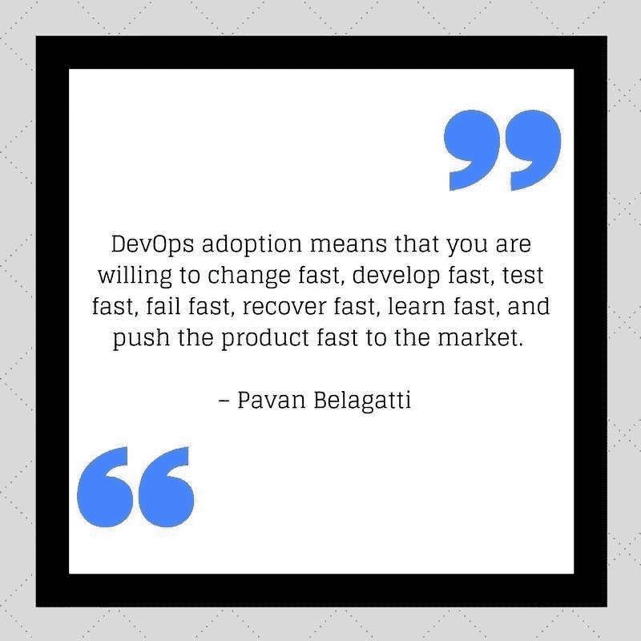
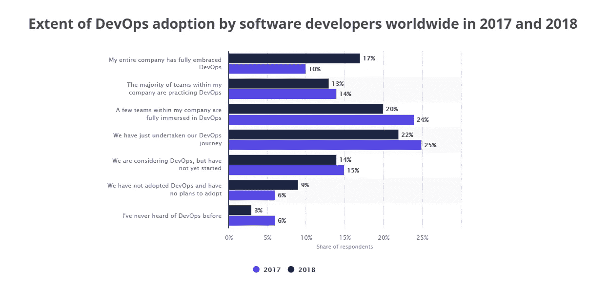

# DevOps 在 2018 年教会了我们什么

> 原文：<https://medium.com/hackernoon/what-devops-taught-us-in-2018-e5f6637a4921>

## 如果 2017 年是 DevOps 年，2018 年是企业 DevOps 年**，**2019 年会是什么？

Photo by Pete Johnson on pexels.com

没有硬性规定说这就是 DevOps 成功之路，但我们总是可以得出一些实验性和假设性的想法，并相应地创建一个 DevOps 计划。总的来说，做好 DevOps 意味着以一种系统的、以平台为中心的方式对待 DevOps，并让文化自然到位。解决根本原因，症状就会消失。不管我们叫它什么，最终的目标是使软件开发和交付的过程更加有效，并且合并开发和运营以实现平稳的业务运营。不管 DevOps 的定义是什么，但背后的意识形态是一样的。

再明确一点，拥抱 DevOps 就是你愿意快速改变，快速开发，快速测试，快速失败，快速恢复，快速学习，快速把产品推向市场。DevOps 的主要目标很简单:[频繁、可靠、高质量地发布软件更新](https://jfrog.com/enterprise-plus-platform/)此外，DevOps 是整个组织的心智模型转换，换句话说，是为了更好的组织敏捷性..是关于交付涅槃。

Forrester 将 2018 年称为“[企业开发运维年](https://go.forrester.com/blogs/2018-the-year-of-enterprise-devops/)”，数据显示 50%的组织已经实施了开发运维。

来自 statista 的统计数据显示了 2017 年和 2018 年全球软件开发人员在工作场所采用 DevOps 的程度，该数据基于对开发专业人员的调查。

Source Credit: [Statista](https://www.statista.com/statistics/673505/worldwide-software-development-survey-devops-adoption/)

# 让我们看看 2018 年 DevOps 教会了我们什么

下面列出了 DevOps 在 2018 年教给我们的 15 个事实。

*1。DevOps 不是一个个人的角色，它是一个团队的努力。*

*2。您的基础架构应该能够自动处理失败的部署并回滚。如果不能，那你就做错了。*

*3。DevOps 对不同的人有不同的含义。*

*4。如果有任何任务不能自动化，立即从任务列表中删除它。*

*5。沟通比工具更重要，它将决定一个组织的成败。*

*6。在开发生命周期中，将安全性的焦点向左转移。*

7。詹金斯。= CI/CD …你有 TravisCI，Gitlab-CI，shippible(最近被 JFrog 收购[)*…等等等等*](https://jfrog.com/about/press/jfrog-acquires-shippable-delivers-complete-devops-pipeline-automation-from-code-to-production/)

*8。设计时始终牢记自动缩放。自动化所有的事情。一键式部署到一键式恢复。*

*9。在 AWS 中创建现成的映像，并使用这些映像进行自动缩放，而不是从 GitHub 构建中编写脚本。*

*10。DevOps 领域确实存在技能短缺。*

11。CI/CD 管道是 DevOps 团队实现的最佳实践之一，用于更频繁、更可靠地交付代码变更。

*12。不要自动化一个糟糕的过程，你最终会得到一个自动化的糟糕过程*

*13。在 DevOps 中，大量需要知道如何编码和自动化脚本来测试各种情况的测试人员。*

*14。这是我们对快速变化的技术趋势的快速反应，这产生了兴奋和推动品牌价值，DevOps 通过更快地向市场提供趋势性的东西(功能)来帮助您的品牌价值指数增长。*

*15。在开发运维与 SRE 的定义上仍然有一些混淆和重叠，但是我们可以说 SRE 对于开发运维就像 Scrum 对于敏捷一样。*

# 让 DevOps 在 2019 年成为真正的交易

今天所有的公司都是软件公司，更快的创新是战胜竞争对手的关键。DevOps 在帮助您加快发布周期和比其他人更快地创新方面至关重要。

您需要支持开发运维的流程来简化软件的交付，它们应该是:

***集成*** —您需要一个统一的平台，一个跨所有应用程序部署管道的视图。

***异构*** —你需要一个[支持所有语言、工具和云](https://jfrog.com/whitepaper/devops-8-reasons-for-devops-to-use-a-binary-repository-manager-on-the-cloud/)的多语言者。

***安全*** —您需要启用策略驱动的权限，并对谁在做什么进行端到端的审计跟踪。

*从 DevOps 的文化方面再向前看一点，了解这八点，作为评估自己是否在 DevOps 的正确轨道上的通用检查表，*

*1。您在组织中建立了持续改进的心态和文化。*

*2。您可以通过快速的发布周期频繁地自动部署。*

*3。你利用容器和微服务架构。*

*4。运营、系统管理员和开发人员协同工作。*

*5。你有一个自我评估和学习的连续反馈循环系统。*

*6。你在团队之间有持续的交流。*

*7。您有一个定制的 DevOps 度量表来查看结果是否可见。*

*8。您已经找到了 CI 和 CD 的工具和平台。*

*9。您已经了解持续安全性的重要性，并且已经在 DevOps 环境中实施了关键控制。*

我们都知道 DevOps 会一直存在，而且是今天的需要。
以正确的方式做开发始于正确的思维方式和成长心态。找出可以轻松自动化的关键流程。DevOps 将在 2019 年变得更加精彩。

 [## 2019 年需要注意的 8 个开发运维趋势

### 从微服务到 ML 到 AI 到…

hackernoon.com](https://hackernoon.com/8-devops-trends-to-be-aware-of-in-2019-b4232ac8f351) 

## 离婚快乐:)