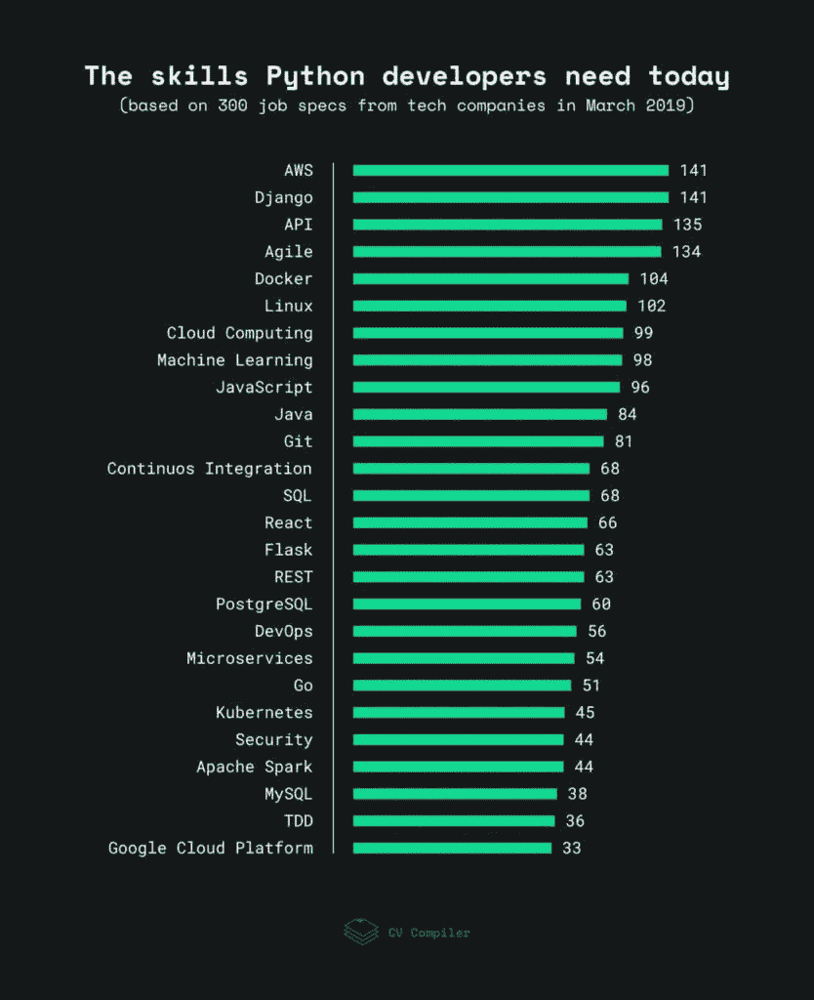

# 2019 年企业对 Python devs 有什么期待？

> 原文：<https://medium.com/hackernoon/what-do-companies-expect-from-python-devs-in-2019-f8b585a1ddf>

Python 无处不在。

根据 2019 年的 [StackOverflow 的开发者调查](https://insights.stackoverflow.com/survey/2019?utm_source=so-owned&utm_medium=blog&utm_campaign=dev-survey-2019&utm_content=launch-blog)，它是世界上第二大最受欢迎的编程语言。

在过去的 4 年里，Python 一直是 GitHub 贡献者中[第三受欢迎的语言](https://octoverse.github.com/projects#languages)。

即使在[简历编译器](https://cvcompiler.com/)，我们也使用 Python 作为简历处理引擎的核心语言。

我们对 Python 的热爱让我们走得更远——通过使用 **NLTK** 和 **spaCy** ，我们创建了自己的文本分析工具。(如果没有它，你就不会读到这份数据证明的现代蟒蛇应该具备的技能清单。)

实际上，这是我们努力的结果——作为一名 Python 开发人员，你需要的一整套技能在 2019 年保持适销对路。

# 作为 2019 年的 Python 开发者，我需要具备哪些技能才能成功？

与我们的团队合作，我们从 StackOverflow、AngelList、LinkedIn 和全球一些快速发展的科技公司中挑选了 300 份 Python 开发人员的工作规范。从所有这些描述中，我们提取了最常被提及的技能，它们在这里。(数字指的是提及次数。)

在这个图表中没有突出显示的其他经常提到的技能是**单元测试** (32)、**持续部署** (30)、 **MongoDB** (30)和 **OOP** (30)。如果说机器学习技能，最常提到的是**熊猫** (29) **，NumPy** (24) **，SciPy** (15) **，**和 **Scikit-Learn** (11)。

当然，这些技能的必要性取决于你如何使用 Python。如果你是机器学习工程师，你不需要完全了解 Django，等等。

**请注意:**这项研究显示了就业市场的整体趋势，而不是 Python 开发者本身的偏好。这个评级可能与大多数开发人员在工作中喜欢使用的技术列表不同。对于 Python 的一些见解，可以参考 Python 软件基金会的 [Python 开发者调查](https://www.jetbrains.com/research/python-developers-survey-2018/)，或者 GitHub 的 [Octoverse](https://octoverse.github.com/) 。

# 专家们对当前的 Python 趋势有什么看法？

> 现在开发者熟悉 Git、GitHub、Travis for CI 绝对是标配。测试，最好是 pytest 和(明智地)使用 unittest.mock，对于一个运行良好的项目也是至关重要的。容器和虚拟化技术，从 docker 到 lxc 到 AWS 到 Azure 到 Kubernetes 和 OpenStack，对于开发和部署来说都是非常“正常”的。能够创建构建工件，然后部署基础设施的试运行版本，然后针对它运行测试，然后部署到生产环境，如果必要的话回滚到以前的版本，这些都应该是按钮式操作。
> 
> Django 仍然像以前一样受欢迎，并且是一项有用的技能。Flask 和 SQLAlchemy 是同样有效的组合，但需求不太大。至于数据科学，它是 Python 世界的后起之秀。熊猫、Numpy 和 SciPy 都是需求量很大的工具，还有 Jupyter 笔记本。数据库知识在这里也是必不可少的。

Python 核心开发人员 Michael Foord。
*【mock】(现为 unittest.mock 标准库)* [*推特*](https://twitter.com/voidspace) *|* [*个人网站*](https://agileabstractions.com/)

> 这项研究非常清楚地显示了发展世界的发展方向。AWS、Docker、Clouds 和 Kubernetes 都很新，但它们已经成为程序员日常工作的一部分。这并不意味着作为一名 Python 开发人员，您需要了解这些技术的所有细微差别，但是您每天都会遇到它们。
> 
> 机器学习十有八九需要 Python，但这是一个完全不同的领域。如果你是一个 Python 开发者，你不需要 ML 技能。如果选择机器学习或者 AI，肯定会需要 Python。
> 
> “微服务”这个词在图上与 Go、REST 和 API 非常接近。然而，这微小的一句话，却无声地改变了整个市场。我建议开始花时间去理解它会带来什么。

*Mikhail Kashkin，
系统架构师和 Python 专家。前谷歌员工。*[*YouTube*](https://www.youtube.com/user/mkashkin2/)*|*[*GitHub*](https://github.com/xen)

> 总的来说，对于 Python 开发者来说，我不认为他们需要学习/知道一件事情来超越。数据科学、DevOps、Web 开发和自动化是完全不同的领域，但都属于“Python devs”。然而，与过去相比，我从客户那里得到了更多关于数据科学工具的问题。主要是熊猫，其次是 Jupyter 笔记本。

*Trey Hunner，
Python 和 Django 团队培训师，*
*Python 软件基金会前主任。* [*推特*](https://twitter.com/treyhunner) *|* [*网站*](https://treyhunner.com/)

> 在过去的一两年里，我参加了一些面试，肯定有很多雇主想要 AWS 或云经验。除此之外，我看到数据科学/机器学习领域有很大增长。就像这项研究已经显示的那样，如果你能做网络开发，那也很好。

*Mike Driscoll，Python 书籍的作者，博客作者。*
*部分教程团队在* [*真正的 Python*](https://realpython.com/) 。
[*推特*](https://twitter.com/driscollis) *|* [*博客*](https://www.blog.pythonlibrary.org/)

# 要打磨自己的技能，应该利用哪些资源？

为了帮助你，我收集了一些我们团队和来自世界各地 Python 社区的有经验的开发人员所尊重的资源。

**Python 相关资源(包括 web 开发):**

*   [RealPython](https://realpython.com/) 是一套全面的 Python 教程。(他们还有一个鼓舞人心的 [YouTube 频道](https://www.youtube.com/channel/UCI0vQvr9aFn27yR6Ej6n5UA/playlists)，由[丹·巴德](https://twitter.com/dbader_org)创建。)
*   [Python Weekly](https://www.pythonweekly.com/) —一份精选的每周时事通讯，包含文章、发布和工作。
*   这个网站为有经验的开发者、工程师和科学家提供了丰富的 Python 资源。(由[肯尼斯·雷兹](https://twitter.com/kennethreitz)创作。)
*   [send ex YouTube 频道](https://www.youtube.com/user/sentdex/playlists)有关于 Django、ML、Python & Finance 等等的庞大播放列表。(由[哈里森·金斯利](https://twitter.com/Sentdex)整理)。)
*   在他的博客中，[米盖尔·格林伯格](https://twitter.com/miguelgrinberg)提供了大约 80 篇关于烧瓶的文章。

**数据科学，机器学习& AI:**

*   [关于实现数据科学& AI 的技术说明](https://chrisalbon.com/)。涵盖的主题还包括 AWS 和 Linux。(由[克里斯·阿尔邦](https://twitter.com/chrisalbon)制作)。)
*   虽然 Keras 是 Python 最流行的神经网络库之一，但它也有一个[有用的主题博客](https://blog.keras.io/)。
*   [一套 Scikit-learn 教程](https://scikit-learn.org/stable/tutorial/)供那些想要掌握科学 Python 的人使用。
*   计算机视觉和深度学习[资源指南](http://pyimg.co/guide)，作者[阿德里安·罗斯布鲁克](https://twitter.com/PyImageSearch)。

# 我应该在网上关注谁才能掌握脉搏？

以下是我乐意在推特上关注的皮托尼斯塔的名单:

*   [@ Kenneth reitz](https://twitter.com/kennethreitz)—Pipenv&请求的创建者。
*   [@ dabe az](https://twitter.com/dabeaz)—《Python Cookbook》的作者。
*   [@raymondh](https://twitter.com/raymondh) — Python 核心开发者。
*   [@1st1](https://twitter.com/1st1) — Python 核心开发者，EdgeDB 创始人。
*   [@ adrianholovaty](https://twitter.com/adrianholovaty)—Django 的联合创作人。
*   [@ Jacobian](https://twitter.com/jacobian)—Django 的联合创作人。
*   [@ py Danny](https://twitter.com/pydanny)—《Django 的两勺》一书的合著者，开源程序员。
*   [@ixek](https://twitter.com/ixek) —微软云开发者倡导者。

熟能生巧，所以，列出你想要学习或提高的技能，开始你的新高度之路。我希望这份材料能帮助你提升你的 IT 事业！

本文是与 CV Compiler 的团队联合编写的，CV Compiler 是一个面向技术专业人员(尤其是 Python 开发人员)的机器学习驱动的简历增强工具。如果你需要一份完美的简历，[点击这里](https://cvcompiler.com/?login)。可以免费查简历！