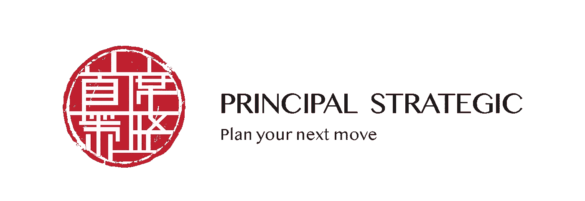

# 加密冬天对企业意味着什么？

> 原文：<https://medium.com/hackernoon/what-does-crypto-winter-mean-to-businesses-3ae45f7d90d3>

Photo by [Mat Reding](https://unsplash.com/@matreding?utm_source=medium&utm_medium=referral) on [Unsplash](https://unsplash.com?utm_source=medium&utm_medium=referral)

## 加密货币的暗淡未来，区块链技术的光明未来。

隐秘的冬天已经持续了很长时间。媒体上有传言称，2017-2018 年的区块链热实际上可能只是另一种时尚潮流。一些对所谓的炒作技术感兴趣的企业开始对区块链持怀疑态度，而一些企业仍在试图理解这些加密悲剧。

为了清除寒冷的冬季空气，目前的隐冬并没有阻止我们去区块链。

企业应该明白，区块链和加密货币虽然密切相关，但却是两回事，加密冬天不会影响区块链企业的潜在增长。

# 企业迎接加密寒冬的 3 个步骤:

## 1.明白区块链的未来并不代表密码市场

重要的是，企业要清楚地了解区块链和加密货币之间的区别。

> 区块链是一种技术，而加密货币只是它最著名的应用。

花 2 分钟时间从这些 [4 个简单的类比](https://pstrategic.com/blockchain-vs-cryptocurrency-explained/)中理解区块链和加密货币的根本区别。企业不应该因为错误的信息或误解而错过利用当时可用技术的增长机会。

Photo by [M. B. M.](https://unsplash.com/@m_b_m?utm_source=medium&utm_medium=referral) on [Unsplash](https://unsplash.com?utm_source=medium&utm_medium=referral)

Crypto winter 独家代理加密货币领域。区块链，驱动它的技术，不能用这种相同的市场条件来代表，因为两者有不同的方式来衡量它们的价值。硬币因其投机投资价值而引起了公众的注意。很多人，特别是在 2018 年比特币价格上涨后，将它们视为投资机会，从而推动了加密市场的波动性。

虽然加密货币的价值是通过其存储价值来衡量的——易于投机，但区块链的价值是通过其项目来衡量的，这些项目应该会给这个空间带来特定的效用。区块链和去中心化更根植于它所支持的 dApps 的价值。

出于这个原因，区块链的核心价值不能通过查看其交易量或类似指标来发现，而是可以在此基础上构建的应用程序。我们需要回归基本面，创造具有附加值的产品。

> 在 [Principal Strategic](http://pstrategic.com) ，我们专注于此:为我们的客户精确定位区块链技术的战略应用，以便营销工作能够专注于呈现独特的附加值。查看我们的[项目](http://pstrategic.com/projects)。

## 2.利用区块链技术的优势，而不是硬币的价值。

如前所述，加密货币仅仅是一个运行在区块链之上的应用程序。这意味着企业可以通过各种方式利用区块链技术的所有优势。因此，区块链平台实际上可以不使用硬币/代币系统而存在。虽然模型可能会以某种方式改变，但仍然有可能构建一个有价值的平台，甚至在某些情况下有更有价值的用途。

**战略营销无硬币区块链平台的要点:**

*   用奖励性的体验激励取代基于硬币的激励

Photo by [rawpixel](https://unsplash.com/@rawpixel?utm_source=medium&utm_medium=referral) on [Unsplash](https://unsplash.com?utm_source=medium&utm_medium=referral)

对于基于硬币的模型，动机是显而易见的。为系统提供价值的人会得到随着系统改进而增值的硬币奖励。然而，如果没有硬币，人们参与的替代经济激励可能是简化的流程或围绕一个用例将一个行业聚集在一起所获得的附加值。区块链技术在降低低效率和交易成本或消除多方相互交易时的障碍方面非常强大。因此，参与者可以因为体验价值而获得使用平台的奖励:节省成本和新的商业机会。

*   对比区块链和加密货币的稳定价值

Photo by [rawpixel](https://unsplash.com/@rawpixel?utm_source=medium&utm_medium=referral) on [Unsplash](https://unsplash.com?utm_source=medium&utm_medium=referral)

在基于硬币的模型中，波动性、证券法和税收都是需要考虑的复杂因素。加密冬天已经是加密货币内在复杂性的明显证据。相比之下，使用无币区块链模型，价值是生态系统固有的。用于交易的法定货币波动性小得多，这种稳定性可能对一些参与者有吸引力。

如你所见，[不使用加密货币的区块链平台](https://blog.chronicled.com/the-argument-against-blockchain-as-a-service-platforms-5396cb31077e)提供了一条不同的前进道路，可以吸引某些群体。这意味着，如果你不精通区块链技术和加密领域，那么在参与任何区块链项目之前，非常值得进一步深入研究。阅读关于每个区块链企业面临的[五大挑战](https://pstrategic.com/five-obstacles-every-blockchain-business-faces/)，做好准备。

## 3.抓住区块链的巨大机遇

Photo by [rawpixel](https://unsplash.com/@rawpixel?utm_source=medium&utm_medium=referral) on [Unsplash](https://unsplash.com?utm_source=medium&utm_medium=referral)

虽然 2019 年被推测为漫长的冬季，但区块链世界阳光明媚。智能区块链项目已经朝着正确的方向发展，dApps(分散式应用程序)的市场应用预计将很快出现。Dapps 的[州的统计数据证实了这一趋势，因为它记录了自 2017 年 12 月以来每月 dApp 的发展增长了 182%。已经使用区块链的大企业将为各种行业中区块链用例的指数增长让路。(你知道 T2 的 7 家公司巨头 T3 已经利用了区块链的技术，并将引领区块链的创新浪潮吗？)](https://blog.stateofthedapps.com/)

事实上，随着创新浪潮给数字金融系统带来信心，区块链的光明未来甚至被预测可以缓解加密冬天的寒冷。更多的加密货币可能会出现，真实产品的加密价格可能会增加。因此，企业应该记住，加密市场不代表区块链技术，无硬币区块链平台是可能的。加密的冬天对区块链企业和对使用区块链感兴趣的企业来说都不是一个坏兆头。事实上，持怀疑态度和灰心丧气的企业应该记住，冬天之后总是春天。加密并没有结束，它才刚刚开始。

如果你想了解更多关于区块链技术的使用，这里有一个全面的[指南](https://pstrategic.com/to-companies-who-want-blockchain-but-dont-know-where-to-start/)来决定一个企业是否应该应用区块链。

你有兴趣利用区块链来发展你的业务吗？[联系我们](http://pstrategic.com/#contact)获得如何战略性使用区块链的专家意见。

## **关于校长战略**

在[主要战略](https://pstrategic.com/services/)，我们谈论、讨论、头脑风暴并执行营销区块链项目的创新想法。我们对区块链的广泛了解和对您业务增长的优先考虑，使我们能够为您提供量身定制的创新解决方案，推动您的业务超越这些障碍。我们专门与革命性企业合作，如 [Tokenize Xchange](https://tokenize.exchange/) 和 [World Trip Singapore](https://wtxt.io/) 。查看我们合作过的有趣的区块链项目。

我们在社交媒体上发布区块链新闻和教育内容的每日更新。**关注我们:**
[脸书](https://www.facebook.com/principalstrategic/) | [领英](http://linkedin.com/company/principal-strategic-pte-ltd/) | [Instagram](https://www.instagram.com/principal_strategic/) | [电报](https://t.me/pscryptosphere) | [推特](http://twitter.com/LtdPrincipal) | [Youtube](https://www.youtube.com/channel/UCGI7uNK4mh6FosHYCFTOegQ/featured)

# 参考

俄勒冈州戴尔市(2018 年 12 月 21 日)。区块链 vs 加密货币:加密的冬天&秋天后的生活。*区块经济*。检索于 2019 年 2 月 7 日，来自[https://block onomi . com/区块链-vs-cryptocurrency-winter-fall/](https://blockonomi.com/blockchain-vs-cryptocurrency-winter-fall/)

Apps 博客的状态。(2019).应用博客的状态。检索于 2019 年 2 月 8 日，来自[https://blog.stateofthedapps.com/](https://blog.stateofthedapps.com/)