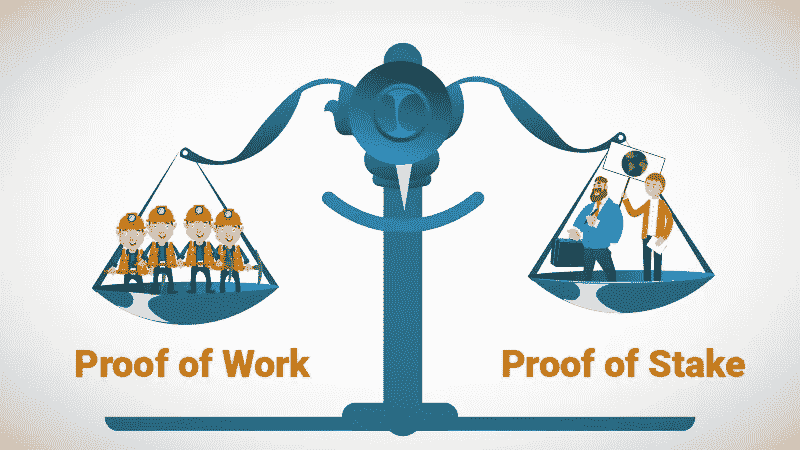
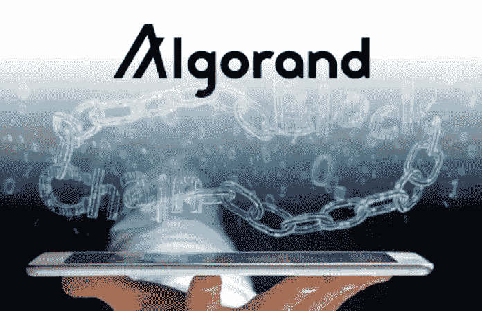

# 去中心化如何让你的企业受益:评估比特币、Hyperledger、Algorand 和 Elixxir

> 原文：<https://medium.com/hackernoon/what-does-decentralization-mean-for-your-business-7d06c9e30c5>

[https://www.gtis.co.za/news/online-collectables/decentralization-2-0/](https://www.gtis.co.za/news/online-collectables/decentralization-2-0/)

像脸书、微软和雅虎这样的集中式服务把所有的鸡蛋放在一个篮子里。这意味着坏演员只需要攻击一个薄弱环节就可以危及你所有的数据。而且有很多种方式，包括 [DDoS](https://en.wikipedia.org/wiki/Denial_of_Service_attack) 、[中间人](https://en.wikipedia.org/wiki/Man-in-the-middle_attack)、[凭证窃取](https://www.schneier.com/blog/archives/2016/05/credential_stea.html)等等。分散式服务通过将数据分布在多个冗余服务器上，使用尖端的加密技术确保数据的完整性、不可更改性和不可篡改性，从而确保数据的安全。当然，分权的程度也有很多。在本文中，我们探讨了各种分散化，它们的历史和演变，以及每种分散化共识算法给你的企业、非政府组织或非营利组织带来的好处。

# DLTs:介于集中和分散之间

与完全分散的公共分类账(如比特币)和集中式服务(如谷歌)相比，分布式分类账技术(DLT)表现出相当大的权衡。例如，集中式服务旨在处理高吞吐量、低延迟的计算，可扩展以满足不断增长的需求。我们从亚马逊 AWS 等集中式服务的成功中看到了这一点，这些服务将内部服务器设置的传统模式转变为更高效、更便宜的云计算服务。 ***由于 AWS 的私有、可信设置和高性能集中式服务器的协调通信，AWS 的可扩展性和成本节约成为可能。***

另一方面，分布式账本技术存在于完全集中和完全分散计算之间。DLT 是共享的分布式分类账，通常依赖于授权的设置和服务器，这些设置和服务器由像 [IBM](https://www.ibm.com/blockchain) 这样的中央机构或像 [Hyperledger](https://www.hyperledger.org/) (开源)和 [R3 Corda](https://www.r3.com/corda-platform/) (闭源)这样的财团拥有，它们使用共享协议遵循相互协调的操作程序。***DLT 的好处是互操作性和可扩展性；但是，它们并不像*** [***比特币***](https://bitcoin.org/en/) ***或者以太坊一样保持分散式公共总账的安全保障。***

[http://www.allaboutalpha.com/blog/2017/12/21/benchmarking-distributed-ledger-technology/](http://www.allaboutalpha.com/blog/2017/12/21/benchmarking-distributed-ledger-technology/)

另一方面，公共分散式区块链被设计成基于无许可分布式共识来处理计算，独立于中央权威机构，并且不依赖可信中介。因此，像[以太坊](https://ethereum.org/)和 [Zcash](https://z.cash/) 这样的公共数据应用程序需要更长时间来执行无信任交易，并使用大量资源，如计算周期和电力，以安全和隐私的方式达成共识。这些权衡目前限制了完全分散的用例，因为它们不能扩展以满足现实世界的需求。

# 工作证明的历史和演变

有各种各样的共识算法支持区块链和 DLT 功能。最突出的是工作证明(PoW ),它使用挖掘硬件建立共识，以分散和可加密验证的方式就事务的准确性达成一致。比特币以 PoW 首次亮相，10 多年来已被证明是一种可行的共识算法。然而，随着时间的推移，电力开采设备变得越来越昂贵。

由于采矿硬件的竞争和人类的贪婪，公共区块链和运行在其上的分散应用程序的重新集中化趋势日益增长。总的来说，公共区块链表现出不同程度的权力下放。尽管比特币最初被设计为在中央权威机构的界限之外运行，但其工作证明(PoW)挖掘算法结合专门的挖掘硬件开发，导致了越来越集中的挖掘。据估计，超过 70%的 BTC 矿工在 mainland China 之外作业。这种密集的地理集中对于网络的弹性来说是不稳定的，因为[突然的政府制裁](https://www.wired.co.uk/article/bitcoin-mining-china-ban-crypto-cryptocurrency-wechat)或[断电](https://cryptoslate.com/china-floods-wipe-out-crypto-mining-farms-bitcoin-hashrate-drops/)会对节点正常运行时间产生负面影响，进而迅速降低网络安全性和分散化程度。

[https://coingape.com/tens-thousands-bitcoin-miners-shutting-down/](https://coingape.com/tens-thousands-bitcoin-miners-shutting-down/)

2009 年，比特币让任何拥有联网电脑的人都能够运行一个完整的节点，利用电脑的 CPU 来挖掘、发送和接收比特币。随着比特币获得价值，用于采矿的硬件变得越来越专业和昂贵，取代了基本的消费者电脑设置。比特币从运行在 CPU 上发展到更昂贵的 GPU、FPGAs，最终发展到称为 ASICs 的专用采矿硬件，即专用集成电路。这种专业化硬件升级的演变重新集中了比特币，因此大多数采矿奖励都流向了那些买得起昂贵采矿设备的人，而不是普通贡献者。

更有甚者，矿工们将他们的资源集中在一起，以集中采矿权并获得更多的采矿奖励。结果，一开始是一个更加完全分散的应用程序慢慢地被下放了，以至于采矿权力和奖励没有像最初预期的那样被平均分配。集中的采矿分布也导致了不公平的决策权，如硬分叉比特币的决定(参见[比特币现金争议](https://en.wikipedia.org/wiki/Bitcoin_Cash))或实施有争议的[比特币改进提案(BIPs)](https://en.wikipedia.org/wiki/Bitcoin_Core#Bitcoin_Improvement_Proposals) 提供了多数节点共识。

总体而言，比特币和工作证明(PoW)公共账本并没有像最初设想的那样去中心化。然而，像 [Quorum](https://www.jpmorgan.com/global/Quorum) 这样的私有集中式区块链，由于其设计的性质，容易受到集中式攻击媒介的攻击，因此它们在速度和吞吐量方面的优势无法超过有限安全性的成本。最终，集中式区块链破坏了共享公共分类账的目的，交付的解决方案结果参差不齐。

# PoS 和 dpo 之间的性能权衡

[https://www.rixtrema.com/blog/proof-of-work-vs-proof-of-stake-theory-practice-part-1/](https://www.rixtrema.com/blog/proof-of-work-vs-proof-of-stake-theory-practice-part-1/)

问题仍然是，我们如何实现集中服务的优势，如速度、可伸缩性和吞吐量，同时保持分散公共分类帐提供的隐私、安全和不变性的积极属性？正如我们所看到，PoW 解决方案会遇到意想不到的后果，如贪婪的矿工和设计权衡，如有限的可伸缩性。其他挖掘算法，如利害关系证明(PoS)和委托利害关系证明(DPoS)，表现出类似的权衡，但结果不同。以下是 PoS 和 DPoS 一致性算法的情况:

*   PoS 通过基于对验证块的权利的加密货币声明来铸造块来建立共识，而不是挖掘块来建立具有块奖励的共识。赌注是游戏中另一种有皮肤的方式。重要的是，PoS 区块链的价值生成不能像 PoW 那样自举，在 PoW 中，采矿通过块奖励有机地创造价值。相反，价值必须通过 ICO、STO 或 Airdrop 预先确定。 ***这意味着 PoS 的安全考虑各不相同，可以用 PoW 不能用的方式进行游戏。***
*   在 PoS 中，铸造下一个区块的权限基于一些因素，如赌注(参与成员为验证区块的权利而下注的加密货币抵押品的数量)，以及其他属性，如下注的持续时间或下注者哈希值的长度。权力可能会产生意想不到的后果，如影响中央集权和治理决策的贪婪矿工，而 PoS 区块链则存在不同的漏洞，如不良行为者，他们可以针对用户下注，以改变所创造的区块的结果。PoS 的代价是安全性降低，速度和可伸缩性提高。
*   dpo 以类似于 PoS 的方式建立共识。不同的是治理中的随机化方法。在 dpo 中，少数代表负责管理区块链参数。他们可以监督区块链的治理决策，但不监督交易验证或阻止生产的投票。用户投票选择见证人，见证人投票确认交易，阻止生产，并通过使用股份选择代表。 ***代表们随时间轮换以确保区块链的健康。***
*   在 dpo 中，安全性类似于流动民主，由选民和投票机的行为来管理。像民主国家一样，dpo 可以在社会层面博弈，权力可以集中到少数人手中。 ***因此，速度、延迟和吞吐量的优势可能会被 dpo 中的不良参与者抵消。结果是一种不同类型的危险集权。***

# 下一代共识算法

最终，区块链共识的这些变体——权力、参与组织和 dpo——都有自己的权衡。为了提供现实世界的效用，区块链和 DLTs 将需要微调共识算法，以便企业可以相信，分散应用程序提供的隐私和安全优势可以随着消费者的需求而扩展。幸运的是，有许多类型的共识算法正在开发中，并有望成为下一代解决方案。

[https://bitcoinexchangeguide.com/algorand-blockchain-and-crypto-project-inks-62-million-dollar-investment/](https://bitcoinexchangeguide.com/algorand-blockchain-and-crypto-project-inks-62-million-dollar-investment/)

例如，[algrand 的](https://www.algorand.com/) Pure PoS 算法中的一种新的共识机制显示了[平衡真正的去中心化和可伸缩性](/algorand/secure-blockchain-decentralization-via-committees-7602f598a0a9)的前景。Algorand 是由图灵奖获得者密码学家[希尔维奥·米卡利](https://en.wikipedia.org/wiki/Silvio_Micali)发明的，他在麻省理工学院开发了纯 PoS。Pure PoS 的工作原理是从一个委员会*“从所有用户的集合中随机选择”产生一个新的块*在 Algorand 中，*玩家可替换*随机化结合*秘密自我选择*实现了一种可链上扩展的去中心化治理模式，解决了[去中心化、可扩展性和安全性的三难困境](/datadriveninvestor/solving-the-blockchain-trilemma-91b093944f93)。理论上，Algorand 实现了两个世界的最佳状态。最近，[algrand 的 TestNet 向公众发布](/algorand/algorands-testnet-is-now-open-to-the-public-64077eb340b4)，因此我们可以开始看到纯 PoS 如何与竞争对手抗衡。鉴于它拥有广泛的测试者和早期采用者，我很高兴看到 Algorand 的结果。

另一个下一代领跑者是[elix sir](https://elixxir.io/)，由 [David Chaum](https://en.wikipedia.org/wiki/David_Chaum) 创建，他发明了 [Ecash](https://en.wikipedia.org/wiki/Ecash) 和 [DigiCash](https://en.wikipedia.org/wiki/DigiCash) ，比特币的早期前身。Elixxir 的全栈区块链使用保护隐私的混合网络实现了抗量子安全。Elixxir 的主要优势是其对隐私的基本关注，它通过使用[混合网络](https://en.wikipedia.org/wiki/Mix_network)、[同态加密](https://en.wikipedia.org/wiki/Homomorphic_encryption)和 [ElGamal 签名方案](https://en.wikipedia.org/wiki/ElGamal_encryption)来混淆交易，从而*隐藏所有交易元数据*。

[https://btcmanager.com/cypherpunk-legends-blockchain-platform-has-outlined-its-betanode-selection-process/](https://btcmanager.com/cypherpunk-legends-blockchain-platform-has-outlined-its-betanode-selection-process/)

与其他区块链相比，Elixxir 的 [cMix](https://eprint.iacr.org/2016/008.pdf) 一致性算法是独一无二的。借助 cMix，公钥加密操作被移出链外，并由实时执行预计算的混合网络节点在后台进行计算。在这种密码系统中，发送方和接收方*不直接*执行公钥操作。公钥加密需要计算密集型资源，这通常会降低交易速度。为了节省时间和增加隐私，[elix sir 节点在事务间隔期间处理整个混合网络的事务](/elixxir/real-cryptography-real-time-precomputations-in-elixxir-e35c903cbd49)的预计算，最大限度地减少发送方和接收方的计算开销，并降低实时事务的延迟。借助 Elixxir，用户可以在一个高性能区块链中获得隐私、速度、可扩展性和安全性。

2 月，[elix sir 启动了运营 BetaNodes](/elixxir/the-elixxir-betanet-node-application-3c049f7fcfcb) 的申请流程，该流程将于明天 4 月 19 日结束。由于节点预计算的性质，Elixxir 构建了一个独特的硬件解决方案，利用家用 GPU、多核 CPU 和高性能固态硬盘来最大限度地提高效率，同时[限制硬件军备竞赛的可能性](/elixxir/elixxir-is-different-so-its-nodes-are-different-579aa61e8622)。因为系统*“只奖励最低限度的表现……所有节点接受相似的奖励，所有节点以相同的频率被选中。”*这意味着 Elixxir 将从完全去中心化开始，并随着时间的推移保持这种状态，为企业、非政府组织和非营利组织等提供运行去中心化应用的最佳区块链。