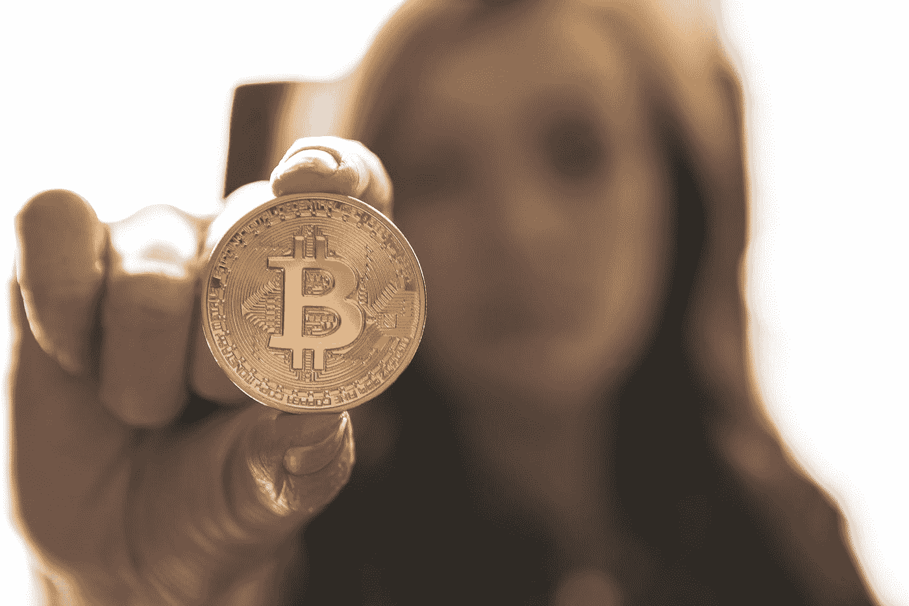

# 比特币的未来会怎样？

> 原文：<https://medium.com/hackernoon/what-does-future-hold-for-bitcoin-4b193cbcebb7>

## 我们能从这种加密货币中期待什么

Photo by [André François McKenzie](https://unsplash.com/@silverhousehd?utm_source=medium&utm_medium=referral) on [Unsplash](https://unsplash.com?utm_source=medium&utm_medium=referral)

作为一种非常突出的加密货币，比特币的涨势让如此多的用户、爱好者和数字货币分析师感到惊讶。在 2018 年的几乎一整年里，加密领域都经历了熊市。

在这次熊市中，比特币明显未能保持在 10000 美元以上的价格。多样化的投资者，以及加密货币领域的新手，开始对比特币市场失去兴趣并投降。

与此同时，到目前为止，已经有很多理论试图解释隐姓埋名的复兴。像往常一样，虽然有些理论是荒谬的，但也有一些似乎非常可行。

然而，打破这种喧嚣，人们对这一惊人的增长又有了新的积极态度。尽管如此，**比特币仍然大幅下跌，**不理会乐观的价格走势。

由于加密货币的感人情绪和高接受度，2019 年也可能是这么多人合法购买或交易独特的比特币加密货币的最后一年。

然而，那些极其富有的人被排除在这份声明之外，因为他们将成为最富有的 1%。

## **比特币的好处**

由于比特币虚拟货币每天都在持续，比特币系统扩散的寿命和潜力都在增加。

此外，出于可能知道也可能不知道的原因，购买比特币实际上是没有吸引力的，直到它被贴上被高估但臭名昭著的标签，最终在有史以来的飙升中大幅崩溃。

基本上，这在 2018 年的新高被严重创下时得到了积极的证明，并导致了一个非理性和疯狂的市场。

截至 2017 年 12 月 16 日，比特币达到了历史新高，其市值约为 3260 亿美元。这只是意味着比特币实际上必须增加近三倍才能达到 1 万亿美元大关。

此外，如果达成这一目标，比特币的近期价格将比当前价格飙升 11 倍以上。**截至 2019 年 4 月 11 日的当前价格约为 6000 美元/7000 美元。**

与此同时，以比特币最近的市值来看，它已经被常规资产类别缩短了。

然而，随着比特币继续获得牵引力，特别是其不断增强的利息收益和基本面，突破 10 万美元的障碍可能在不久的将来实现。

随后，加密领域的一些人认为，个人应该先购买比特币，然后再冒险购买替代比特币。当人们考虑比特币的以下事情时，这个概念实际上在某些层面上是有意义的。

**这些东西包括:**

比特币每四年减半，成为价格催化剂

比特币的最大供应量是 2100 万，其中大约 84%已经被开采

由于其稀缺性，没有足够的比特币来满足全球 3600 万百万富翁的需求

比特币是现存最大、历史最长的数字货币，它增强了稳定性和安全性

硬币一直是占主导地位的虚拟货币，目前约占整个加密货币市值的 50%。

加密货币市场尚未与比特币脱钩，比特币的运动和变化对替代币的价格波动影响很大

它是最受欢迎的数字货币，它有最理想的流动性。有了这个，新用户更有可能在考虑替代硬币之前先购买它。

同样，比特币在 5000 美元的价位上表现强劲，因此，期望一个人拥有完整的比特币通常是不现实的。尽管如此，美元成本平均化等计划也有助于实现一个比特币的里程碑。

## **比特币的更大波动**

尽管比特币市场目前已经重振旗鼓，但流动性和数量正在上升。此外，散列率也重新获得了自己的动力，并且呈上升趋势。

此外，强大的哈希速率非常重要，原因多种多样，例如:

这表明了矿工参与度的提高，也证明了人们对市场状况的信心。

增加的散列率表明增强的系统安全性

散列率的增加有时也预示着更高的成本变化。

## **其他的山寨币呢？**

虽然有些人会嘲笑在购买任何比特币加密货币之前冒险进入替代货币的概念或想法，但其他人认为比特币代表了相当大比例的加密货币用户的投资组合。

然而，在开始寻找替代币之前，并不一定要有一个完整的比特币。然而，它仅仅依赖于每个用户的个人目标。大多数顶级替代币都有可能在牛市中超过比特币的回报。

与此同时，还有一个警告，即这些替代硬币意味着比严格购买比特币更大的风险。

**随着上一年 2018 年的加强，在熊市中与比特币相比，altcoins 的表现非常糟糕。**

## **总结一下**

任何人都不应该睁一只眼闭一只眼冒险购买比特币；最好确定风险承受能力，并决定什么最适合您的加密货币之旅。

然而，完全忽略虚拟货币，比特币的不对称回报是非常巨大的。少量投资比特币或其他可行的数字货币，极有可能在未来几年产生令人难以置信的投资回报。

最后是 FOMO；当比特币市场开始推向更新更高的高度时，对错过的恐惧有卷土重来的趋势。它有可能引发购买狂潮。然而，可悲的事实是，到那时，要合理地持有一个完整的比特币，甚至是一个裂成两半的比特币，都已经非常晚了。