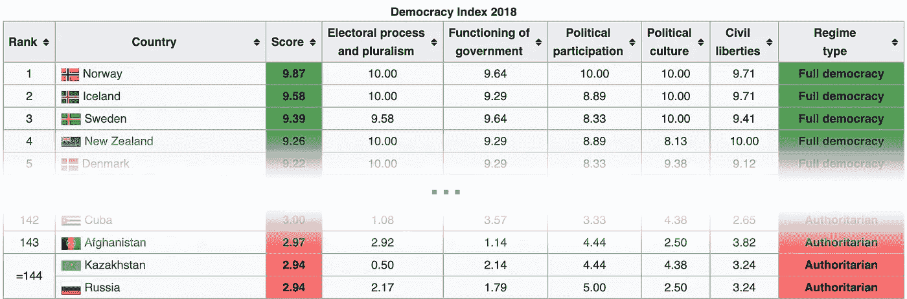

# 《权力的游戏》告诉我们什么是利害关系的证明——不要相信瑟曦！！

> 原文：<https://medium.com/hackernoon/what-game-of-thrones-teaches-us-about-proof-of-stake-don-t-trust-cersei-a9caba418d36>

《权力的游戏》最后一季目前正在播出。期待已久的铁王座之战——统治维斯特洛的[七大王国](https://en.wikipedia.org/wiki/World_of_A_Song_of_Ice_and_Fire#Westeros)。

考虑一下《最后一集》*(别急，这都是编的，此处不剧透)*:最后一战在我们身上；史塔克带领的北方军队逼近战场；丹妮莉丝的军队也在那里；瑟曦率领的兰尼斯特军队也是如此。曾经负责任的成年人约翰·斯诺提出了一个替代方案:“与其流血，我们为什么不进行一次民主选举？”每个人都点头同意。士兵们欢呼。学分。

瑟曦自愿参加选举。兰尼斯特家族在维斯特洛全境设立了投票站，七大王国的每个公民都在选票上写上他们心目中统治者的名字。然后选票会被运到君临，瑟曦会在那里统计票数并宣布获胜者。

整个过程结束了，瑟曦兴奋地宣布她赢了。你会相信这些选举吗？

事实证明，并非所有民主国家都是平等的。如果你有兴趣看排行榜，看看每个国家在 2018 年民主指数[中的排名。](https://en.wikipedia.org/wiki/Democracy_Index#Democracy_Index_by_country_2018)

名单中的大多数国家，特别是那些红色排名较低的国家，公开以民主自豪，并庆祝人口众多的国家有机会选择他们的领导人的定期选举。但显然，一些民主进程容易被操纵，让现有领导人维持其权力地位，不管人口众多的人试图将它转移到哪里。

伪民主并不是唯一有问题的。列表中前 15%的人存在问题。以美国为例，它在榜单上排名第 25，是现代民主的历史缩影(无意冷嘲热讽)。“不公正的选区划分”是美国问题的一个例子，执政党可以在对自己有利的选区之间划线。

民主制度实施起来很复杂，微妙之处很多。通过他们的分析和批评，我们有机会改进他们。来设计更好地保证其纯度和抵御腐败的流程。

**利益证明**系统的行为方式非常相似。投票，或者说影响程度，是基于股权所有权而不是公民身份，但除此之外，这一过程很容易出现类似的细微差别，必须设计成经得起操纵。我们还必须不断批评 PoS 实施，以便我们有机会改进它们。

当然——在密码世界里有很多对 PoS 的批评。范围从相信 PoS 的问题是可解决的，争论各种实现的利弊，到彻底怀疑 PoS 是否能工作。

以以太坊的联合创始人和 ConsenSys 的创始人 Joseph Lubin 的观点为例，他在最近的:*“EOS 怎么样？正如一直争论不休的那样，一个由 21 家加密公司控制的平台并没有那么分散。如果他们愿意，他们可以串通起来进行审查。政府和其他资源丰富的行为者可以贿赂他们或迫使他们违背自己的意愿，违背使用平台的人的福祉和安全"*。

让我们试着分析一下 Lubin 的论点，为什么迄今为止占主导地位的 PoS 实现 EOS 是有缺陷的。EOS *的 21 个民选节点“如果愿意，可以串通起来审查。”但是如果这些节点真的串通起来反对整个网络的利益，会发生什么呢？如果影响不小，比如代币价格下降，利益相关者将会迅速采取行动，取代合谋节点。EOS 上的选举依赖于整个网络的利害关系，并且假定大多数利害关系是诚实的。那么风险在哪里呢？*

风险只有在共谋节点能够阻止自己的替换时才会出现。在我看来，问题的核心是他们才是进行选举的人。他们是计票的人。

这和瑟曦一个人数维斯特洛的选票没什么区别。

大多数 PoS 实施都是**封闭系统**。投票过程是协议的一部分，协议由运行网络的节点执行，这些节点是根据协议选择的。这里有一个循环信任的本质。

那么**工作验证**算法呢？PoW 是否容易出现同样的循环信任弱点？

不完全是。尽管 PoW 在效率和成本方面有缺点，但它有几个非常好的特性，使它成为分散信任的绝佳选择。其中最主要的是强烈的客观性。

**客观性**(我在这里使用的是 Vitalik 的定义)意味着*一个新节点进入网络，除了(I)协议定义和(ii)所有块的集合和其他已经发布的“重要”消息之外一无所知，可以独立地得出与网络其余部分关于当前状态完全相同的结论。*

这是什么意思？假设我是网络的观察者，我想确信网络中节点呈现的状态确实是“正确的”。我能自己验证所有的东西吗？

我可以自己轻松地验证 PoW 中的工作量(这就是重点，哈希很容易验证，但很难产生)。由于 PoW 算法根据最长链规则工作，我可以客观地知道哪个状态的竞争描绘(竞争分叉)是正确的。

你可以说，在某种意义上，工作本身是系统之外的**，由于系统不再是封闭的，并且不仅仅使用它自己来担保它自己，它变得非常值得信任。**

*objectivity* 属性是 PoW(以及类似的方法，如 [VDFs](https://eprint.iacr.org/2018/601.pdf) )独有的，但在大多数 PoS 实现中却没有，这导致了封闭系统的循环信任弱点。

为什么 PoS 网络缺乏*客观性*令人痛苦？这些网络的核心是信任。作为网络的客户端，我们应该能够验证相关状态和事务的正确性。验证数据的正确性需要知道所选的验证者，因为他们是被允许签名块的人。为了验证选出的验证器，可以尝试验证选举计算。然而，计算和投票驻留在链本身上，由我们首先尝试验证的相同验证器签名。这种循环依赖阻止了客户端客观地验证其数据的正确性。有一些变通办法，比如信任其中一个验证器，但是这些解决方案不是最理想的。当我们的核心服务是信任时，我们应该以更高的标准要求自己。

如果我们能给 PoS 添加*客观性*，这将为我们提供缺失的**外部监督**——并给我们一个更值得信赖的 PoS 实现。这也很好地回答了卢宾的担忧，即系统中的当选节点可能会相互勾结并进行审查(特别是在选举他们的投票过程中)。

那么，有没有可能在不影响 PoS 效率的情况下，将 PoW 用于此目的？有一种简单的方法可以做到这一点，而且实际上非常简单。你所要做的就是在外部存储选票——最好是在一个不同的基于 PoW 的分散网络上。

回到维斯特洛的例子，这意味着存放选票的投票站将不再受兰尼斯特控制。投票站将由其他人(权力的游戏世界之外的人)控制，这将保证选举的神圣性。一旦选举完成，无论哪个国王当选，都可以在没有外部势力介入的情况下自由统治维斯特洛。

最后一部分很重要。如果我们要保持 PoS 的效率，网络运营的其余部分——主要是在 PoS 网络上执行智能合同，存储一致同意的状态，做一个[区块链](https://hackernoon.com/tagged/blockchain)所做的一切——必须不再依赖 PoW。PoW 将提供的唯一东西是**客观性的外部保证**，这将让任何观察者确认 PoS 网络没有串通，并且确实是纯粹选举产生的。

这就是这种方法与第 2 层解决方案的不同之处。第二层将所有的[安全](https://hackernoon.com/tagged/security)和信任委托给基础层。例如，基础层可以推翻智能合约结果，或者覆盖第二层所做的状态修改。我们的方法仍将使 PoS 系统保持其自身的安全性和信任，从而保持其自身的价值。

那么这在实践中是如何运作的呢？

电力网络存储选举选票自然选择是*以太坊*。作为一种信任标准，它很受欢迎，而且显然足够安全(就散列能力而言),足以在激励方面与我们自己的 PoS 网络断开连接；它的智能合约提供了适当集成的灵活性。

如果在以太坊上存储选举投票是一个简单的解决方案，为什么我们没有看到更多的区块链 PoS 采用这种方法？

一个原因可能是自负。许多 PoS 系统将自己定位为潜在的“以太坊杀手”——在以太坊达到自己的可扩展性里程碑之前，运行应用程序的可扩展场所。选举也是你的解决方案的一个重要部分，利用别人来完成这个重要部分可能会把你自己的一些感知价值“泄露”给这个人。我们在 Orbs 不同意这些观点。我们看到了已经建成的现有生态系统的巨大价值。不是所有的东西都要更换。我们试图在现有基础设施显示优势的地方使用它们，以使我们自己的解决方案更好。

这种方法对于许多 PoS 区块链来说很困难的另一个原因是用于赌注的令牌的效用。大多数 PoS 系统依赖令牌进行结算，这与这些平台的主要目的——运行应用程序——有关。换句话说，应用程序开发人员使用令牌向运行其应用程序的节点付费。

在以太坊上执行赌注也将意味着应用程序执行的支付效用也必须在以太坊上完成。由于大多数 PoS 系统依赖于每笔交易的 gas 模型，并以非常高的交易吞吐量为目标，这将使以太坊费用(在以太中)非常高且效率低下，从而错过了 PoS 效率的全部要点。

这是 Orbs 架构对我们有利的另一个地方。我们很久以前就做出了一个产品决定(参见最初的[立场文件](https://www.orbs.com/white-papers/orbs-position-paper/))，让应用程序向 Orbs 节点支付*每月订阅*费用，以执行他们的应用程序，而不是按事务处理的 gas 模型。这一产品决定带来了对务实的应用执行平台至关重要的多种好处，如可预测的费用和应用补贴用户费用以鼓励采用的能力(就像脸书补贴你的 Messenger 费用，并且不收取你发送每条聊天消息的基础设施费一样)。这是我们将 AWS 产品体验带给区块链应用开发者的战略的一部分。

Orbs 上的应用程序运行在[虚拟链](https://www.orbs.com/white-papers/blockchain-virtualization-a-necessity-for-real-world-dapps/)上，这些虚拟链拥有专用的隔离资源。虚拟链中的资源专用订阅是按月支付的(如果您想保证未来的数据可用性，甚至可以更长)。每月在以太坊支付一次意味着以太费可以忽略不计。对 PoS 的效率不会有影响。

Orbs 网络是一个基于 PoS 的区块链。它依赖于 ORBS 令牌，ORBS 令牌用于支付运行应用程序的基础设施费用，也用于标记和选举验证器。投票过程在以太坊上执行，因此 ORBS 是一个 ERC20 令牌。

虽然 Orbs 不是以太坊的第二层。Orbs 不会将安全和信任委托给以太坊，而是根据 ORBS 令牌的 PoS 生态系统及其激励模型，在其无权限验证器池中保存自己的值。以太坊提供了一个**外部客观保证**,任何观察者都可以验证 orb 上被选举的节点确实是利益相关者投票的节点。对于这个重要的治理功能，以太坊是 Orbs 设计中的一个关键组件。

运行在 orb 上的 app 不在以太坊上执行，让他们充分享受 PoS 中的高效和去中心化，极低的运营费用，极高的规模以及其他许多 orb 特有的好处，如治理隔离，任何语言的智能合约等等。

点击了解更多关于球体[的信息。](https://www.orbs.com/white-papers/)

*顺便说一句——我将在纽约参加区块链周(2019 年 5 月 10 日至 16 日)，如果你想打招呼，请发微博给我* [*@koltal*](https://twitter.com/koltal)

*原载于 2019 年 5 月 2 日*[*https://www.orbs.com*](https://www.orbs.com/pos-external-oversight/)*。*