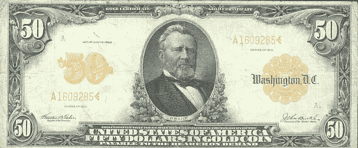
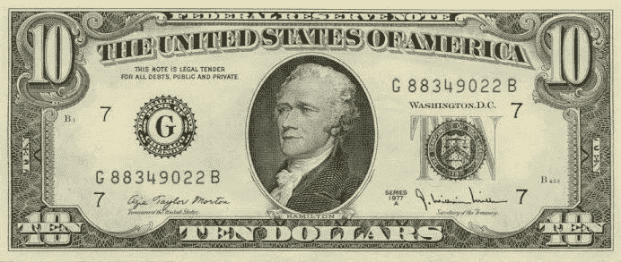
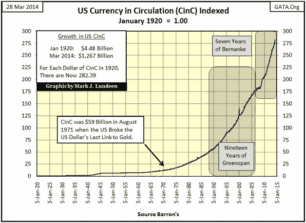
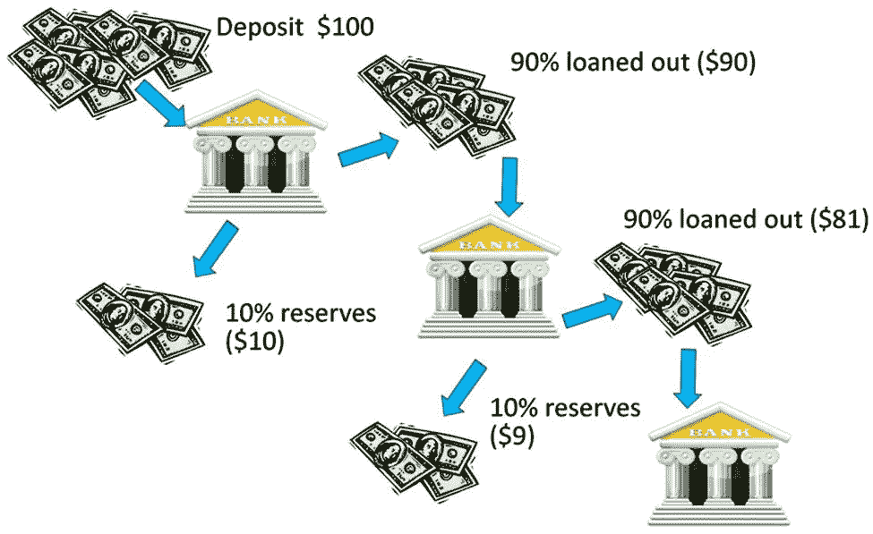
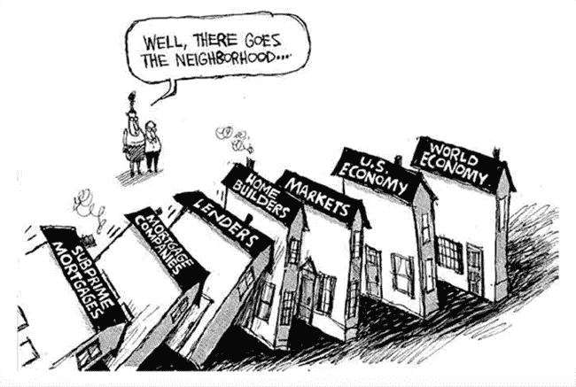
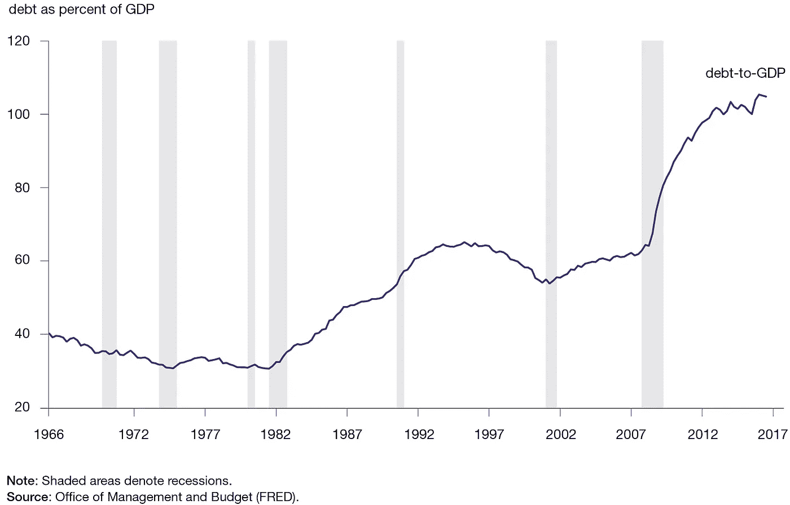
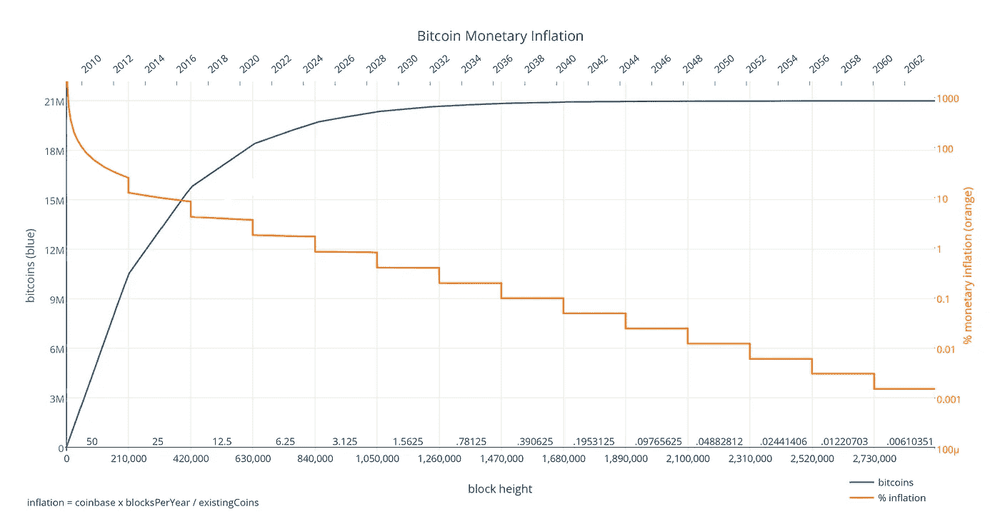
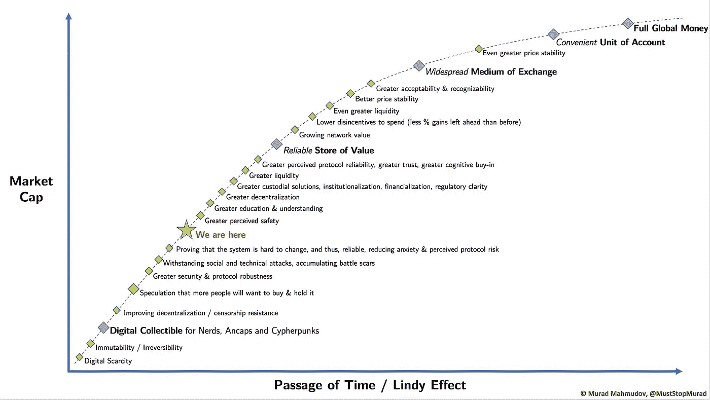
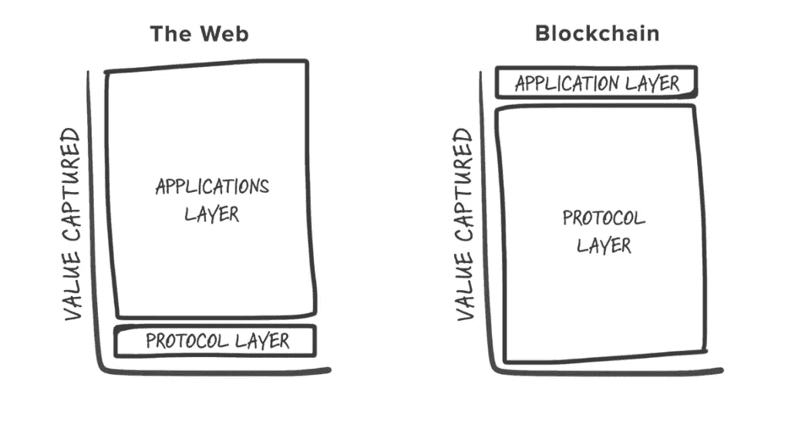

# 是什么赋予了加密货币价值？

> 原文：<https://medium.com/hackernoon/what-gives-cryptocurrencies-value-d5e8aee1466d>

> 就在一年多前，在比特币刚刚从历史高点回落后，我天真地买了我的第一个比特币，然后[掉进了兔子洞](/@belowsearcher/crypto-a-mirror-of-society-1d79ed1df7db)。我了解到的一件事是，加密货币不仅仅是一项技术创新，还可能对社会产生重大的经济和政治影响。在这篇文章中，我将讨论我在过去一年中学到的一些加密货币背后的经济学教训，以便让这个领域的其他新人更好地感受最初让人们兴奋的东西。

## 钱是什么？

比特币中的‘coin’和加密货币中的‘currency’明确暗示了它们的预期用例；它们应该是一种货币形式。首先想到的可能是你用来购买杂货的本国货币。但是它们从哪里来呢？谁决定了你银行账户应用程序上的这些硬币、钞票或数字有价值？

关于金钱背后的[历史的一个比较知名的文献是](https://en.wikipedia.org/wiki/History_of_money)*[*脱壳:金钱*](https://nakamotoinstitute.org/shelling-out/)*这篇文章是 [Nick Szabo](https://twitter.com/NickSzabo4) 在近二十年前写的。在他的文章中，萨伯反思了蛤蜊、贝壳、珠子和贵金属在过去是如何拥有货币功能的。**

**根据 Szabo 的说法，这些早期的货币可以被称为收藏品。所有提到的例子都是值得拥有的，因为穿着它们可以提高社会地位:这些商品被认为是有吸引力的，但很难得到，因为它们在一定程度上都是自然稀缺的。结果，他们变成了**价值储存库**。毕竟，如果你拥有一些很难得到的东西，而且你知道有很多人想拥有它，收集这些东西是有意义的，因为你可以在需要的时候用它们交换其他商品，比如食物。这些具有社会价值的收藏品因此可以被用作交换媒介。最终，最能起到价值储存和交易媒介作用的收藏品也将起到记账单位的作用(如“…值…壳”)。**

****

**Arab traders using shells as a form of money ([source](https://en.wikipedia.org/wiki/Shell_money))**

**金钱也可以近似为 [**社会机构**](https://en.wikipedia.org/wiki/Institution)；社会秩序的一种机制，控制着一个群体中个人的行为。通过使用一种货币形式来代表价值，劳动的专业化成为可能。例如，一个优秀的木工可以专注于做他最擅长的事情，而不是需要维持一个农场或制作衣服，如果他为整个社区增加的价值超过他消耗的价值，甚至可以节省。**

**在过去的几个世纪里，黄金成了作为货币使用的“T4”金本位制。像黄金和白银这样的商品被用来铸造有一定重量的硬币，从而代表一定的价值。虽然这种 [**商品货币**](https://en.wikipedia.org/wiki/Commodity_money) 作为记账单位更为实用，但它也可能被篡改，因为硬币会被剪短或贬值。1875 年，经济学家威廉姆·斯坦利·杰文斯描述说，其结果是， [**代表货币**](https://en.wikipedia.org/wiki/Representative_money) 以银行券的形式出现。这些“黄金证书”代表了一定数量的黄金被储存在银行里。假设这些银行可以存储与证书中所代表的黄金相同的数量，代表货币是一种很好的价值储存手段和方便的交易媒介，因为它更容易携带。**

****

**A $50 gold certificate ([source](https://en.wikipedia.org/wiki/Representative_money))**

**1944 年，第二次世界大战期间，来自 44 个国家的代表就一种被称为布雷顿森林体系的货币体系达成一致。参与该系统的国家同意用美元结算他们的国际账户，可以在美国政府以每盎司 35 美元的固定汇率兑换成黄金。结果，美元成为世界的储备货币，所有其他货币的价值都以美元计价。由于美国在这一体系中的优势地位，法国人称之为“[美国的过分特权](https://en.wikipedia.org/wiki/Exorbitant_privilege)”。**

****

**The US dollar as a fiat currency, 1977 ([source](http://www.rankcurrency.com/wp-content/uploads/2015/03/10-US-Dollar-Bill-1977.jpg))**

**在第二次世界大战后不久的几年里，这一体系运转良好。然而，由于国际收支出现逆差，越南战争期间的开支导致公共债务增加，以及美国美联储的通货膨胀，他们开始花费比他们储备中的黄金更多的钱，美元在 20 世纪 60 年代变得越来越被高估。在 20 世纪 70 年代初，一些欧洲国家离开了布雷顿森林体系，将他们的美元兑换成黄金，进一步增加了通货膨胀和失业。1971 年，美国总统理查德·尼克松提出了一系列被称为“T2·尼克松冲击”的经济措施，其中包括将美元与黄金脱钩。结果，美元变成了 [**法定货币**](https://en.wikipedia.org/wiki/Fiat_money) (源自拉丁语 fiat，意为*‘顺其自然’*)，一种没有内在价值、由政府调控的货币。今天，几乎所有流通的国家货币都是一种法定货币。**

## **法定货币是如何创造的？**

**在美元与金本位脱钩后，尼克松被引述说:我现在是经济学中的凯恩斯主义者。尼克森这里指的是一种宏观经济理论，叫做[凯恩斯经济学](https://en.wikipedia.org/wiki/Keynesian_economics)，描述了一套政策制定者稳定商业周期波动的措施。为了在衰退期间限制失业，凯恩斯主义者认为政府最好是借钱(量化宽松)并把钱花在公共基础设施上。它认为，这种资金流入将蔓延到整个经济，基本上是“启动”它。**

**创造新资金流入经济的最显而易见的方法就是创造新的资金。只有[中央银行](https://en.wikipedia.org/wiki/Central_bank)(例如美国的[美联储](https://en.wikipedia.org/wiki/Federal_Reserve)或欧洲的[欧洲中央银行](https://en.wikipedia.org/wiki/European_Central_Bank))被允许通过铸造硬币或印刷钞票来实际创造新的货币。然后，央行将这些新资金分配给政府或私人银行，由它们在整个经济中进一步分配。这种新货币的涌入可能会导致通货膨胀，因为随着时间的推移，货币的购买力会随着其稀缺程度的降低而下降，从而威胁到其作为长期价值储存手段的功能。**

****

**Circulating supply of the US dollar ([source](http://goldsilverworlds.com/wp-content/uploads/2014/04/US_Currency_circulation_1920_2014.jpg))**

**但是，新钱(虽然技术上；[由于](https://en.wikipedia.org/wiki/Credit) [**部分准备金银行**](https://en.wikipedia.org/wiki/Fractional-reserve_banking) ，信贷也开始在经济中流通，这是全世界大多数银行系统的规范。与完全储备银行相反，在部分储备银行中，银行只需持有其储备中贷给贷方的资金总额的一定比例。因此，一个中央银行创造少量的新货币或向储蓄账户增加一定数量的货币，可以导致更大数量的货币进入一个经济体的流通。**

****

**Fractional-reserve banking ([source](http://thenextturn.com/primer-widely-misunderstood-money-creation-mechanism/))**

**部分准备金银行的弱点在于，它严重依赖于一个假设，即不是每个人都需要同时动用所有的钱，从而信任这个系统。一旦人们对这个系统失去信心，并集体想要提取比银行储备更多的钱，这个系统就可能崩溃。这种现象被称为银行挤兑。**

**[2007 年至 2008 年](https://en.wikipedia.org/wiki/List_of_bank_runs)金融危机期间和之后发生了几次银行挤兑。虽然不可能指出这场危机的单一原因，但很明显，次级贷款在危机开始时扮演了重要角色。次级贷款意味着借钱给那些可能难以及时偿还贷款的人。在次级抵押贷款泡沫期间，人们贷款买房，因为他们投机于房价上涨，从而产生了泡沫。由于银行借给一些人比他们应该的更多的钱来购买已经过高的房子，拖欠率迅速上升。更糟糕的是，银行还将这些债务打包成更复杂的金融产品(如[抵押贷款支持证券](https://en.wikipedia.org/wiki/Mortgage-backed_security)和[债务抵押债券](https://en.wikipedia.org/wiki/Collateralized_debt_obligation))出售给政府机构和投资银行。结果，无法偿还的债务产生多米诺骨牌效应，金融工具贬值，严重影响了世界经济。**

****

**Subprime mortgages creating a domino-effect ([source](http://www.haraldhau.com/wp-content/uploads/The-Role-of-Equity-Funds-in-the-Financial-Crisis-Propagation.png))**

**世界经济的不稳定进而引发了 2009 年欧洲债务危机。一些欧洲国家(希腊、葡萄牙、西班牙、爱尔兰和塞浦路斯)无法为其治理债务进行再融资，也无法救助因银行挤兑而陷入困境的过度负债的银行。为了防止整个国家破产，破坏欧盟的稳定，欧盟和欧洲中央银行作为最后贷款人，推出了多项紧急措施。**

**凯恩斯主义经济模式和 20 世纪 80 年代随之而来的新自由主义经济模式帮助大幅增加了年度国内生产总值(GDP)T1，这是衡量每年生产的所有商品和服务价值的指标。然而，这也是以大幅增加国债为代价的。尤其令人担忧的是，在 20 世纪 70 年代的货币危机结束后，美国的国债增长超过了 GDP，说明国债正逐渐变得不可持续。**

****

**US debt-to-GDP ratio ([source](https://www.aier.org/sites/default/files/Files/Images/Research/6329/chart1debt.jpg))**

**像广受欢迎的美国前总统候选人[罗恩·保罗](https://en.wikipedia.org/wiki/Ron_Paul)这样的批评者认为，当前的体系是一个泡沫，如果不回到金本位制度，这个泡沫就会破裂。虽然保罗是黄金支持货币的支持者，[他认为比特币等加密货币是一个有趣的替代选择](https://www.ccn.com/bitcoin-gold-backed-currency-can-coexist-in-free-society-ron-paul/)。**

****

**Is Bitcoin the balloon, or the pin? ([source](https://www.evolllution.com/wp-content/uploads/2012/10/balloon-pop.jpg))**

## ****比特币和菲亚特有什么不同？****

**2008 年 10 月 31 日，在 2007-2008 年金融危机最严重的时候，一个名叫中本聪的匿名人士或团体发布了一份名为 [*《比特币:一个点对点的电子现金系统】*](https://bitcoin.org/bitcoin.pdf) 的白皮书。顾名思义，比特币被设想为一种数字货币，可以在不通过金融机构的情况下从一个人转移到另一个人。**

**在白皮书中，Nakamoto 将电子硬币定义为一系列数字签名，并描述了它如何使用基于巧妙激励的共识机制在分散的节点网络上运行。只要想到能够在没有可信第三方中介的情况下将数字货币从一个人发送到另一个人，使其能够抵抗审查，这本身就令人兴奋不已。然而，还有更多。**

**比特币的主要经济属性之一是其供应量上限为 2100 万枚，这意味着永远不会有超过 2100 万枚硬币存在，从而造成稀缺。为了刺激网络增长(自举)，最初每创造一个新的区块就铸造 50 个新的比特币。每隔 [210.000 块](https://www.bitcoinblockhalf.com/) (~4 年)，这种“块奖励”减半，这意味着比特币的[货币通胀](https://en.wikipedia.org/wiki/Monetary_inflation)随着时间的推移而降低，这被称为[反通胀](https://en.wikipedia.org/wiki/Disinflation)。实际的流通供应量甚至可以被认为是随着时间的推移而减少([紧缩](https://en.wikipedia.org/wiki/Deflation))，因为许多比特币的访问权限因私钥丢失而丢失。在撰写本文时，已经创造了比特币最大供应量的 [83.11%](https://www.bitcoinblockhalf.com/) ，其年通胀率为 [3.84%](https://www.bitcoinblockhalf.com/) 。在下一次减半后，预计大约在 2020 年 5 月 25 日，其货币通胀率降至 [1.80%](https://www.bitcoinblockhalf.com/) 。由于其内在的稀缺性，比特币被其支持者视为“数字黄金”的一种形式，这表明它可能是最终成为下一个稳定货币标准的理想货币(*、*、[、*比特币标准*、](https://www.amazon.com/Bitcoin-Standard-Decentralized-Alternative-Central/dp/1119473861/ref=sr_1_2?ie=UTF8&qid=1546165972&sr=8-2&keywords=the+bitcoin+standard)、*、*)。**

****

**Bitcoin’s monetary inflation ([source](https://cointelegraph.com/storage/uploads/view/1d067f3721f10f0a76439de9860a4e54.png))**

**虽然比特币的价格波动很大，但货币通胀率不会意外上升的保证使其被视为“硬通货”或“健康货币”，因为它有助于随着时间的推移保持购买力。例如，像委内瑞拉人目前经历的奇怪的 100 万%的年通货膨胀率这样的恶性通货膨胀不太可能发生在比特币上，因为它的货币政策。**

**为了在一段时间内保持购买力，资产的价格也应该至少与购买时的价格持平。那么，是什么决定了资产的价格呢？这个问题的答案取决于你采用哪种经济理论。**

**在整个 18 世纪和 19 世纪占主导地位的古典经济学学派认为，价格是由生产的客观成本决定的。就比特币而言，明确接受古典学派观点的人可能会辩称，价格将取决于与区块开采相关的成本(如硬件、电力)。2018 年，[采矿场被关闭](https://www.youtube.com/watch?v=lhg87v7kQvw)，因为比特币的价格下跌，使得生产成本高于获得的价值，因此在短期内无利可图，这表明这一想法有可取之处。然而，也有矿商有意识地亏本开采，因为他们预计比特币的价格未来会再次上涨，暗示价格不仅仅取决于生产成本。虽然传统古典学派的理论预期价格跟随生产成本，但在比特币的例子中，允许的生产成本实际上跟随其价格。**

**根据[新古典经济学](https://www.investopedia.com/terms/n/neoclassical.asp)的说法，价格是由供需平衡决定的，新古典经济学沿袭了古典经济学流派，并在 20 世纪流行开来。在比特币的例子中，其供应只会略微增加(几乎完全没有弹性)，这意味着它几乎完全取决于其需求。需求高时，价格上涨，需求低时，价格下跌。**

**起源于 19 世纪末 20 世纪初的[奥地利学派](https://en.wikipedia.org/wiki/Austrian_School)，在 2007-2008 年金融危机期间[复兴](https://www.theguardian.com/commentisfree/2008/dec/17/recession-economy)，[拒绝古典和新古典关于价格发现的观点](https://www.investopedia.com/articles/economics/09/austrian-school-of-economics.asp)。它认为，生产成本也是由基于稀缺资源替代用途价值的主观因素决定的，供求平衡也是由个人偏好决定的。奥地利学派强调稀缺和避免政府干预的重要性。因此，奥地利学派与当前实际上基于货币通胀和政府监管的经济模式形成了鲜明对比。由于比特币拥有这些相同的特征，奥地利学派在比特币支持者中变得很受欢迎，反之亦然。**

**除了能够随着时间的推移保持购买力之外，货币必须能够被可靠地储蓄、储存和取回，才能被视为价值的储存手段。在撰写本文时，比特币网络已经上线 10 年了，虽然其 99.98%的功能都在运行，但仍然面临着变得易于存储、使用和在需要时大量出售的挑战，特别是对于非技术人员而言。如果用户界面随着时间的推移得到改善，更多的保管解决方案变得可用，流动性得到改善，并且尽管受到攻击，网络仍然能够有弹性地生存，那么它的货币进化将逐渐继续。**

****

**The monetary evolution of Bitcoin, according to [Murad Mahmudov](https://medium.com/u/e1c7b66721d6?source=post_page-----d5e8aee1466d--------------------------------) ([source](https://twitter.com/MustStopMurad/status/1022169639386836992))**

## **其他加密货币呢？**

**比特币是第一种引起广泛关注的加密货币。自那以后，许多其他加密货币被创造出来，例如调整比特币的技术或经济属性或添加功能(例如更灵活的智能合约)。由于比特币的[先发优势](https://en.wikipedia.org/wiki/First-mover_advantage)和[林迪效应](https://en.wikipedia.org/wiki/Lindy_effect)，即一项技术的剩余预期寿命与其当前年龄成正比，其他加密货币必须在比特币的基础上大幅改进，才能超越其建立的[网络效应](https://en.wikipedia.org/wiki/Network_effect)。对大多数人来说，比特币是进入加密货币的入口，也是交易中最常用的基础货币对。虽然解释加密货币之间的所有差异超出了本文的范围，但我们将讨论由于加密货币的发展而出现的两种经济理论。**

**[fat 协议论文](http://www.usv.com/blog/fat-protocols)最早由 [Joel Monegro](https://twitter.com/jmonegro) 在 2016 年描述，比较了传统互联网和区块链的价值增长。它指出，互联网产生了不可估量的价值，但就价值分配而言，它是由“瘦”协议和“胖”应用组成的。没有人拥有开源互联网协议(例如 TCP/IP、HTTP、SMTP 等。)，而这些协议允许应用程序极大地扩展(如谷歌、脸书、亚马逊)，帮助它们获取价值。**

**对于区块链来说，fat 协议的论题信念是反过来的。与传统的互联网协议不同，拥有本地资产(如比特币或以太网)是使用区块链协议的必要条件。因此，它表示，采用区块链协议将增加对这些令牌的需求，从而提高它们的价值。成功采用基于这些协议构建的应用程序也将自动增加对基础区块链协议资产的需求，从而增加基础协议的价值。因此，fat 协议论文指出,《区块链协议》的价值增长将始终快于在此基础上构建的应用程序的价值总和。**

****

**The Fat Protocols thesis ([source](https://cdn-images-1.medium.com/max/1600/1*4__swDeTd6d6awR9pE53hA.png))**

**通常，可以独立运行的加密货币被称为*‘币’*(如比特币、以太坊)，而依赖另一种加密货币作为平台运行的加密货币被称为【T2’【令牌】(如奥格，0x)。代币通常被出售以筹集资金(“初始硬币发行”，ICO)，用作区块链应用程序中的专有货币和/或资产的数字表示(例如软件许可证、游戏中的虚拟资产或股权)。特别是在 2017 年的牛市期间，代币变得非常受欢迎，因为成千上万的代币被创造出来，价格出现了大幅上涨和下跌。因此，在 fat 协议论文的上下文中，值累计特指这种令牌。**

**[代币流通速度问题](https://www.coindesk.com/blockchain-token-velocity-problem)描述了一个假设问题，即如果硬币或代币的供应量是固定的，需求的增加会自动提高其价格。令牌速度问题表明，网络的平均值取决于其总交易量与交易发生的速度的关系。**

> ***“平均网络价值=总交易量/速度”***

**简单地说，这意味着人们想要持有的硬币或代币将比人们认为无用并会匆忙处理掉的代币产生更多的价值。**

**例如，人们持有比特币可能是因为他们预期比特币最终会成为全球货币。在这种假设下，长期持有比特币是合乎逻辑的。如果许多人坚持不出售他们的硬币，那么可获得的供应量很低，需求的小幅增长可能已经导致其价格大幅上涨。**

**然而，如果人们收到一枚硬币或代币，而他们认为这种硬币或代币保持购买力的可能性比其他可获得的代币小，他们可能会立即卖掉它，去购买其他可获得的代币。特别地，仅具有非常具体的用途的代币(例如，专有应用代币)和已知随着时间经历货币膨胀的硬币或代币被描述为处于这种信任的风险中。**

## **结论**

**对于是什么赋予了加密货币——甚至是广义的货币——价值，目前还没有达成一致的单一理论。然而，价值是资产的一个相对主观的特征，主要取决于对资产的预期(未来)需求，这一概念似乎是清楚的。此外，不管人们采用何种经济理论，拥有一种不受审查、数字形式的货币以及可预测的货币通胀的前景，作为当前经济体系的潜在替代方案，已经激发了许多人的热情。加密货币是否能真正演变成一种可供普通公众以既方便又安全的方式使用的替代形式的全球货币，还有待观察。如果事实证明他们真的可以，事情可能会变得非常非常有趣。**

***此文还有* [*俄文*](https://link.medium.com/7y79RBEW7S) *。***

***相关文章推荐继续阅读:《比特币的看涨案例》***】by*[*Vijay Boyapati*](https://medium.com/u/9efdc740067f?source=post_page-----d5e8aee1466d--------------------------------)*和* [*一个加密货币的演绎估值框架*](/@alexander.liegl/a-deductive-valuation-framework-for-cryptocurrencies-a6bfa085a8b6)*[*Alexander Liegl*](https://medium.com/u/7a46048108d6?source=post_page-----d5e8aee1466d--------------------------------)*和*****

***最后，我要感谢* [*哈苏*](https://medium.com/u/90326a938400?source=post_page-----d5e8aee1466d--------------------------------)*[*Nic 卡特*](https://medium.com/u/a063100e6515?source=post_page-----d5e8aee1466d--------------------------------) *和* [*穆拉德·马赫穆多夫*](https://medium.com/u/e1c7b66721d6?source=post_page-----d5e8aee1466d--------------------------------) *的宝贵反馈。****

> **喜欢这个故事吗？你可以在[媒体](/@undersearcher)和[推特](https://twitter.com/undersearcher)上关注我。**
> 
> ****免责声明**:本文仅用于信息和教育目的，不应被视为投资建议。**