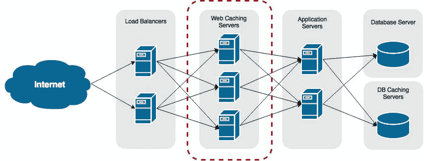
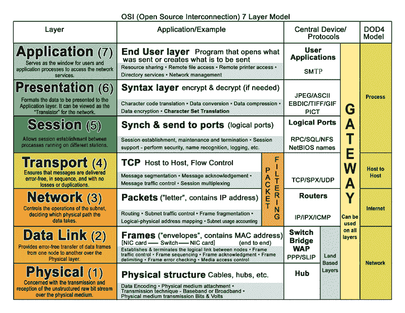
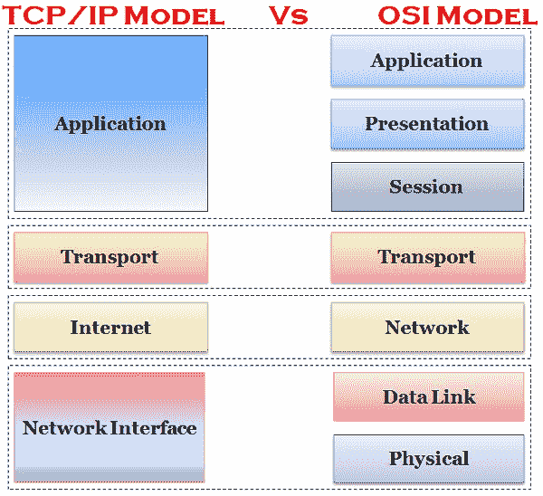
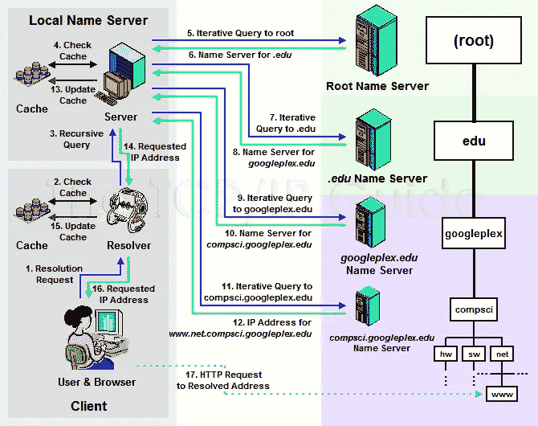
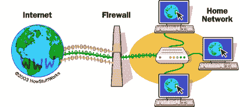
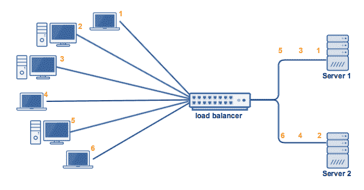
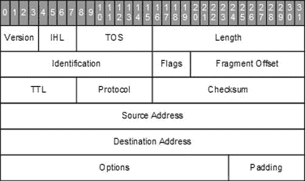

# 当我在浏览器中输入“holbertonschool.com”并按 Enter 键时会发生什么？

> 原文：<https://medium.com/hackernoon/what-happens-when-i-type-holbertonschool-com-into-my-browser-and-press-enter-9a9a643d1aee>

basic web-infrastructure design

今天我们将回答一个常见的软件工程面试问题:“当我输入 holbertonschool.com(可以是任何网址)并按回车键时会发生什么？”这个问题通常是为了衡量你是否了解网络基础设施——网站是如何托管的，以及它们如何向用户提供内容。

这个问题可以分分钟总结，也可以几个小时讲解透彻。这就是为什么我建议，当你收到这个问题时，你可以问面试官一些澄清性的问题，比如:“我应该以什么样的详细程度解释工作流程”以及“你是否希望我在某个领域(网络、安全、服务器等)比其他领域更为关注？因为这个问题是开放式的，所以你发现面试官问这个问题的意图是很重要的。他们让你在几分钟内总结一个复杂的过程，是在测试你的沟通技巧吗？他们是否通过要求你深入研究技术描述来测试你对网络基础设施的了解程度？或者他们雇用你在网络基础设施中担任更具体的角色(例如:安全工程师)，并想知道你对 HTTPS(超文本传输协议安全)、SSL(安全套接字层)和配置防火墙了解多少？

本文将深入探讨。它将从头到尾解释流程中的每个步骤，并将每个步骤与开放系统互连(OSI)模型相关联。值得注意的是，OSI 模型是应用程序如何通过网络进行通信的“概念模型”。这不是一个协议。因此，在 OSI 模型的各层和传输控制协议(TCP) /互联网协议(IP)协议的各步骤之间并不总是 1:1 的映射关系……我们将尽力将两者联系起来。

OSI model

OSI and TCP/IP models do not map 1:1

让我们从解释域名系统(DNS)流程开始回答这个问题。

用户输入 holbertonschool.com，然后按回车键。目前，我们处于 OSI 模型的“应用层”——第 7 层(Chrome、Firefox、Skype 或用户与之交互的任何其他应用程序构成应用层)以及 TCP/IP 模型的“应用层”(第 4 层)。OSI 模型有 7 层，从用户的角度来看，从上到下运行(应用层到物理层)。TCP/IP 模型有四层，也是自上而下运行的(应用层到网络接口层)。

按下 enter 键后，用户的浏览器会检查其缓存中与输入的域相对应的 IP 地址。如果在浏览器的缓存中找不到 IP 地址，用户的操作系统会搜索其缓存。如果用户的操作系统找不到 IP 地址，它会要求 DNS 解析器“解析”该特定的域(找到相应的 IP 地址)。解析程序通常位于互联网服务提供商(ISP)提供的服务器上。首先，解析器将检查其缓存中相应的 IP 地址。如果它无法定位相应的域，它会将用户的请求定向到根服务器。如果根服务器无法解析该域，它会将请求定向到顶级域(TLD)服务器。TLD 的意思是要么”。com“，”。org“，”。net”等(在撰写本文时，大约有 1000 个不同的 TLD)。在这个例子中，用户正在寻找一个“因此该请求被定向到 TLD 服务器。com”。解析器保存 TLD 服务器的地址，因此在后续请求中不需要再次询问根服务器。如果 TLD 服务器无法解析该域，它会将请求定向到该域的相应权威名称服务器。但是什么是“权威域名服务器”？TLD 是如何知道哪个域名服务器对应于该域名的呢？

购买域名时，会向域名注册机构进行注册。域名注册机构告诉相应的 TLD 服务器可以回答 DNS 查询的域名服务器的位置。权威域名服务器是 DNS 流程的最后一站。域名服务器将向 holbertonschool.com 提供一个有效的 IP 地址，或者它将返回一个 404 错误，表明它无法解析所提供的域名(找不到 IP 地址)。解析器将缓存域名服务器提供的 IP 地址，这样下次就可以更快地解析这个域名。

DNS process

让我们假设解析器返回了有效的 IP 地址。用户现在使用 HTTPS 和 TCP/IP 协议向该 IP 地址发出 HTTP 请求。等等，这些协议是什么？让我们从 HTTPS 开始。HTTPS 是一种客户端-服务器协议，位于 OSI 模型的应用层。每当用户从浏览器请求网页时，这个过程(一组规则)就会运行。HTTPS 请求通过传输控制协议(TCP) /互联网协议(IP)发送，有时使用传输层安全性(TLS)或安全套接字层(SSL)加密。用 SSL 或 TLS 加密所有 HTTP 连接是很重要的，因为否则，如果黑客截获了你在网络上发送的数据包(信息),数据包中的信息将不会被加密。因此，如果你发送你的信用卡信息或社会安全号码，他们将很容易阅读。在解释最常见的 HTTP 方法之前，理解一个基本概念很重要:幂等性。一个动作是“等幂的”,如果多次重复该动作不会导致状态的进一步变化。有四种常见的 HTTP 请求:

**幂等方法:**

**GET:** 使用统一资源标识符(URI)从给定的服务器请求信息。GET 请求仅检索数据，不会导致状态发生变化。无论你请求同一个资源多少次，你都不会导致状态的改变。

**删除:**删除给定服务器上的资源。DELETE 是幂等的，因为在删除给定的资源之后，再次尝试删除它将不会有任何效果。

PUT: 在给定的服务器上创建或更新数据。PUT 请求确实会导致状态发生变化。但是，PUT 请求是等幂的，因为多次发出相同的 PUT 请求不会导致状态的进一步变化。如果在 PUT 请求中发送的资源在服务器上不存在，PUT 将创建它。如果资源已经存在，PUT 将尝试更新资源。但是，如果没有对 made 的更新，PUT 将什么也不做

**非幂等方法:**

**POST:** 在给定的服务器上创建新数据。POST 不是等幂的，因为它每次都创建一个新的资源，而不管指定的资源是否已经存在于服务器上。例如，如果您运行了两个 POST 请求，在您的服务器上创建了一个名为“file1”的文件，那么您的服务器上将会有同一个文件的两个版本。

HTTP 请求可以从网站请求内容(GET):视频、声音、图像等，向服务器发布内容(post 或 PUT)，或者从服务器删除资源(delete)。每次客户端向服务器发送 HTTP 请求时，都会收到 HTTP 响应。响应旨在通知客户他/她的请求是否成功。HTTP 响应中最有用的信息通常是状态代码。常见的状态代码包括:200(正常)、404(未找到)、302(临时移动)。

既然我们对 HTTP 请求是如何产生的有了更好的理解，我们就可以深入 TCP/IP 协议了。TCP/IP 是通过互联网发送信息的方式(向 IP 地址发送数据包)。IP 协议是 OSI 模型(第 3 层)中的“网络层”协议，根据 IP 地址通过不同的路由器和互联网路由数据包。IP 协议出现在 TCP/IP 模型的“互联网层”(第 2 层)。TCP 是一种“传输层”协议(在 OSI 模型的第 4 层上运行),负责将所请求的“资源”(文件、图像等)划分为有效大小的“块”,用于路由，确保所有分组到达它们的预期目的地(如果没有从分组接收器接收到确认，则通过重新传输分组),并且一旦分组到达它们的目的地，就将它们重新组装成原始文件。TCP 也在 TCP/IP 模型的“传输层”(第 3 层)上运行。

为了看到这一点，让我们假设用户点击了 Holberton 页面上的一个链接。一个 HTTPS GET 请求被发送到 IP 地址(它或者被缓存在某个地方，或者由 DNS 解析器返回),现在用户正在等待 HTTPS 的响应…

这是谈论网络基础设施的最佳场所。在我们检查了霍尔伯顿如何处理我们的 HTTPS 请求后，我们将跟进我们在 HTTPS 的回应。

在我们的 HTTPS 请求进入霍尔伯顿的网络之前，它必须通过他们的防火墙。防火墙是一种网络安全系统，它根据一组预先确定的安全规则来控制传入和传出的网络流量。通常，防火墙代表可信网络(本例中为 Holberton)和不可信网络(本例中为 internet)之间的屏障。防火墙是“网关”设备的一个例子。有两种不同的(也是常见的)防火墙类型:基于网络的和基于主机的。基于主机的防火墙运行在主机上，控制进出该主机的网络流量。网络防火墙过滤两个或多个网络之间的流量，并运行在网络硬件上。在这种情况下，让我们假设 Holberton 的负载平衡器上运行着一个基于网络的防火墙。我们还假设防火墙配置了基本的包过滤防御。它将检查我们的发件人的 IP 地址，或者验证或拒绝我们的请求。如果防火墙拒绝我们，它可以通过简单地丢弃数据包并拒绝我们进入网络来无声地拒绝我们，或者，它可以生成一条消息，通知我们已经被网络的防火墙拒绝。基于发送者 IP 地址的包过滤是一种非常简单的防火墙配置，并且有大量不同的方法来配置防火墙。

Firewall separating private network from public

出于本文的目的，我们将被 Holberton 的防火墙授予访问网络的权限。现在，我们的 HTTPS 请求将被定向到 Holberton 的负载平衡器。

负载平衡器是一个软件，它在一个 web 服务器集群上分配网络流量。一旦 HTTPS 请求进入网络，它通常是第一个被定向的地方。负载平衡器通过减少每个 web 服务器必须处理的请求数量来实现可伸缩性。它们还消除了单点故障，因为如果一个 web 服务器出现故障，负载平衡器可以将所有请求定向到其他 web 服务器。有两种常见的方法来对 web 服务器集群的网络流量进行负载平衡:第 4 层和第 7 层。第 4 层负载平衡或“传输层”负载平衡根据数据包报头中记录的目的 IP 地址和端口来平衡负载。第 7 层是基于“应用层”的负载平衡，根据用户请求的内容(用户在网站上寻找的内容)将用户请求转发到不同的后端服务器。一旦我们的请求被定向到特定的后端服务器集群，负载平衡器就应用负载平衡算法来确定我们的 HTTPS 请求应该被转发到哪个 web 服务器。

**常见的负载均衡算法有:**

**循环法:**将请求转发给列表中的第一个网络服务器。然后，将该 web 服务器移动到列表的底部，并将下一个请求转发到列表顶部的新 web 服务器。

**最少连接方法:**选择当前处理最少数量活动连接的网络服务器。

**最少数据包方法:**将请求转发给在指定时间内收到最少数据包的网络服务器。

**最小响应时间法:**选择活动连接数最少、平均响应时间最短的 web 服务器。

负载均衡器会根据前面提到的负载均衡算法将我们的请求转发到 Holberton 的一个 web 服务器。

Round Robin algorithm

负载平衡器能做的最后一件事是 SSL 终止。SSL 终止意味着在 HTTPS 请求被转发到网络中的其他服务器之前，对其进行解密(取消 SSL 加密)。这里的逻辑是，由于 HTTPS 请求通过了您的防火墙，现在在您的专用网络中，您可以通过在代理服务器(在这种情况下是您的负载平衡器)上解密请求来降低系统负载(否则您的服务器的处理能力将用于解密 HTTPS 请求)。然而，根据您的操作性质，这可能是不可取的，因为终止 SSL 将允许任何人访问您的服务器，以查看(和阅读)所有的信息在您的网络上移动。在做这件事之前，考虑一下其中的含义。

最后，我们的 HTTPS 请求被转发到 web 服务器。此时，用户的计算机已经成功地与 Holberton 的网络建立了会话。在 TCP/IP 中，会话在应用层(第 4 层)处理，而 OSI 模型有自己的“会话层”来处理会话(第 5 层)。我们现在可以开始与霍尔伯顿的服务器互动。web 服务器的主要作用是向客户端返回静态内容。这种“静态内容”通常是 HTML、CSS 和 Javascript 文件。因此，当我们点击一个霍尔伯顿的网页，图片、段落和链接充斥着我们的屏幕，这是网络服务器在做它的工作。web 服务器的另一个关键作用是与应用服务器(app-server)交互。应用服务器的作用是处理动态内容。这种“动态内容”通常被描述为应用程序的“业务逻辑”。例如，如果用户在 Holberton 的网站上使用学费估算器，应用服务器将运行它使用的任何算法，根据学生输入的工资生成“估算学费”(假设它是用 Python 编写的)，并将内容返回给 web 服务器。然后，网络服务器将使用 TCP/IP 协议将数据(当然是数据包)传回给用户。因此应用服务器负责处理动态内容——应用做什么，而不是它看起来如何。由于应用服务器位于 web 服务器和数据库服务器之间，它还负责与数据库服务器交互。这意味着，如果用户在 html 登录表单中输入密码并点击 enter，web 服务器会将请求转发给应用服务器，应用服务器会将请求转发给数据库服务器。

数据库服务器的主要目的是从数据库中输入和检索信息。在配置数据库服务器时，必须考虑数据库拓扑。在这种情况下，数据库拓扑指的是数据库服务器与数据库交互的权限。您的系统中至少需要有一个数据库服务器是主数据库服务器。主服务器对数据库具有读写权限。但是，由于您需要不止一台数据库服务器，为了避免单点故障(SPOF)，您将需要第二台数据库服务器。这就是你需要开始注意的地方。如果您要添加第二个主数据库服务器，您可能会有多个服务器同时尝试更新同一行的风险。这就是所谓的数据库冲突。为了防止数据库冲突，明智的做法是将您的第二个数据库服务器作为辅助数据库服务器。这意味着您的第二台服务器只能从数据库中读取数据。因此，如果用户试图登录，您的辅助数据库服务器将能够查询数据库，并验证用户是否有正确的密码。但是，如果用户点击“保存我的密码”按钮，应用服务器必须将该请求发送到主数据库服务器(唯一可以写入数据库的服务器)。这样，我们就有了多台数据库服务器形式的冗余，并且避免了数据库冲突。如果您正在构建的应用程序变得非常大，您可能需要多个主数据库服务器，因为您会同时收到如此多的写请求(想想脸书)。您可以有一个主-主数据库配置，但是，这种设置要求您有某种冲突预防/解决软件，以防数据库中同一行同时被更新。

让我们回到霍尔伯顿的例子。我们离开了我们的 HTTPS 请求刚刚到达我们的网络服务器的地方。假设我们点击了霍尔伯顿网站上的“教育”页面。因为我们只是请求得到一个静态网页，所以 web 服务器应该能够满足我们的请求。web 服务器将知道在哪里可以找到这些 HTML、CSS 和 Javascript 文件(因为它已经配置好了)，并通过 TCP/IP 协议将它们(作为数据包)返回给我们。将数据包发送到特定的 IP 地址称为数据包路由(发生在 OSI 模型的“网络层”(第 3 层)和 TCP/IP 模型的“互联网层”)。分组路由之所以成为可能，是因为每个分组都包含发送者的 IP 地址、预期接收者的 IP 地址、告诉网络所请求的资源被分成了多少个分组的信息，以及对应于该分组的唯一编号。在 IP 协议中，HTTPS 响应中的数据包通过最快的可用路由在互联网上传输。这意味着所有数据包都可以通过相同的路由传输，或者没有数据包可以通过相同的路由传输。在请求 Holberton 的“教育”页面的情况下，每个包将包含页面中的一部分信息(例如一个段落)。TCP 在数据包传输过程中会进行大量的错误检查。例如，在发送一个包后，如果包发送者在一段时间后没有收到包接收者的确认，他将认为包丢失并重新发送它们。

IPV4 packet anatomy

希望您对键入类似“holbertonschool.com”的 url 并按回车键后发生的事情感觉更舒服。有很多移动的部分和不同的场景(毕竟这是系统设计)，所以在你开始回答这个问题之前，一定要弄清楚你的面试官的期望是什么。