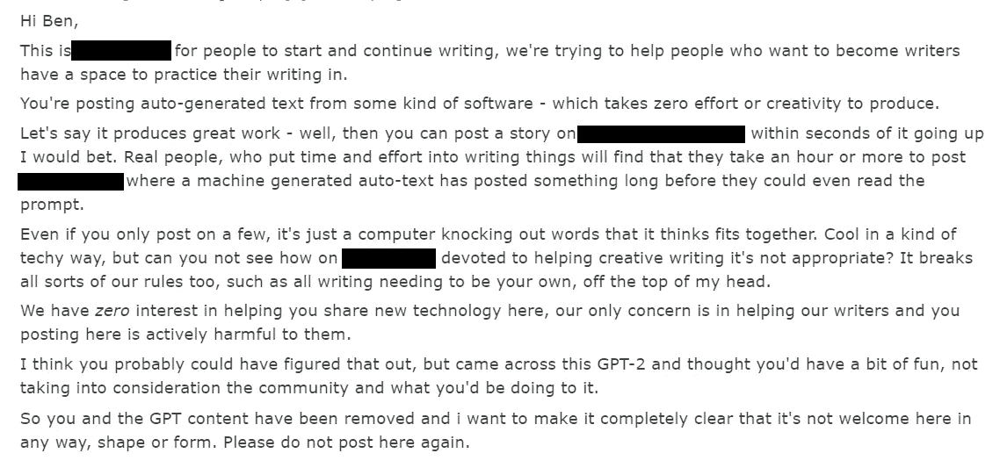
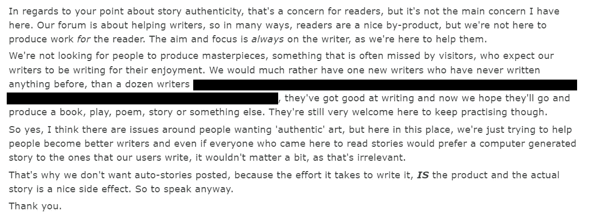
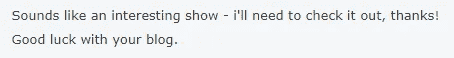
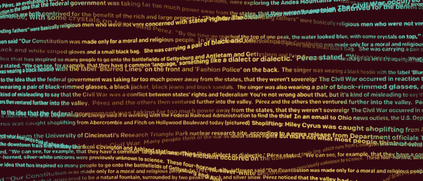

# 用 GPT-2 写小说我学到了什么

> 原文：<https://medium.com/hackernoon/what-i-learned-using-gpt-2-to-write-a-novel-b74a6294c813>

# **故事**

2019 年 2 月 14 日，Open AI 向 AI 社区发布了他们独特的情书。他们分享了一个 21 分钟长的博客，谈论他们名为 GPT-2 的新语言模型，它生成的文本示例，以及一个轻微的警告。博客以一系列可能的政策含义和发布策略结尾。

> “…我们预计安全和安保问题将在未来减少我们的传统出版，同时增加共享安全、政策和标准研究的重要性” [OpenAI 宪章](https://openai.com/charter/)

虽然我们已经习惯了 OpenAI 在发布公告的同时分享他们的完整代码库，但 OpenAI 致力于让 AI 变得安全。在这种情况下，发布完整代码被认为是不安全的，理由是对假冒、误导性新闻、虚假内容和垃圾邮件/网络钓鱼攻击的担忧。作为一种妥协，OpenAI 与我们分享了一个小模型。虽然不如完整的 GPT-2 模型令人印象深刻，但它确实给了我们一些测试的东西。

所以我就是这么做的！上周，我在笔记本电脑上安装了 GPT 2 号的小型模型，进行了一些实验。

首先，为了好玩，我想测试一下它在创造性写作方面的技能。我对手头仅有的小型模型没有抱太大的期望，但我认为我可以了解一些关于模型功能的东西，并且在我使用它的时候可能会开始一些关于技术的有趣对话。

我用一个名为 GPT2 的账号加入了一个流行的在线写作论坛，并写了一篇简短的免责声明，其中写道；

> *****这是使用 OpenAI GPT-2“小型模型”创建的计算机生成文本。出于安全考虑(例如假新闻和冒名顶替)，完整模型目前尚未向公众提供。我没有加入 OpenAI。点击此链接了解更多>>***[***https://openai.com/blog/better-language-models/***](https://openai.com/blog/better-language-models/)**** ****

这个装置看起来很完美。我有一个现成的提示输入到 GPT-2，模型的输出正好是提交的预期长度。我甚至可以从其他用户那里获得关于提交质量的反馈。我选择了一些具体的广告词，作为提示输入到 GPT-2 中，在它产生一个看似合理的输出之前，多次运行这个模型。

我把这个故事粘贴到平台上，我的免责声明在最上面，兴奋地看着我会从社区收到什么样的问题。我按下回车键，几秒钟后。

> 你被禁止了。

我很困惑。我在使用电脑生成的文本时非常透明，没有试图提交大量帖子，只是一个。这是我学到第一课的地方。

# **第一课——保持透明可能并不总是足够的**

我有意识地努力做到尽可能透明。我不想欺骗任何人，让他们相信这不是计算机生成的文本。远非如此，我想让人们知道它是由 GPT-2 创造的，让他们参与到围绕人工智能安全的对话中。我天真地认为我会通过我的诚实来避免负面的回应，但这对这个社区来说还不够。

我给版主发了信息。这是我收到的回复；

Please note, I have redacted any references to the specific forum out of respect for their community. They do not want to inspire copy-cats, and hopefully, this blog will make it apparent that I don’t either.

对话就是这样开始的，但要知道它是愉快地结束的！

# **第二课——风险不在于《GPT 新协议》,而在于我们如何使用它**

GPT-2 发布后不久，我看到了对有限发布的两种主要反应。一些主流媒体重新展示了他们最喜欢的终结者照片，而人工智能社区的一些人认为这是一种营销策略——因为任何太危险而不能发布的技术都必须非常令人印象深刻。

我只能接触到非常有限的“小型”GPT 2 号。你只需要使用它几分钟就能知道它离终结者风格的风险有多远，但它仍然强调了通过发布策略进行思考的必要性。糟糕的技术实现会对公众情绪产生负面影响，在这种情况下，是我选择的论坛和技术应用敲响了警钟。

# **第三课——真实性很重要**

GPT 2 号可能会写一个迷人的故事，但如果它既迷人又真实，它就不会在我们心中占据同样的位置。马克斯·泰格马克(Max Tegmark)在《生活 3.0》(Life 3.0)中提出了这一点，他认为在一个人类没有工作的世界里，人工智能可以为我们创造新的药物或虚拟体验。这些药物可以让我们感受到和获得诺贝尔奖一样的成就感。但这是人为的。泰格马克认为，不管感觉有多真实，肾上腺素激增有多令人上瘾，知道你实际上并没有做好基础工作，知道你已经有效地欺骗了你的方式来实现这一成就，这将意味着它永远不会相同。

“假设它产生了伟大的作品”

不管出于什么原因，人们渴望“真正的产品”,即使它在各方面的功能都比人造产品差。有些人坚持在钢琴上安装象牙键盘，因为这是真实的东西——尽管它们会变黄，容易破碎，并且依赖于对动物有害的材料。塑料替代品更坚固耐用，但不是真的。正如(来自论坛的)信息所言，即使“它产生了伟大的作品”，可能在功能上比人类可以写的任何故事都好，但你没有“真正的人，他们花时间和精力写东西”的真实产品

# **第 4 课——我们不仅仅关心故事，我们还关心故事背后的故事**

该信息还强调了两件事——人类的提交需要努力和创造力，这很重要，即使实际输出在功能上并不比计算机生成的文本好。我想我同意。当我发现一本伟大的书背后的故事时，我总是发现它对我来说意义重大得多——这是作家自己的意识经历的故事，引导他们创作这部作品。

## ***华氏 451 度***

雷·布雷德伯里的巨著《华氏 451 度》本身就是一本精彩的书，但它的创作背后的故事让它对我来说更加特别。构思这部小说时，布拉德伯里有一个年幼的孩子，在家里找不到一个安静的地方写作。他偶然发现了一个地下房间，里面满是每小时 10 美分的打字机。布拉德伯里在那个房间里写了整本书，周围都是其他人，打着他一无所知的东西。九天 9.80 美元之后，我们有了华氏 451 度。

## ***Vulfpeck—Sleepify***

这不仅适用于生成的文本。最近，我花了太多的钱进口 Vulfpeck 的“Sleepify”专辑的黑胶唱片。一张唱片有 10 条均匀分布的轨道，凹槽完全平滑。为什么？只是纯粹的沉默！虽然这是一张基于其音乐价值的糟糕唱片，甚至最基本的音乐生成算法也可以创造出更好的东西，但我喜欢它的故事。

Vulfpeck 乐队于 2014 年将这张专辑放在 Spotify 上，并要求他们的粉丝在睡觉时播放一整夜。大约两个月后，这张专辑被从 Spotify 撤下，但在此之前，乐队获得了略高于 20，000 美元的版税，他们用这笔钱进行了完全免费的“Sleepify 之旅”。

顺便说一句，我认为像 GPT-2 这样的人工智能也可以在创造一个迷人的故事背后做得很好。不过，对于前面的观点，如果它没有实际发生，如果没有人类有意识的努力，它就缺乏真实性。一旦我知道了，对我来说就不一样了。

# **第五课——有时是关于写作过程，而不是被阅读的过程**

My second response from the moderators

在我与版主的交谈中，我甚至没有想到的一点是，阅读内容的人并不重要，有时从写作中可以获得更多的乐趣和个人发展，这也是论坛积极想要推动的事情。

在网飞的新剧《来世》中，(没有真正的剧透！)主角托尼在当地一家报社工作。在整个系列中，托尼指出了报纸的乐趣，从他们镇上必须报道的平凡故事到送报纸的人，结果他只是把报纸扔在附近的一个垃圾箱里。实际上没有人读报纸，托尼认为这意味着他们的工作直到系列的最后都没有意义。托尼意识到谁看报纸并不重要，或者是否有人看报纸并不重要。重要的是登上报纸。每个人都应该有机会让别人听到他们的故事，不管在别人听来有多平凡。如果这让他们觉得自己很特别，是更大的事情的一部分，即使只是一会儿，那也是好的。

我已经写了几年了，除了我现在在 Medium 上的 18 个博客之外，我还有大量写了一半的想法，大部分是垃圾，还有一个不断增长的概念列表，我希望有一天能扩展它。有时候，我的写作是一个更大使命的一部分，围绕人工智能的用途、安全和社会影响向广大受众进行交流，在那些时候，我确实关心我的写作被阅读，甚至更好地被评论和讨论。在其他时候，我用它来整理我的思路——了解我需要做的演示或我需要提交的提案背后的叙述和信息。有时候，我写作只是因为好玩。

如果人工智能能够比人类写得更快更好，而且看起来很有可能(毫无疑问，在一些缩小的参数范围内)——这并不意味着我们不能因为这些原因而继续写作。人工智能可能会吸引读者的注意力，但即使没有人阅读，我仍然可以为快乐而写作。然而，我认为这将意味着人们会写得更少。

我开始写作是因为有人要求我工作。开始时这是一件苦差事，困难、耗时，我只在有真正明确的需求时才会去做。渐渐地变得容易了，直到突然发现自己乐在其中。如果不是几年前的那个具体要求，我不知道我是否会开始写作，也不知道我现在是否会在这里为快乐而写作。

# **不是结论**

Not a flamethrower either

很明显，像 GPT-2 这样的语言模型可以对社会产生积极的影响。OpenAI 已经确定了一些例子，如更好的语音识别系统，更有能力的对话代理，写作助手和语言之间的无人监督翻译。

然而，除非我们有正确的发布策略，并有强大的安全流程和政策支持，否则这一切都是不可能的。创造性写作可能不是正确的应用，所以我们需要确保我们识别出社会认可的对这些语言模型的良好使用的应用。将我们批准的应用程序和我们希望在政策中保护的应用程序整理成文，将有助于其他人做出正确的决定。良好的沟通将确保人们了解正在使用什么，为什么使用，并让他们保持一致。强大的安全性将防止恶意方规避策略和最佳实践。

值得注意的是，这些经验都是轶事，来源于单一的互动。没有一个健全的政策是基于轶事证据，而是基于学术研究，在将价值观提炼为每个人都要遵循的具体规则之前，用一种不偏不倚的方法吸取广泛的意见。

这不是结论。

这个故事才刚刚开始。

Thankfully, we parted on good terms

Credit: Ben Barry / OpenAI