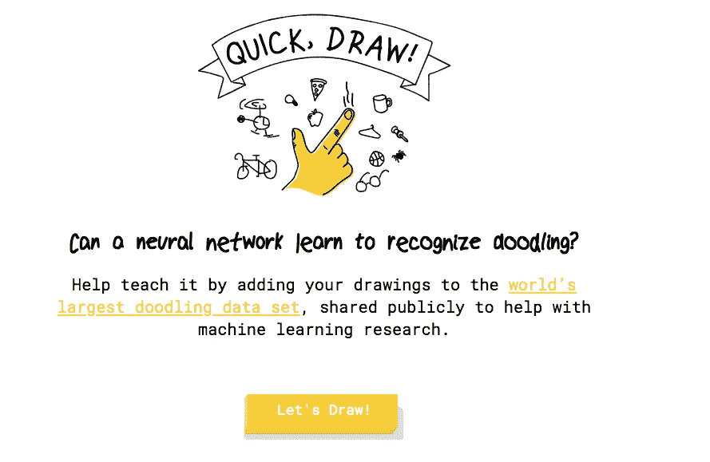
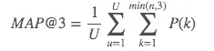
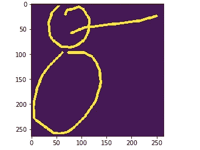
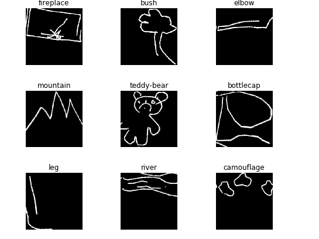

# 当我试图使用深度学习来改善游戏中的人工智能代理时，我学到了什么

> 原文：<https://medium.com/hackernoon/what-i-learned-when-trying-to-improve-an-ai-agent-in-a-game-using-deep-learning-2727850fc378>

2018 年末我参加了 kaggle 的**“快，画！涂鸦识别挑战”。**对于那些不知道的人，下面是这个游戏的简短描述:

[*“快，画！”*](https://quickdraw.withgoogle.com/) *作为一款实验游戏发布，以一种好玩的方式教育公众人工智能是如何工作的。该游戏提示用户绘制描述某一类别的图像，例如“香蕉”、“桌子”等。*



作为比赛的一部分，超过 340 幅 1B 作品的子集被发布。竞争者需要改进现有的人工智能[算法](https://hackernoon.com/tagged/algorithm)，该算法可以区分用户是否能够正确地画出所要求的内容。对于每张测试图片，需要预测涂鸦最可能属于的三个类别。

```
key_id,word
9000003627287624,The_Eiffel_Tower airplane donut
9000010688666847,The_Eiffel_Tower airplane donut
```

最佳算法是基于其平均精度@ 3 (MAP@3)选择的。



其中,`U`是测试数据中被评分的绘图的数量，`P(k)`是截止时的精度`k`,而`n`是每个绘图的预测数量。

# **初步深入研究数据**

这些画被捕捉为带有时间戳的向量，并标有元数据，包括玩家被要求画的内容以及玩家所在的国家。340 个职业中的每一个都有下面格式的 CSV 文件，定义了相应的玩家是如何绘制涂鸦的。


A sample for doodles with apple as class

使用下面的代码，我们可以将上述文件的绘图列中的每一个笔画转换成相应的图像。

```
BASE_SIZE = 256
**def** draw_cv2(raw_strokes, size=299, lw=4, time_color=**False**):
    img = np.zeros((BASE_SIZE, BASE_SIZE), np.uint8)
    **for** t, stroke **in** enumerate(raw_strokes):
        **for** i **in** range(len(stroke[0]) - 1):
            color = 255 - min(t, 10) * 13 **if** time_color **else** 255
            _ = cv2.line(img, (stroke[0][i], stroke[1][i]),
                         (stroke[0][i + 1], stroke[1][i + 1]), color, lw)
    img = cv2.copyMakeBorder(img,4,4,4,4,cv2.BORDER_CONSTANT)
    **if** size != BASE_SIZE:
        **return** cv2.resize(img, (size, size), interpolation=cv2.INTER_LINEAR)
    **else**:
        **return** img
```

例如，这是雪人文件中的一个:



snowman

我们将所有的笔画转换成相应的图像，并存储在相应的文件夹中(train & test)。



A batch of images in training data

# 使用卷积神经网络来识别涂鸦

理想情况下，有多种方法可以解决这个问题，例如，由于笔画是坐标序列，因此有一个顺序组件，也可以使用递归神经网络。我更喜欢把它作为一个计算机视觉问题来处理，因为通过可视化图像问题的结果来测试和学习比我们正在研究的顺序问题更容易。

我们选择的架构是 Resnets 及其变体([https://arxiv.org/abs/1512.03385](https://arxiv.org/abs/1512.03385))。我们从 Resnet18 开始，逐步测试问题的性能，甚至跨更大的架构。根据经验，我观察到 Resnet34 比其他任何网络给我们带来了更多的好处。

# **我从最初的数据实验中学到了什么**

对数据和后续运行的观察表明，这个问题需要一个简化的网络，它可以放大这些大量的涂鸦。当时需要的是一个能够在有限时间内运行多个时代的简化网络。因此，我甚至没有尝试任何复杂的架构，这最终是一个伟大的决定。

使用 Resnet34，我可以在 30%的数据量上运行我的实验，它确实表明当你有一个简单但非常多样化(更多标签)的数据集时， ***更多的数据确实有助于泛化能力。***

# 数据中的噪声

在进一步的观察中，观察到在训练数据中有许多噪声，即有许多涂鸦被错误地标记。这实际上影响了模型的[学习](https://hackernoon.com/tagged/learning)能力，因为你天生就给了它错误的指令。对此，我无法尝试的可能解决方案是开发另一个网络来识别错误标记的图像或手动标记的高损失图像(实际和预测之间差异最大的图像)。

# **我在哪里着陆**

我得到的最高地图@3 在公共排行榜上是 0.91444，在私人排行榜上是 0.91318。考虑到比赛的获胜者是 0.95480，我是在正确的道路上。如果我花更多的时间改善数据中的噪音，一个可能会有所不同的策略是，但这是下一次的学习。

## 感谢大家阅读我解决这个非常有趣的问题的经验！对于任何想尝试的人来说，下面是比赛的链接。

[](https://www.kaggle.com/c/quickdraw-doodle-recognition) [## 快，画！涂鸦识别挑战

### 你能多准确地识别涂鸦？

www.kaggle.com](https://www.kaggle.com/c/quickdraw-doodle-recognition)