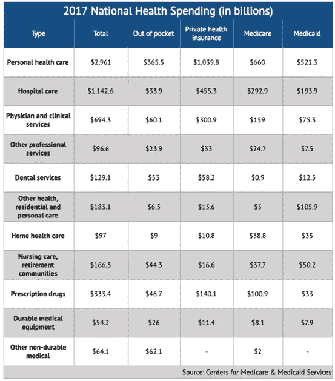

# 如果把区块链和可穿戴设备结合起来会怎么样？

> 原文：<https://medium.com/hackernoon/what-if-we-combine-blockchain-with-wearable-devices-ce87377ec7d3>

虽然许多人的目光都集中在金融领域，但区块链对其它各个领域的影响却很有趣。我们将在未来几年看到，这肯定会标志着这些行业内企业的兴衰，这些企业要么成功，要么无法适应区块链可能产生的变革力量。目前，区块链和技术正在解决医疗保健领域的几大挑战。区块链对全球健康非常有益，这是正确的，特别是在智能可穿戴设备方面，这显然是当今的需求。

可穿戴设备的使用范围很广，从跟踪健康状况的数字智能手表等实用技术。据调查，美国有 40%的千禧一代拥有可穿戴设备。随着这种发展，现代技术在监测我们的健康和让我们获得个人数据进行自我管理方面变得越来越重要。数字医疗、电子医疗、远程医疗、医疗信息技术和远程医疗等领域的进步极大地改善了医疗保健的效果，其中移动医疗*(或移动医疗)*产生了重大影响。

*“数字技术，如移动无线技术，有可能彻底改变人们与国家卫生服务的互动方式。数字卫生，特别是移动卫生，已被证明可以提高护理质量和覆盖面，增加获得卫生信息、服务和技能的机会，并促进健康行为的积极变化，以防止急性和慢性疾病的发生。”-* 世界卫生组织声明

## 智能可穿戴设备中有区块链有什么好处？

从便利到必要，这就是区块链如何改变可穿戴技术，它带来了透明度和安全性，允许客户对自己的数据和信息有更多的控制，对它的完全安全更有信心。这也将使老人、小孩和病人更安全

## MHealthcoin 智能可穿戴设备

mHealth 的品牌专用智能可穿戴设备持续测量用户的血压、心率等健康数据，并提交给 app。在用户同意的情况下，健康数据也将被提交和分析，这是一个手机内部的聊天机器人，它将根据这些信息为用户提供个性化的健康和锻炼建议。老年人和儿童版包含一个电信芯片，允许父母和看护人跟踪用户的实时位置。在紧急情况下，用户可以呼叫紧急服务，并通过简单的点击显示他们的位置。

*   给孩子的

增加了 GPS 追踪功能，让父母可以追踪孩子的位置。

*   针对老年人

增加了 SOS 功能，供老年人在紧急情况下使用，并呼叫帮助监控他们的身体状况

*   为了运动

数字训练系统旨在让用户保持健康，激发生活热情，具有多样化的锻炼指导视频，可根据用户的个人目标和训练偏好建立一系列锻炼

*   家用电器用 IOT

为了给用户提供一站式的更智能的生活方式，物联网技术将在后期发展到我们的智能设备上。用户可以在 mHealthcoin 应用程序甚至可穿戴设备上随时随地控制他们的联网家庭

## 锻炼和增强现实游戏

除了智能可穿戴设备，mHealthCoin 应用程序还提供有趣的锻炼功能，以鼓励锻炼。它将在应用程序中整合不同的锻炼任务和活动，以挑战用户。为了增加运动的乐趣水平，用户可以在自然环境中运动时使用设备的 GPS 寻找隐藏的物体来完成任务。还有最佳成绩记录和一个虚拟的“训练伙伴”来鼓励用户打破记录。

锻炼和健康的生活方式是长寿的关键，这是预防心脏病、关节炎、癌症和糖尿病等慢性疾病的最简单方法之一。

It is calculated that U.S. households spent $980 billion on health care in 2017, which works out to more than $3,200 per person.

mHealthcoin 的使命是为用户提供一个了解和监控自己健康的平台，同时通过其练习获得激励。连同其智能可穿戴设备，燃烧的每一卡路里都有助于奖励——这意味着用户即使在睡眠中也可以赚取 mHealthCoin。所有获得的硬币和代币都可以用来兑换打折的品牌商品和服务。

## 最后的话。

有很多公司创造并销售自己品牌的可穿戴设备，但是缺少了一个步骤，那就是区块链。我可以看到未来我们如何生活在区块链的去中心化的数字世界中。员工可能会看到自己得到智能手表，并跟踪他们的职责，商店里的顾客将会有可穿戴设备，im 医院可以通过可穿戴设备更好地跟踪病人的健康状况。

没有人能否认，未来会有各行业去中心化的可穿戴技术，而这个未来呢？

一点也不遥远。

●网址:h [ttps://mhealthcoin.io/](https://mhealthcoin.io/)

●频道:【https://t.me/mHealthCoins 

●安线程:【https://bitcointalk.org/index.php?topic=5047000.0】T4