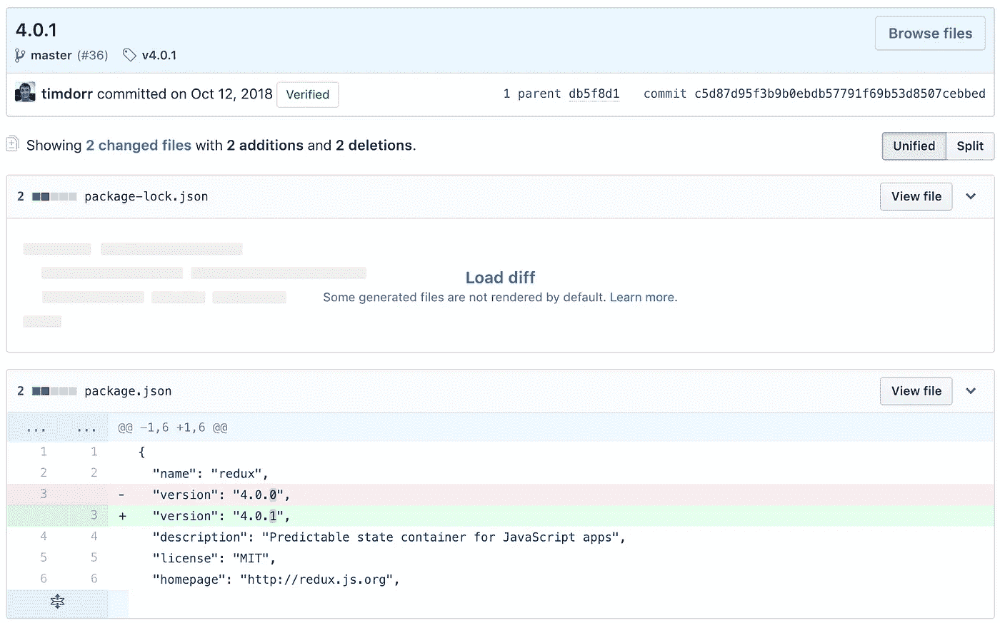
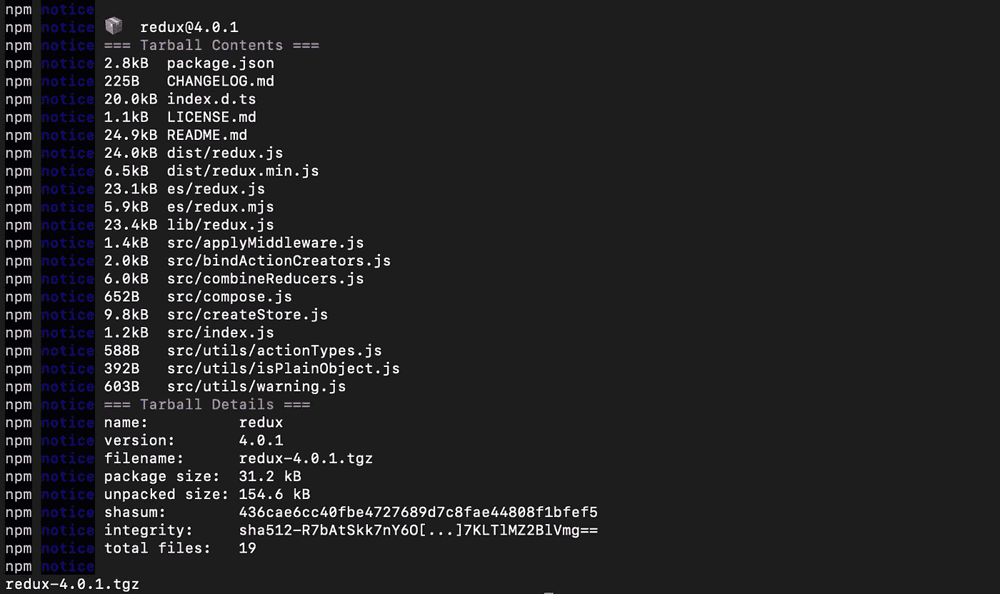
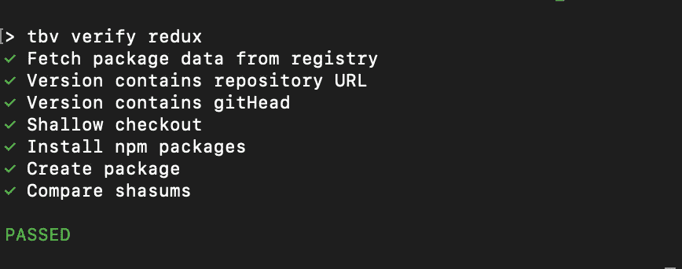
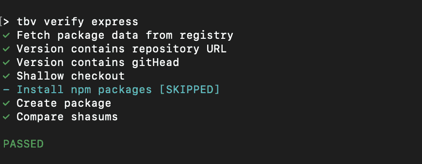
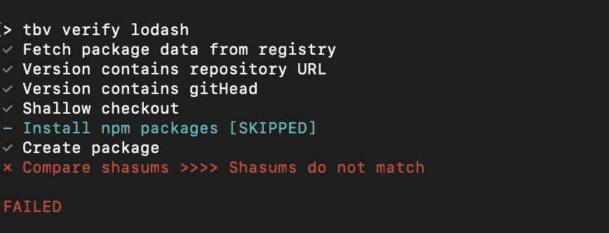
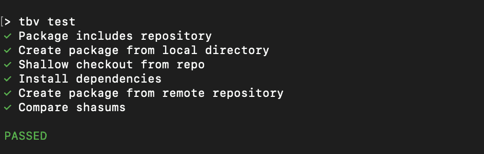
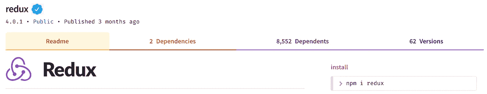

# 如果我们可以验证 npm 包会怎么样？

> 原文：<https://medium.com/hackernoon/what-if-we-could-verify-npm-packages-c2a319cff758>

## 识别有害和恶意代码的可重复步骤

# NPM 安全状况

2018 年给我们带来了一些关于 NPM 安全状况的相当高调的话题。

一月份，[添加到事件流](https://medium.com/u/f735d3b0f2f3#diff-b9cfc7f2cdf78a7f4b91a753d10865a2)中。

防范这种攻击的唯一方法是仔细检查影响整个*依赖树的所有提交。此外，使用 package-lock.json 文件有助于确保使用可预测的依赖关系，这降低了对子依赖关系进行攻击的风险。但是代码审查的安全性必须始终保持在点上*，而攻击者只需要运气*一次*。**

## *没有规范的方法来证明一个包是合法的*

*这在某种程度上是前两个向量的组合。如果 NPM 知道 eslint-scope 包含恶意代码，他们本可以阻止它被发布。*

*假设包中的代码必须总是与源代码控制中的相匹配。因为攻击者从未获得 Github 帐户的访问权限，所以他们无法更改回购协议。这将阻止发布新的包版本。但是这也会阻止基于类型脚本的项目的存在，比如 RxJS。所以很明显，这不是一个好的启发。*

*在安装之前验证依赖项是否有效，或者是否可以用类似于`npm audit`的东西来标记有问题的依赖项，这也是很好的。*

# *有可行的解决方案吗？*

*理想情况下，发布 npm 包应该是这样的:*

1.  *编辑码*
2.  *提交并推送到 Github/Gitlab/Bitbucket/etc*
3.  *???*
4.  *出版*

*缺少一个自动过程来验证将要发布的包是否与源代码控制中的包匹配，或者至少是源代码控制中的包的确定性结果。*

*让我们来看看 NPM 为建立这样一个过程提供了什么。*

## *NPM 前置/后置脚本*

*我将在这里快速回顾一下 npm 脚本，这样我们就能达成共识。*

*您可以创建在任何其他脚本之前或之后运行的任何脚本的“前”或“后”版本。例如，如果您有一个运行 Typescript 编译器的“生成”脚本，您也可以创建一个“预生成”脚本来清除任何以前文件的生成输出文件夹。以这种方式分解复杂的脚本有助于产生小而易读的脚本。*

*但是您也可以为“内置”npm 脚本编写“前”和“后”脚本。例如，“prepack”、“prepublish”和奇怪命名的“prepare”脚本让您在创建或发布包之前运行构建或测试。*

*下面是来自 Redux package.json 的实际的[“准备”脚本](https://github.com/reduxjs/redux/blob/686d29b5d4e2dcb6709c16e31b79ecde90763156/package.json#L47):*

```
*"prepare": "npm run clean && npm run format:check && npm run lint && npm test"*
```

*正如你所看到的，打包 Redux 将首先清理，检查，皮棉，并测试所有的东西。如果开发人员不知何故偷偷通过了代码审查，甚至错误的格式，该脚本将阻止该更改被打包并随后发布。这真是太棒了！*

## *NPM 注册和源代码管理*

*虽然 npm 是一个命令行应用程序，但它的所有数据都来自 registry.npmjs.com。这个 API 提供了任何关于包的公开数据。如果你想看到所有关于 Redux 的当前和历史数据，只需[获取 https://registry.npmjs.com/redux](https://registry.npmjs.com/redux)。*

*如您所见,“versions”对象包含由版本 ID 索引的每个版本的数据。在撰写本文时，`redux@4.0.1`是最新的稳定版本。关于来自注册表的版本信息，有一些有趣的事情需要注意。下面是一个缩写的对象，这样我们就可以专注于相关的位:*

```
*"4.0.1": {
  ...
  "repository": {
    "type": "git",
    "url": "git+https://github.com/reduxjs/redux.git"
  },
  ...
  "gitHead": "c5d87d95f3b9b0ebdb57791f69b53d8507cebbed",
  ...
  "dist": {
    ...
    "shasum": "436cae6cc40fbe4727689d7c8fae44808f1bfef5",
    ...
  }
}*
```

*“gitHead”对应于发布包的机器上的当前提交。关于更多上下文，您可以访问 Github 上的 commit 来查看更多信息:*

**

*[https://github.com/reduxjs/redux/commit/c5d87d95f3b9b0ebdb57791f69b53d8507cebbed](https://github.com/reduxjs/redux/commit/c5d87d95f3b9b0ebdb57791f69b53d8507cebbed)*

## *NPM 包装试运行*

*注册表输出中的“shasum”是生成的包的校验和。假设您已经克隆了 Redux repo，那么您可以使用`git checkout c5d87d95`(sha 的前 8 个)检查包的“githead”并从锁文件:`npm ci`安装依赖项。*

*现在我们可以试运行 pack 命令，该命令执行打包过程，而不实际生成文件:`npm pack --dry-run`。以下是在此特定提交下运行时的输出:*

**

*Result of packing Redux at c5d87d95*

*如果我们不进行“试运行”，这就是*将*放入包的 tarball 中的内容这里有两件非常酷的事情。首先，任何人在一个干净的回购上签出这个提交并运行“pack”脚本，都会得到完全相同的输出。其次，注意输出中的 shasum 与注册表中的 shasum 完全相同。这证明了当 Tim Dorr 打包并发布 Redux 时，他执行了与我们完全相同的步骤。没有无证的手动步骤，没有隐藏的恶意代码，没有偷偷摸摸的业务。*

*我们知道这一点，因为我们以相同的 git 头开始，以相同的 shasum 结束。我们可以查看回购中的一切，包括代码和“准备”脚本，并看到一切都是光明正大的。有了这些知识，我认为我们绝对可以信任这个版本的 Redux！*

*👍👍👍👍👍👍👍👍👍👍👍👍👍👍👍👍👍👍👍👍👍👍👍👍👍👍👍👍👍👍*

# *RealScience 是可重复的*

*以下是我们刚刚采取的验证 Redux 的步骤:*

1.  *从 NPM 注册中心获取包数据*
2.  *查找存储库 URL*
3.  *找到 gitHead/commit*
4.  *签出提交(到临时文件夹中)*
5.  *安装依赖项*
6.  *包装试运行*
7.  *比较发布的和重新创建的 shasums*

*我创建了一个[概念验证包验证器，名为 TBV(信任但验证)](https://www.npmjs.com/package/tbv)，它自动化了验证包的这些步骤。软件包的 repo 被“浅克隆”到一个临时文件夹中，所有 npm 操作都在该文件夹中执行。以下是我们在 Redux 上运行 TBV 时的输出示例:*

**

*Redux 通行证。Express 也是如此:*

**

*注意，Express 没有“准备”或“预打包”步骤，所以我们不需要安装依赖项。*

*但并不是所有流行的软件包都验证了这一点。在撰写本文时，lodash 是 NPM 最依赖的软件包；但是，它没有“prepack”步骤，发布的 shasum 与 Github 中相应版本标签生成的 shasum 不匹配:*

**

*这并不是说 Lodash 使用起来有危险，只是说我们无法证明*不是用我们在其他软件包上执行的相同步骤*。在未来，我打算对最流行的软件包做进一步的研究，看看是否有办法减少假阴性。*

## *发布前验证*

*在发布之前，有一组类似的自我验证步骤。此处的目的是将易于验证的包引入市场:*

1.  *确保 package.json 指定了一个存储库*
2.  *打包试运行(本地文件)*
3.  *签出最新的本地提交(到临时文件夹中)*
4.  *安装依赖项*
5.  *打包试运行(临时文件夹)*
6.  *比较本地文件夹和临时文件夹的总和*

*这个过程类似于前面的验证过程；然而，shasum 不是来自注册表(我们还没有发布)，而是来自本地代码的模拟运行。然后将其与源代码控制中的内容进行比较。结果是，如果您的本地上有任何未提交或未推送的更改，该过程将失败。*

*“测试”过程表明如果你的包被发布，其他开发者是否能够验证它。因为它根本不是从 NPM 注册表中提取的，所以你可以根据需要进行任意多的修改，以在发布之前验证*。**

*下面是测试 TBV 项目本身的输出示例:*

**

# *生产的概念验证*

*[TBV](https://github.com/skonves/tbv) 工具只不过是一个快速而肮脏的实验，用来测试自动化包装验证是可能的这一假设。而且看起来确实如此！但就目前的形式而言，它只不过是一个概念验证。我们将何去何从？*

## *官方验证包*

*我认为 NPM(可能还有所有的包经理)应该有这种包验证。Npmjs.com 可以显示包装的验证状态，以指示哪些包装不太可能包含不可预测或不可再现的内容:*

**

*Twitter, please don’t sue me. You’ll benefit from this, too. I promise! :D*

## *仅验证的帐户/包*

*NPM 可以允许帐户被配置成禁止发布未经验证的软件包。这将防止类似 eslint-scope 上的攻击。黑客将无法更新 Github 中的代码，这意味着即使他们可以访问发布令牌，也不可能发布可以验证的包。*

*反过来说，package.json 可以有一个“verifiedOnly”标志来防止安装未验证的依赖项或子依赖项。*

## *改进 NPM 审计*

*目前，`npm audit`命令检查项目完全依赖树中已知的安全漏洞。对当前审计的一个有用的补充是报告依赖关系树中存在多少“未验证的”包。*

*目前存在许多合法的包，按照我在这篇文章中定义的简单规则，它们并不有效。如果这样一个特性进入 npm(或 yarn ),那么就需要将某些已知良好版本的未经验证的包列入白名单。*

## *真的抓到一个坏人*

*可能发生的最好的事情是新闻报道说某人*没有*将恶意代码引入流行的软件包。不，你是对的，这样一个没有故事的故事根本不会出现在博客上。👍*

*在研究这个项目的时候，我真的学到了很多关于 NPM 生态系统的知识！看着引人注目的安全漏洞攻击新闻机器是痛苦的，因为它总是引出 NPM 和 NodeJS 的仇恨。我乐观地认为解决方案唾手可得！让我们让 2018 年成为类似 event-stream@3.3.6 的事情发生的最后一次。让我们也确保大卫·吉尔伯森的脏手远离我们的信用卡号码和密码😃。*

*我真的对你对这种方法的反馈很感兴趣。发表评论或留下一些👏让我知道你的想法。另外，[看看 TBV](https://www.npmjs.com/package/tbv) (是的，它验证了😃)和[给它一些🌟🌟🌟如果你认为这是他们应得的。](https://github.com/skonves/tbv)*

*编码快乐！*

*编辑:我在构建“包验证即服务”的实验版本方面做了一些工作可以在这里了解:[https://hacker noon . com/NPM-package-verification-EP-2-2 B2 EC 66 EB 610](https://hackernoon.com/npm-package-verification-ep-2-2b2ec66eb610)*