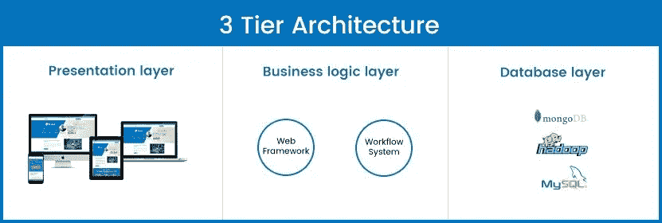
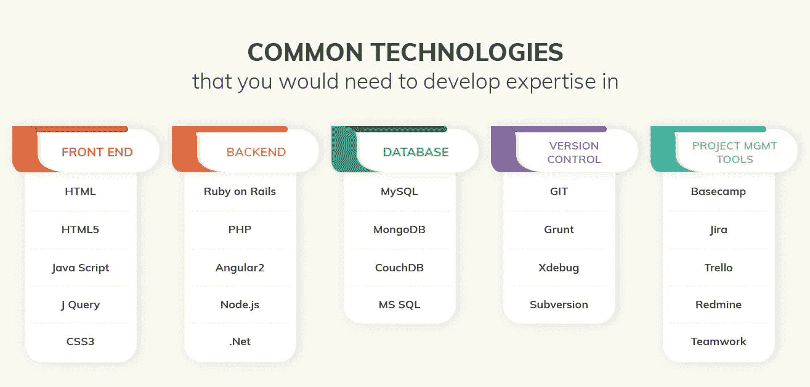
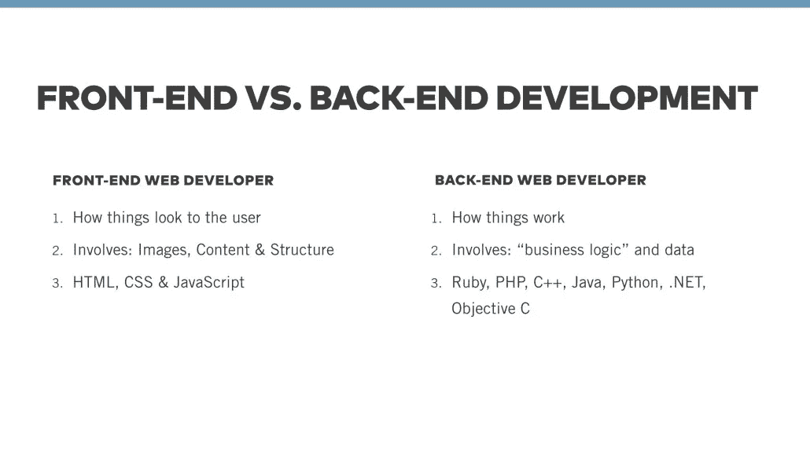
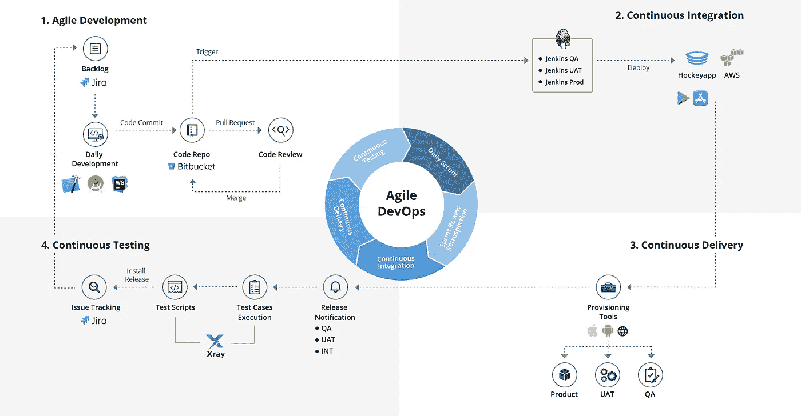

# 什么是全栈开发者？

> 原文：<https://medium.com/hackernoon/what-is-a-full-stack-developer-a62b705b8909>

## 在本文中，我们将探讨全堆栈应该了解的各种问题，以及它们包含的技术。

Photo by [Eaters Collective](https://unsplash.com/@eaterscollective?utm_source=medium&utm_medium=referral) on [Unsplash](https://unsplash.com?utm_source=medium&utm_medium=referral)

> 全栈开发人员是一个技术人员，他有潜力在软件应用的前端和后端工作。这些开发人员对用于实现软件产品中不同组件和层的技术有着深刻的理解。

**全栈开发人员应该了解以下内容:**

1.  **表示层** 该层处理应用程序的前端部分，即用户界面
2.  **业务逻辑层** 业务逻辑层处理应用程序的后端部分，例如数据验证、用户界面和 web 之间的连接。
3.  **数据库层** 该层处理与应用前端的数据库连接。

Image reference Excellentwebworld

成为全栈开发人员并不意味着您应该精通所有这些技术。相反，这意味着全栈开发专业人员应该知道如何在客户端和服务器端工作，以及在开发应用程序时应用程序中发生了什么。

如今，企业更愿意投资于全栈开发服务，而不是雇佣多种资源来构建软件应用程序。

> “全唱全跳的技术奇才。”伊恩·彼得斯-坎贝尔

Image source learntek.org

# 前端技术

随着对数字解决方案的需求快速增长，前端技术在产品开发中也变得越来越重要。在分析产品的成功时，需要考虑用户体验，而不是只关注产品特性。

前端技术用于管理软件产品面向用户的组件。一个全栈开发者应该知道软件应用应该是什么样子，以及应用的流程应该是什么。

## **HTML/CSS**

HTML 代表用于创建网络应用和网页的超文本标记语言。CSS 代表级联样式表，描述 HTML 事件应该如何在屏幕上显示。此外，CSS 可以同时管理多个网页的布局。

## **自举**

Bootstrap 是一个开源的 CSS 框架，可以管理响应式网站和应用程序的创建。使用基于 CSS 和 Javascript 的设计模板，Bootstrap 将开发人员从大量编码工作中解放出来。

## **棱角**

AngularJS 是一个基于 javascript 的开源框架，可以解决在构建单页面应用程序时遇到的几个挑战。

## **反应**

React 是一个用于开发用户界面的 javascript 库。它可以在服务器端和客户端实现高性能渲染。

# 后端技术

后端是你看不到的软件应用程序的一部分。应用程序的后端处理数据的组织和存储，并确保一切都在客户端稳健运行。

后端负责与前端交互，接收和发送要在 web app 上显示的信息。无论你是在应用程序上填写表格，请求购买商品还是将商品保存到卡上，应用程序的前端都会向服务器发送请求，服务器会获取信息并显示出来。

## **PHP**

PHP 是一种通用编程语言，用于网站和 web 应用程序的开发。主要集中在服务器端脚本，PHP 允许开发者做其他 CGI 程序能做的事情。例如，生成动态页面内容、收集表单数据或发送和接收 cookies。

## **Java**

Java 是一种面向对象的语言，可以在多种平台上工作，包括 Windows、Linux、MAC 等等。该语言可用于构建移动应用、web 应用、桌面应用、游戏、数据库连接、web 服务器和应用服务器。

## **巨蟒**

Python 是一种高级解释编程语言，可用于创建 web 应用程序和连接到数据库系统。与其他编程语言相比，它允许开发人员用更少的代码行编写代码。此外，语法有点类似于英语，更容易理解。

## **。网**

。NET 是一个开源的跨平台，开发者使用它来构建 web 应用、移动应用、桌面应用、微服务、游戏应用和物联网应用。开发人员应该理解 C#、Visual Basic 或 F#编程语言来构建。网络应用。

## **NodeJS**

NodeJS 是一个 javascript 运行时，旨在创建可伸缩的网络应用程序。它是一个开源的服务器环境，可以运行在不同的平台上，比如 Linux、Mac OS X、Linux、Unix 等等。

## **开始**

Go 是一种开源的谷歌通用编程语言，用于构建高效且简单易用的软件应用。

Image source: Onemonth

# 数据库ˌ资料库

大多数软件产品需要一个数据库来存储数据。要成为全栈开发人员，个人需要了解一两个数据库，并知道如何与之交互。

## **MySQL**

MySQL 是一个开源的 RDBMS(关系数据库管理系统)，它使用 SQL 来添加、访问和管理数据库中的内容。

## **MongoDB**

MongoDB 是一个面向文档的跨平台数据库系统，是一个 NoSQL 数据库。MongoDB 中的编码使用 C++编程语言完成，提供了高性能、可用性和可伸缩性。

## **PostgreSQL**

PostgreSQL 是一个开源的 RDBMS(关系数据库管理系统),能够处理从单机应用程序到数据仓库或有大量并发用户的 web 服务的工作负载。

## **SQL 服务器**

SQL Server 是一个关系数据库管理系统，它根据软件应用程序的请求存储和提取数据，这些应用程序可以运行在同一系统上，也可以运行在网络上的另一个系统上。

# DevOps

DevOps 这个词是两个词的组合，“开发”和“运营”。它是一组软件开发实践，协作开发和操作团队以可重复的方式将代码更快地部署到生产中。

这种技术允许开发人员参与软件应用程序从设计到开发的整个开发过程。它有助于提高组织交付数字解决方案和应用程序的速度。

作为一名全栈开发人员，个人应该对 DevOps 生命周期以及它与传统开发流程的不同之处有深入的了解。

Image Source: [LeewayHertz](https://www.leewayhertz.com/hire-full-stack-developer)

# 理解应用程序中的横向问题

## **请求/响应追踪**

请求/响应跟踪允许开发者识别和检查软件应用上的特定请求发生了什么。

## **文件存储**

文件存储系统以分层结构管理数据的存储。所有数据都存储在文件和文件夹中，并以相同的格式呈现给检索数据的系统和存储数据的系统。一个全栈开发者应该了解不同类型的文件存储服务，包括谷歌云、微软 Azure、AWS 等等。

## **安全**

在开发任何软件应用程序时，安全性被认为是确保应用程序安全且不缺乏安全标准的关键因素。作为一名全栈开发人员，个人应该对加密、公钥和私钥加密、SHA、解密以及更多安全标准有很好的了解。

## **测井**

日志记录是一种保存过程、数据输入和输出以及应用程序操作记录的实践。这是许多开发人员在开发软件产品时忽略的东西。全栈开发人员应该知道如何创建日志文件并在其中存储日志。

# 对合规的理解

软件应用程序必须处理不同类型的数据，包括个人、财务、审计、交易和敏感数据。数据的分类和识别是软件开发的基本活动。此外，还需要保护数据免受任何攻击。将法规遵从性添加到数据中是满足业务需求不可或缺的一部分。

因此，全栈开发人员还应该更好地理解合规性和法规。

## **HIPAA**

HIPAA compliance 代表健康保险可移植性和责任法案，该法案确保了医疗记录的安全性和隐私性。全栈开发人员应该负责将 HIPAA 合规性添加到医疗保健应用中，以及如何使其符合 HIPAA。

## **PCI DSS**

PCI DSS 代表支付卡行业数据安全标准，用于维护管理 Visa、Discover、American Express 和 MasterCard 等卡组织信用卡的应用程序的合规性。开发人员应该了解 PCI DSS 的要求，以使支付应用程序符合法规要求。

## **菲斯曼**

联邦信息安全管理法案(FISMA)合规性定义了一个框架，以增强美国联邦政府及其承包商和附属机构的计算机和网络安全。开发者需要关注 FISMA 标准以提高软件应用的安全性。

了解以上技能和技术，可以让你成为一名合格的全栈开发者。在 LeewayHertz，我们有一个由[全栈开发人员](https://www.leewayhertz.com/hire-full-stack-developer/?utm_source=hackernoon_leewayhertz)组成的团队，他们有潜力构建一个根据客户需求量身定制的数字解决方案。

在[脸书](https://www.facebook.com/LeewayHertz/)、 [LinkedIn](https://www.linkedin.com/company/leewayhertz-technologies/) 和 [Twitter](https://twitter.com/LeewayHertz) 上关注我们，了解区块链的最新发展。