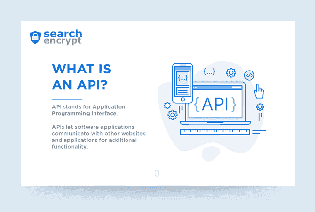
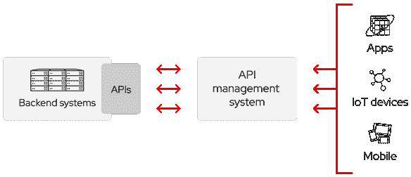
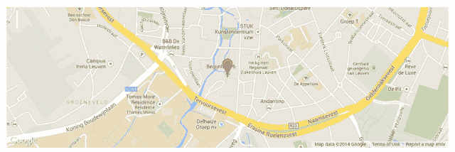

# 什么是 API？

> 原文：<https://medium.com/hackernoon/what-is-an-api-26668ca8a294>

如果你花时间在软件或互联网工具上，你可能听说过“API”这个术语。API 代表“**应用编程接口”**。网上有大量的 API 可供软件开发人员用来将其他应用程序的信息集成到他们自己的软件中。

# 什么是 API？

API 是操作系统中的工具和资源系统，它允许开发者创建与其他服务交互的软件应用程序。API 允许两个独立的应用程序相互通信。API 让用户无需离开你的网站就能与其他服务或网站互动。API 很重要，因为如果没有它们，就很难理解你的工具与之交互的所有应用和服务的语法。API 解释了每个对象被调用的内容以及可以对每个对象执行的操作。

[**UpWork**](https://www.upwork.com/hiring/development/intro-to-apis-what-is-an-api/) 分解了 API 中的实际单词，让我们更好地理解 ***应用编程接口*** 的实际含义:

> **应用:**想象一个类似 ATM 的应用。当你走向自动取款机时，你希望它能让你进入你的账户并完成像取现这样的交易。就像自动提款机一样，一个应用程序提供一种功能，但它本身并不能完成这一切——它需要与用户和它所访问的“银行”进行通信。应用程序也处理输入和输出。web、移动或后端应用程序就像一台解决特定问题的机器。该软件可能是一个面向客户的应用程序，如旅游预订网站，或者是一个后端应用程序，如将请求传输到数据库的服务器软件。
> 
> **编程:**API 允许 ATM 与您的银行通信。编程是应用软件的工程部分，将输入转化为输出。换句话说，它会将您的现金请求转换到银行的数据库，验证您的帐户中有足够的现金来提取所请求的金额，银行会给予许可，然后 ATM 会将您提取的金额反馈给银行，以便银行可以更新您的余额。
> 
> **界面:**一个[用户界面(UI)](https://www.upwork.com/hiring/design/ux-ui-ia-digital-design-terms-explained/) 是我们与应用程序交互的方式。在自动取款机的情况下，它是屏幕、键盘和现金槽——输入和输出发生的地方。我们输入密码，输入我们想提取多少现金，然后取出吐出的现金。接口是我们与机器交流的方式。对于 API 来说，几乎是一样的，只是我们用软件代替了用户。

如果一个网站或程序提供了一个 API，这意味着他们的开发者已经创建了一组返回纯数据响应的 URL。

## 远程 API

远程 API 旨在通过通信网络进行交互。所谓“远程”，我们是指由 API 操作的资源在发出请求的计算机之外的某个地方。因为使用最广泛的通信网络是互联网，所以大多数 API 都是基于 web 标准设计的。并不是所有的远程 API 都是 web API，但是可以假设 web API 是远程的。

## Web APIs

Web APIs 通常对请求消息使用 HTTP，并提供响应消息结构的定义。这些响应消息通常采用 XML 或 JSON 文件的形式。XML 和 JSON 都是首选格式，因为它们以一种其他应用程序易于操作的方式呈现数据。Web APIs 分为两大类:**远程过程调用(RPC)** 和**表述性状态转移(REST)** 。

*   **远程过程调用(RPC)API**通常是单个 URI(统一资源标识符)，可用于通过 POST 调用许多操作。[这些 API](https://apigility.org/documentation/api-primer/what-is-an-api)涉及传递一个结构化的请求，该请求包含您想要调用的操作的名称和您想要传递给该操作的任何参数。RPC 本质上主要是过程性的。
*   **表述性状态转移(REST)API**不是一种特定类型的 API，而是一种基于 HTTP 规范的架构。REST 利用了 HTTP 的优势。例如，REST 使用 URIs 作为资源的惟一标识符，使用 HTTP 的操作动词作为资源的惟一标识符，并允许客户端链接资源以表明这些资源是相关的。

# API 发布政策

不是每个 API 都 100%公开给任何人使用。私有和合作伙伴 API 仅由内部或批准的用户使用。这使得该公司能够控制谁在使用与其产品相关的信息和其他资源。

**私有:**API 仅供内部使用。这给了公司对他们的 API 最大的控制权。

**合作伙伴:**API 与特定的业务合作伙伴共享。这可以在不影响质量的情况下提供额外的收入来源。

**公众:**每个人都可以获得这个 API。这允许第三方开发与您的 API 交互的应用程序，并且可以成为创新的源泉。

# 什么是 API 密钥？

API 密钥用于与 API 交互或向 API 发出请求的用户代理的身份验证。这些密钥可以使用查询字符串、请求头或作为 cookie 发送给 API。控制 API 的公司可以使用密钥来只允许注册用户发出请求，跟踪谁发出请求，跟踪 API 的使用情况，并阻止或限制超过特定限制的用户。当 API 看到你发送的密钥时，它会*验证*你就是你所说的那个人，然后*授权*你执行某个动作。

# 什么是 API 调用？

API 调用是指应用程序使用 API 与服务器或其他应用程序进行通信。这基本上是指程序运行不属于主程序的外部代码的任何时候。例如，如果一个程序正在 Windows 中运行，该程序需要打开一个新的文件窗口，它将调用一个 API 来告诉操作系统它需要打开一个窗口。

# API 的示例

在 API 的早期，典型的应用程序只需要使用几个 API 就可以实现全部功能。现在，一个应用程序可能依赖数百个 API 从其他服务访问数据或函数。

脸书 API: 脸书实际上提供了许多不同用途的 API。脸书的广告 API 让用户跟踪和监控他们广告活动的效果。脸书的图形 API 允许其他应用程序访问脸书函数。

**谷歌地图 API:** 如果你访问一个嵌入了谷歌地图的网站，这就是谷歌地图 API 的一个例子。该网站必须与谷歌地图互动，以获取信息，并将内容嵌入网页。

**Dropbox API:** Dropbox 的 API 允许用户读取/写入存储在 Dropbox 中的文件，允许他们使用 Dropbox 的文件同步和存储，并为 Dropbox 找到其他用途。

**Stripe API:** Stripe 是目前网上最流行的支付处理器之一。它的 API 是围绕 REST 组织的，允许应用程序和软件开发人员将 Stripe 的支付处理无缝集成到他们的应用程序中。

*原载于 2019 年 6 月 6 日*[*https://choosetoencrypt.com*](https://choosetoencrypt.com/tech/what-is-an-api/)*。*