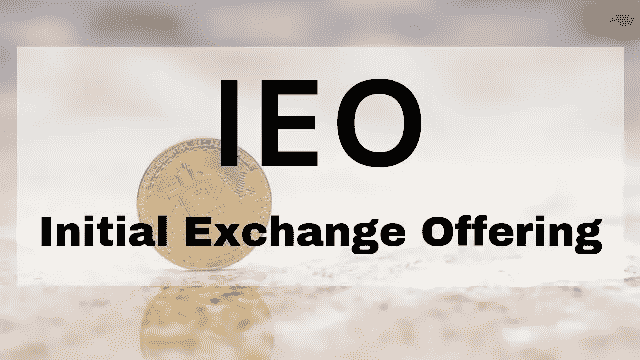

# 什么是首次交易所上市(IEO)以及如何使用它进行交易

> 原文：<https://medium.com/hackernoon/what-is-an-initial-exchange-offering-ieo-and-how-to-use-it-for-trading-10a0f40b9854>

Image Credit: cryptopotato.com

如今，首次交易在加密货币领域风靡一时。在过去的一年里，首次发行硬币(ICO)曾经是首选的融资方式，但这种情况发生了变化。如今，ico 越来越少，而 ieo 正风光无限。

## 到底什么是 IEO，为什么它们现在如此普遍？

都是为加密货币项目筹集资金有关。

在 ICOs 中，投资者将把钱交给项目团队，以换取给定区块链上的一定数量的密码。这有很多原因，主要是由于诈骗和失败的项目。

独立评价办公室的工作方式不同。IEOs，顾名思义，有一个密码交换平台作为中间人。你不把钱交给开发者，而是交给与他们合作的加密交易所。作为交换，你现在可以从加密交换平台获得令牌，而不是项目团队直接奖励你一些令牌。

## IEOs 带来了哪些优势？

对于投资者来说，很多是可以识别的。首先，当一个加密交换网站与一个加密项目配对时，交换的声誉[就被押上了线](#Reputation)。如果开发团队没有达到既定的目标，就会暴露出来。如果项目失败，或者更糟，如果它碰巧是一个骗局，交易所将承担主要打击。

这意味着加密交换网站在接受项目进入其 EIO 产品之前会进行尽职调查。这包括检查项目的白皮书，其成员，并确保目标是可实现的和现实的。

如果交易网站发现任何可疑之处，它们甚至可以在 IEO 举行之前随时退出。[这在](https://bittrex.zendesk.com/hc/en-us/articles/360025035532-Statement-Regarding-Bittrex-International-RAID-IEO)之前确实发生过。这种情况还会再次发生，至少是在声誉良好的交易所。

因此，对于投资者来说，与 ICO 相比，风险大大降低。这并不意味着这个项目不可能是一个骗局，但它是一个骗局的可能性要小得多。

因为项目可能会失败，所以仍然存在相关的风险。有时候失败不是任何人的错——毕竟，不可预见的情况会出现。这些情况可能是意料之外的管理费用，市场变化，或新的法律使一个项目不可行。

尽管如此，一个 IEO 比一个 ICO 更不容易让你输钱。

还有更多。

随着交换站点托管越来越多的 ieo，每个站点都将为其项目的成果建立声誉。虽然现在很难说，但随着时间的推移，你将能够以某种方式根据支持该项目的交易所来预测结果。

例如，一个在 IEOs 中有 95%成功的 exchange 站点将被认为是高度可信的。然而，如果另一个网站有经常失败的项目，那么在那里投资可能并不明智。

这些数字要达到统计上的显著水平还需要一段时间，但它们会达到的。这种预测已经在商业中发生了，ieo 也自然会效仿。

## 密码交易是如何运作的？

对于投资者和交易者来说，ieo 很简单。这实际上是他们的一大优势。

对于 ico，你必须了解它们何时发生以及如何参与，而对于 IEOs，你从一开始就准备好参与。假设 IEO 有你注册的交易网站支持；你所需要做的就是登录并购买你的密码。

不再需要使用不知名的网站注册，也不需要调查项目接受的支付方式。如果交换站点接受付款类型，IEO 将接受。这包括用其他密码支付密码 ieo。

只有一件事你应该记住，因为，与 ico 一样，ieo 期间提供的令牌数量有限。这意味着，对于高期望值的项目，IEO 代币可能会在几分钟内售罄。

也有这样的情况，当 IEO 的需求量很大时，交换站点可能会因为流量过大而在报价期间关闭。虽然严肃的交换网站试图为这些情况做准备，但它们通常不可能完全避免。想想 Ticketmaster 网站，当一个标志性的音乐行为宣布一场一次性的音乐会。如果这能发生在他们身上，那它当然也能发生在密码交易所。

## 那么这里有什么问题呢？交易所网站这样做是出于善意吗？

经济学中没有[善意](https://www.fool.com/investing/2019/04/09/when-should-i-start-investing.aspx)。任何[密码交易平台](https://irishtechnews.ie/what-are-crypto-trading-platforms-things-you-should-know-about-crypto-trading-tools/)都是为了钱，所以它自然从中获利。

他们获利的主要方式是从销售总额中提成。因为网站使用的是现有的软件基础设施，所以运行一个没有金钱成本。除了确保项目合法之外，工作量很小。

简单来说，ieo 对于交易所网站来说是最赚钱的。然而，由于它们的声誉面临风险，至少可信的交易所也试图只提供可信的独立评价办公室。

还有更多。一些交易所允许那些使用交易所自己的令牌购买 IEOs 的客户享受特殊费率。例如，币安以降低用 BNB 支付的人的交易成本而闻名。

由于交易费用的损失，这看起来像是净亏损，但事实并非如此。无论币安在交易费用上损失了什么，它都为自己赢得了用户。为了让人们能够使用 BNB 支付，他们首先需要购买 BNB。

这意味着将有更多的用户购买并持有币安本地代币。从数字上来说，这比小额费用更有价值。

## 而开发者如何从中获利？

首先，IEO 以一种 ICO 不能的方式使开发团队合法化。如果你已经设法让任何一家[最好的加密货币交易所](https://www.coinreview.com/best-cryptocurrency-exchange/)接受你的 IEO 项目，你的项目至少是可信的。由于对区块链项目越来越不信任，仅此一点就非常有价值。

第二，你确信至少会有一家交易所将你列入名单。这听起来可能很傻，但现在有太多的加密货币了。他们中的大多数都没有以太坊或比特币那样的用户或社区兴趣。

这意味着交易网站经常需要决定什么上市，什么退市。因此，在一家领先的交易所上市，启动一个加密项目是一件大事。

开发者从 IEOs 中获利的第三种方式是广告。一个 ICO 应该得到资助，但必须花很多钱让人们知道 ICO 将要发生。

由于 ieo 是由一个加密交换站点支持的，所以该交换被期望处理部分广告。这并不意味着该项目将在超级碗期间获得广告，但只要在交换网站上宣布 IEO，当地社区就会知道。而且社区越大越好。

## 结论

我应该投资任何 IEO 吗？等一下。显然，[当前的比特币价值](https://www.coinreview.com/bitcoin/)对 IEOs 来说是一个巨大的推动。

虽然 ieo 比 ico*更安全*，但是*更安全*并不意味着*安全*。他们不太可能失败，但是投资任何一个与你擦肩而过的 IEO 都可能以眼泪和破产告终。

即使交换网站已经审查了项目，他们也应该做好自己的功课。调查这个项目——谁负责这个项目以及它的记录。看看有什么出售，看看是否有市场。试着找到它的实际用途。

然后，如果听起来仍然令人信服，就冒这个险。