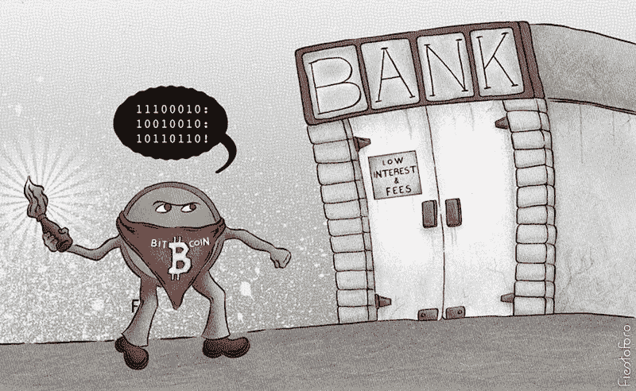

# 比特币是什么？(第一部分)

> 原文：<https://medium.com/hackernoon/what-is-bitcoin-part-1-1755b81984e8>

仅仅因为你多次听到这个术语，就很容易相信你理解了一些东西。从表面上看，确实如此。你知道听诊器是什么，因为你见过听诊器，也见过它被使用。

然而，在更深的层次上，有一个听诊器是干什么用的知识。也就是说，听诊器可以让你听到身体发出的声音，并获得关于其功能的线索。一个孩子可能见过听诊器，甚至能认出一个，但不明白它是干什么用的。

大多数人对比特币的了解都是表面层面的；他们知道这是一种货币形式，甚至可能已经买了一些。这篇文章是写给那些在表面上理解比特币，但想在更深层次上理解它的人的。

# 稀缺

稀缺的资源往往是有价值的。特别是，货币需要稀缺，因为大量的货币会导致其他所有东西的价格上涨，使其在贸易中不切实际。

两种截然不同的稀缺是一分为二的。一方面，你有集中的，人为的和受控的稀缺。另一方面，你有分散的，自然的和不受控制的稀缺。

集中稀缺是中央政府生产或发行该物品的结果。从有编号的印刷品到出租车的徽章，所有的东西都属于这一类，因为一些中央权力机构制造这种物品。假冒可能是这种稀缺品的一大危险，因为假冒商品通常比在市场上购买更便宜。

分散稀缺是自然界中发生的事情。在这第二种意义上，盐、玻璃珠、贝壳和黄金等各种各样的东西是稀缺的。这些东西需要花费很多努力去获得，而且通常生产成本很高。这些都不是容易伪造的东西。上面列出的所有这些东西都曾在某个时候被用作货币，这并不是巧合。只有当这些商品的生产成本下降或被其他商品竞争时，第二类稀缺商品才不再是货币。

这里的区别至关重要。集中稀缺与分散稀缺有质的不同。受控制的稀缺事物可以通过控制权威的意志而失去价值。不受控制的稀缺物品不会轻易失去价值，通常需要一些重大的技术突破或强制没收才能做到。

# 数字的

在比特币之前，数字领域只有一种稀缺性:集中/人工/控制。从某种意义上说，这是意料之中的，因为整个数字领域都是由人类创造的，没有理由相信其中存在任何分散的、自然的或不可控的东西。

因为数字的东西是由 1 和 0 组成的，所以一般很容易复制。我们可以将数字项目分为两类:无限可复制的项目和稀缺但集中的项目。你有像 MP3 这样可以被无数次复制的东西，也有像魔兽世界黄金版这样由中央权威控制的东西。

# 输入比特币

比特币的创新之处在于，它给数字领域带来了去中心化的稀缺。在 2008 年中本聪发明之前，没人知道这是可能的。这怎么可能呢？数字领域存在哪些自然的、去中心化的、不可控的东西？

答案是工作证明。工作证明经常被称为“困难的数学问题”或“共识算法”，但最好的描述是大多数比特币人所说的工作证明发现过程:挖掘。

在金矿开采中，泥土和岩石被加工以寻找黄金。一般来说，大约 45 吨的泥土和岩石被压碎、处理和筛选以获得 1 盎司的黄金。这样做的总成本一般比 1 盎司黄金的价格低一点点。然而，与生产黄金相比，验证一盎司黄金是否真的是黄金的成本(通过试金石、化学测试等)微不足道。换句话说，生产黄金的成本很高，但验证它是否是黄金的成本却相当低。

工作证明与数字领域非常相似。有一种叫做 nonce(也称为 number-used-only-once)的东西很难找到，它满足一个特定的等式。这样做的总体成本，就像金矿开采一样，只比比特币的大宗奖励和费用低一点点。然而，验证是非常容易和便宜的。与黄金一样，工作证明的制作成本很高，但验证成本却很低。

从某种意义上说，比特币使用数学作为分散的、自然的和不受控制的稀缺性，从而允许良好的资金。

# 结论

比特币是一种自然的、去中心化的、不受控制的和数字的东西。这是在 Satoshi 于 2008 年发明它之前不存在的东西，我认为，在任何其他加密货币中都不存在。这是比特币作为货币有用的关键。稀缺性是第一个需要的东西，没有它，货币的命题就会崩溃。

在本系列的下一部分，我们将讨论比特币作为货币的属性，以及它如何优于其竞争对手。