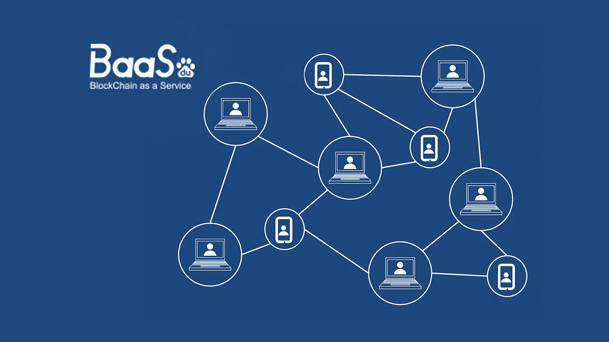
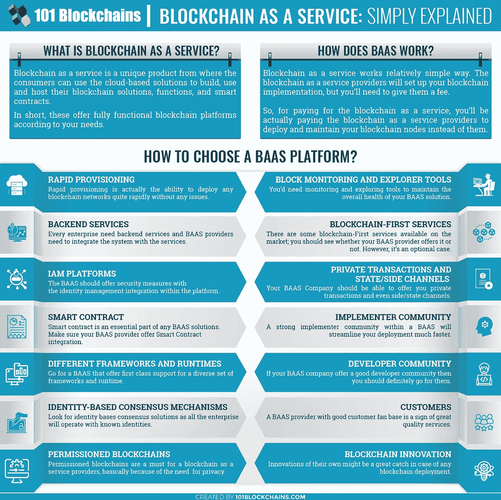

# 什么是区块链即服务？(BaaS)以及如何选择合适的 BaaS 平台？

> 原文：<https://medium.com/hackernoon/what-is-blockchain-as-a-service-28667754d6dc>

Image Source: Google

区块链即服务预计将在未来几年发挥至关重要的作用。由于越来越多的公司了解区块链的优势，它已经开始呈指数级增长。然而，由于种种原因，他们无法实现区块链。

像 IBM、Microsoft Azure 和其他大公司这样的区块链即服务提供商已经发现 BaaS 可以让那些核心竞争力仍然在 IT 以外的领域的组织更简单地实施区块链。它帮助组织更加专注于他们的核心领域，而不必担心发展空间。

# 什么是区块链即服务？

> [区块链即服务](https://www.leewayhertz.com/guide-to-blockchain-as-a-service) (BaaS)是一项区块链服务，允许客户使用基于云的服务来开发、使用和托管他们的区块链应用、功能和智能合同。

BaaS 包括一个基于云的服务提供商，负责管理任务以保持基础架构的可操作性和敏捷性。它有望加速不同企业对区块链的采用。

企业和个人都愿意实施区块链技术。但是，创建、运营和维护区块链基础设施的技术复杂性阻碍了其大规模采用。区块链即服务提供解决方案，帮助公司摆脱新技术的障碍。

# BaaS 是如何工作的？

BaaS 提供商为客户设置和管理区块链技术和基础设施。客户向 BaaS 提供商支付一些费用，用于代表他们设置和处理区块链连接节点。BaaS 提供商管理客户端及其业务的后端。

保持区块链基础设施的运行是区块链即服务运营商的责任。BaaS 运营商还负责资源的合理分配、带宽管理和托管要求等活动。使用 BaaS 模型，客户可以更加专注于他们的核心领域和区块链的功能，而不必担心性能和基础架构相关的问题。

考虑一下类似于虚拟主机提供商的区块链即服务。

你建立有创意的网站，每天有数百万的点击量，在你的服务器上托管网站，自己或者通过雇佣资源来管理所有的维护工作。另一种方法是将你的网站托管在任何虚拟主机提供商上，比如 Amazon Web Services 或 Azure，让他们处理所有的维护和基础设施问题。

BaaS 的工作方式类似于第二种方法，从而减轻了您管理区块链应用程序基础设施的负担。

Image Source: [101Blockchains](https://101blockchains.com/blockchain-as-a-service/?utm_source=leewayhertz)

# 市场上一些受欢迎的 BaaS 提供商:

# **微软 **

微软是 2015 年创立 Azure 区块链服务时首批提供 BaaS 的厂商之一。他们与 Consensys 合作开发了基于以太坊区块链的微软 Azure。该服务旨在让开发者和企业客户通过“一键式基于云的区块链开发环境”来体验区块链技术

微软 Azure 的区块链即服务也允许其用户使用行业级框架构建公共、私有和联盟区块链环境，并将他们的区块链应用程序推向市场。通过集成基于人工智能的虚拟辅助系统 Cortana，Azure 帮助其用户理解和实现分布式账本技术。

**微软 Azure 的特点:**

1.  支持多种区块链框架，包括 Quorum、Corda、Hyperledger Fabric 和 Ethereum。
2.  使用 Azure CLI、Azure 门户或带有 Azure 区块链扩展的 Visual Studio 代码轻松部署。
3.  内置联盟管理来管理网络成员。
4.  完整的监控和记录

# 亚马孙

像其他大型组织一样，亚马逊也推出了名为“亚马逊管理的区块链”的 BaaS 产品。亚马逊托管区块链是一项完全托管的服务，允许其用户只需点击几下鼠标，即可建立和处理可扩展的区块链网络。

亚马逊管理的区块链支持两个流行的区块链开发框架，以太坊和 Hyperledger Fabric，使客户可以通过单个管理服务更容易地管理许可和公共区块链网络。通过提供包括不同内存和 CPU 组合的各种实例类型，Amazon 的 BaaS 产品为您提供了为您的工作负载选择适当资源的灵活性。

**亚马逊托管区块链的特点:**

1.  全面管理。
2.  支持 Hyperledger Fabric 和以太坊。
3.  用于保护 Hyperledger Fabric 的 CA(证书颁发机构)的 AWS 密钥管理服务。
4.  使用 Amazon QLDB 技术管理增强订购服务。

# R3

区块链平台即服务(platform as a service)chain stack 发布了其托管的 R3 corda 服务，让企业能够一键式部署基于云的 corda 节点。

托管 R3 corda 平台将区块链节点的部署时间缩短至几分钟，使企业、R3 合作伙伴和政府只需点击三下鼠标即可托管 corda 网络。

基于 Corda 4.1 的最新版本，开发人员可以开发他们的专用网络用于测试环境，并在专用网络节点上安装 CorDapps。它减少了工作量和资源，并在较短的时间内提供了可伸缩性。开发者不再需要关注网络的维护。

**R3 Corda 业务特点:**

1.  使用 Docker 轻松实现基于云的部署和节点的快速设置。
2.  内置的区块链应用防火墙提供额外的安全性。
3.  R3 的互操作性特性允许开发人员同时操作多个应用程序。

# **SAP 云平台区块链**

也被称为“莱昂纳多”，SAP 区块链即服务驻留在 SAP 云服务中，不需要任何内部软件或硬件。通过消除大量前期资本投资的需要，SAP 的 Leonardo 允许使用开放标准来开发私人和财团区块链网络。

SAP 的区块链即服务平台作为区块链云服务、机器学习服务执行，并在单一生态系统中为物联网提供支持。

**SAP 的莱昂纳多的特点:**

1.  云部署。
2.  实时监控区块链数据。
3.  面向区块链的 SAP 云平台允许原型化、构建和测试智能合约和区块链。

由于您会在市场上遇到许多区块链即服务平台，因此您需要考虑一些因素，根据这些因素来为您的区块链用例选择理想的 BaaS 提供商。

# **以下是可以帮助您选择合适的 BaaS 平台的一些因素:**

*   智能合同集成
    您需要一个智能合同机制来将业务逻辑集成到您的区块链解决方案中。智能合同不仅包括像典型合同一样的规则，还会在任何一方违反规则的情况下强制执行处罚。由于 BaaS 平台是不可变的，这使得智能合约的测试和部署对开发人员来说相当复杂。重要的是要考虑到区块链即服务公司为您提供智能合同集成部署。
*   **IAM(身份访问管理)平台** 许可网络允许用户访问特定信息或层。集成身份管理平台将使区块链网络非常安全，您将能够向个人授予权限。
    例如，并不是办公室的每个员工都能接触到内部机密信息。身份访问管理(IAM)是一个帮助企业管理数字身份的框架。
    为了管理身份，您可以使用单点登录方法甚至多种身份验证方法来授予用户访问信息的权限。IAM 集成确保您只共享所需的内容，而不是其他所有内容。选择提供 IAM 框架集成的 BaaS 平台。
*   **不同的运行时和框架** 在 BaaS 架构上构建区块链应用时，如果想切换到另一个区块链平台，该怎么办？说到区块链框架，你可能找不到多少提供多功能性的区块链即服务提供商。
    一些 BaaS 提供商仅支持一种企业区块链部署。确保选择支持多种运行时和框架的 BaaS。它将有助于为您的企业需求带来灵活性。
*   **基于身份的共识机制** 你一定听说过典型的共识机制，比如利益证明或工作证明。
    然而，利益证明和工作证明并不能提供企业级解决方案所需的足够的可扩展性。因此，选择基于不依赖于计算的共识机制的区块链即服务提供商。
    以身份为中心的共识模型可以扩大网络规模，并允许企业快速集成技术。因此，您也可以选择具有基于身份的共识算法的 BaaS 平台，使企业能够使用授权身份运营。

上述因素将帮助您根据您的业务需求决定和选择正确的区块链即服务解决方案。

# 成本分析:BaaS 产品与自托管区块链

在分析自托管区块链应用的成本时，总拥有成本预计会很高，因为启动成本(基础设施、人员、软件、许可、硬件、咨询等)、报废成本(服务器机架的退役)和运营成本(监控、每次交易的成本、带宽支出)。

此外，在前一种模式下构建和部署单个智能合同的成本可能高达十万美元。

作为 BaaS 产品的一部分，一个托管在云中的区块链应用程序可以以每分配 CPU 小时 0.29 美元的价格购买。这意味着您将不得不按需付费，也就是说，您只需为所使用的服务单元付费。

BaaS 模型中的实际成本取决于交易率、最大并发交易数、交易的有效负载大小等因素。

例如，亚马逊 AWS 管理的区块链服务的定价取决于对等节点、写入网络的数据、网络成员、数据传输和对等节点存储等因素。

# **结论**

*区块链即服务是一种很有前途的产品，可以帮助企业通过基于区块链技术的可扩展解决方案为未来做好准备。*

[***咨询 LeewayHertz***](https://www.leewayhertz.com/blockchain-development-company) *借助区块链即服务框架，让您的业务流程更加高效、稳健、安全。*