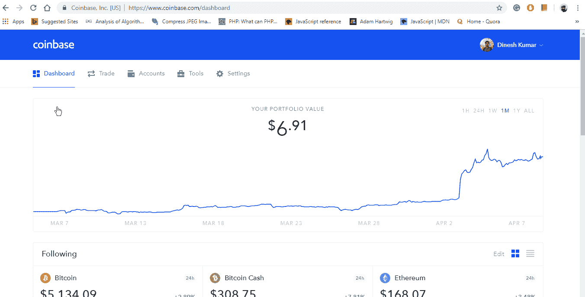

# 什么是比特币基地挣取计划，如何使马克斯从中受益

> 原文：<https://medium.com/hackernoon/what-is-coinbase-earn-program-how-to-make-max-out-of-it-877f805e3a1c>

Earn.com 最近在比特币基地推出了一个名为“比特币基地挣”的项目，在这个项目中，用户必须观看教育视频来学习新的硬币和代币，然后通过回答技能测试来赢取它们！看起来很容易，让我们知道如何开始，以及如何使马克斯出来。

From my system [Coinbase](https://coinbase-consumer.sjv.io/9aqby)

首先在比特币基地注册你的账户

所以，在****上报名吧。****

**填写详细信息，通过填写 KYC(了解您的客户)表格来验证您的帐户。**

**现在，接下来你需要做的是在[**Earn.com**](https://earn.com/denydani/referral/?a=8qicl4n22nlashuf)**上注册。****

**再次填写细节，并验证您的 KYC。一旦你注册了他们两个，你就可以开始了。**

**现在登录你的比特币基地账户，向下滚动，你会看到类似上面的 gif 图片。或者只需将 URL 更改为 coinbase.com/earn.。一旦您访问该链接，您将看到所有可用的视频教程和相应的收入，如下所示:**

****

**From my system**

# **怎么**

**刚开始上课时，每次你观看课程视频时，你必须回答一些与视频相关的问题。一旦完成，你将在你的账户中收到一定数量的密码。就这么简单。目前，只有美国比特币基地的客户可以开始这门课程，而其他所有人都不需要担心！他们仍然可以免费查看页面上的所有内容，并且一旦他们的国家有赚钱机会，他们可以加入等待名单以获得通知。**

**根据这篇文章[https://blog . coin base . com/earn-50-of-xlm-for-learning-about-stellar-and-invite-your-friends-2183 effcde 16](https://blog.coinbase.com/earn-50-of-xlm-for-learning-about-stellar-and-inviting-your-friends-2183effcde16)**

> **多达 10 亿 XLM 将在“赢取 XLM”机会中发放，100%将发放给我们的客户。这些资金由恒星发展基金会(SDF)提供，这是一个帮助开发恒星协议的非营利组织。**

# **如何让麦克斯摆脱它**

**目前，如果你是美国受访者，只需在比特币基地上注册并获得，你就可以立即开始学习这些课程并获得。而如果你来自另一个国家，去注册并加入候补名单。一旦它在你的国家可用，你将通过邮件得到通知，你可以马上开始。**

# **结论**

**比特币基地挣得程序现在可从一段时间。但是 coinbase 从来没有直接通过他们自己的平台这样做，而是使用 Earn.com。但是现在，如果他们正在这样做，他们必须对未来有一些远见。这是我们必须期待的。**

**通过我的推荐链接注册来支持我的文章-**

**https://www.coinbase.com/join/5a002782a6ecfb00eafeca8f 比特币基地**

**挣—【https://earn.com/denydani/referral/?a=8qicl4n22nlashuf **

**其他文章—**

**[https://hacker noon . com/coin base-launch-in-50-new-countries-you-the-lucky-one-how-to-trade-it-d 9 C1 c 696 F3 BD](https://hackernoon.com/coinbase-launched-in-50-new-countries-are-you-the-lucky-one-and-how-to-trade-with-it-d9c1c696f3bd)**