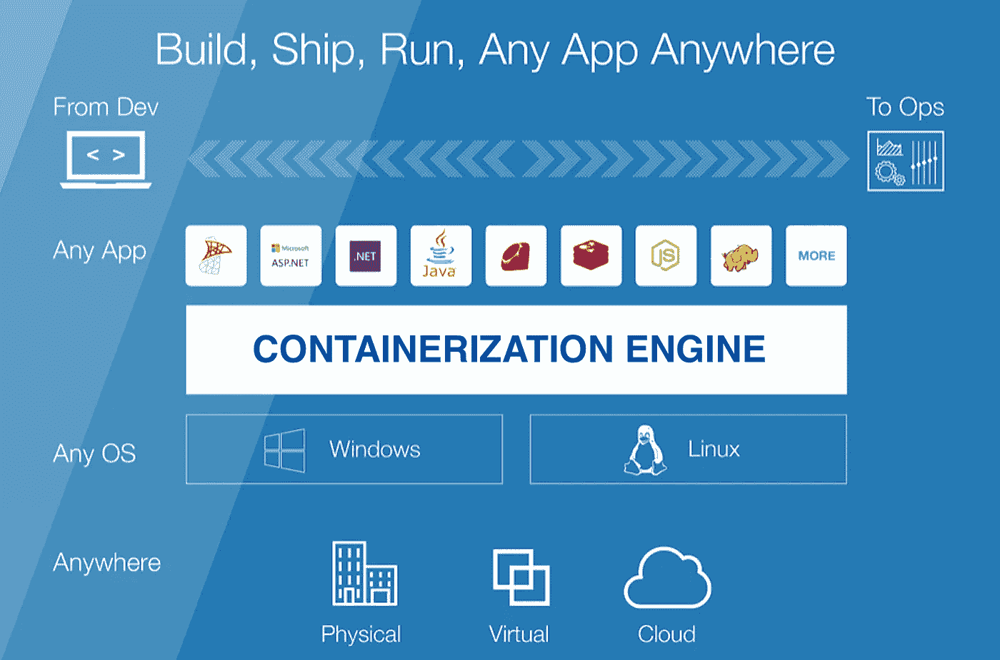
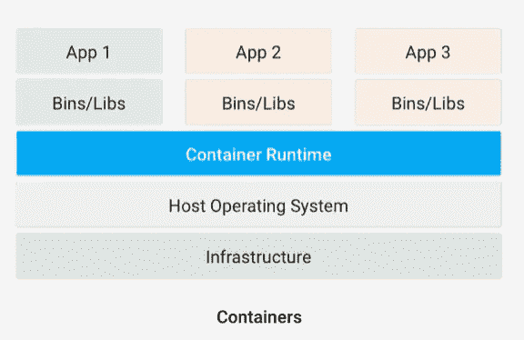
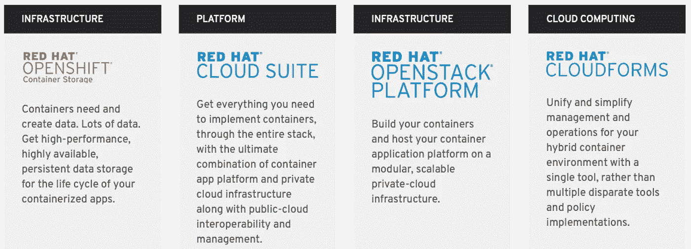

# 什么是集装箱化？

> 原文：<https://medium.com/hackernoon/what-is-containerization-83ae53a709a6>

在传统的软件开发中，在一个计算环境中开发的代码在部署到另一个环境中时经常会出现错误。

软件开发人员通过在云中的“容器”中运行软件来解决这个问题。

**容器如何工作**

容器化包括将应用程序与它所需的所有相关配置文件、库和依赖项捆绑在一起，以便在不同的计算环境中以高效且无错误的方式运行。

最受欢迎的集装箱化生态系统是 Docker 和 Kubernetes。

Apps and their dependencies sit in containers on top of a ‘container runtime environment’ which can work on a host operating system and the infrastructure of choice.

**容器对虚拟机**

容器经常被比作虚拟机，因为它们都允许多种类型的软件在被包含的环境中运行。

容器是应用层的抽象(意味着每个容器模拟不同的软件应用程序)。尽管每个容器运行独立的进程，但是多个容器共享一个公共的操作系统。

虚拟机是硬件层的抽象(意味着每个虚拟机模拟一个可以运行软件的物理机)。VM 技术可以使用一台物理服务器来运行相当于许多台服务器的功能(每台服务器称为一个 VM)。因此，当多个虚拟机在一台物理机上运行时，每个虚拟机都有自己的操作系统、应用程序及其相关文件、库和依赖关系的副本。

在容器化环境中运行软件通常比在不同虚拟机中运行软件使用更少的空间和内存，因为后者需要在每个虚拟机上运行操作系统的单独副本。

**IBM 通过收购 RedHat** 押注集装箱

红帽的 OpenShift 平台有助于管理 Docker 和 Kubernetes 等流行生态系统中的容器。

Along with the OpenShift container platform IBM will also own these services once the Red Hat acquisition is complete.

2018 年 10 月，IBM 宣布以 340 亿美元收购 Red Hat，这是有史以来最大的一笔软件收购交易。这笔交易及其估值表明，主要的技术公司相信云中的容器化是软件的未来。

**分布式应用**

应用程序容器化对于分布式应用程序和微服务来说是一个积极的发展，因为每个容器都独立于其他容器运行。因为每个容器都独立于其他容器运行，所以它有助于防止相互依赖，还可以防止单点故障。每个应用程序或微服务通过它们的 API 与其他应用程序或微服务进行通信。容器虚拟化层也非常灵活，可以扩展微服务，以满足应用程序组件不断增长的需求，并分配负载。

**安全问题**

集装箱化带来了两个安全挑战。首先，由于容器化的应用程序共享一个通用的操作系统，对操作系统的安全威胁会影响整个系统。其次，相关的，容器化环境中的安全扫描器通常保护操作系统，但不保护应用程序容器，使后者易受攻击。

同时，容器化也增强了安全性，因为它在很大程度上隔离了应用程序容器。

**结论**

容器化是软件开发的一个主要趋势，它的采用可能会在数量和速度上增长。像 Google 和 IBM 这样的大玩家在容器化上下了大赌注。此外，一个巨大的[创业生态系统正在形成](https://techcrunch.com/2018/05/07/as-kubernetes-grows-a-startup-ecosystem-develops-in-its-wake/)，以实现集装箱化。

容器化的支持者认为，它允许开发人员比传统方法更快、更安全地创建和部署应用程序。虽然集装箱化很昂贵，但随着集装箱化环境的发展和成熟，其成本预计会大幅下降。因此，容器化很可能成为软件开发的新规范。

—

[沙安雷](http://www.shaanray.com)

关注媒体上的 Lansaar Research ，了解最新的新兴技术和新的商业模式。