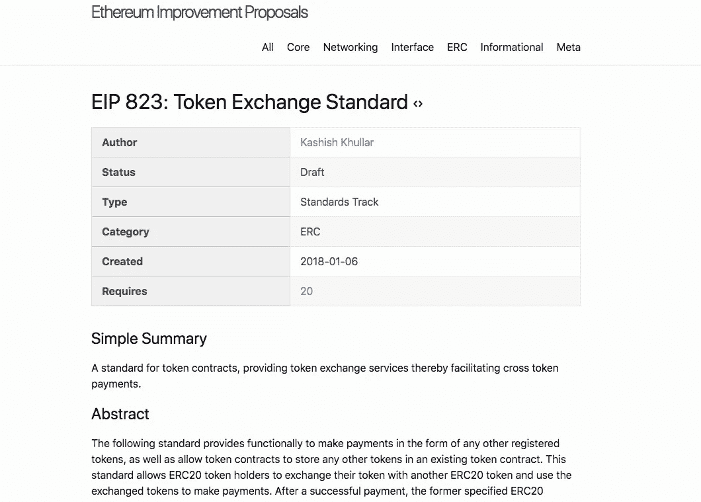

# 以太坊硬叉更新君士坦丁堡是怎么回事？

> 原文：<https://medium.com/hackernoon/what-is-going-on-with-the-ethereum-hard-fork-update-constantinople-f453af698c0c>

## 这对我意味着什么？

## 这篇文章的概要:

*   君士坦丁堡，[以太坊](https://hackernoon.com/tagged/ethereum)最新[网络](https://hackernoon.com/tagged/network)硬叉系统升级，计划于 2019 年 1 月 16 日星期三进行，block 万。
*   EIP-1234，第五次升级将减少矿工 33%的奖励，也被称为第三次 T4。
*   由于以太坊改进提案(EIP) 1283 中存在允许可重入攻击的漏洞，分叉被延迟。
*   核心以太坊开发人员于 1 月 18 日召开会议，讨论下一步措施，并决定将君士坦丁堡网络升级推迟至(大约)2019 年 2 月 27 日(区块编号 7，280，000)。
*   硬叉现在将分两部分同时发布。这第一次硬分叉升级将包括所有五个 EIP(包括小车 EIP 1283)。在第二次升级时，EIP 1283 将被删除。
*   如果你拥有以太网(ETH)或智能合约——你什么都不用做。
*   如果你是一个矿工，节点运营商或运行一个交换，你将不得不更新你的 Geth 和/或奇偶校验客户端时，他们被释放。

**君士坦丁堡是什么？**

你可能听说过君士坦丁堡这个词，如果你想知道这到底是什么，或者更重要的是它对以太坊网络意味着什么…这篇文章是给你的。

君士坦丁堡是以太坊网络的最新分支之一，它包含 5 个 EIP(以太坊改进提案)。

> 定义—以太坊改进建议—以太坊是其社区拥有的开源网络。没有一个单独的实体来决定如何升级网络。这意味着社区内的任何人都可以提出改进网络的建议，这些建议采用 EIP(以太坊改进提案)的形式。

Example if an EIP (Ethereum Improvement Proposal)

1.  EIP 1014 —启用状态通道[可扩展性]
2.  EIP 1052 —降低验证智能合同所需的计算能力[速度和能源]
3.  EIP 145 —降低发送交易所需的气体[效率和速度]
4.  EIP 1234——以太坊矿工的单位奖励调整，矿工验证一个单位将获得 2 个单位奖励，而不是 3 个单位
5.  EIP 1283 —降低交易成本[成本]

要了解更多关于更新[的信息，请查看这篇文章](https://media.consensys.net/the-constantinople-hard-fork-what-you-need-to-know-d438a91dec3f)。

**以太坊为什么要进行网络升级？**

以上所有的 EIP 都是 ETH 2.0 的一个更广阔的愿景的一部分，在这个愿景中，以太坊协议将经历许多根本性的改变，以改善其长期功能。这些变化包括:

*   利害关系证明
*   通过分片提高可扩展性
*   EVM(以太坊虚拟机)的改进
*   跨契约逻辑的改进(例如抽象)
*   协议经济学的改进

**在通往 ETH 2.0 的道路上，我们遇到了一些困难……**

1 月 15 日(君士坦丁堡协议生效的前一天)， [ChainSecurity](https://chainsecurity.com/) ，一家智能合同审计公司，强调了 EIP-1283 中的一个非常重要的漏洞，该漏洞会使现有合同容易受到可重入攻击。

在 [ChainSecurity medium 文章](/chainsecurity/constantinople-enables-new-reentrancy-attack-ace4088297d9)中，他们提到以太坊改进提案(EIP) 1283，如果实施，可能会在以太坊网络中制造一个漏洞，攻击者可以通过这个漏洞进入网络，窃取用户的资金。这种攻击被称为“重入攻击”，因为它会给黑客机会在不通知用户的情况下多次进入网络上的特定功能。从本质上讲，攻击者可以利用这种攻击永远从网络中窃取资金，而不会被发现。

ChainSecurity 还概述了利用此漏洞的可能性极小，因为他们无法找到任何存在风险的预先存在的合同。然而，核心开发人员、客户开发人员和整个社区决定在进一步测试后推迟网络升级。

以太坊的核心开发人员在计划的网络升级两天后召开了一次会议，讨论如何推进以及何时重新引入君士坦丁堡升级。在电话会议上，开发人员达成共识，将更新再推迟 6 周，以便给客户一个合理的测试时间。君士坦丁堡以太坊网络升级将于 2 月 27 日在 7，280，000 街区进行。

在开发商电话会议期间，该集团还决定 EIP 1283 将从君士坦丁堡发布中删除。相反，EIP 1283 将被推迟，一旦进行了额外的测试，以确保该提案不再有缺陷，就将发布。

君士坦丁堡网络升级现在将作为两个同步更新发布。

第一次网络升级将包括所有五个 EIP(包括有缺陷的 EIP 1283 ),第二次升级将移除 EIP 1283。

Peter szilágyi(以太坊的核心开发人员)在 dev 电话会议上提出了这一升级策略，他建议这一过程将进一步确保任何已经实施了完整的君士坦丁堡硬分叉升级(EIP 1283)的网络仍然能够修复漏洞百出的 EIP，而不必回滚任何块。

**这意味着什么？**

你的下一步将取决于你如何与以太网互动。

如果您拥有以太网(ETH)，拥有智能合约或只是与网络进行高级交互(您不运行网络中的节点)，请高枕无忧，因为您不必做任何事情。

如果你是一个矿工，节点运营商或运行一个交换，你将不得不更新你的 Geth 和/或奇偶校验客户端时，他们被释放。

查看以太坊基金会的链接，下载可用的更新—[https://blog . ether eum . org/2019/01/15/security-alert-以太坊-君士坦丁堡-延期/](https://blog.ethereum.org/2019/01/15/security-alert-ethereum-constantinople-postponement/)