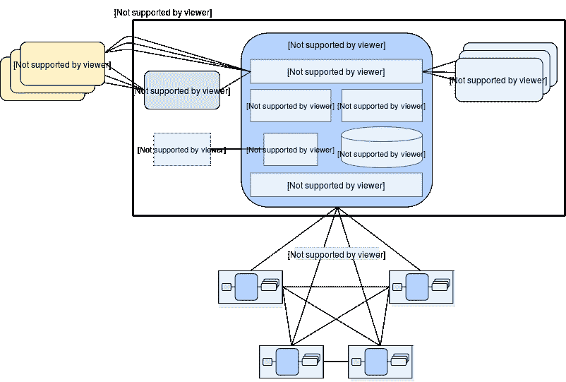
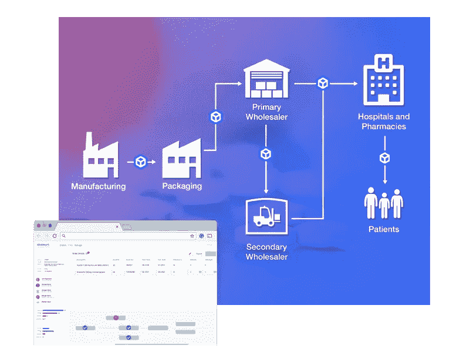

# Hyperledger 锯齿功能简介及其设置指南

> 原文：<https://medium.com/hackernoon/what-is-hyperledger-sawtooth-51b90f10096c>

Image Source: Hyperledger

## Hyperledger 锯齿的炒作是什么

Hyperledger 锯齿是一个开源的区块链平台，由 Linux 基金会的开源区块链项目 Hyperledger 创立。由英特尔提出，它是一个企业级分布式账本，是 Hyperledger 旗下的首批项目之一。

借助可插拔的共识模型，Hyperledger 锯齿具有以下特点:

1.  模块化的
2.  可攀登的
3.  支持无权限和有权限的基础结构。

> 其底层设计旨在保持分类账的分布式，并向智能合同添加业务逻辑。

在许多基于区块链的标准平台中，应用程序和核心在其平台上执行和托管，这可能会导致性能问题和安全问题。

然而，Hyperledger Sawtooth 与此类平台的不同之处在于，它将核心分类帐系统与特定于应用程序的环境隔离开来。因此，它简化了应用程序开发，同时保持了系统的安全性。

借助锯齿的模块化架构，开发人员可以用他们选择的编程语言开发应用程序，并可以在系统外围托管、运行和操作它，而不会妨碍核心区块链系统。

Hyperledger Sawtooth 上的应用程序可以基于核心业务逻辑来运行业务操作，也可以作为一个智能合同虚拟机来构建和运行，该虚拟机具有自治机制，可以创建、通知和执行区块链网络上各种成员之间的合同。

锯齿的核心系统允许这两种应用程序共存，允许不同类型的应用程序驻留在区块链网络的同一个实例中。

锯齿上的应用程序可以选择交易规则，定义共识机制，并选择所需的许可，以满足企业要求的方式决定数字分类帐的工作。

极具可扩展性。Hyperledger 锯齿可以提供高数据事务吞吐量，因此是处理生产供应链的最佳选择。

# Hyperledger 锯齿的特征

*   **具有许可功能的专用网络** 锯齿解决了许可网络的挑战，因为其节点集群可以通过隔离许可进行部署。任何集中式服务都不会泄露机密信息或交易模式。

> 区块链管理指定身份和角色的设置，以便网络中的参与者可以访问网络上的信息。

*   **以太坊合同与 Seth
    的兼容性** The Seth，锯齿-以太坊集成项目允许锯齿平台与以太坊的互操作性。该项目使得以太坊智能合约部署到 Seth transaction family 的锯齿平台成为可能。
*   **并行事务执行** 许多区块链需要串行事务执行，以确保网络上每个节点的顺序一致。但是，Sawtooth 包含一个高级并行调度器，可以将事务分类到并行流中。根据事务访问的状态中的位置，锯齿在处理上下文变化时将事务的执行彼此分开。

> 锯齿中的事务是并行执行的，以防止重复开销，即使对同一状态进行了多次修改。与串行执行相比，这种类型的调度可能会提高性能。

*   **核心系统和应用程序层之间的隔离** Hyperledger 锯齿通过将应用程序层与核心系统层分离，简化了应用程序的开发和部署。它提供了智能契约抽象，允许开发人员用他们选择的编程语言创建契约逻辑。
*   每个应用程序都可以定义定制的事务处理器来满足独特的需求。它提供事务系列作为低级功能的方法，如存储链上权限、管理链范围的设置，以及保存块信息和性能分析等特定应用。
*   **可插拔共识机制** 共识机制是区块链网络中一组参与者达成一致的过程。具有任意错误的达成共识的算法需要在一组特定的参与者中进行某种投票。
    一般共识方法包括通过抽签选择领导者的 Nakamoto 式共识，以及运行多轮显式投票以形成共识的拜占庭容错机制的变体。
    锯齿支持同一区块链上的多种合意类型，该最初在网络设置期间选择，并且可以通过事务在运行的区块链上改变。

# **支持以下共识实现:**

**经过时间的证明(PoET):** 是一个中本聪式的共识，被设计为可以支持大网络人群的生产级协议。依靠安全的指令执行，它可以实现 Nakamoto 式一致性机制的可扩展性，而没有 PoW 算法的功耗缺点。

**PoET 模拟器:** 它可以在任何硬件和虚拟化的云环境上实现 PoET 式的一致。

**开发模式:** 这是一种简化的随机领导机制，用于开发和测试。

*   **示例事务族** 事务语言和数据模型在一个事务族中实现。尽管用户可以构建定制的事务族来表示他们独特的需求，但是锯齿也提供了各种事务族作为模型。 **IntegerKey** 用于测试已部署的总账。
    2。**身份**用于管理验证者和交易者密钥的链上许可，以简化公钥列表的身份管理。
    3。**设置**提供保存链上配置设置的实现。
    4。 **BlockInfo** 用于提供一种存储大量历史街区信息的方法。
    5。 **Smallbank** 用于在比较区块链系统的性能时管理性能测试和基准测试的性能分析。

# Hyperledger 锯齿应用程序开发入门？

Image Source: Hyperledger Sawtooth Documentation

在开始在 Hyperledger 锯齿平台上开发应用程序之前，您必须设置并执行一个本地验证程序来测试您的应用程序。一旦网络开始运行，您就可以执行新的事务，并通过锯齿 REST API 和 HTTP 从区块链获取块数据和结果状态。

> 锯齿验证器可以从预构建的 Docker 容器运行，这些容器使用 Ubuntu 16.904 安装或部署在 AWS marketplace 的 AWS 中。

我们将带您了解使用 Docker Compose 开发 Hyperledger 锯齿应用程序的过程。

# 安装 Docker 引擎和 Docker 合成

**Windows:** 在 Windows 上安装 [Docker 引擎可以自动安装 Docker Compose。](https://docs.docker.com/docker-for-windows/install/)

**Linux:** 在 Linux 操作系统上，你需要同时安装 [Docker 引擎](https://docs.docker.com/engine/installation/linux/ubuntu/)和 [Docker Compose](https://github.com/docker/compose/releases) 。

**macOS:** 在 macOS 上，你要安装最新版本的 [Docker 引擎](https://docs.docker.com/docker-for-mac/install/)。与 Windows 类似，Docker Compose 也是与 Docker Engine 一起自动安装在 macOS 上的。

# 设置环境

提供了一个 Docker 合成文件来描述构建锯齿环境的过程。锯齿环境由以下容器组成:

*   连接到验证器的 REST API
*   运行锯齿命令的客户端容器
*   使用开发模式共识的单个验证器
*   设置、XO 事务处理器和 IntegerKey

> Docker 合成文件还表示从 Docker Hub 获取的容器映像，以及容器正确交互所需的网络设置。

Docker Compose 文件是多容器锯齿应用程序开发环境的基础。下载 Docker Compose 文件并设置锯齿应用程序的开发环境。

**启动锯齿环境包括以下任务:**

*   打开终端窗口。
*   将工作目录切换到存储 Docker 合成文件的目录。
*   运行命令:% docker-compose-f sawtooth-default . YAML up

下载 docker 映像可能需要几分钟时间。找到注册和构建初始块的容器后，继续下一步。

如果需要停止或重置环境，您需要注销客户机容器以返回到默认状态，然后在最初执行 docker-compose 的 Windows 系统中按 CTRL- C。

# 如何创建事务并提交给锯齿网络

Sawtooth 提供了 intkey 命令来生成 IntegerKey (intkey)事务类型的样本事务，以便进行测试。该方法使用 intkey 来准备批量 intkey 事务，这些事务将一些键分配给随机值，然后随机增加和减少这些值。

这些批次存储在本地，并分发给网络内的验证器。

**从客户端容器运行下面提到的命令:**

$ intkey create _ batch—count 10—key-count 5 $ int key load-f batches . int key-U[http://rest-API:8008](http://rest-api:8008)
运行 docker-compose 命令的终端窗口将作为验证器开始记录输出，int key 事务处理器管理最近提交的事务。

除了使用 intkey load，还可以使用“锯齿批处理提交”命令来提交事务。例如，使用以下命令提交 batches.intkey 文件中的事务:

$ sawtooth batch submit-f batches . int key—URL[http://rest-API:8008](http://rest-api:8008)

# 查看区块链

以下是用于查看块、块列表、特定块和全局状态的不同命令:

*   该子命令用于查看保存在区块链中的块。
*   sawtoothblocklist
    该命令用于查看块存储的状态。
*   锯齿块显示—URL[http://rest-API:8008](http://rest-api:8008){ BLOCK _ ID }
    该命令用于查看使用块 ID 的特定区块链。
*   该命令用于列出 Merkle 树中的节点。
*   锯齿状态显示—URL[http://rest-API:8008](http://rest-api:8008){ STATE _ ADDRESS }
    该命令用于查看特定地址的数据。

# 连接到 REST API

使用命令“$ curl http://REST-API:8008/blocks”来确保可以通过主机连接到 REST API。

要从主机连接 REST API，可以使用命令:“$ curl http://localhost:8008/blocks”。

由于 Hyperledger Sawtooth 在构建模块化和可扩展的区块链应用程序方面的潜力，它正被区块链公司广泛用于为企业和初创公司提供区块链业务解决方案。

# 无耻的塞又名我们在超账本锯齿上的工作

我们在 Hyperledger 锯齿平台上构建了一个名为 [TraceRx](https://www.leewayhertz.com/project/tracerx/) 的分布式分类账平台，能够在区块链的整个医药供应链中实现端到端的可追溯性。该平台使 UNO 能够跟踪免费援助的分发情况，并快速执行召回。

Image Source: LeewayHertz

*在 LeewayHertz，我们有一个由* [*区块链顾问*](https://www.leewayhertz.com/blockchain-consulting-services/) *组成的团队，他们可以帮助有兴趣利用分布式账本技术推进其业务运营的公司和个人。*