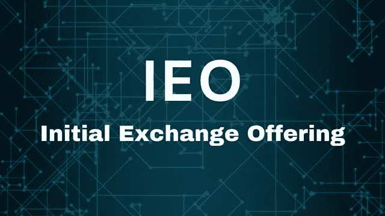
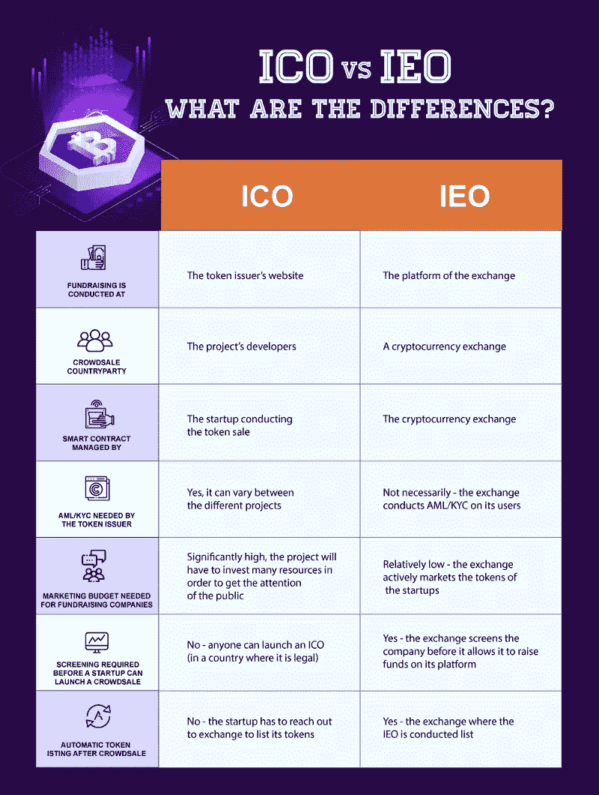
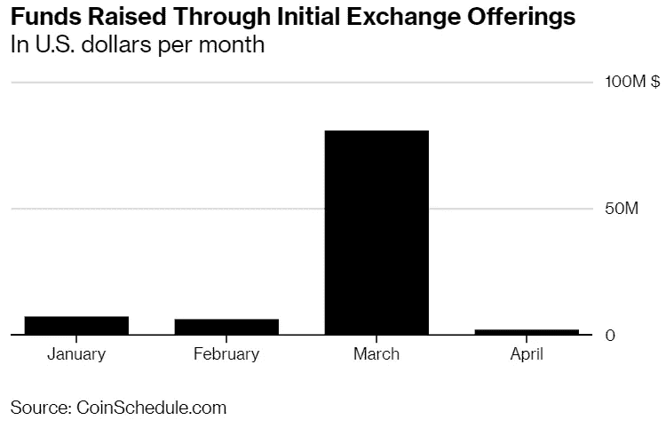

# 什么是首次公开募股(IEO ),如何成功推出？

> 原文：<https://medium.com/hackernoon/what-is-initial-exchange-offering-ieo-and-how-to-launch-it-successfully-6389c613e241>

Source: Cryptopatato

2017 年底，中国的 ICOs 禁止了该国的加密创业公司，并迫使他们寻找替代方案为他们的项目筹集资金。因此，项目开始探索首次公开募股(IEOs)的新趋势。这种新方法让初创公司不用担心当局或法律就能筹集资金。

**让我们更深入地了解“首次交易所发售”这一术语，它是如何运作的，它提供了哪些好处，以及如何推出成功的 IEO。**

# 什么是 IEO(首次公开募股)？

顾名思义，IEO(初始交易所发售)是在加密货币交易所平台而不是发行方平台上进行的。尽管 IEO 和 ico 都是众筹技术，但代币发行者对 ico 负责，而 IEO 则由一个交易所平台代表寻求融资的初创公司进行管理。

source CryptoPotato

由于代币销售是在加密交易平台上进行的，代币发行者需要在 IEO 时支付上市费用以及售出代币的百分比。

作为回报，这些代币可以在交易所平台上出售，并在 IEO 结束后上市。

通过从创业公司售出的代币中获得一定百分比，激励交易所帮助代币发行者进行营销活动。IEO 参与者的贡献不会像 ICO 那样发送到智能合约。相反，用户必须在加密交换平台上创建一个帐户，在这个平台上进行 IEO 的代币销售。

# 在交易所推出 ieo

许多密码交易平台已经开始采用 IEOs 并允许其上市。第一批支持 IEO 的交易所之一是币安。

币安推出了一个专注于 IEO 的新平台，币安 Launchpad。 **BitTorrent 在币安 Launchpad 上开始代币销售，15 分钟内赚了 720 万美元**。在 15 分钟内出售所有代币是任何加密初创公司都梦寐以求的令人兴奋的方法。第二个 IEO，拿过来。AI 在 22 秒内筹集了 600 万美元，达到了更好的众筹上限。

在币安平台获得成功后，许多其他的交易平台也宣布推出他们的 IEO 平台。**其他一些受欢迎的 IEO 平台有 Bitmax Launchpad、OK Jumpstart、Bittrex IEO、Huobi Prime 和 KuCoin Spotlight。**

# 为什么是 IEO？

## **信任**

ICO 发生在特定的区块链平台上，例如以太坊，在该平台上，开发者构建智能合约，投资者将加密资产转移到智能合约以换取令牌。然而，在 IEO，开发商向交易所发送代币，然后交易所以特定价格将代币出售给平台上的用户。

IEO 以交换平台的形式涉及中间人和中央集权。这种集中化的重新引入给愿意安全投资加密资产的投资者带来了信任。

**确保交易平台能够消除 IEO 项目的骗局**。这种情况的一个很好的例子是 RAID IEO 案件。Bittrex 最近宣布取消 RAID IEO 项目，就在代币销售前几个小时。取消的原因是 RAID 终止了与一家公司的合作关系，该公司将为他们筹集 600 万美元。

Bittrex 提到，RAID 的合作伙伴关系是该项目的重要组成部分，当交易所了解到这一事件后，他们计划终止代币销售。

因此，通过交易所平台筹集资金会在投资者和寻求融资的公司之间带来信任。

## **精简上市**

在初始交换提供中，一旦代币销售结束，加密货币交换平台就有责任列出代币。此外，在主要的交易平台上上市代币是每个创业公司在发行硬币时的最终目标。在知名交易所上市可以为项目带来流动性和可信度，并增加代币的价值。

由于代币必须在 IEO 的交易所上市，这也鼓励了市场运作。

## **易用性**

代币发行初创企业可以从启动 ieo 的过程中受益。代币发行者可以利用交易所庞大的客户基础，为项目争取更多的捐款。

Source: CoinSchedule

在 IEO，代币发行者不必担心用户的反洗钱/KYC 流程。交易所平台对 IEO 参与者的反洗钱/KYC 使用自己的标准。

## **法律保护**

交易所平台有一个有组织的法律结构，保护初创公司免受任何监管后果的影响。年轻的初创公司寻找法律资源会节省资金。

知名交易所还提供法律建议、透明度和法律团队，以帮助年轻的初创公司遵守法规。

## **速度**

如上所述，交易所在几分钟内就完成了代币销售，在某些情况下，在几秒钟内就完成了。IEO 交易所平台的速度远远好于任何其他众筹平台或网络。

一旦明确了什么是首次公开募股(IEO)以及你为什么要启动一个 IEO 项目，理解它的启动过程是很重要的。

# 如何成功推出 IEO？

为了让你的 IEO 项目取得成功，请确保你遵循一个循序渐进的启动流程。

**我们将首次交易所发行的启动流程分为四个阶段:**

*   **准备**
*   **IEO 之前**
*   **IEO**
*   **后 IEO 时代**

## **准备**

首先，这是至关重要的一个 IEO 项目之前，你去上市你的令牌。第一步是提出一个想法，并确保它是可行的。

了解市场需求，了解您是否有足够的预算来推出 IEO。基于理解和经验的项目规划将帮助你筹集更多的资金。项目要看起来合法，这样你才能在交易所平台上市。

一旦准备工作完成，寻找一个强大的合作伙伴和顾问团队。建立一个强大的团队可以帮助你赢得更多的项目投资者。确保你的团队在这个领域有相关的经验。

在 IEO，你需要在交易所平台上启动项目；因此，这是至关重要的有一些发展或进展正在进行中，使交易所可以列出你的项目没有任何问题。例如，BitTorrent 在启动他们的 IEO 项目之前有 1 亿用户。

## **IEO 前**

在这个阶段，你首先需要选择你想要合作的交流平台。确保你检查了他们的选择标准，这样你就可以提前做好一切准备，以防止失败。

一旦你选择了交易平台，现在是时候开始起草白皮书了，它可以作为投资者的建议文件。从项目目标到市场分析、发展战略、象征经济学和路线图，确保你在文件中包含了所有需要的东西。

虽然 token 是在 exchange 平台上推出的，但对于一个项目来说，有一个营销网站是必不可少的，用户可以在这个网站上了解品牌和项目的更多信息。

在您准备好白皮书和网站之后，您应该期待令牌的开发。

## **IEO**

开发代币时，请确保您有最大资金需求。决定适当的资金硬上限，以确保目标切实可行。代币铸造成功后，下一步是在确定的交换平台上列出它们。

一旦您通过了交易平台的选择标准和尽职调查，代币就会成功地在平台上列出。

## **后 IEO**

代币销售结束后，交易所列出您的代币，这是营销项目和拓展目标受众以获得吸引力的时候了。

您可以通过开展营销活动(如社交媒体营销、新闻发布和外联、SEO 和内容营销)以及在相关论坛上发表评论来推广项目。

你是否希望**推出一款 IEO** ？如果是，请立即联系我们的团队，我们可以帮助您完成 IEO 发布流程的每个阶段。在 LeewayHertz，我们有一个 IEO 专家团队，他们与著名的 IEO 交流平台建立了战略伙伴关系，可以为您提供启动 IEO 项目所需的所有服务。

请访问我们网站上的 [**见解部分**](https://www.leewayhertz.com/ieo-initial-exchange-offering/?utm_source=Hackernoon_leewayhertz) **了解更多关于区块链空间的信息。关注我们的** [**【脸书】**](https://www.facebook.com/LeewayHertz/)**[**LinkedIn**](https://www.linkedin.com/company/leewayhertz-technologies/)**和**[**Twitter**](https://twitter.com/LeewayHertz)**了解区块链的最新动态。****