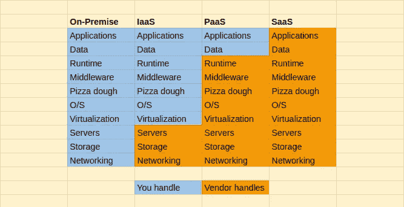
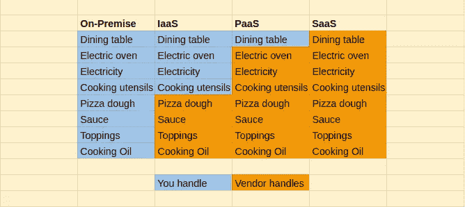
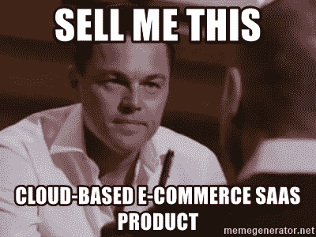
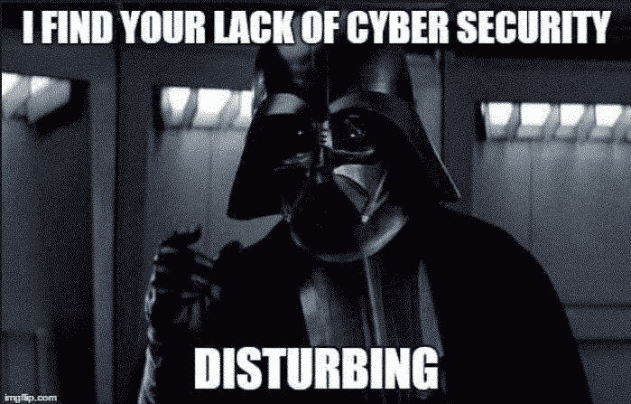

# 什么是 SaaS？完整的概述

> 原文：<https://medium.com/hackernoon/what-is-saas-a-complete-overview-19d3579d5466>

软件即服务(SaaS)解决方案(也称为按需解决方案)是热门话题。SaaS 构成了云市场的最大部分，预计 2019 年将增长 17.8%。

这篇文章将会让你明白 SaaS 是什么，为什么 SaaS 看起来发展如此之快。我们还区分了 SaaS、PaaS 和 IaaS(有一个很酷的例子；) )并指出为什么 SaaS 应用程序开发是有史以来最好的事情。

在本文中，我们将介绍:

1.  什么是 SaaS？
2.  IaaS、PaaS 和 SaaS 之间的区别
3.  为什么是 SaaS？
4.  SaaS 的优势和劣势
5.  SaaS 和安全

# **1。什么是软件即服务(SaaS)？**

云计算的三个组成部分之一，[软件即服务(SaaS)](https://www.binaryfolks.com/services/hire-experts/hire-saas-application-developers?utm_source=Medium_hackernoon&utm_medium=Social&utm_campaign=whatisSaas) 是一种软件分发模式，其中第三方提供商托管应用程序，最终用户可以通过互联网访问软件。

SaaS 应用程序开发消除了组织在自己的计算机或数据中心安装和运行应用程序的需要，使基础架构投资为零。这意味着不需要向 IT 专家大喊大叫，将软件下载到办公室的每台电脑上，也不需要担心每台电脑上的软件是否保持最新。

让我用一个简单的例子来解释什么是 SaaS。你出去吃饭。你选择地点、菜单，付钱享用现成的食物。包括房租、买菜、做饭、清洁和服务在内的一切费用；由餐厅处理。SaaS 应用就像外出就餐一样。它为特定的业务需求提供现成的解决方案。

现在，您对 SaaS 平台有了一个模糊的概念，让我们快速、简单地讨论云计算的其他 2 个组件:*平台即服务(PaaS)* 和*基础架构即服务(IaaS)* 。

# **2。IaaS、PaaS、SaaS —差异**

*平台即服务* 提供框架和环境，开发人员可以利用它们来开发、测试和管理定制应用。因此，供应商提供基础设施和开发人员代码。

与 SaaS 不同，PaaS 不是通过互联网交付软件，而是为软件创作提供一个平台。与 SaaS 类似，开发者不需要担心操作系统、更新、存储等问题。

就像 SaaS 解决方案一样，用户也可以选择采用现收现付定价模式的 PaaS 解决方案。

## **基础设施即服务**

IaaS 由具有云存储和网络功能的自动化和可扩展资源组成，可通过互联网提供虚拟化计算资源。这些云服务器和其他资源是通过 dashboard 和 API 提供的。

IaaS 客户端可以直接访问其服务器和存储，并获得更高的可扩展性。

与 SaaS 和 PaaS 相反，管理操作系统、中间件、运行时等。是客户的责任。IaaS 提供商负责管理服务器、硬盘、虚拟化和存储。

**IaaS 据说是最灵活的云计算模块。**让我用一个很酷的例子来解释 SaaS、Paas、IaaS 和内部部署软件的区别:

回到外出就餐的例子——比如你想订一份比萨饼。让我用这个例子来告诉您内部部署、IaaS、PaaS 和 SaaS 会得到什么:

我希望现在区别已经很明显了！

## **哪里可以用 SaaS，什么时候用 SaaS 比较有利？**

SaaS 可用于开发任何[企业应用](https://www.binaryfolks.com/services/solutions/enterprise-software-development?utm_source=hackernoon&utm_medium=social&utm_campaign=whatisSaaS) — PO、DBMS、CAD、CRM、MIS、HRM、GIS 等。

2018 年的一项全球 CIO 调查得出结论，SaaS 已被纳入几乎所有领先企业软件开发的战略。93%的首席信息官表示他们正在采用或考虑云，大多数(54%)预计在未来 3 年内将云软件用于任务关键型应用。超过 70%的首席信息官认为可扩展性和敏捷性是采用云的动力。

**延伸阅读:** [企业软件开发的挑战](https://www.binaryfolks.com/blog/enterprise-application-development-challenges-and-how-to-overcome-them)

## **何时使用 saas？**

1.  当您需要应用程序具有显著的可伸缩性时。
2.  具有同等 web 和移动需求的应用程序。
3.  快速启动业务，无需担心服务器配置和更新。

Binaryfolks 是一家 SaaS 应用程序开发公司，但这并不是我们推动您采用 SaaS 的原因。让我们看看为什么应该采用或转向 SaaS 解决方案。

# **为什么是 SaaS？**

全球*软件即服务*行业正以指数速度增长。[据福布斯](https://www.forbes.com/sites/louiscolumbus/2018/09/23/roundup-of-cloud-computing-forecasts-and-market-estimates-2018/#2ad0082c507b)报道，SaaS 企业市场现在为软件供应商创造了 200 亿美元的季度收入，这个数字每年增长 32%。

以下是任何企业或初创公司升级或转向 SaaS 平台的一些原因:

## **多租户架构**

这意味着软件的单个实例可用于服务多个客户。因此，所有用户和应用程序共享一个集中维护的公共基础设施和代码库。

这种多租户使得根据单个企业的业务需求定制 SaaS 应用程序变得更加容易。购买者可以自定义外观和感觉，添加自定义字段，定义特定于业务的工作流，使用权限等。

由于共享基础架构以及较低的维护成本，多租户还可确保降低前期成本。

## **无缝集成**

要经营一个成功的企业，你需要将所有的应用程序相互集成。有效地集成关键系统对于扩展组织孤岛内的功能和实现收入最大化至关重要。

有一些 API 可以实现 SaaS 与内部应用程序以及其他 SaaS 产品的无缝集成。这将最小化开发成本，最大化 SaaS 投资的价值。

## **可扩展性**

作为一个企业主，你会一直关注一个可扩展的选项。SaaS 应用程序使您能够根据您的业务需求选择自己的模型，并在业务需求发生变化时轻松升级或缩减模型。因此，当公司扩张时，不需要购买额外的硬件；只有计算能力，如数据存储、带宽等。

## **节约成本**

就重要性而言，“更低的总体成本”是 SaaS 采用的第二大驱动因素。

SaaS 通常是基于订阅的，没有预先许可费。SaaS 也有一个“随用随付”的模式，将成本与使用联系起来。如果使用更多的组件和服务，价格就会上涨；如果用得少，价格就会下降。AWS 提供“随用随付”定价，根据实例数量、API 请求等进行收费。

## **无痛升级**

因为 SaaS 应用程序是多租户应用程序，不是更新每个实例，而是更新代码库，所有用户都可以即时访问。

如果 SaaS 的应用程序按订阅计划运行，费用包括维护、升级、错误修复和其他成本。因此，不需要安装或下载任何种类的更新或安全补丁。

SaaS 应用程序开发有优点，也有一些缺点，包括:

## **失控**

内部软件解决方案比托管解决方案具有更高的控制级别，因为托管解决方案中的控制权属于第三方。

通常，每个人都必须使用软件应用程序的最新版本，并且不能推迟功能的升级或更改。

## **性能**

SaaS 应用程序在远程数据中心运行，而本地应用程序将在用户的桌面上运行。在这种情况下，有时可能会出现性能问题。快速可靠的互联网连接可以帮助您摆脱与性能相关的困扰。

## **对服务提供商的依赖**

在 SaaS 应用程序开发中，对服务提供商有很大的依赖性。如果您的 SaaS 提供商破产或他们决定停止服务，您将无法再访问您的应用程序。同样，即使他决定暂时从网络上移除服务，你也不能使用该应用程序。

**SaaS 有利有弊。尽管优势战胜了劣势。说到利弊，关于 SaaS 应用安全对 SaaS 来说是利还是弊，存在着巨大的争论——让我们彻底解决这个争论吧。**

# **SAAS 安全**

随着时间的推移，企业和任务关键型业务应用越来越频繁地使用云网络，因此，安全性是重中之重。

## **是什么让 SaaS 应用面临风险？**

1.  根据[云安全联盟](http://www.cloudsecurityalliance.org/guidance/csaguide-dom12-v2.10.pdf)的说法，“管理企业应用程序的身份和访问控制仍然是当今 IT 面临的最大挑战之一”。
2.  云标准不是很强，而且云服务提供商通常很少公布他们数据中心和运营的细节。
3.  因为在 SaaS 模式下，只要有互联网连接，就可以访问应用程序，这也是一个风险。
4.  对数据的位置没有足够的了解，因为有时由于负载平衡和改进的延迟，提供商可能需要移动数据。
5.  由于虚拟化使单个服务器能够存储多个客户端的数据，因此如果有人攻击单个服务器，就会使许多客户的全部数据面临风险。
6.  由于数据托管在云上，客户端无法控制数据。在出现差异的情况下，人们需要依靠提供商来获得答案。

**尽管如此，贝恩公司预计，到 2020 年，CAGR 的 SaaS 增长率将达到 18%。**过去 7 年来，binary 乡亲是 SaaS 应用程序开发的先驱，我们知道如何最大限度地降低风险，以便 SaaS 解决方案可以最大限度地提高您的投资！

## **一些 SaaS 安全最佳实践**

**端到端加密:**端到端加密是最安全的用户-服务器交互方式，通过 SSL 连接实现。加密对于敏感数据也很重要。确保你的云服务提供商也提供可定制的现场级加密。

**漏洞测试:**使用一些行业领先的 SaaS 应用程序监控工具来跟踪 SaaS web 应用程序，并运行轻量级扫描来查找漏洞和风险。选择具有全自动安全评估功能的解决方案来测试应用程序运行状况，并提供按需扫描功能。

**数据删除政策:**客户数据保留期结束后，必须以编程方式删除客户数据。

您的 SaaS 提供商可以只为您提供云环境，而不是利用多租户实例，以便您可以控制所有数据。AWS 称之为虚拟私有云(VPC)。用户将完全控制他们的虚拟网络环境，包括选择他们的 IP 地址范围、创建子网以及配置路由表和网络网关。

# **临别赠言**

据预测，如果您迁移到云，您的业务将增长 19.63%。此外，SaaS 解决方案意味着可观的成本节约。我希望这篇文章描绘出一幅清晰的画面，告诉你 SaaS 可以做些什么来改变你的业务，让你获得超越竞争对手的竞争优势。

*最初发表于*[*https://www.binaryfolks.com*](https://www.binaryfolks.com/blog/what-is-saas-a-complete-guide)*。*