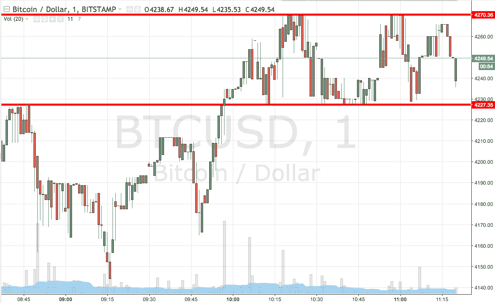
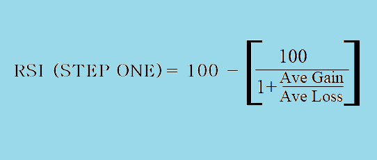
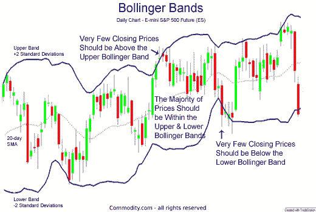
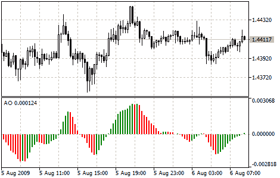

# 什么是黄牛交易，它是如何在加密货币交易中使用的？

> 原文：<https://medium.com/hackernoon/what-is-scalping-and-how-it-is-being-used-in-cryptocurrency-trading-56bb32e11f5b>

外汇倒卖一度是投资者的热门话题。它可能会永远存在，因为加密货币的趋势不知何故正在沸腾。对于许多新投资者来说，加密货币倒卖可能是新鲜事，但它已经潜伏很久了。

# 了解倒票

术语 [**刷单**](https://www.investopedia.com/articles/trading/05/scalping.asp) 相对用于日内交易。这种投资方式适合那些寻求短期边际利润而非长期风险的人。通过刷单，交易者利用技术分析获得 50-70 点的利润，这种策略可能是因为他们习惯花时间分析外汇交易市场。

它神奇地起作用，因为投资者没有长期持有任何资产/股票，而是迅速止损，以赚取小额但更频繁的利润。这里成功的最重要的关键是保持激光聚焦，并在瞬间做出非常敏锐的反应。

# 如何进行加密货币头皮交易？

这里最重要的是要记住，你需要某种对货币进行技术分析的工具。您需要可以显示每分钟货币价格的活动烛台图表/图形。市场上到处都是[最棒的外汇经纪商，他们从事加密货币交易](https://fxdailyreport.com/best-scalping-forex-brokers/)，可以帮你起步。

然而，如果你已经学会了基础知识，你就知道什么时候是投资的最佳时机。尽管你不应该长期持有这项投资。密切关注不断增长的交易量，建立止损，并在小幅上涨时继续前进。一些专家在一天内做了 100 笔交易，集体收益更高。

除了交易基础，你需要学习使用指标进行头皮交易。这些方法正是你需要的武器。现在，你不会找到这些工具

**相对强度指数**

它只有一个目的，测量最新的价格变化。这些数据可以用来判断货币是超买还是超卖。一个很好的方法是知道你应该在什么时候购买，什么时候退出。

该工具使用一个 [**公式**](https://www.investopedia.com/terms/r/rsi.asp) 获取一段时间内发生的平均损失和利润数据，具体来说。它提供特定资产的编号值，在本例中是任何加密货币。

作为一名投资者，如果你曾经使用过带有 RSI 指标的工具，你会知道，如果 RSI 值接近 70 或以上，这是货币超买的迹象。这意味着该货币正在以虚高的价格交易，避免购买是当时采取的最佳措施。

**S & R(支撑和阻力指标)**

如果你知道趋势，这个度量概念就会出现。你一定听说过股票交易中的一个著名谚语，即“牛熊之战”其中可以提到 [**支持和**](https://zerodha.com/varsity/chapter/support-resistance/) 抵抗两个层次。支撑是一个术语，指的是需求被推断为稳定和强劲的点，它阻止了价格的进一步下跌。另一方面，阻力是强卖的价格，它阻止价格进一步上涨。

*Source: StockCharts.com*

在图中，底部趋势线显示支撑位，而上部趋势线显示阻力位。顶线和底线上的箭头指向价格，价格在到达顶线以上之前一直受到限制。一旦突破了上方趋势线，它就从阻力位变成了新的趋势支撑位。

**BB(布林线)**

这是一种由约翰·布林格开发的技术，使用移动平均线和两个交易带，两端各一个，即上方和下方。这里布林线不计算百分比，只是简单的通过加减计算 [**标准差**](https://www.fidelity.com/learning-center/trading-investing/technical-analysis/technical-indicator-guide/standard-deviation) 。

两端各有一条中线和两条价格通道。价格通道充当研究股票的标准差；中线保持指数移动平均线。两个波段都扩张和收缩，表明价格波动变得不稳定，或者局限于交易紧张的模式。

*Source: commodity.com*

**AO(超棒振荡器)**

[**牛逼振荡指标**](https://www.metatrader5.com/en/terminal/help/indicators/bw_indicators/awesome) 是用来评估市场动能的指标。它计算 34 到 5 简单移动平均线之间的周期缺口。使用的 SMA 不是根据收盘价计算的，而是根据每个棒线的中点计算的。

当棒线高于零线时，这是买入的信号。是条形图把负值区域传递到正侧的情况。拿一个点来说，卖出的信号类似于买方只是反向的。这里的值传递到零线以下。

交易者成功地利用这些技术分析来显著改变他们的投资组合。每种方法都有其优缺点，在深入研究之前需要进行大量的研究。也就是说，如果你不介意赚的少且更有规律，头皮交易值得一试。