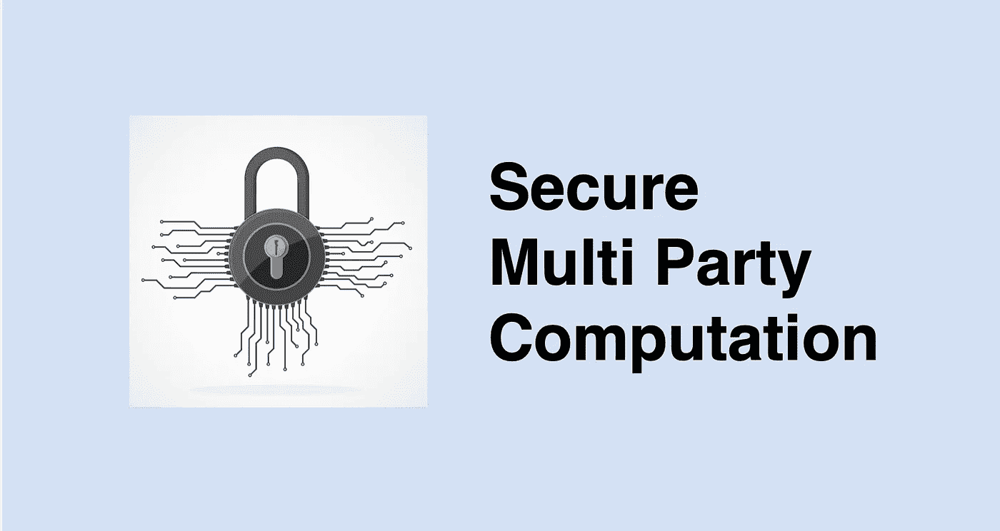
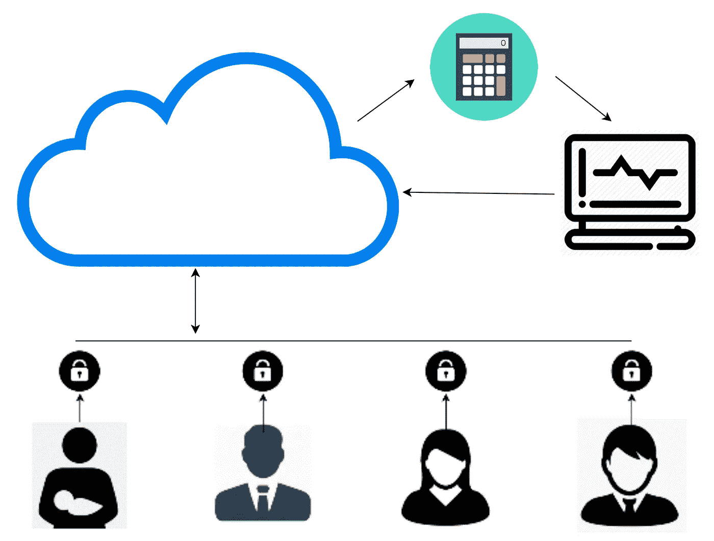

# 什么是安全多方计算？

> 原文：<https://medium.com/hackernoon/what-is-secure-multi-party-computation-232caef900b9>

安全多方计算(SMPC)是密码学的一个重要分支。它有可能实现真正的数据隐私。SMPC 寻求让各方使用他们的输入来共同计算一个函数的方法，同时保持这些输入的私密性。

**沙米尔的秘密共享方案:**

要理解 SMPC，我们必须首先了解沙米尔的秘密共享方案。该方案的目的是将一个秘密值划分并分布在几个节点或用户上，这样就没有人知道这个秘密值。要检索机密值，必须有最小数量的用户将他们的数据汇集在一起。

Shamir 的秘密共享方案也可以用于对秘密共享值进行计算。当我们将每个用户对各自数据的计算结果组合在一起时，我们会得出计算结果，而不知道秘密输入。

**举个例子**

为了更好地理解这个概念，让我们使用一个简单的例子:一个大于 1000 的秘密数字，一个系统中有 100 个用户，法定人数为 10 个用户。

每个用户都有一个 100 到 199 之间的唯一号码。

由于最低法定人数要求是 10 个用户，任何时候 10 个或 10 个以上的人聚在一起，他们的组合数 x 将揭示秘密(x > 1，000)，而不会揭示任何人的个人号码。

**个人数据的安全多方计算**

现在，不使用数字，让我们说“秘密”是用户的个人数据。

SMPC 的工作方式大致相同:个人数据被分割成几个更小的部分，每个部分都使用加密技术进行掩盖。接下来，每一小块加密的数据被发送到一个独立的服务器，这样每台服务器只包含一小部分数据。

希望发现“秘密”(即发现个人数据)的个人或组织将需要聚集编码数据。此外，通过要求每个服务器在不泄露数据的情况下对其小部分数据执行计算，将有可能基于个人数据执行计算。

**对隐私的影响**

人们最近开始要求政府和公司更加主动地保护他们的个人信息，特别是财务、健康、人口统计或其他敏感信息。大型组织现在希望通过成为客户个人数据的负责任的保护者来维护客户的信任。

在这种情况下，SMPC 的加密、分发和分布式计算的结合会对数据隐私和安全产生深远的影响。

—

[沙恩雷](http://www.shaanray.com)

关注媒体上的 [Lansaar Research](https://medium.com/lansaar) ,了解最新的新兴技术和新的商业模式。