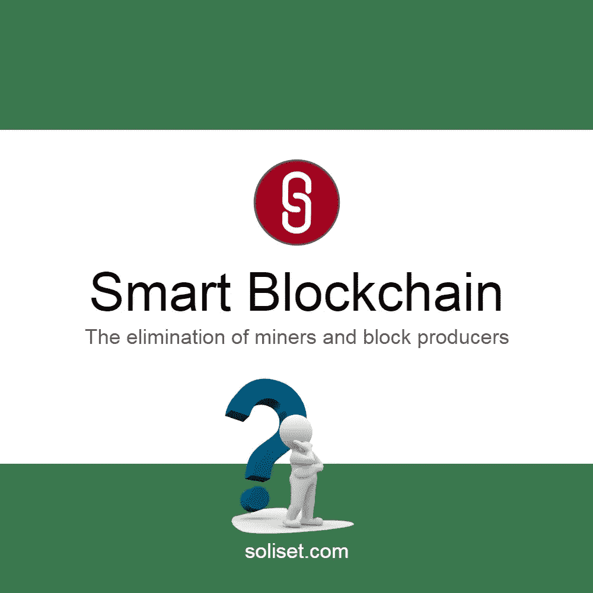
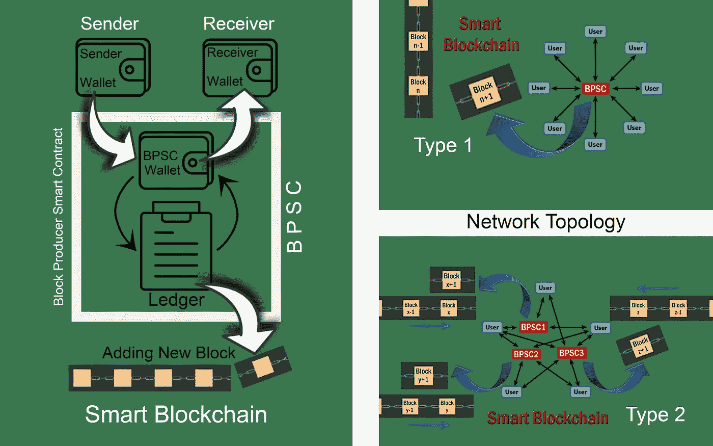
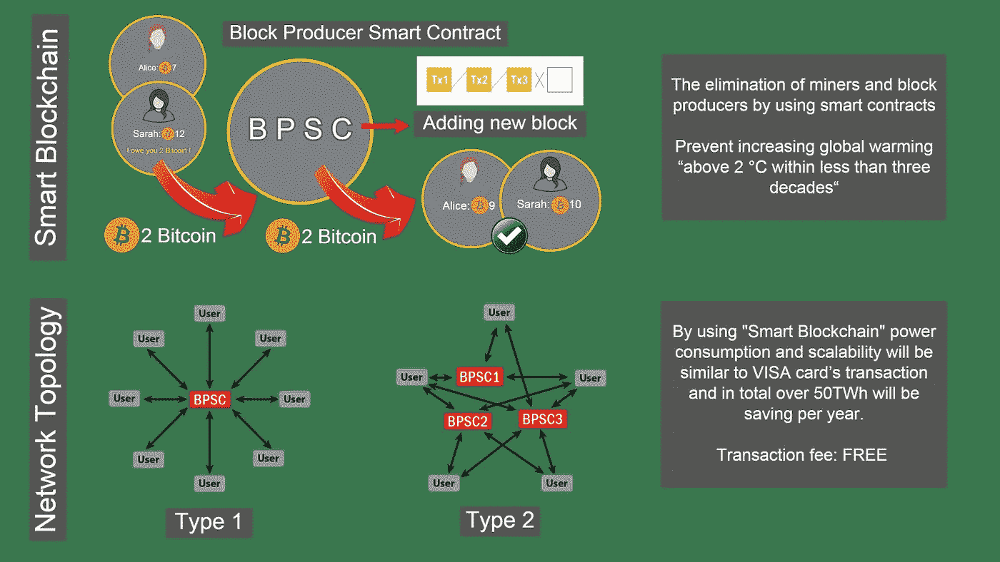
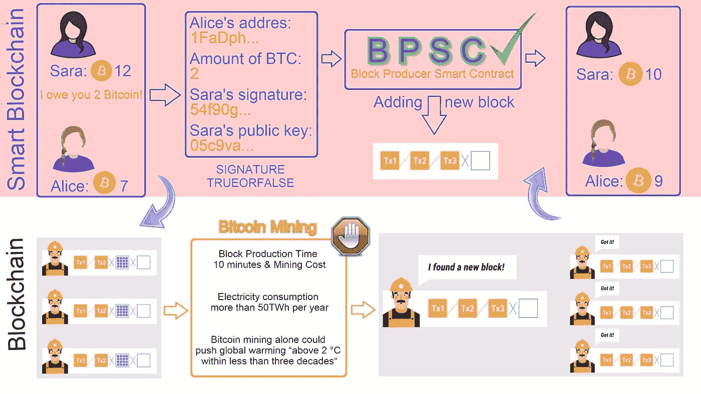
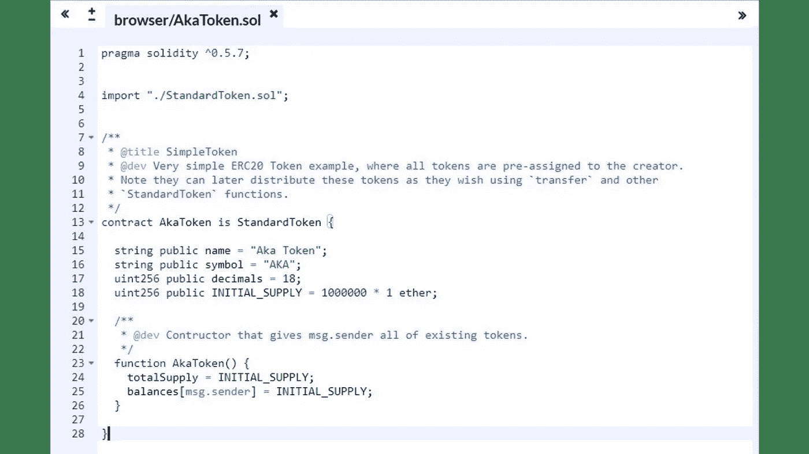
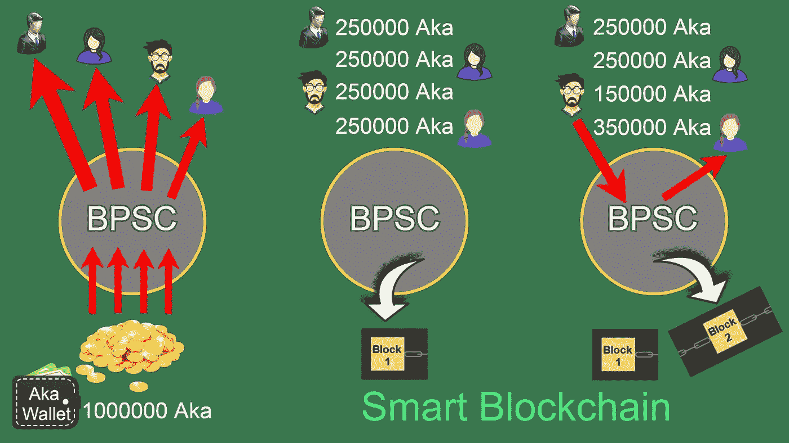

# 什么是智能区块链？

> 原文：<https://medium.com/hackernoon/what-is-smart-blockchain-4b134275e90f>

## 用智能合约取代矿商和大宗生产商。

智能区块链是新一代的区块链网络，它将允许一个或多个智能合约在交易发生的那一刻从去中心化网络的成功交易中收集准确无误的数据，并同时将这些数据存储和注册在新的区块中。智能区块链既不需要金融机构，也不需要中介，此外，在这项技术中，矿工和区块生产者没有任务可做。换句话说，在智能区块链中，总是有一个或多个像金融机构一样的智能合同，免费并自动记录和存储交易数据到新的区块中。

这篇文章的作者是索马耶赫·戈拉米女士和迈赫兰·卡泽米尼亚先生，文章于 2019 年 4 月以波斯语和英语写成。

[*波斯文*](https://www.soliset.com/smart-blockchain2)

# 智能区块链是如何工作的？

在智能区块链中，一个或多个区块生产者智能合同(BPSC)存在于分散的网络中，没有 BPSC 的参与，没有成功的交易被执行。为了在网络中成功交易，首先，发送者必须将加密货币发送到 BPSC 的钱包，然后 BPSC 自动将加密货币发送到接收者。这一简单的操作使 BPSC 准确无误地拥有了所有网络交易数据，然后作为一个准确可信的金融机构，将交易数据记录到一个新的数据块中，并将这个新的数据块添加到区块链的末尾，这样就不会有任务分配给矿工和数据块生产商。

[Smart Blockchain](https://www.newchains.info/)

此外，智能区块链提供了根据主题对交易进行分类的可能性。例如，它允许在由独立区块链组成的网络中交易几种类型的加密货币。这将通过增加网络中 BPSCs 的数量来实现。限制也是重要的一点是，事务可以分配给独立的 BPSCs，它们的主题彼此不相关。例如，如果我们希望智能合同为每 100 个赞提供奖励，那么这种项目的赞交易和加密货币交易应该由单个 BPSC 存储和注册，并进入单个区块链。有关更多信息，您可以阅读以下文章:

 [## 通过使用智能合同淘汰矿工和区块生产商

### (迈向智能环保区块链的第一步，也是最重要的一步)

medium.com](/swlh/the-elimination-of-miners-and-block-producers-by-using-smart-contracts-58b20e317e9b) 

# 智能区块链有什么好处？

在交易发生时，存储和登记正确无误的交易数据。在这种情况下，不需要像他们在比特币网络、以太坊网络等中所做的那样，从一个区块中生成一些替代品。，然后矿工们花那么多钱，消耗巨大的电力，使用各种证明机制，选择正确有效的区块。

交错的功耗是使用工作验证机制或利益验证机制的结果，或…..哪个智能区块链根本不需要其中任何一个。不幸的是，一个比特币交易的耗电量是一个 VISA 交易的 20 万倍。用于存储和注册整个比特币交易的年耗电量超过 50 太瓦(1 太瓦时= 3 600 000 000 000 000 J)，相当于一个拥有 1000 万人口的国家的年耗电量。这项研究于 2018 年 10 月发表在全球气候变化上，研究表明，在不到三十年的时间里，比特币采矿可以使全球气温升高 2 摄氏度以上。

幸运的是，智能区块链交易和常规 Visa 卡交易在功耗上不会有差异。BPSC 存储的数据是完美的，因为它是在交易发生时自动注册的，没有人工干预。智能区块链可以简单地结束额外花费数十 TWh 电力的噩梦。

[Smart Blockchain](https://www.newchains.info/)

通过使用智能区块链，我们应该不再担心矿工和区块生产商的费用。BPSCs 将自动自由地执行矿工的所有任务。此外，智能区块链的可扩展性无法与现有的区块链相媲美，可以与 Visa 的交易速度相媲美。有关其他信息，您可以阅读以下文章:

 [## 比特币挖矿；《大小谎言》

### 隐藏比特币的弱点不是解决办法。

medium.com](/swlh/bitcoin-mining-big-little-lies-c6911435aa77) 

# 智能区块链有什么用？

***首次使用:*** 在类似以太坊、EOS 等网络中。可以注册和部署智能合约，只需为每个新的智能合约设置一个专用的区块链。通过这种方式，一旦新的智能合约启动，BPSC 将被启动，并且从一开始，智能合约的所有交易将被存储并登记到 BPSC 的分类账中。在这种情况下，专用区块链将不需要来自以太坊区块链、EOS 等的任何数据。，而且会独立工作。同时，在编码时，这个 BPSC 可以单独编码和发射，或者 BPSC 码可以导入到所需的智能合同码中。

***第二用途:*** 用于各以太网、EOS 等。允许注册和部署智能合同，整个现有的区块链可以被智能区块链取代。为此，在将专用 BPSC 投入网络后，所有现有钱包的准确和最终状态将提供给 BPSC，此后所有后续网络交易也将通过 BPSC 完成。

***第三种用途:*** 如果我们想将智能区块链用于比特币等无法建立任何智能合约的网络，我们应该首先推出一种新的去中心化网络，允许注册和部署类似以太坊网络的智能合约。然后，在这个新的网络中，我们设计并激活了一个块生产者智能合同 BPSC。在确保 BPSC 在新网络上的功能后，我们必须要求所有比特币所有者从新区块链的加密货币中获得等同于他们的比特币，同时，他们最初的比特币应该被烧毁。这些都是由一个网络的 BPSC 完成的，BPSC 可以记录网络中任何钱包的初始余额，并立即开始工作。

[Smart Blockchain](https://www.newchains.info/)

***第四种用途:*** 智能区块链可以用来推出全新的区块链，当然一切都可以从头开始设计。与此同时，关于智能区块链的功能，我们可能很快就会看到一个或多个非分散的全球网络，其中包括所有类型的加密货币和具有独立区块链的智能合约。有关更多信息，您可以阅读以下文章:

 [## 智能区块链；拯救比特币，每年节电 50 多万瓦时

### 一个比特币交易的耗电量是一个比特币交易的 20 万倍

medium.com](/swlh/smart-blockchain-the-rescue-of-bitcoin-and-saving-electricity-more-than-50twh-per-year-c17606976fce) 

# 智能区块链的一个简单例子

我们在主动网络上设计智能区块链；它的意思是以太网，描述一下 BPSC 是如何工作的:

在第一阶段，通过注册和部署智能合约，我们一次性创建 100 万个 ERC20 类型的 AKA 令牌，所有令牌都将放在合约的钱包(AKA wallet)中。在本例中，我们希望建立一个新的区块链来记录这一百万个 AKA 令牌的交易。新的智能区块链是完全独立的，不需要主以太坊的区块链数据。这意味着，如果以太坊区块链因任何原因被停止，例如，矿工和块生产者停止工作；新的智能区块链将继续工作。

下一步是注册和部署 BPSC(块生产者智能合同)。这个契约有几个主要功能:

*   AKA 令牌只能从发送者的钱包发送到 BPSC 的钱包，而 BPSC 会立即将令牌发送到原始接收者。通过这种简单的方法，BPSC 作为一个准确可信的金融机构，将拥有交易数据。
*   对于每笔成功交易的数据，BPSC 分类账将立即更新。
*   在期望的时间间隔，BPSC 将新事务的数据作为新块添加到链的末尾。

[Smart Blockchain](https://www.newchains.info/)

假设所有 AKA 代币由四个人以相等的数量购买。因此，你需要发送二十五万又名令牌给每个买家。当然，要做到这一点，首先，AKA 令牌应发送到 BPSC 的钱包，BPSC 会立即将它们发送到买家的钱包。

现在，BPSC 可以更新其整个分类账，并在第一块记录这些交易的数据。接下来，例如，如果 Aka 代币的所有者之一向另一个所有者出售 100，000 个 Aka 代币，卖方仍将把 100，000 个 Aka 代币发送给 BPSC，而 BPSC 立即将 Aka 代币发送给买方。无论如何，没有 BPSC 的参与，任何交易都不会被认为是成功的交易，这就是为什么 BPSC 可以不断更新其分类账，并在新的区块中记录交易数据。

文章到此结束，我们等待您的评论。您还可以使用以下链接了解更多信息，并访问智能区块链技术的最新发展:

[***智能区块链技术***](https://www.newchains.info/)

## 2019 年 4 月 3 日
索马耶赫·戈拉米
迈赫兰·卡泽米尼亚

[网站](https://www.soliset.com/) | [推特](https://twitter.com/SetSoli) | [电报](https://t.me/soli_set)