# 网络安全专业人员的 11 个最佳 IP 地理定位 API

> 原文：<https://medium.com/hackernoon/what-is-the-best-ip-geolocation-api-for-cybersecurity-professionals-87653b625376>

地理定位长期以来一直与商业联系在一起。事实上，根据个人或网络实体 IP 地址背后的信息来了解其物理位置的能力是组织已经利用了一段时间的一项关键功能。

真的是这样吗？不管你在日常生活中是否注意到，你可能已经遇到了这项技术的一些副产品——例如，位置感知应用程序、定向广告和定制的电子商务内容。

然而，IP 地理定位不仅仅是在线销售和广告。网络安全是另一个可以从其能力中大大受益的部门，特别是跟踪网络犯罪分子的活动及其行踪，以便更好地检测和预防威胁。

本文深入探讨了最佳的 IP 地理定位 API，并为网络安全专业人员提供了截图，同时概述了这些产品所能提供的功能。但在此之前，让我们先回顾一下为什么地理定位与当今运行充分的网络安全操作如此相关，以及选择正确产品所需的重要标准。

目录

*   IP 地理定位与网络安全的相关性
*   选择 IP 地理定位 API 的标准
*   了解产品前景
*   供应商 1:ip-geolocation.whoisxmlapi.com
*   供应商 2:geo.ipify.org
*   提供商 3: IPInfo.io
*   供应商 4:DB-IP.com
*   供应商 5:IP2Location.com
*   供应商 6:IPData.co
*   提供者 7: IPGeolocation.io
*   供应商 8:Ipapi.com
*   供应商 9:IPStack.com
*   提供商 10: ClearIP.io
*   提供商 11: IPWhois.io
*   总结想法

# IP 地理定位与网络安全的相关性

你为什么想开始使用 IP 地理定位 API？众所周知，当前的数字世界充满了不断攻击企业、系统和用户的恶意实体和网络攻击。从入侵企业网络、在黑市上窃取和出售敏感信息，到不仅影响网络，还影响人们身体健康的数据泄露，攻击的范围不断扩大，使每个人的网络活动都面临风险。

为了预防和阻止这些有害行为，几种类型的网络安全专业人员(包括威胁猎人、事件响应专家、渗透测试专家和网络安全分析师)发现地理定位非常方便。

那么，这项技术如何更具体地赋予优势呢？通过对某个 IP 地址进行查找，地理位置数据可以为专家提供关键指标，以验证互联网上可疑的实体，因为设备背后的个人或组织的信息包括城市、国家、州、时区、坐标等。

**网络安全中 IP 地理定位的使用案例**

如今，IP 地理定位在网络安全领域有许多应用。例如，地理数据可用于对付找到进入公司网络的方法的入侵者。实现这一点的一种方法是通过交叉检查可疑远程用户和访问者的当前地理位置细节，以揭示简档信息中的不规则性。如果已确认不匹配并发现入侵者，则可以实施限制来阻止对敏感数据或应用程序的进一步访问。

找出网络攻击的切入点一直是业内的一个挑战。好消息是，由于 IP 地理定位 API 考虑了用户的坐标，它们可以用来追溯威胁来自哪里，并确定其行动来源。在此基础上，专家可以决定应用威胁情报技术来找出与目标相关的其他实体，并突出显示可能的恶意合作伙伴。

了解网络犯罪行为的来源也很重要，因为它为执行进一步的分析提供了坚实的证据。一旦这些威胁被证实，专业人员可以进行反击，以阻止和阻止他们造成更多的伤害。此外，他们可以使用来自 IP 地理定位的数据，将经过验证的入侵与可以验证的流量信息进行交叉链接。

这项技术的另一种应用方式是打击在线欺诈和身份盗窃，这些行为每年都会造成巨大的经济损失，并影响到全球数百万人。事实上，每当发生数据泄露时，信用卡信息被盗是最常见的后果之一。

IP 地理定位可以在这方面有所帮助，因为它允许网络安全专家将可疑的 IP 地址与合法客户过去的账单细节进行比较。在此阶段发现的任何差异，特别是当订单来自可疑地点时，都可以标记出来，以便进行更深入的审查。

还可以利用 IP 地理定位来抵御垃圾邮件或可疑邮件。为了检查消息是否由真实的人发送，网络安全人员可以执行地理 IP 搜索，以收集和分析用户的各种基于位置的数据。此功能支持对来自高风险地区的某些 IP 地址进行地理封锁。这降低了危险电子邮件到达组织的可能性，从而最大限度地减少了漏洞。

# 选择 IP 地理定位 API 的标准

此产品类别不存在“一刀切”的做法。相反，网络安全专业人员需要以明智的方式选择 IP 地理定位 API，因为市场上并非所有产品都是相同的。你需要考虑几个方面，其中包括以下几个方面:

**1。覆盖范围**

首先，了解解决方案为其客户提供的覆盖范围是至关重要的，即特定地区、国家等接受审查和监控的 IP 地址数量。和精度水平。这对于网络安全应用至关重要，因为这些应用依赖精确度和及时性来应对来自不同地方的网络罪犯。因此，重要的是要考虑到这样一个事实，即一些 IP 地理位置提供商专门提供美国的准确位置信息，而其他人可能会在欧洲或其他地区这样做。

**2。兼容性**

大多数组织通常计划将 IP 地理定位 API 与其新的或现有的安全系统集成在一起。这意味着专家需要考虑支持哪些编程语言，数据库是否有不同的格式，以及是否可以实现标准化的响应-在处理网络安全威胁时，允许简化操作并节省宝贵的时间。

**3。可靠性**

在投入时间和金钱之前，网络安全专家也应该知道一个 API 的可信度。可靠性方面要考虑的一些因素包括响应时间、软件不可用的频率以及客户服务团队是否能提供及时的支持。持续便捷地访问所有服务是另一个需要牢记的重要方面，因为网络安全专家需要立即对威胁事件做出响应。

**4。文档**

最后，提供商提供的文档是另一个关键标准。这些文件提供入门帮助，教导如何使用功能，解释如何解决问题，并包含其他提示和技巧。这些材料可以作为用户指南、说明手册或常见问题解答。

# 了解产品前景

如前所述，并非所有的 IP 地理定位 API 都来自同一品种。一些可能专注于提供数据多样性，而另一些则有更少但更精确的输出字段。此外，一些解决方案提供了网络安全专家会觉得有用的功能，而其他产品可能更适合其他专业和使用案例。

例如，某些网络安全任务不需要获取目标地址的详细信息，如嫌疑人的邮政编码，但需要准确的经度和纬度信息。另一个例子是，专家可能对目标的时区不感兴趣，但可能想了解 IP 地址背后的组织和 ISP 以进行调查。

除此之外，一些提供商提供补充服务，如访问 WHOIS 数据库下载服务或威胁情报分析，这些服务与 IP 地理位置数据相结合，可以帮助加强和简化网络安全运营。

随着对当前产品前景的更好理解，这里有一个主要 IP 地理定位提供商的非详尽列表供您查看。

# 供应商 1:[ip-geolocation.whoisxmlapi.com](https://ip-geolocation.whoisxmlapi.com)

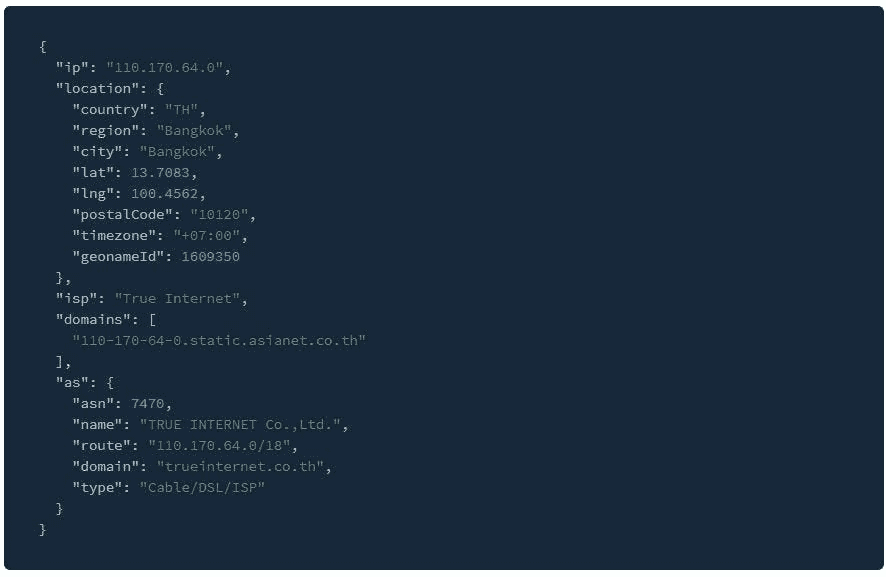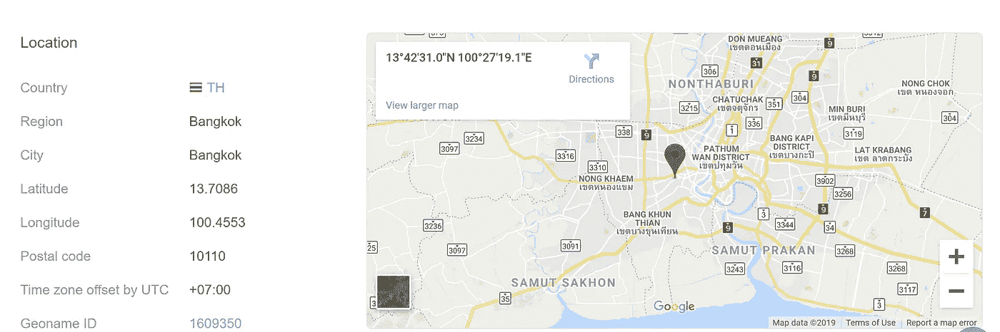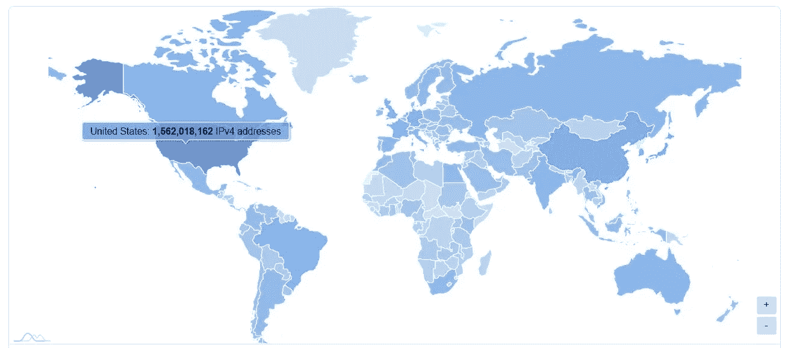

**覆盖范围**

WhoisXML API 从与其签订法律协议的众多实体处收集数据。他们的来源包括一些主要的 ISP，这些 ISP 已经熟悉他们所拥有和分配的 IP 地址，如果有必要，他们可以提供关于相应网络和设备的更精确的数据。与其他平台和服务相比，这一过程通常会转化为更全面的结果和更高的 IP 地理定位准确性。

该公司声称今天覆盖了 99.05%的 IP 空间，包括 IPv4 和 IPv6 地址。它的输出包括国家、地区、城市、邮政编码、纬度和经度、邮政编码、时区、一组与 IP 相关的域，以及 IPv4 自治系统上的数据。

就最近增加的功能而言，API 的自治系统号(ASN)类型功能允许用户确定 IP 地址所属的网络类型。换句话说，这是一个唯一的标识符，允许自治系统与其他系统交换路由数据。此处显示的结果包括数字用户线路(DSL)、内容、教育、企业等。

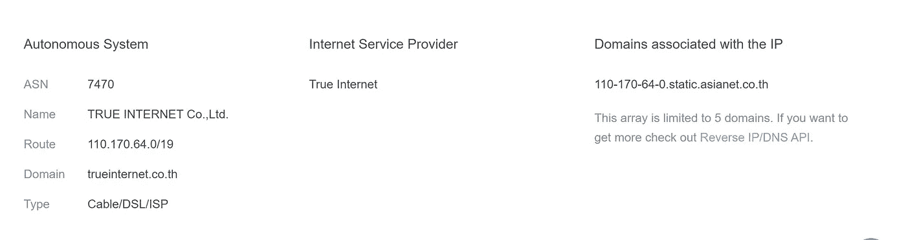

同时，GeoName ID 标记等其他新功能会为任何给定的 IP 地址分配一个位置标识符。这些标签基于地名数据库，这是一个储存所有国家地理数据的资料库。该数据库还有 1100 多万个地名。执行查找时，API 会自动查询 GeoNames 数据库，以获取 IP 的唯一地理标识符。

该 API 还有一个内置的关联域参数，允许用户查看连接到特定 IP 地址的所有域。它通过识别它检测到的所有已知网站并在列表中提供这些网站来做到这一点。该列表在识别由特定个人或组织运营的其他域时特别方便。

关于其记录，Whois XML API 将所有这些记录保存在一个定期更新的数据库中。该服务可提供 800 多万个 IP 地址块和位置。此外，该网站还提供了批量查找和下载功能，这非常有用，例如，当需要立即同时审查大量可疑地址，而不是手动逐个审查时。

对详细的 IP 地理定位数据感兴趣的用户可以免费注册。注册可以让他们检查多达 1000 个 IP 地址。该 API 提供了美国、法国、德国、英国和意大利的大部分 IP 地址信息。如果用户访问 FAQ 页面，还可以查看其他国家的统计数据。

**兼容性**

使用编程语言 Java、PHP、C#、NodeJS、Javascript、Perl、Ruby 和 Python，可以将 API 与其他网络安全应用程序和进程相融合。网站上的“集成”页面突出了各种开发人员库，并提供了到 Github 的链接以了解更多详细信息。

从那里，用户可以选择特定的客户端库，以了解如何使用他们想要的编程语言来执行 IP 地理位置查找。该页面还有一个代码示例列表，让用户了解 API 是如何工作的。在这个页面上找到的 simple-GeoIP 包的链接也可以方便地下载。但是，他们必须先创建一个 IP 地理位置 API 查找帐户，然后才能获得软件包。

所有 WHOIS XML API 的数据集都遵循相同的标准，从而简化了规则的创建。这有助于放大数据库中的地理 IP 查找，从而简化身份验证。值得注意的是，数据库可以以 CSV 或 JSON 格式下载。这是目前最常用的两种格式，这很方便。

**可靠性**

点击 API Status(【https://main.whoisxmlapi.com/api-status】T4)可在网站的“资源”选项卡下直接查看 IP 地理定位产品的可用性。在这一部分，用户可以检查软件的实时状态及其响应时间。其状态旁边的一个小问号图标可以悬停，以显示问题的简要说明(如果有的话)。此外，还可以通过在页面底部留言来联系支持团队。

**文档**

该站点提供了一个文档部分，解释了产品的输入参数，并提供了 JSON 和 XML 形式的示例输出。还可以在那里找到进行请求所需的 API 键和帐户余额信息。

还有一份冗长的用户指南，介绍如何操作产品的批量处理功能。这里讨论的主题包括 API 使用规则、如何发出和创建请求、可能的错误列表等等。用户还可以研究该部分中的输出参数，该部分列出了所有属性及其各自的定义。

此外,“集成”页面包含演练链接，指导用户如何在支持的编程语言上执行 geo IP 搜索。这些演练得到了很好的解释，并以各种示例为特色，使它们更容易理解。因此，即使是不熟悉 API 集成的编码人员也可以轻松完成这个过程。

# 供应商 2:geo.ipify.org

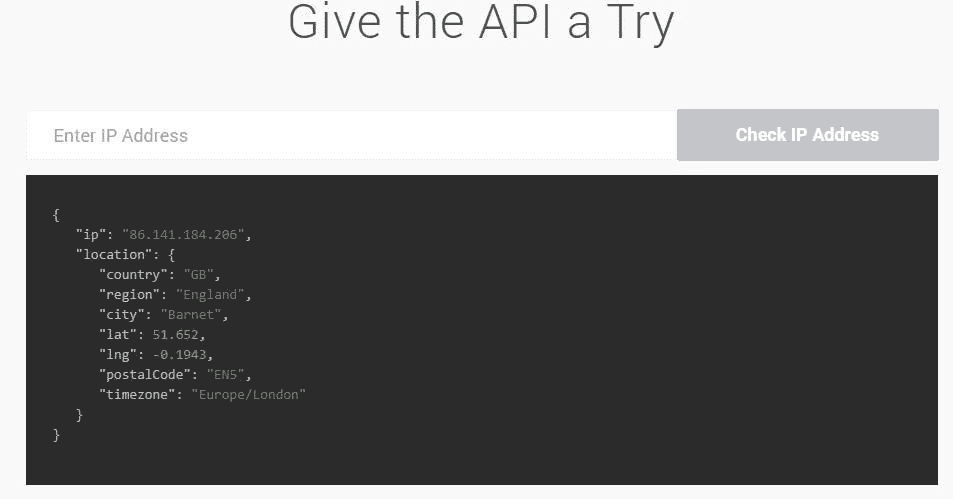

**覆盖率**

该地理定位产品提供了 99.5%的地址空间覆盖率，其数据库中有超过 1500 万个 IP 地址块和位置。该公司拥有最多独特位置的国家是美国、法国、英国、德国和加拿大。

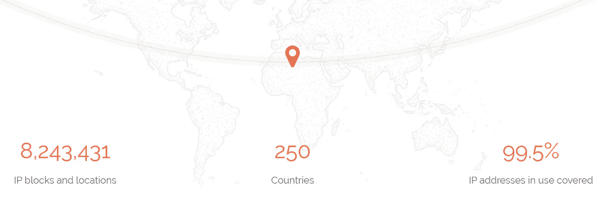

地理。Ipify 还允许访问其 IP 地理位置数据库，该数据库目前涵盖 8，243，431 个 IP 地址块和位置，包含 4，834，1212 条记录。该公司努力提高覆盖率和输出的准确性，这就是为什么他们声称每个月都有数十万条记录更新并添加到数据库中。

不知道目标的电子邮件地址或域但有 IP 地址的用户仍然可以使用该工具获取地理信息。他们必须输入目标的 IP 地址才能接收大量的信息。这些信息包括国家、州、坐标、时区、城市和邮政编码。

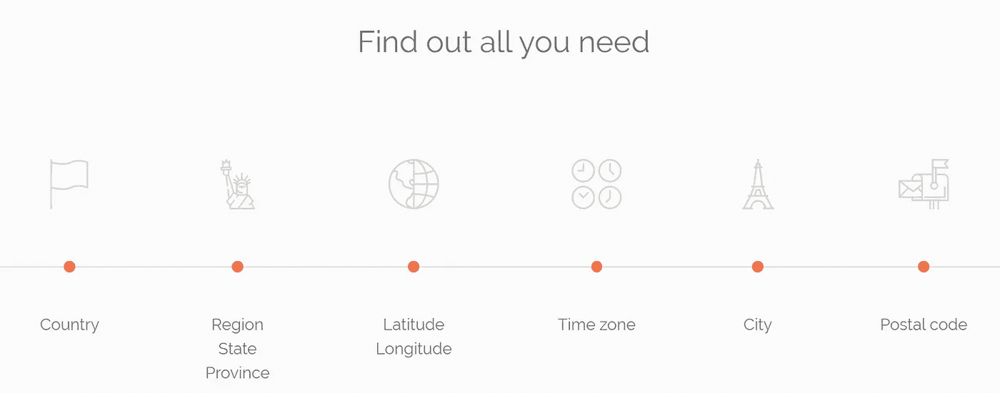

此外，对于那些希望检查数据是否足够详细以满足其需求的客户，Geo。Ipify 提供免费订阅计划。注册后，用户每月可以获得多达 1000 次的查询，而无需承担任何经济责任。

**兼容性**

API 支持各种编程语言，包括 PHP、C#、NodeJS、Java、PowerShell、Perl、Python 和 Ruby。尽管如此，数据集都是标准化的。这意味着程序员在响应中编码时，将不必处理诸如拼写错误之类的问题。用户可以在他们的“代码样本”标签下检查代码样本(【https://geo.ipify.org/code-samples】T4)。

可以通过 CSV 和 JSON 格式访问 IP 地理位置数据库。此外，该公司还提供了一个数据库转储，其中包含约 5 百万个 IP 范围记录，大小约为 50 兆字节。

感兴趣的人可以下载样本数据库，看看该公司提供什么。然而，有效的凭证是必需的。这些数据库位于 My Subscriptions 页面上，并以 JSON 格式提供。用户可以选择获取 IPv4 或 IPv6 结果，或者两者都获取。请记住，解压缩后的下载文件可能超过 1GB。

想要开始使用的人可以访问供应商的定价页面，查看各种 IP 地理定位服务的价格。选择包括一次性购买或每月或每年订阅。还有几种支付方式可供选择——信用卡、PayPal、比特币、支票或电汇。不过用户需要先联系公司请示。

**可靠性**

说到客户支持，Geo。Ipify 为所有客户提供 24 小时客户服务。如果遇到问题，用户可以在需要时联系团队以获得问题的答案。他们可以通过给 support@ipify.org 发电子邮件来做到这一点，回复时间不超过一天。也可以向下滚动到网站每个页面的末尾，找到一个消息框，你可以在那里留下你的疑问或问题。至于正常运行时间，可以通过直接在网站上查找来测试产品是否可以运行。

**文档**

地理。Ipify.org 为文档提供了一个单独的页面([https://geo.ipify.org/docs](https://geo.ipify.org/docs))。用户可以在那里找到输入参数、输出格式的示例和产品密钥。该公司还有一个网页，专门回答客户最常问的问题([https://geo.ipify.org/faq](https://geo.ipify.org/faq))。

更重要的是，特性代码示例可以用各种编程语言访问，并且是不言自明的。用户只需点击自己感兴趣的语言，就能了解 API 的运行方式。

考虑用例。IPify 提到，他们的产品可以支持数字营销工作，因为它根据客户所在的国家、地区或城市来定位客户。他们还声称，它可以用来实时定制用户的网站，阻止未经授权的访问，并打击网络攻击。

# 提供商 3: IPInfo.io

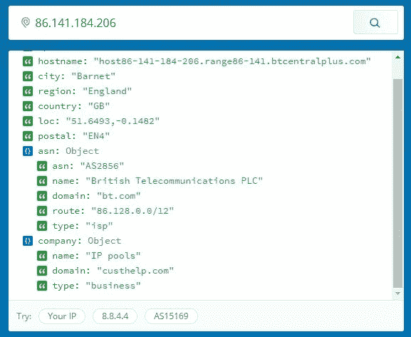

**覆盖范围**

IPInfo 提供 IP 地址的地理位置详细信息，如其位置、ISP、公司、域和运营商。他们拥有大约 2.2 亿个域名的信息，包括每个域名所连接的公司。他们声称，他们的定制数据集是通过他们的软件处理的大量数据建立的。

**兼容性**

IPInfo.io 维护了几个流行编程语言的库，包括 PHP、Python、Perl、Java 和 Ruby。他们也有诸如 Django、Laravel 和 Rails 等 web 框架的库。API 特性的设置和集成非常简单。

**可靠性**

他们的 API 构建在 Google Cloud 上，其基础设施会根据客户需求自动扩展。该公司的销售和支持团队可以直接在网站上联系。此外，他们的所有数据都通过 256 位 SSL 加密或 HTTPS 进行保护。

**文档**

IPInfo 为他们的 API 提供了大量的文档。它概述了产品的主要参数以及输出示例和功能指南。开发人员可以直接跳到官方库部分，如果他们想马上开始的话。

# 供应商 4:DB-IP.com

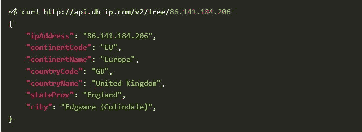

**覆盖范围**

DB-IP 声称拥有跨越几个大洲的服务器基础设施。它们利用任播路由，将所有用户请求转发到离它们最近的服务器。几乎一半的记录是在美国发现的，其次是印度、意大利、英国和德国。

他们从多个来源获取数据，包括与各种 ISP 的协议。这使他们能够访问全球 20 万个城市中超过 150 万个独特的位置。他们说，他们的数据库中总共有至少 2100 万个 IPv4 和 IPv6 块。

**兼容性**

据说他们的 API 可以兼容像 Geonames 这样的第三方服务。该软件采用 RESTful 语义，这是当今主流开发平台正式支持的。

同时，DB-IP 的数据库定期更新，可以以 CSV 或 MMDB 格式下载。

**可靠性**

DB-IP 有一个 API 状态页面，用于监控其软件、内容交付网络和数据库的运行。这可以用来检查他们的服务是否工作，以避免混淆。此外，他们声称他们的电子邮件支持可用于所有订阅，以回答任何问题或关注。

**文档**

网站上还提供了 API 特性的教程。在这里，用户可以学习如何导入和更新数据库、按国家过滤访问者、显示访问者位置等等。FAQ 页面回答了涉及一般问题、数据集下载和 API 的问题。

# 供应商 5:IP2Location.com

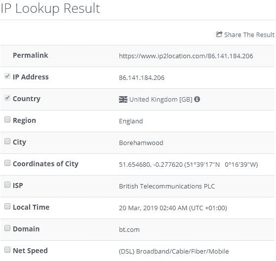

**覆盖范围**

IP2Location 表示，它提供了一种 IP 搜索技术，在收集地理位置数据时不会侵犯隐私。他们的 REST API(representative State Transfer)提供了关于 IP 查找的细节，包括地区、城市、纬度、经度、邮政编码、时区和 ISP。他们还声称，输出是从他们自己的数据库中获得的，该数据库有超过 40 亿条唯一记录，支持 IPv4 和 IPv6 地址。

**兼容性**

关于 IP 地理位置数据的检索，提供商提到其 API 可以与现有软件平台集成。它的查找利用了支持 Java、PHP、.NET、Python、Ruby 和 Perl。

**可靠性**

在向客户提供支持方面，网站上提到的并不多。但是,“联系”页面包含公司为有疑问的用户提供的支持电子邮件。

**文档**

关于他们产品的大量文档可以在 FAQ 部分找到。这里回答了关于其一般、技术和数据库特性的最常见问题。除此之外，他们还准备了教程和开发库，概述了入门技巧。

# 供应商 6:IPData.co

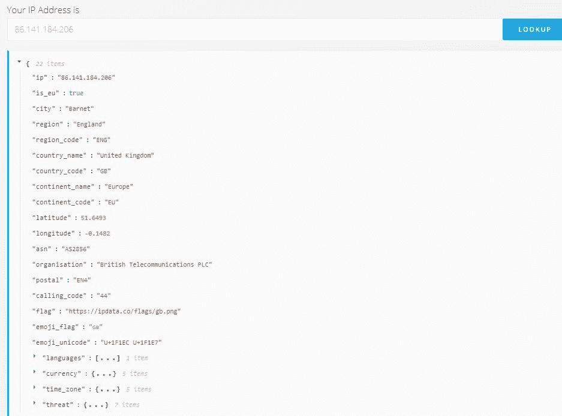

**覆盖范围**

IPData 提供了一个 API，让人们可以获得地理位置的详细信息，包括洲、国家、地区、城市、坐标、组织/ISP 以及 IPv4 和 IPv6 地址的时区。它还能够识别实体的运营商和移动国家代码。

**兼容性**

该品牌目前支持 Python、PHP、Javascript、Node、Ruby、Go、Java、Swift 和 C#库，因此种类繁多。

**可靠性**

IPData 表示，他们的基础设施通过亚马逊运行，并使用 AWS Route53 路由来确保请求的延迟保持较低。该网站上有一个链接，将用户重定向到一个页面，该页面显示他们的 API 的整体状态，以及正常运行时间、响应时间和停机时间等详细信息。

**文档**

网站上提供了该产品的完整文档。此处包含入门提示、载体检测功能、威胁数据和开发人员库。他们也有各种功能的指南，包括如何根据用户所在的国家阻止、重定向和显示广告。

# 提供者 7: IPGeolocation.io

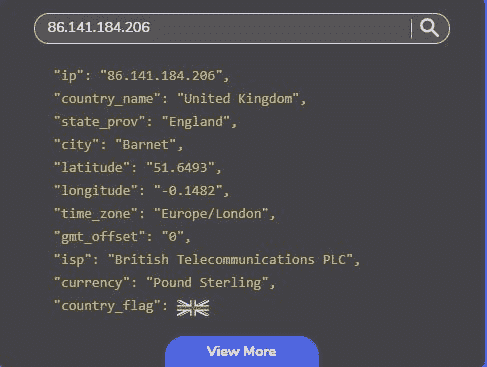

**覆盖范围**

据说，该 API 对国家级搜索的准确率为 99%，而对城市级搜索的准确率预计为 70%。IPGeolocation 公开提到，与有线网络相比，他们在移动网络上的 geoIP 查找没有达到标准。

**兼容性**

他们的 IPGeolocation API 的端点都以 JSON(默认)和 XML 格式响应。关于他们的数据库，他们说开源项目被用作他们的主要数据源，还声称他们使用其他数据库作为参考点来验证他们方法的准确性。然而，现在无法访问该公司的数据库，但该公司正计划在未来向公众提供该数据库。

**可靠性**

他们的 API 的状态报告链接可以在网站上找到。该页面详细描述了正常运行时间、apdex、响应时间，包括延迟和查找的总时间。除此之外，IPGeolocation 声明他们是 GDPR 兼容的，不通过他们的服务器收集任何信息。

**文档**

至于文档，它们为用户提供了产品如何工作的指南。还可以找到关于如何使用他们的软件开发工具包(SDK)和他们提供的其他 API 的详细信息。

# 供应商 8:Ipapi.com

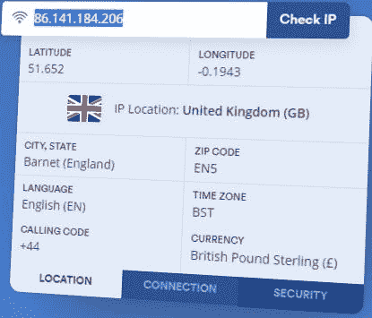

**覆盖率**

Ipapi API 是由总部位于英国伦敦的软件公司 Apilayer 制作和维护的产品。他们的 API 返回来自各种提供商的 IP 地址数据，包括商业、非商业和私有实体。他们声称，这些来源中的每一个都被定期验证和监控，以确保质量和一致性。除此之外，Apilayer 还表示，他们的 API 可以返回全球超过 200 万个独特位置的准确信息。

**兼容性**

他们基于 REST 的 API 允许他们的查询请求使用 JSON 或 XML 返回的结果。该公司还声称，其服务使用高度可扩展的云基础设施，每月能够处理数千个或更多的 IP 地址查询。

**可靠性**

当谈到正常运行时间时，API 的状态据说是全天候密切监控的。该公司提到，根据过去 12 个月的计算，他们的平均正常运行率为 99.9%。他们的网站上还有一个公开的状态页面，详细介绍了软件的总体正常运行时间、最近的停机时间和一些快速统计数据。

**文档**

API 的文档页面为用户提供了关于其基本和高级特性以及其他选项的信息。这里有对单个响应对象的描述，使用户更容易理解每个对象的工作方式。

# 供应商 9:IPStack.com

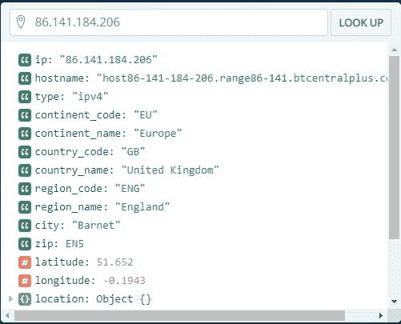

**覆盖范围**

IPStack API 覆盖全球约 200，000 个城市的 200 多万个独特位置。该公司声称已经与大型互联网服务提供商合作多年，确保他们能够提供准确一致的信息。他们还表示，API 每天能够处理 20 到 30 亿个 API 请求，平均响应时间为 25 毫秒。

**兼容性**

IPStack 表示，他们的产品可以通过各种解决方案进行扩展，为用户提供 JSON 或 XML 格式的结果。除此之外，它还支持各种编程语言，如 PHP (cURL)和 JavaScript 用于查找。

**可靠性**

用户可以直接从他们的网站上查看 API 的当前状态。在这里，可以验证过去几天产品的总正常运行时间、最新停机时间和其他统计数据。IPStack 背后的公司也有一个技术支持团队来帮助有需要的用户。

**文档**

在他们的网站上可以找到 API 的大量文档，以及产品基本特性、端点和其他功能的入门指南。在这里，用户还可以找到 IPStack 支持的编程语言的示例代码。

# 提供商 10: ClearIP.io

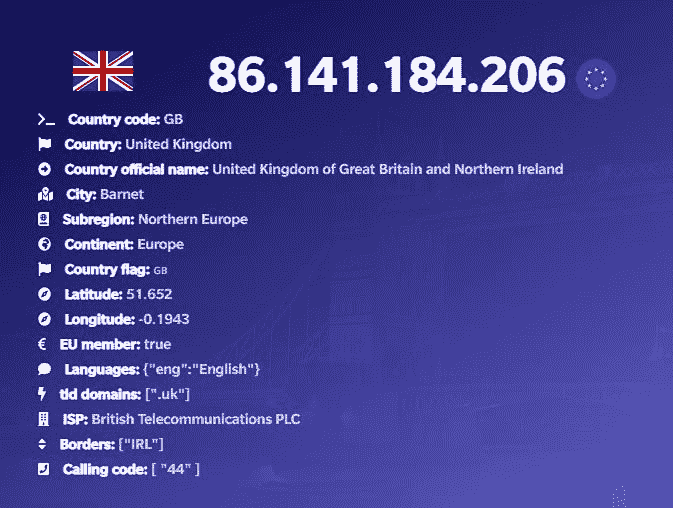

**覆盖率**

ClearIP.io 是另一个提供 IPv4 和 IPv6 地理位置数据的 API。虽然没有关于该产品目前覆盖的独特位置数量的信息，但 ClearIP 声称从许多来源获得了他们的信息。他们还说他们的数据库每天都在更新。

**兼容性**

该 API 使用由 Amazon AWS 支持的基础设施运行，允许产品根据网络需求自动扩展。ClearIP 背后的团队也为流行的编程语言构建了自己的库，比如 PHP、Golang、NodeJS 等等。此外，该公司提到在 JSON 中向用户提供结果。

**可靠性**

网站上没有状态页面，也没有联系我们部分。但是，如果出现问题，可以直接从弹出的聊天窗口向公司发送消息。

**文档**

ClearIP API 有一个文档页面，为希望正确设置应用程序或网站的客户提供了一个演练。本节概述了用户如何提出请求，以及与编程语言集成的基本示例。

# 提供商 11: IPWhois.io

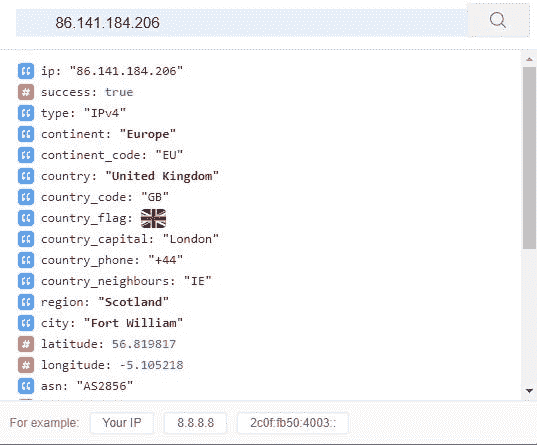

**覆盖范围**

IPWhois.io 声称开发并维护一个实时地理定位数据的数据库。该公司保证用户发出的每个 API 请求都将获得最准确的基于位置的信息。此外，IPWhois 表示，他们将该存储库与多个渠道整合在一起，其中包括 RIPE、APNIC、ARIN 和 AFRINIC 等。

说到响应时间，在世界上大多数地方，人们可以预期大约 90 毫秒。据说 IPWhois 使用分布在各大洲的几个强大的服务器来实现这一评级。

**兼容性**

该公司表示，其产品易于与现有的应用程序和系统集成。可以接收标准 JSON 和 XML 格式以及换行格式的结果。

**可靠性**

发送到 IPWhois.io API 的所有数据都受到 256 位 SSL 加密(也称为 HTTPS)的保护。除此之外，该公司打算将其服务器分散在世界各地，这样它可以为用户提供速度和安全性，同时避免单点故障。

**文档**

IPWHois.io 有自己单独的页面，简要概述了他们的 API 是如何工作的。此处列出了各种字段和值的描述，以帮助用户入门。虽然在他们的客户服务上没有提到太多，但有一个 FAQ 部分可以回答大多数问题。

# 总结想法

随着网络犯罪的增加，组织不得不利用一切可以利用的手段来避免成为黑客、诈骗和欺诈的受害者。为了支持这一点，地理定位能够提供关于 IP 地址的地理信息，并可以证明是各种网络安全专家更好地研究威胁来源的有用工具，从而打击恶意行为者。

查找可以揭示位置、时区、ASN、组织等细节。也就是说，我认为本文中列出的产品是当今网络安全可用的最佳 IP 地理定位 API。

考虑到前面提到的各种标准，我个人愿意为[geoipify.whoisxmlapi.com](https://geoipify.whoisxmlapi.com)(我创立的)和[geo.ipify.org](https://geo.ipify.org/)担保。但是，您的需求将决定这些 API 中哪一个最适合您的需求。

【whoisxmlapi.com】声明:作者是 [*的创始人*](https://www.whoisxmlapi.com) *。如果你有任何反馈或问题，你可以访问他的网站或联系 support@whoisxmlapi.com。*