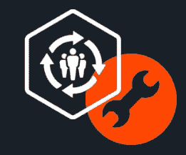
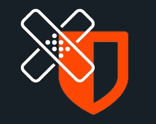
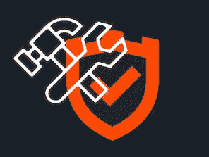

# 信息安全和信息技术有什么区别？

> 原文：<https://medium.com/hackernoon/what-is-the-difference-between-information-security-and-information-technology-b926c3b5d597>

## 信息安全和/或网络安全与信息技术不是一回事。

Photo by [Petter Lagson](https://unsplash.com/@lagopett?utm_source=medium&utm_medium=referral) on [Unsplash](https://unsplash.com?utm_source=medium&utm_medium=referral)

信息安全和信息技术之间有着紧密的联系。两者听起来可能相似，但实际上它们是独立的功能。

*   ***信息安全*** 处理与安全相关的问题，它确保技术安全，防止可能的违规和攻击。
*   ***信息技术*** 致力于部署有助于企业运营和发展的技术。

> 信息安全和信息技术是一个硬币的两个不同面。他们共同努力，在当今的任何企业中创造高效、安全的环境。

# 信息安全的目标

信息安全的主要客观原则是—

1.  保密。
2.  认证。
3.  正直。
4.  可用性。
5.  不可否认。

## **保密性**

它几乎等同于 ***隐私，*** 保密的主要目的是为敏感数据提供安全保护，防止未经授权的人接触到。

## **认证**

对于一个组织来说，这是信息安全最重要的方面之一。它有助于组织只允许授权人员访问组织机密数据。

## **完整性**

它涉及到在数据的整个生命周期中维护数据的一致性、准确性和可信性。它还确保数据不会被未经授权的人更改。

## **供货情况**

确保这一点的最佳方法是严格维护所有硬件，在需要时立即进行硬件维修，并维护一个没有软件冲突的正常运行的操作系统环境。

## **不可否认性**

It 是保证某人不能否认某事的有效性。它是**信息安全**中广泛使用的一个法律概念，指的是一种服务，提供数据来源的证明和数据的完整性。

# 信息技术的目标

信息技术的主要客观原则是—

1.  关注关系。
2.  角色的定义。
3.  成功可视化。
4.  你出主意，他们决定。
5.  面向结果。

## **关注人际关系**

在 IT 界，一个重要的方面是与客户保持良好的关系。当客户和利益相关者之间有明确的讨论时，这是可能的。

## **角色定义**

IT 顾问应该确保他们的客户意识到他们在项目中的积极作用，并且每个人都明白谁对每个阶段的决策负责。顾问还需要清楚地说明他或她的角色的界限，以及咨询他们的界限。

## **成功可视化**

第三步也是规划阶段的一部分，需要帮助客户想象最终产品或解决方案的样子。这是介绍结果和最终配置的地方。应明确定义潜在的好处，以及新流程的工作方式和新设备的安装方式。

## **你出主意，他们决定**

第四个原则显然与角色的定义有关。IT 顾问必须始终考虑到，当涉及到某些决策时，客户是最了解的。咨询团队的角色是提供建议、提议和技术指导。但最终，团队也必须能够靠边站，为客户提供他们所要求的东西。这是“你建议，他们决定”的精髓，也是我们 IT 咨询公司采取的基本方法。

## **以结果为导向**

最后一个原则是“以结果为导向”，这实质上意味着所有的行动都必须有助于最终目标的实现。

# 信息系统和信息技术的主要区别

信息安全和信息技术之间的主要区别是—

Priority

## **信息系统和信息技术的首要任务**

1.  信息技术确保硬件、软件和其他网络组件保持正常运行。
2.  信息安全涉及保护数据和资产。

Responsibility.

1.  信息技术负责硬件、软件和新技术。
2.  信息安全部门负责系统流程和最终用户带来的风险。

Implementation

1.  信息技术实现对硬件、软件的控制。
2.  信息安全部门确定要实施哪些控制措施，并测试控制措施以确保它们正常工作。

Threat Safe.

1.  信息技术不断更新和修补硬件、软件和应用程序。
2.  信息安全部门随时了解每天出现的新威胁和网络攻击。

Risk Mitigation.

1.  信息技术通常以正常运行时间和响应时间来衡量。
2.  信息安全部门建议并优先考虑降低风险的行动计划和解决方案。

Approach

1.  信息技术遵循“先解决”的方法。
2.  信息安全遵循“安全第一”的方法。

*我希望这篇文章能帮助你建立一个清晰的概念* ***信息安全和信息技术之间的区别。我认为我们详细地讨论了硬币两面的所有东西——请在评论中告诉我你的想法。***