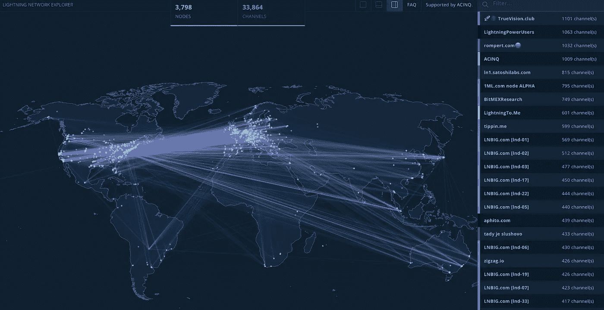
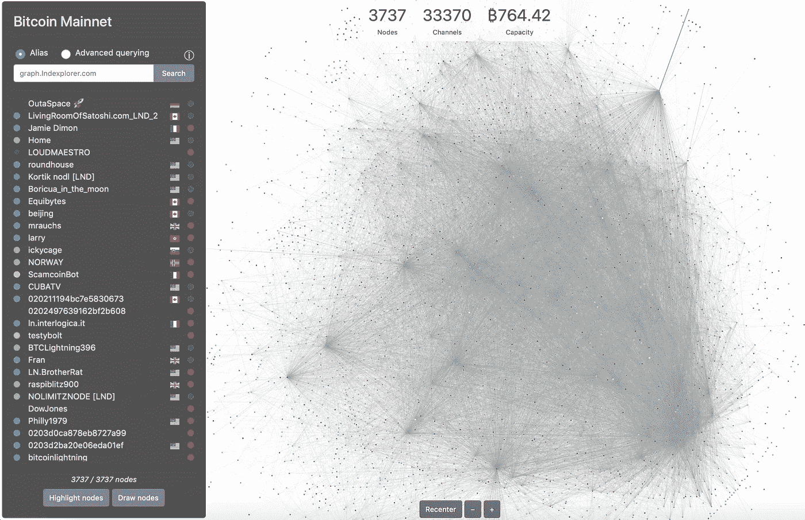
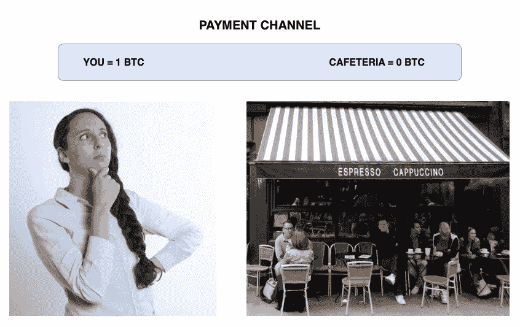

# 闪电网是什么？

> 原文：<https://medium.com/hackernoon/what-is-the-lightning-network-496c4e636350>

Bitcoin’s Lightning Network visualized according to the geolocation of nodes by [https://explorer.acinq.co](https://explorer.acinq.co).

比特币的区块链存在可扩展性问题。

Visa 平均每秒处理 2000 笔交易，而比特币每秒只能处理 7 笔交易，块容量为 1 MB。

比特币的闪电网络是解决这一可扩展性问题的一种努力。

**比特币区块链上面的一层**

闪电网络背后的想法是，较小的日常交易不需要存储在主比特币区块链上。

闪电网络是建立在主区块链之上的第二层。它使用“链外支付通道”实现了更快的微交易。使用这种链外方法，被认为不太重要或不重要的交易在主链之外进行。

使用闪电网络的链外交易只涉及主比特币区块链上的两个条目——一个是在双方之间打开一个私人“支付通道”，另一个是关闭它。支付通道是两个用户之间的私人通道，允许他们离线交易。由于双方签署的最新资产负债表用于通过主链交易关闭私人渠道，支付的完整性得以保持。

Bitcoin’s Lightning Network visualized by [https://graph.lndexplorer.com](https://graph.lndexplorer.com).

**闪电网络示例—两方**

为了更好地理解闪电网络，让我们假设你每天在上班的时候从同一个自助餐厅购买午餐。

你和自助餐厅(相互信任的双方)之间的这些日常交易不需要记录在主比特币区块链上。相反，你和自助餐厅将一定数量的比特币存入一个‘多签名账户’(又名‘多签名账户’)。

*你— 1 BTC*

*自助餐厅— 0 BTC*

这笔交易被记录在主比特币区块链上。然而，现在你有一个私人的非连锁渠道与自助餐厅交易。只有在双方同意的情况下，才能使用 Multi-Sig 帐户中的资金进行交易。

第二天，你为 **0.01 BTC** 订午餐

你和自助餐厅都用你的私人钥匙签署这项交易。该交易记录在私人渠道上，多签名账户现在显示以下余额:

*你——0.99 BTC*

*BTC 0.01 号自助餐厅*

无论是你还是食堂，都可以随时关闭链外支付通道。你要做的就是出示双方签字的最新资产负债表，并广播到主比特币网络。私人渠道通过一项交易关闭，该交易将资金分配到主比特币区块链上各自的账户。

**多方网络效应**

除了允许两个信任方之间的链外交易，闪电网络还实现了网络效应。使用前面的例子，让我们说你有两个单独的私有外链通道打开:一个在你和自助餐厅之间，另一个在你和亲密的同事之间。

有一天，同事陪你去自助餐厅吃午饭。她也想从自助餐厅买午餐。她可以通过使用您的 Multi-Sig 帐户作为她和自助餐厅之间的中间人，将资金转移到自助餐厅，而不是打开她自己的链外私人通道(所有适当的资产负债表都会在此过程中更新)。

Thanks to network effects, everyone in this network can purchase items from the Cafe as long as they have a positive BTC balance in their accounts.

如果在她和自助餐厅之间有多个具有多 Sig 账户的人，则支付试图使用中介最少和费用最少的路径(只要中介在其个人账户中有足够的钱)从你的同事(起源)到自助餐厅(接收者)。因此，交易可以通过连接的支付渠道进行。

**结论**

可伸缩性一直是领先的公共区块链面临的主要问题。面对来自 EOS、Qtum、以太坊和其他公司的竞争，闪电网络是比特币通过在链外进行大量交易来解决可扩展性问题的努力，从而减轻主比特币区块链的负载。闪电网络是一项急需的计划，旨在解决最古老、最成熟和最知名的公共区块链的可扩展性问题。

—

[沙安雷](http://www.shaanray.com)

请关注 [Lansaar Research](https://medium.com/lansaar) 关于媒体的报道，了解最新的新兴技术和新的商业模式。