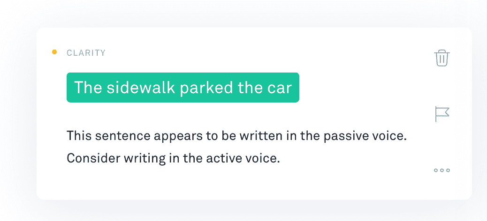

# 语法检查工具有什么问题:三个主要问题以及如何解决它们

> 原文：<https://medium.com/hackernoon/what-is-wrong-with-grammar-checking-tools-three-main-problems-and-how-to-fix-them-50835ca654d9>

英语语法可能很复杂，即使是最聪明的本土人也会犯错。这就是为什么使用语法检查软件看起来是一个好的[主意](https://hackernoon.com/tagged/idea)。这一想法得到了该领域领先服务机构的大力宣传的支持。

但是现实生活有点复杂，用户经常会面临一些意想不到的问题。今天我们将讨论这些问题，以及如何确定一个能够提供更好的体验和结果的语法检查工具。

# **机器人想智胜人类**

编写纠错工具的最大问题之一是它们假装比用户更聪明。然而，目前的技术发展水平不允许这样做。

例如，以市场上领先的语法检查工具 [Grammarly](https://grammarly.com/) 为例。它的算法讨厌被动语态，并试图在 100%的情况下尽可能地消除它。相对于主动语态，该系统认为被动语态是一种不好的写作结构。

这是它在实践中的样子。假设你有一句话:“车是大卫停的。”语法检查器会突出显示错误——这是肯定的。有被动语态！一个复杂的算法将得出一个重写的句子:“大卫停好车。”到目前为止听起来不错，但是如果你的句子是“车停在了人行道边”呢？这里我们的意思是汽车实际上停在某个物体附近(在我们的例子中是人行道)。价值 29.95 美元/月的人工智能算法能提供什么？

给你:

这就是当计算机试图智胜人类时发生的事情。在线助手应该不那么咄咄逼人，不要试图对生成的推荐过于严格，无论它们与什么有关，从被动语态到从 And 或 But 开始的句子。

例如，几年前，一个内置的 MS 单词语法检查器在语法上很像，但现在它以一种更柔和的方式工作，不会烧毁被动语态。

# **开发者忽视隐私**

最近，脸书工程师 Sebastian McKenzie 提出了一个有趣的话题:语法检查器允许的隐私程度。他在语法上称之为键盘记录器，因为它疯狂地想要记录用户在网上输入的任何信息(不包括像密码表格这样的受限字段)。

此外，开发者在他们的隐私政策中列出了查看用户内容的权利。他们可能出于多种原因需要这样做，从算法培训到违反服务使用条款。

有趣的是，一名脸书员工提出了隐私问题，但他提到了真实的事实。你不能像一个键盘记录器那样调用语法检查器，因为用户自己授予权限并安装浏览器扩展，但问题是为什么这个工具不能控制用户的隐私？

如果你做一些研究，你会发现其他工具有一些隐私相关的功能。比如短信。AI 允许在不注册的情况下以匿名模式使用其 [Chrome](https://chrome.google.com/webstore/detail/textlyai/ndgklmlnheedegipcohgcbjhhgddendc/) 和 [Firefox](https://addons.mozilla.org/en-US/firefox/addon/textly/) 扩展，并在其[网络应用](https://app.textly.ai/)中提供了 pastebin 模式，类似于消息应用中的秘密聊天。对于用户来说，这是一个更好的方法。但是，你仍然需要自己寻找这样的工具。

# 软件对内容创作没有帮助

许多语法检查器的另一个严重问题是这些工具检查已经写好的内容。但是很多人甚至没有达到那种程度:在谷歌上问作家的瓶颈，你会得到大约 2900 万个搜索结果。这是一个现代工具无法解决的现实问题。

现在在这方面做得很少。解决方法之一:发短信。AI 发布了它的内容模板库,因此用户可以在它的基础上构建自己的内容:

另一个例子: [Ginger](https://www.gingersoftware.com/) 允许句子重组器能够从简单的句子中创建更复杂的句子。仍然不能解决作家瓶颈的核心问题。

# **最终想法**

现代语法检查工具和写作增强工具会很有用。然而，这类软件有其局限性和问题。因此，要选择有助于您解决任务的工具，需要回答几个问题:

*   开发者是否致力于隐私保护，这是他们的目标之一吗？
*   这项服务是否有助于内容创作，或者修复你已经写好的内容？
*   算法是否足够软，不会强迫你使用不相关的推荐？

就这样，感谢阅读并在下面的主题上发表你的想法！