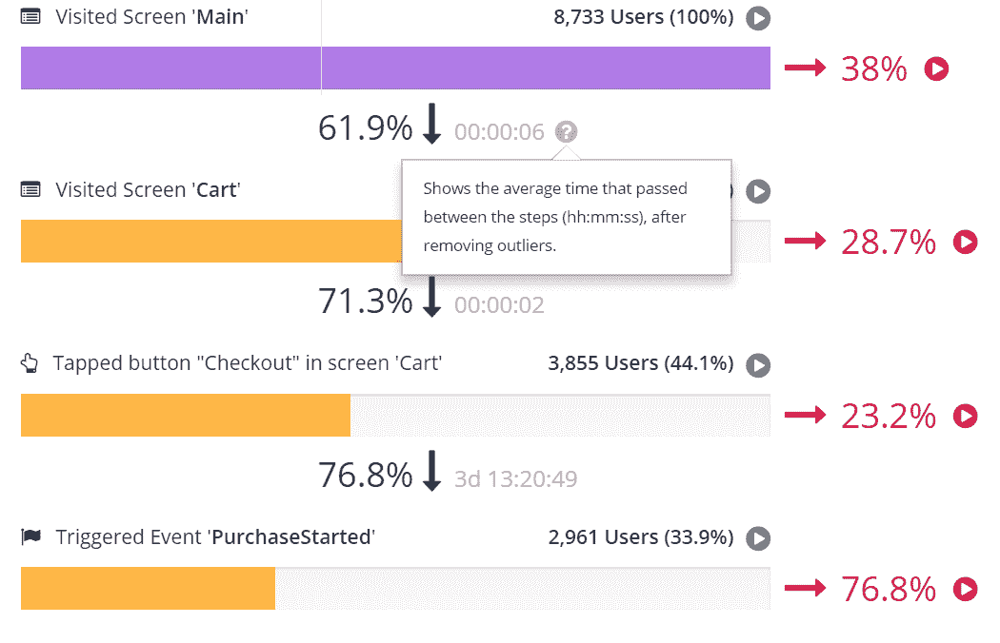
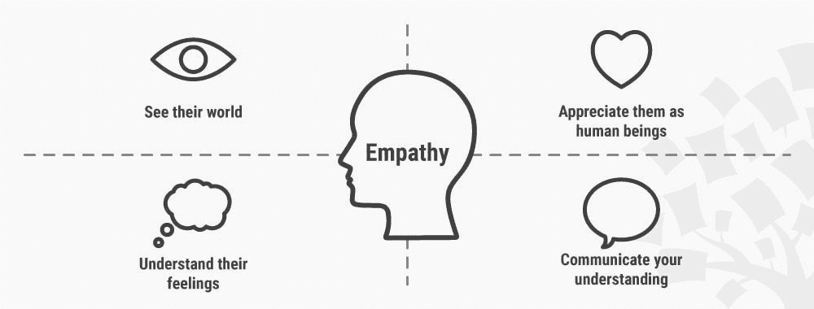
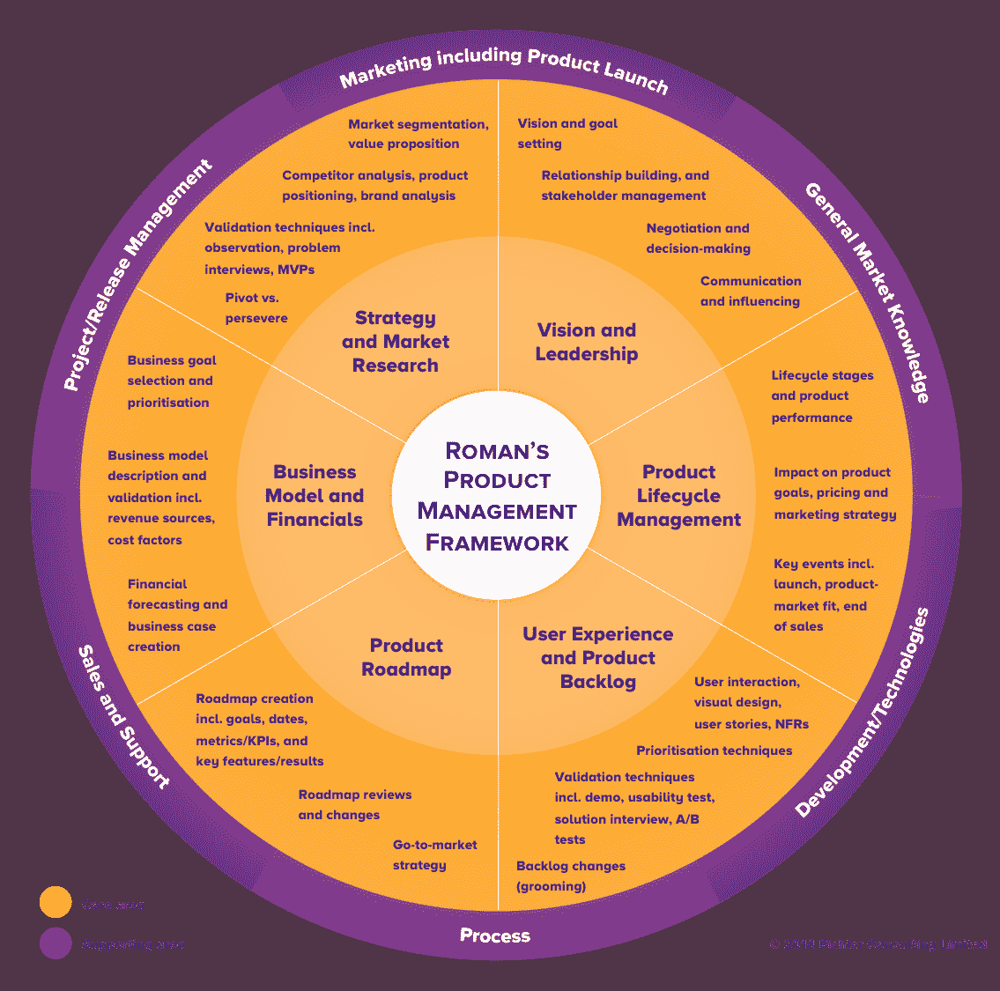
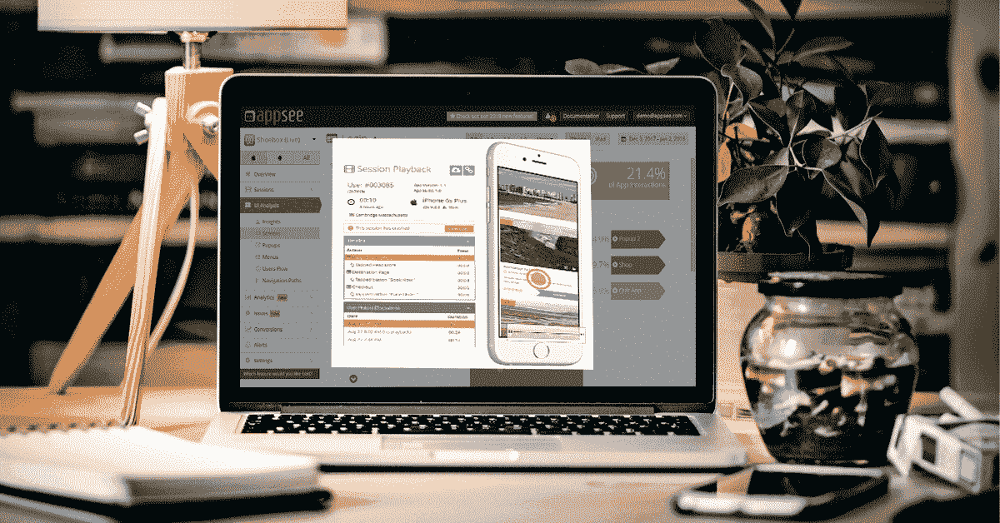
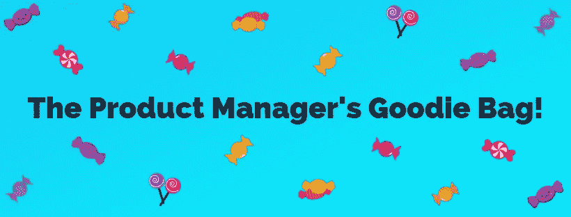

# 怎样才能成为一名优秀的产品经理？5 个专业技巧

> 原文：<https://medium.com/hackernoon/what-makes-a-good-product-manager-5-pro-tips-d72db556db7d>

怎样才能成为一名优秀的产品经理？关于产品管理已经说了很多，写了很多，过多的书籍、文章和推文可能会让人不知所措。在移动应用程序世界里，事情变得更加复杂，一切都可能在一瞬间发生变化，没有一个工作周甚至周一早上会看起来像最后一天。

别担心，我们会支持你的。我们查看了文章、观点、研究以及对行业领先产品经理的采访。我们收录了行业领先产品经理的激励性言论，如 Julie Zhuo、Marty Cagan、Roman Pichler 和 Ken Norton。Splitwise 等顶级移动应用的项目经理也给了我们他们的至理名言。以下是为新的和有经验的产品经理收集和整理的关于成为优秀产品经理的一些经验。不要离开我们，因为在这篇文章的结尾有一个礼包给你！)

# 明智地选择你的 KPI。

定期跟踪你的移动应用的 KPI(关键绩效指标)可以给你数据，但也会让你头疼。您收集的数据需要为您提供价值:行动项目、错误修复、功能改进或设计解决方案。你如何把有价值的 KPI 和没有给你带来价值的 KPI 区分开来？[安迪·卡维尔提出了最小可行分析的概念](https://mobilegrowthstack.com/mobile-app-analytics-519f5719e283):你做出有效决策所需的数据。这意味着您应该避免跟踪太少的指标，太多的指标，过时的指标，或者仅仅是不正确的指标。他还对“分析麻痹”提出了警告，当你有这么多数据时，你不知道该怎么处理。

> “团队最好考虑一下什么是最低可行的分析:他们做出有效决策所需的数据。”—安迪·卡沃尔

这可能需要一点小小的调整，但是您会希望优化您正在跟踪的指标来回答您最迫切的问题，而不是被冗余或误导性的数据所困扰。您如何知道要跟踪哪些指标？罗曼·皮克勒提供了一份关于如何选择正确产品 KPI 的 [10 条建议清单，从陈述你的商业目标开始，这样你就可以看到你的产品如何影响收入。另一个建议是**避免虚荣指标**——看起来不错但没有价值的 KPI。一个完美的例子是“应用程序下载数量”:许多用户可能会下载你的应用程序，但如果他们都有糟糕的用户体验或未能转化，这就毫无意义。](https://www.romanpichler.com/blog/10-tips-how-to-choose-the-right-product-key-performance-indicators-kpis/)

Pichler 还建议结合定量和定性指标。这意味着查看 MAU 毛等数字指标来回答“什么”和“多少”，以及定性 KPI，如[无反应手势](https://blog.appsee.com/unresponsive-mobile-gestures-your-mobile-apps-hidden-troublemakers/?cpnid=701b0000000Wd7c&utm_source=medium&utm_medium=link&utm_campaign=what_makes_a_good_product_manager&utm_content=unresponsive_gestures_hidden_troublemakers)和最后手势，这些指标回答“为什么”:为什么用户突然结束会话，或者为什么用户退出某些漏斗。为了分析这些指标，你需要使用像[触摸热图](https://www.appsee.com/features?cpnid=701b0000000Wd7c&utm_source=medium&utm_medium=link&utm_campaign=what_makes_a_good_product_manager&utm_content=features_touch_heatmaps#touch-heatmaps)这样的定性工具。此工具在每个屏幕上显示用户交互的集合，可以通过第一个、最后一个或无响应的手势进行过滤。

此外，**留意经常被遗忘的移动应用指标**。很多产品经理低估了某些非常有用的移动应用 KPI。例如，每个 PM 都知道跟踪转化率，但用户从漏斗的一个步骤到下一个步骤的平均时间是多少呢？这是一个可以指出 UX/用户界面问题的指标，这些问题让你的用户不知道在哪里点击，比如放错了按钮或不清楚的缩微拷贝。

An example of Appsee’s conversion funnel tool showing average time between steps.

# 了解你的用户。爱你的用户。做你的用户。

以用户为中心的设计是通向快乐用户之地的黄砖路。为了达到这一点，你需要走进你的用户，在他们了解自己之前，真正了解他们的思维过程、意图以及与你的移动产品相关的需求。是的，你可能对产品中的工作原理有一个很好的想法(Ken Norton 称之为" **spidey-sense** ")，但最终， [**你不是你的用户**](https://www.nngroup.com/articles/false-consensus/) 。

> "假设你是你的用户是一个在人类头脑中根深蒂固的谬误."拉卢卡·布迪乌

从人物角色和故事板到调查和用户测试平台，从访谈和焦点小组到[会议记录](https://www.appsee.com/features?cpnid=701b0000000Wd7c&utm_source=medium&utm_medium=link&utm_campaign=what_makes_a_good_product_manager&utm_content=features_user_recordings#user-recordings)，有很多了解用户的方法。最好的方法是什么？答案是:**全部**。使用你武库中的所有工具，不要害怕走老路:走出大楼，与他们面对面。

此外，让你自己在用户研究的想法上变得有创造性，因为有时在那里你会发现你最有价值的见解。一条鲜有人走的路是利用从客户支持中收集的见解。[split wise 的高级产品经理佐伊·查维斯](https://blog.appsee.com/professional-spotlight-zoe-chaves-splitwise/?cpnid=701b0000000Wd7c&utm_source=medium&utm_medium=link&utm_campaign=what_makes_a_good_product_manager&utm_content=zoe_chaves_professional_spotlight)，在她刚起步时，碰巧做了一些客户支持工作。她说，这帮助她发展了对应用用户群和需求的直觉，同时也给了她对规格的想法。如果你没有实际的客户支持经验，那也没关系——通过保持与公司客户成功团队的沟通渠道畅通，你可以获得许多有趣的产品创意。

在任何情况下，**如果你想创造一个用户喜欢的产品，保持一种感同身受、以用户为中心的方法**是很重要的。看看[交互设计基金会的同理心象限](https://www.interaction-design.org/literature/article/stage-1-in-the-design-thinking-process-empathise-with-your-users)，它为你的用户提供了四件需要记住的事情。

Image Source: The Interaction Design Foundation

# 学会说不。

你可能听过 [PM 酒吧笑话](https://www.goodproductmanager.com/2013/09/18/data-doesnt-tell-you-why-more-product-management-bar-jokes/):“一个产品经理走进一家酒吧。倒饮料，端盘子，打扫厕所，扑灭仓库里的火。”作为项目经理，你将负责规划产品战略和路线图，保持跨团队沟通，并确保每个人都达到他们的目标和期限，等等。您将在与营销、法律、财务、用户、分析师和首席执行官的会议之间奔波。如果有一种艺术形式是你作为产品经理必须掌握的，那就是优先化的艺术。Rev.com 公司的增长主管 Barron Caster 说，优先化的挑战之一是找出什么会有最高的投资回报率。维维诺产品管理副总裁克里斯特斯·约瑟菲迪斯简单地说:“如果你有太多的球悬在空中，就放下一个。”坦率地说，为了实现这一点，你还需要掌握[如何说不的艺术](https://productcoalition.com/product-management-is-not-about-saying-no-it-s-about-how-to-say-no-e461236c138c)。

> "如果你有太多的球悬在空中，放下一个."克里斯特斯·约瑟菲迪斯

Mountain Goat Software 的这篇博客文章提供了对利益相关者说不的六条指导方针，是的，你猜对了——第二条要求感同身受。不要只是说“不”，然后就此打住。不要说“现在不行”。为说“不”提供一个合理的理由——只有一个。对你的优先顺序保持透明，并向你的谈话对象介绍你的考虑。Typeform 的产品经理 Sebastien ph lix[提供了给出“肯定不”的 4 个技巧](https://hackernoon.com/negotiate-like-a-pro-how-to-say-no-to-product-feature-requests-e2ce00ae9981)，并建议使用“我们”的心态，而不是“我们对他们”的心态。

Image Source: Giphy

# (不要)成为你产品的 CEO

关于产品经理是否也是产品的 CEO，已经写了很多。大多数思想领袖会用一个强烈的“不”来回答。马丁埃里克森说，“你不是任何事情的首席执行官”，并建议项目经理“领导，而不是命令”。作为产品经理，你不是老板，但你是教练、老师和领导。埃里克森说:“永远不要忘记，作为一名产品负责人，你和你的团队一样优秀。”。

> “领导，不要指挥。”—马丁·埃里克森

马蒂·卡甘承认，[首席执行官和产品经理角色](https://svpg.com/ceo-product-revisited/)之间有相似之处，尤其是在公司扩大规模的时候。然而，他警告说，不要让“项目经理作为首席执行官”的心态冲昏了产品经理的头脑，这样会让他们失去团队的尊重。他建议产品经理在他们的管理方法中保持谦逊，赢得团队的信任。

请记住，即使没有实际担任首席执行官，你的项目经理职位也能让你对产品和公司产生巨大的影响。然而，与此同时，你可以在你作为项目经理的角色中运用一些 CEO 领导力课程，而不会给人留下错误的印象；例如，对你的公司所做的一切有深刻的理解，对不同团队的成员感同身受。

[Roman Pichler’s Product Management Framework](https://www.romanpichler.com/blog/romans-product-management-framework/). Look at all the things you can do!

# 分析一下这个。还有那个。但是要做得更聪明。

彼得·德鲁克有句名言:“如果你不能衡量它，你就不能改进它。”你已经知道分析对你的应用有多重要。无论你来自哪个行业，分析性的、数据驱动的决策都是日常生活的一部分。移动应用领域的不同之处在于，你的用户不会留下来告诉你什么需要改进。他们会毫不犹豫地放弃你的应用。

这意味着你会想要使用一个*伟大的*——不仅仅是好的——分析工具。你需要在你的产品上线之前尽早进行分析，以防止任何未被注意到的错误或可用性问题困扰你的用户并损害你的应用程序的成功机会。此外，由于您的时间很宝贵，您会希望使用一个使用[自动事件标记](https://www.appsee.com/features?cpnid=701b0000000Wd7c&utm_source=medium&utm_medium=link&utm_campaign=what_makes_a_good_product_manager&utm_content=features_automatic_events#automatic-events)的分析工具，这将为您节省大量时间，并为您提供开箱即用的洞察力。

如果一个好的分析策略的一部分是跟踪正确的指标，另一部分必须使用最好的工具来跟踪它们。任何好的移动增长堆栈都应该包括定性分析工具。正如 Roman Pichler 所说，定性分析可以帮助你避免忽略“最重要的成功因素:数字背后的人”。这些工具使你能够深入了解用户的体验，并找出他们在你的应用程序中遇到摩擦的地方。例如，会话记录可以让你像用户一样体验你的应用程序，这样任何 UX 问题(及其解决方案)都会立即变得清晰。

> "定性指标，如用户反馈，可以帮助你理解为什么会发生这样的事情."—罗曼·皮克勒

An example of user session recordings on Appsee’s qualitative analytics platform

# 额外提示:记住没有最终产品这种东西。

忙到连这篇文章都没时间看？从 scrum 跑到 presentation？我们将为你总结一下:首先，对你的用户、同事和你自己感同身受，其次，让你的分析为你所用。

> “一个产品永远不会完成，只会进化。”—尼克·巴比奇

但是，永远记住，你的工作永远不会真正结束。作为一名移动产品经理，你生活在一个需要不断优化、额外的用户研究和产品迭代的现实中。尼克·巴比奇在他的产品设计综合指南中说:“一个产品永远不会完成，只会进化。”。考虑到这一点，你可以创建一个[产品策略](https://blog.appsee.com/the-ultimate-product-strategy-checklist-for-your-mobile-app/?cpnid=701b0000000Wd7c&utm_source=medium&utm_medium=link&utm_campaign=what_makes_a_good_product_manager&utm_content=ultimate_product_strategy_guide)，带你和你的团队一路到达终点。

## 还和我们在一起吗？太好了！……的时间

由于你一直和我们在一起，而且因为第一天上学/工作是令人兴奋的一天，我们为你准备了一个小礼包，里面装满了有助于你成为 PM 绝地大师的重要资源。

[**移动产品经理必备工具箱**](https://blog.appsee.com/essential-toolbox-mobile-product-managers/?cpnid=701b0000000Wd7c&utm_source=medium&utm_medium=link&utm_campaign=what_makes_a_good_product_manager&utm_content=product_manager_toolbox) ←更多工具和资源在此！

[**以用户为中心的 App 制作剧本**](https://www.appsee.com/ebooks/the-playbook-of-user-centered-app-making?cpnid=701b0000000Wd7c&utm_source=medium&utm_medium=link&utm_campaign=what_makes_a_good_product_manager&utm_content=user_centered_design_ebook)

**7 本免费的移动专业电子书**

****

**[**介意产品**](https://www.mindtheproduct.com/)**

**[聪明的 PM](http://www.cleverpm.com/)**

**[**送甜甜圈**](https://www.kennorton.com/newsletter/)**

**[**折叠卷饼**](https://foldingburritos.com)**

**[T21 陈楚翔](https://andrewchen.co/)**

****

**[**介意产品**](https://www.mindtheproduct.com/)**

**[**移动世界大会**](https://www.mwcbarcelona.com/)**

**[**产品管理节**](https://productmanagementfestival.com/)**

**[**开手机峰会**](https://events.incite-group.com/oms/)**

**[**行业**](https://industryconference.com/)**

****

**[**移动产品经理的 5 种类型我们都知道**](https://blog.appsee.com/the-5-types-of-mobile-product-managers-we-all-know/?cpnid=701b0000000Wd7c&utm_source=medium&utm_medium=link&utm_campaign=what_makes_a_good_product_manager&utm_content=5_types_mobile_product_managers_we_all_know)**

**[**产品经理笑话第一卷**](https://thecooperreview.com/product-manager-jokes-volume-1/)**