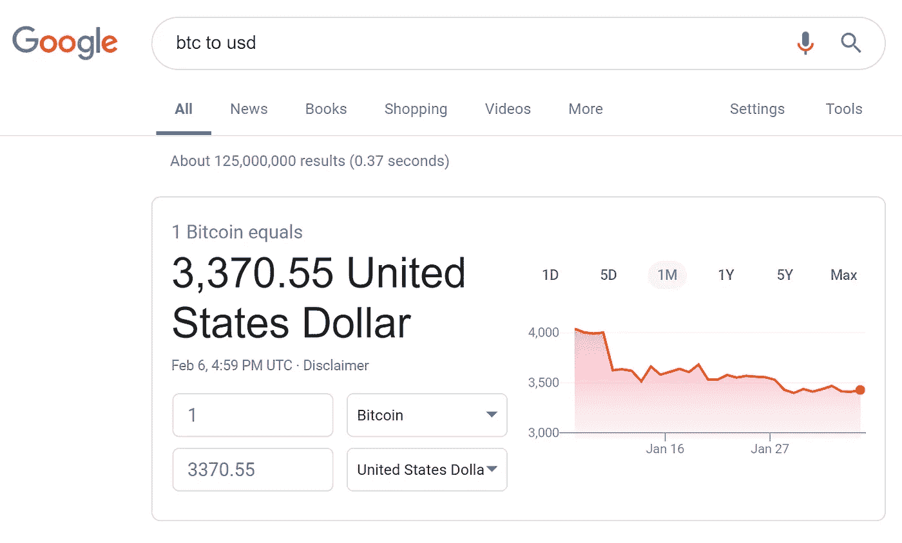

# 关于稳定密码和安全令牌,(大多数)人遗漏了什么

> 原文：<https://medium.com/hackernoon/what-most-people-are-missing-about-stablecoins-and-security-tokens-e09f52f86dfd>

# 2018 年在区块链

2018 年区块链最有趣的发展是围绕稳定硬币和安全令牌，至少在我看来是这样。这两个领域都有很多新项目、聪明人、资金和惊喜(例如 https://medium.com/basis-blog/basis-update-ae96e3565b1d)。我觉得这既令人鼓舞，同时又具有讽刺意味。令人鼓舞的是，密码世界意识到，为了大规模采用区块链技术，它必须更加可预测、文明、规范和合规。出于同样的原因，这很讽刺:最初作为现有金融和货币系统的替代方案而创建的技术现在必须遵守现有的金融规则和法规(安全令牌)，并接受政府支持的法定货币作为支付标准(钉住稳定货币)。

# “(……)他们永远夺不走我们的自由！”

加密货币和 ico 背后的最初想法是创建一个替代金融系统，摆脱 SEC、华尔街、银行和毫无价值的法定货币的暴政，政府将法定货币贬值并用作对人民财富的隐性税收。勇敢的、新的、分散的和透明的金融世界，受不变法典法则的支配，本应赋予受压迫的穷人权力，让最聪明的人容易获得资本；释放大众未实现的潜力和智慧。或许在某些情况下确实如此。当然有非常有趣和高尚的区块链项目。但这些都是稀缺品。该领域的绝大多数资金参与了有史以来最大的不受监管的 24/7 赌场。令人惊讶的是，由于没有规则、许可证或客户保护，诈骗、市场操纵、虚假报告和糟糕的治理非常普遍。结果远非公平或分散:例如，BTC 87.5%的土地仅由 0.66%的钱包地址拥有([https://bitinfocharts . com/top-100-richest-bit coin-addresses . html](https://bitinfocharts.com/top-100-richest-bitcoin-addresses.html))。

所以，现在这个行业意识到，这种自由主义的、无政府主义的、狂野的西部方式只吸引非常特定类型的用户，而不是为大众市场创造有意义的、改变生活的解决方案的最佳方式。因此，我们需要受到监管、顺从，请原谅这个双关语，还需要稳定。我们有与菲亚特挂钩的稳定债券，这将促进交易和证券代币，sto 出售公司股权，而不是 ico 出售没有实际效用的假装效用代币。这对现在受到更多保护的用户、消费者和投资者来说很好，但你需要区块链做什么呢？

电子支付已经很发达了。在包括美国在内的许多司法管辖区，无需加密令牌就可以进行股权众筹。添加令牌会带来另一层复杂性、成本和摩擦，因为现在您需要传统基础架构(法律和技术)、区块链基础架构以及两者之间的接口。这不仅适用于 stablecoins 或 STOs，也适用于每一个区块链项目:一旦你开始复制现有的结构和模型，问题是‘为什么是区块链？’需要解决。有具体的，利基情况下，代币增加额外的价值，但这些主要是迎合秘密赌场社区。

# 我们将何去何从？

我建议把重点放在商业模式和应用上，这些模式和应用只有在区块链才有可能，在没有区块链的旧世界是不可能的。让我们从 stablecoins 开始。几乎所有我知道的项目都试图创造稳定的硬币。“硬币”部分在这里至关重要。这些项目可能受到了奥地利经济学派(出于某种原因，这是加密领域最受欢迎的思想流派)的影响，采纳了货币是一种促进商品和服务交换的商品的观点。因此，他们的首要任务是创造商品，硬币。但这种方法让我们回到了几百年前，当时支付是关于移动实物，货币商品被用作一种非常简单的“单一条目会计”系统来跟踪资源。

自从大约 800 年前在欧洲引入复式记账会计以来，通过调整相应的会计记录来转移价值和支付。这就是现代金融体系的运作方式。银行是可信的、集中的第三方，负责跟踪这些会计记录并防止重复支出。我认为，一个共享的、分布式的会计记录数据库，具有不变的规则和条目，不受任何第三方控制，是区块链技术的一个很好的用例，也是货币概念的自然演变。在这种方法中，货币被用作记账单位，但不需要作为交换媒介。价值交换是通过调整会计记录来实现的。对商品的需求不再存在。

此外，这造成了一种情况，即货币和支付系统可以携带关于每笔交易的商业背景的更多信息。这开启了新服务和应用的整个范围，如用于慈善捐赠的可追踪资金、即时更新财务报表的实时会计，或对每项业务活动更准确的风险评估。

拥有一套包含资产支付和流动信息的可信会计记录，有助于创建新型资产类别和金融工具。安全令牌不再需要复制股票或债券。相反，安全令牌的值可以从特定的业务交易中获得。例如，衍生代币可以支付公司或个人收入的版税，或者授予购买永久折扣的权利。在这种情况下，区块链技术将使企业和个人能够以透明和廉价的方式创造衍生品。这在以前仅适用于受监管的金融工具，而且在小范围内成本过高。我认为这种创新将对经济产生深远的影响，就像金融市场上的衍生品和证券化一样。

这就对了。这就是(大多数)人对于稳定密码和安全令牌所缺少的:

1.  复制现有系统没有太大意义；和
2.  区块链技术实现了全新类型的衍生品和我们称之为货币的下一代基础设施。

如果你想讨论经济、战略或创新，请随时联系我:[https://www.linkedin.com/in/michalbacia/](https://www.linkedin.com/in/michalbacia/)

我能够以通俗易懂的方式解释非常复杂的主题，同时让人们发笑并参与其中。