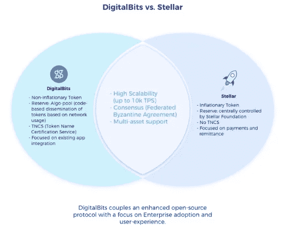

# 什么叫“嘿呀！”可以告诉我们区块链的大规模采用

> 原文：<https://medium.com/hackernoon/what-outkasts-hey-ya-can-teach-us-about-blockchain-mass-adoption-cb3711185088>

Outkast 的成员已经将他们的嘻哈事业发展到了音乐产业之外长达数十年的努力中。

最近，Big Boi 在超级碗上表演了 2004 年的热门歌曲“The Way You Move ”,旁边是魔力红的亚当·莱文和瞌睡虫布朗，后者演唱了原始版本。

最近在读查尔斯·杜希格的《习惯的力量》时，我了解到了他们的热门歌曲《嘿，雅》的故事我想，这首歌独特的成功轨迹可以教会我们如何收养区块链。

# “习惯的力量”

人们听 Top 40 是因为他们想听到他们最喜欢的歌曲或者听起来像他们最喜欢的歌曲的歌曲。当不同的事情发生时，他们会被冒犯。他们不想要任何不熟悉的东西。”

*查尔斯·杜希格，习惯的力量*

在他的书《[习惯的力量](https://charlesduhigg.com/the-power-of-habit/)》中，查尔斯·杜希格阐述了变化是如何让人类不舒服的。

他描述了“嘿呀！”到 2005 年，OutKast 预计将获得巨大成功，但最初播出时没有达到预期。后来发现这与听众习惯的完全不同，他们一听到就换台。

进入“三明治模式”这需要广播电台播放席琳·迪翁的歌曲，然后是“嘿呀！”，然后又是一首热门歌曲。他们夹着“嘿呀！”伴随着当时著名和流行的歌曲。“嘿呀！”获得了关注并赢得了许多荣誉。《嘿呀》的故事类似于区块链的现状。

在撰写本文时，比特币网络在最近 24 小时内经历了 321，563 次交易。相比之下，VisaNet 每天平均处理 1.5 亿笔交易。在 dapps 雷达跟踪的 1839 个分散应用程序中，24 小时只有 180，000 个用户。脸书是一个知名的集中式社交媒体平台，拥有 15 亿日活跃用户。

毕竟，人们没有采用区块链。也许，我们可以从广播电台如何向听众介绍“嘿呀”中学到一点东西。“把区块链夹在中间”是答案吗？

让我们来看看一些项目如何将区块链融入熟悉的概念中，帮助他们为消费者创造熟悉的体验。

# 支付解决方案:加密借记卡和移动支付解决方案

今天，尽管大部分纸币都是数字化的(8%的现金是数字化的)，但使用法定货币仍然比加密货币容易得多。当考虑大规模采用时，输入公钥(记住一个错误可能导致资金损失)，并等待收到资金的确认既不可持续也不理想。TenX 和 Cardano 等项目正在探索加密借记卡领域，以使支付变得快速而简单。

# TenX

TenX 以加密钱包和加密卡的形式创造了一个动态组合。TenX wallet 允许用户与其他 TenX wallet 用户发送和接收加密货币(BTC、ETH、LTC)。该钱包可以与 TenX 卡配对，TenX 卡在近 200 个国家的 4200 万个线上线下积分点接受。用户可以通过他们的钱包应用程序轻松管理他们的资金，并分配 TenX 卡上的可用金额。如果卡丢失或被盗，可以通过应用程序锁定。

# 卡尔达诺

[Cardano](https://www.cardano.org/en/home/) 也已经扩展到加密借记卡领域。它与 Metaps Plus 的合作产生了金额为 100 和 1000 阿达的预付借记卡。超过 40，000 家商店接受 Metaps Plus。

# 移动支付解决方案

# 洛布斯特尔

[LOBSTR](https://lobstr.co/) 是 Stellar 生态系统中最大的钱包提供商，它提供了一种简单而安全的方式来存储、发送和接收 Stellar 区块链上的流明和其他资产。在其他移动加密解决方案中，LOBSTR 将自己视为 Venmo 和 Apple Pay 等集中式移动支付选项的竞争对手。

提供加密借记卡和移动支付应用等熟悉的交易方式的解决方案，实现了急需的便携性和易用性。消费者的学习行为不受影响，允许他们消费、转移和接收他们的密码，就像他们发行纸币一样。

# 现有应用集成

dapp 生态系统并没有吸引大量用户。今天的分散式应用程序，通常被称为 dapps，面临着过多的问题。除此之外，Dapps 通常提供糟糕的用户界面和体验，并且缺乏大型的活跃社区；整个 Dapp 生态系统的用户不超过 180，000。几乎没有什么东西能激励人们放弃流行的集中式替代方案。

# 数字比特

[DigitalBits](https://www.digitalbits.io/) ，恒星区块链的一个分支，集成了现有的用户应用程序，目前专注于将资产令牌化、转移和交易引入数十亿美元的忠诚度和奖励积分领域。

该公司希望促进与区块链技术的互动，不管用户是否知道。消费者行为一定不需要改变。该协议优化了应用程序的后端基础设施，以一种熟悉的方式为用户带来区块链的好处。

DigitalBits 运营副总裁 Michael Luckhoo 表示:“区块链是一项革命性的技术，但 Dapp 生态系统已经成为开发者的游乐场。“我们需要将这项技术带到大众中，带到人们日常使用的现有应用中。Dapp 的时代将会到来，但我们需要把人们带到那里，把他们扔进 Dapp 的火里不是解决问题的办法。”

跨境支付和汇款

每年的跨境支付和汇款总额超过 20 万亿美元。目前用于全球转移资金的基础设施已经严重过时。目前跨境支付的领导者 SWIFT 向用户收取高额费用，结算时间可能长达 3 至 5 天。

农民工寄回家乡的费用平均损失 10%以上，这有时迫使他们打第二份工或放弃休假来弥补额外的资金。这些费用会给依赖在国外工作的亲戚的家庭带来很大压力。

# 涟漪

Ripple [解决了](https://www.forbes.com/sites/tomgroenfeldt/2017/08/16/ripple-uses-blockchain-to-move-money-faster-than-a-flying-courier/#39c929dd3f3a)目前困扰跨境支付的速度和成本问题。“如果我想把钱从这里(旧金山)转移到伦敦，最快的方式是飞到那里，”Ripple 首席执行官布拉德·加林豪斯(Brad Garlinghouse)说。“我们可以从空间站传输视频，但我不能把自己的钱从 A 地转移到 B 地，尤其是国际支付，但国内转账也是如此。”

RippleNet 交易在 3-5 秒内完成，成本仅为几分之一便士。(在撰写本报告时为 0.00001 XRP，或 0.0000029 美元)

Ripple 直接与银行和金融机构合作。消费者不必直接与技术互动，但他们将从时间和成本的减少中受益。

# 网页浏览

用户在使用科技公司开发的应用程序时会产生有价值的信息。

亚马逊、Facebooks 和谷歌从中获利。用户得不到任何补偿。谷歌目前每月活跃用户超过 10 亿，分布在七个独特的产品上。

# 勇敢的浏览器

[Brave](https://brave.com/) 屏蔽广告和网站追踪器，同时向内容发布商支付替换广告收入的 55%。Brave Software、广告合作伙伴和浏览器用户将获得 15%的收入。用户可以通过小额支付将他们的收入份额捐赠给内容发行商。

Brave 由 Javascript 的联合创始人布伦丹·艾希(Brendan Eich)创立。它的原生“基本注意力令牌”(BAT)允许用户给网站和内容创作者小费。

# 金属纤维

全面支持 web 3.0 的浏览器 Metalye 正在创建一个门户，用于存放和利用其浏览器收集的数据。用户可以利用其个人数据的所有权。Lyfe Coin，Metalyfe 的原生货币，允许为用户提供的关注和数据赚取收入。

Brave 和 Metalyfe 提供的经济激励浏览让用户有机会“谷歌”一些东西并获利。

Metalyfe 的创始人 Sameer Pirani 说:“自成立以来，我们一直以人为中心。“我们致力于为每个用户创造独特的定制体验。随着我们迈向 Web 3.0 以及人工智能和数据科学的进步，促进增强的策划体验将成为新数字世界的一部分。”

# 比特流

分散应用的概念早于区块链和加密货币。dapps 的第一次主流迭代是点对点文件共享和托管网络，如 Napster、Limewire、eDonkey 和 BitTorrent。

BitTorrent 被区块链初创公司 Tron 以 1.4 亿美元收购，目前是分布式计算架构领域最大的参与者。它声称在出售时拥有 1.7 亿用户，每天移动大约 40%的世界互联网流量。Tron 希望在已经成功的 BitTorrent 基础设施中实现加密货币，立即将 BitTorrent 社区移植到区块链。

BitTorrent 的托管和共享操作将或多或少保持不变。用户现在将有办法在平台上消费和赚取加密货币。现有的 BitTorrent 协议需要将一个文件共享给系统，以便下载另一个文件，一旦下载完成，就没有动力将该文件保存在那里。

BTT 将允许用户为发送给他们的文件付费，并支付额外的带宽以提高下载速度。通过激励文件主机将文件在网络上保存更长时间，用户可以从总体更快的下载速度和网络上更多的文件中受益。

BTT 希望利用经济激励来提高整个网络的性能。文件提供商通过继续托管他们的文件来支持网络，并因此在 BTT 得到奖励。网络上可用的文件越多，整体下载速度就越快。

“我们在白皮书中描述的 BitTorrent speed 产品是关于加速 BitTorrent 下载的，所以如果有人有一个 Torrent，而你想获得它的一部分，你可以用令牌更快地获得它，”项目 Atlas Lead 的 Justin Knoll 说，该项目目前正在致力于将 BitTorrent 连接到区块链的项目。“通过加密货币，Tron 创建了一个经济模型，允许在现有的 BitTorrent 基础架构内进行价值转移并提高性能。用户继续播种和下载文件，并获得额外的回报和速度。”

# 将区块链夹在中间

区块链具有惊人的潜力，但目前对大多数人来说太陌生了，无法采用。正如“嘿呀！”夹在流行歌曲之间，区块链需要与现有的架构和操作一起呈现，以提供熟悉感。

本文中提到的项目目标明确且相关。他们并不孤单。以 Flipp 为例。他们正在创造一种新的用户体验，其特点是社交网络和约会网站(如 Tinder)上的垂直滚动。

该公司在一份新闻稿中表示:“Flipp 移动应用程序现在具有垂直滚动体验，允许购物者以自然和本能的方式消费他们喜欢的内容。”

它们在后台工作，使用户能够通过区块链做更多的事情，但不会明显改变用户体验。