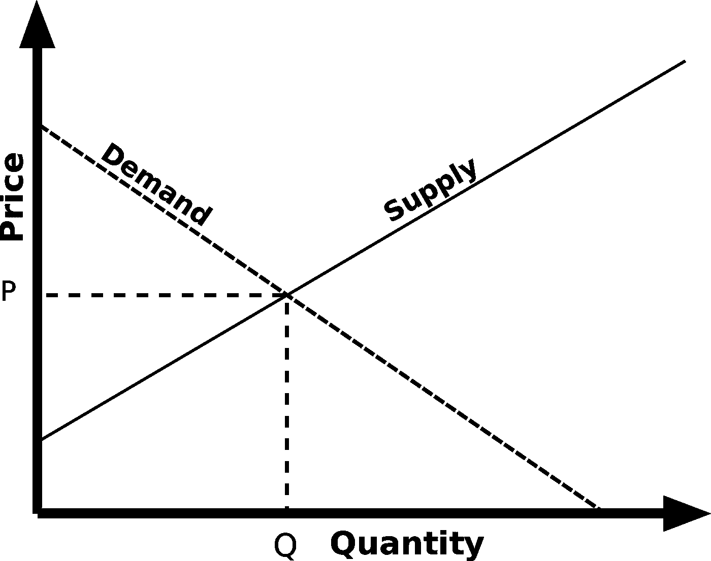

# 后稀缺意味着什么

> 原文：<https://medium.com/hackernoon/what-post-scarcity-means-7c4d653418f4>

## 为什么后稀缺经济难以解释

许多人表现得像后稀缺时代是一场白日梦。乌托邦童话和科幻小说的素材。恕我不能苟同。事实上，我认为在很多方面，美国已经有了。我们只是看不到就在我们眼皮底下的富足，因为我们当前的经济范式让它变得不可理解。

> 后稀缺是一种商品生产超过需求的经济状况。

但是当我后退一步，我看到数百万磅多余的衣服被倾销到其他国家。我看到路边有免费的沙发。我看到人们从银行拿走的圆珠笔，眼睛都不眨一下。我看到如此多的娱乐选择，以至于有些频道专门告诉你其他电视频道在播什么。

与此同时，收入不平等正在加剧，人们无家可归，忍饥挨饿，我看到人们购买时髦的 FitBits 和高档汽车。那么无家可归怎么办？当人们饥饿的时候，我当然不能否认匮乏。

虽然我确实相信许多类型的匮乏确实存在(有些可能永远存在)，但我不认为匮乏是无家可归的原因。我认为资本主义和社会主义应该受到谴责。因为资本主义在今天的美国如此普遍，我将把重点放在它而不是社会主义上。但是我的批评和意见对两者都适用。首先，我要探索后稀缺的本质。然后，我将转向为什么没人知道如何处理它，以及需要什么来改变它。

# **后稀缺的两种类型:产品和金融资源**

关于后稀缺时代的讨论通常围绕产品展开，具体来说。我怀疑这是因为金融资源的价值仅仅在于它们允许一个人购买的产品。尽管如此，这两种后稀缺性之间的区别对于解释后稀缺性为何无法从资本主义(和社会主义)框架中理解具有重要意义。这些含义将在下一节进一步阐述。

**产品**

产品通常被想象成实物商品。这些实物商品的资源和劳动力是有限的，因此可以控制供求曲线(至少从资本主义范式来看是如此)。尽管工业革命或亨利·福特的装配线等进步可能会大幅削减原材料开采成本和劳动时间，但资源开采的理论极限通常(并过早地)压制了任何供应可能会持续压倒需求的观点。因此，技术和社会进步推动了人们熟悉的产品渗透——从稀有的奢侈品到普通商品。与此同时，这些产品的价格接近但永远不会达到零。

Conventional supply-and-demand curve

不太常见的是，人们在考虑商品时会考虑无形的信息。这些商品几乎不需要物理资源(只需要存储和检索商品的硬件和基础设施)，因此在很大程度上达到了后稀缺状态。

当我提到后稀缺商品时，我特指供给能力大于需求的商品。需要明确的是:并不是所有后稀缺商品实际上都分配给了所有需求者，但它们的价格可能接近 0 美元。这在信息商品中尤其常见，如歌曲或电影(对这些商品来说，获得和发行拷贝的成本可以忽略不计，但违反了版权侵权法)。然而，一些实物商品也可能是后稀缺的(比如农产品，超市每年扔掉 430 亿英镑，大概是因为当地需求跟不上易腐性)。

F **财政资源**

然而，仅仅因为某人出生在一个资源稀缺的世界，并不一定意味着他们将亲身经历这种稀缺的全部影响。虽然可能有有限的产品可供使用，但一些人通过他们的身体和经济能力(在这里我们指的是经济能力)缓冲了这种稀缺。也就是说，富人和有权势的人比穷人和弱者更少感受到稀缺。

随着文明的到来(可能更早)，生活水平以上的人类已经参与了财富信号的实践。一旦一个人有足够的资源来满足他们的基本需求，他们就能够通过把钱花在不必要的、华而不实的东西(如珠宝)上来与他人交流他们的相对地位，大概是为了吸引配偶、赢得朋友和影响他人。

当我提到金融后匮乏时，我特指一个人获得基本物质必需品的能力，并且仍然有钱购买奢侈品(或奢侈版本的生存工具，如纽约的顶层公寓、有机农产品或名牌服装)。

**资本主义和两种后稀缺**

尽管资本主义从根本上无法理解后稀缺产品，但它对金融后稀缺并不陌生。事实上，这就是游戏的名字:如果你想维持你的身体安全，你需要在财政上变得后匮乏。让我们进一步分析一下。

资本主义诞生于使用实物美元(法定货币)追踪价值储存的长期经济传统。因为大多数资源是稀缺的，为了使价值交换的分类账准确，法定货币也需要稀缺。不管怎么说，这很直观:我给你一颗珍珠，你给我一美元。我们都交换了一些物质和有限的东西，这似乎是公平的。因此，商品的稀缺性决定了有多少法定单位(稀缺性单位)被返还作为交换。

这完全符合对资源限制的传统理解。没有人认为每个人都应该得到普遍的奢侈品——比如一根金条。但是，似乎确实有一种信念，即有足够的钱来满足每个人的基本需求(因此，呼吁普及基本收入——UBI)。人们感到沮丧的是，有些人买 10 块苹果手表，而有些人只是为了买得起一个苹果。

UBI 的目标是实现所有人的金融后稀缺(即所有基本需求都得到满足，任何额外收入都可以用于“奢侈”或相对财富信号)。但是在一个由稀缺性构成的经济范式中，是不可能认识到后稀缺性的。资本主义表现为竞争性市场——与其说是关于你拥有什么，不如说是关于你与他人相比拥有什么，这是关于 T2。让某种东西在资本主义中变得普遍，就是让它变得没有价值。因此出现了人们熟悉的通货膨胀的限制。

# **零和、资本主义和后稀缺**

稀缺商品竞争的内在本质，即资本主义的零和博弈，正是后稀缺时代看起来不可理解的原因。这不仅适用于产品，也适用于普遍金融后稀缺概念(任何可行的 UBI 形式)。自由放任的资本主义不会强迫实体创造后稀缺商品；自然资本主义市场会扼杀这样做的企业(因为成本会迅速下降，让创造者出局)。

受监管的资本主义通过制造人为的稀缺掩盖了这个问题。这可能以对竞争产品的补贴、创造以前不必要的工作岗位的形式发生，或者——也许最容易说明的——以知识产权法的形式发生。我们如此迷恋稀缺，以至于我们实际上丧失了将后稀缺商品视为后稀缺商品的道德。如果你分享一部电影或学术期刊的文章，你就违反了法律，从别人那里窃取了东西。从资本主义范式来看，稀缺本身就是赋予商品价值的东西。盗版内容就是从知识产权持有者那里“窃取”稀缺资源。

需要澄清的是——我不是在纵容盗版。不幸的是，在我们的资本主义世界，盗版确实会导致辛勤劳动者的收入损失。然而，我确实想坦率地说，资本主义让我们陷入了一个非常荒谬的困境。传播知识和获取信息违反了知识产权法:为世界增加价值是一种犯罪。消除稀缺性是非法的。

Aaron Schwartz was put on trial by Elsevier for unauthorized access of research articles (many of which were publicly funded).

这就是为什么新自由主义者尽管讨厌政府监管，却对知识产权法情有独钟。如果你想在一个重视稀缺的系统中赚钱，让后稀缺商品变得稀缺(即“有价值”)的唯一方法就是垄断它，并收取%100000000 的加价费来访问它。

那么，人们到底在后稀缺时代做些什么呢？

人们很大程度上忽略了商品的后稀缺性。面对后稀缺性，我们捏造稀缺性，试图在道德上为其正名。关于实物商品，我们可以接受杂货店扔掉产品——而不是降低价格(我的意思是，他们这样赚钱最多，而且他们必须谋生，对吗？).关于信息商品，法律正在用法规制造稀缺，抛弃一个人听、读或看的经验(但是，如果我们未经授权下载了那篇期刊文章，有人就失去了本应属于他们的收入，对吗？).这种人为的稀缺是资本主义子弹孔上的奇怪创可贴。

与此同时，我们放弃购买额外的一箱草莓和电影租赁，并攒钱买新车——这是一个热门的新财富——向我们的朋友展示我们有大把的资源。

我们只是缺乏一个经济范式来解释产品日益增长的后稀缺。因此，我们拒绝它们的存在——声称投入产品的劳动力或资源使其变得稀缺。但是后匮乏并不是关于理论上被宇宙的物理属性所限制——而是关于我们超越我们的实际需求和实际欲望的能力。这对于许多产品来说是可行的(并不是所有的产品都可以做到，也许对于任何最新的物理产品来说都不行)。

**我们应该如何应对后稀缺时代？**

简而言之，我们需要一种经济范式，让后稀缺和稀缺商品的价值比较变得可以理解。在这个系列的第二部分，我将论证我们所需要的是一个诠释学的评估系统。这种估价系统明白，商品的价值不是漂浮在“外面”等待看不见的手去发现的抽象概念。相反，商品的价值不在于“市场”将承受的价格标签，而是由产品或服务在特定时间对特定人的内在价值构成。我从看电影中获得的价值可能比我从喝一杯咖啡中获得的价值更大——尽管事实上电影的供应是无限的，而咖啡的供应是有限的。这种经济范式拒绝后稀缺商品没有价值的概念，并提出两个伦理主张:1 .后稀缺商品[不应该被人霸占，不让那些付不起任何价格的人购买；2 .后稀缺商品的创造者和经销商应该为他们创造的真实价值得到补偿——而不是被抛弃在供需曲线的尘盆中。我将在本系列的第 2 部分更深入地阐述这些观点。](https://hackernoon.com/behavioral-cryptoeconomics-the-secret-of-digital-currencies-ac6e9b04fcb6)

**人们应该如何处理后稀缺？**

后稀缺现在就在这里。首先，它需要得到认可和验证。如果我们合法化的只是稀缺性，那么稀缺性就是合法的。唯一阻止我们释放更多财富的是我们以稀缺为中心的经济范式——这种范式将财富等同于你囤积了多少东西。如果我们欢迎后稀缺和它所要求的新范式，我们可以改变财富的定义，从你囤积了多少稀缺商品，到你创造了多少富足。

我正在用[时代](https://era.eco/#step1)构建去中心化网络的平等主义基础设施。*如果你喜欢这篇文章，如果你为它鼓掌，分享它，并在* [***推特***](https://twitter.com/ambercazzell) *上与我联系，这将意味着很多！您也可以订阅* [***观看***](https://www.youtube.com/playlist?list=PL-UMfJVuezk-YgNUNSgpv-fE6q5Qjokdp) *或* [***收听***](https://open.spotify.com/show/3e3030cJwqwKa2A4UzBwnK) *我的播客！*