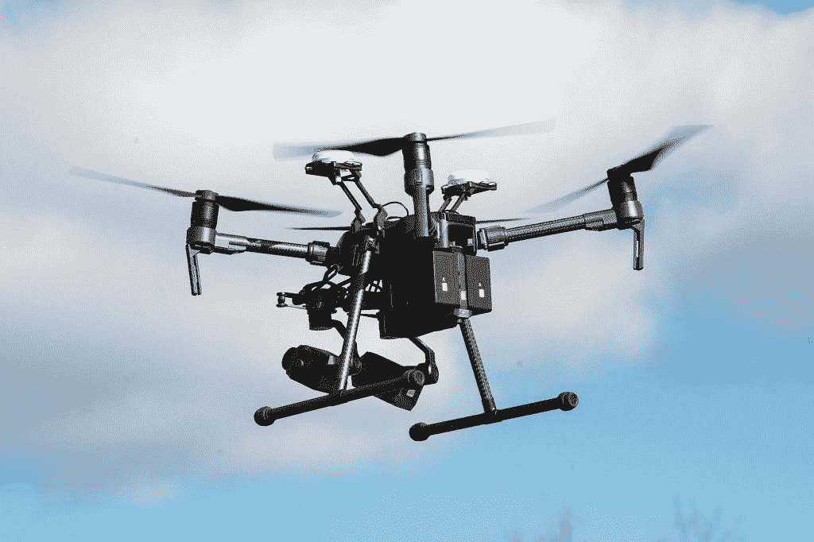
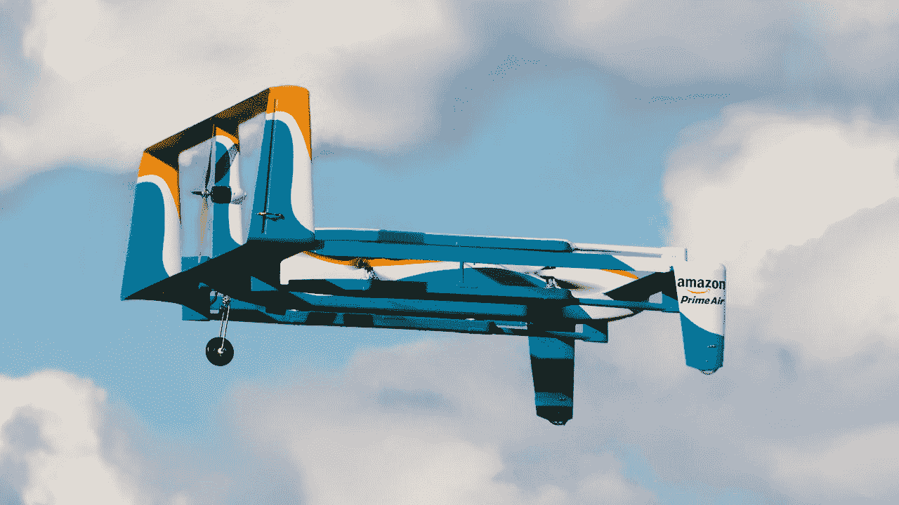
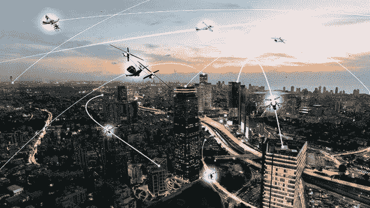

# 区块链可以解决无人机行业的哪些问题？

> 原文：<https://medium.com/hackernoon/what-problems-can-blockchain-solve-in-the-drone-industry-956b7f748512>

最近的技术进步正在开创一个全新的创新时代。虽然无人机技术已经存在了近一个世纪，但直到最近它才在野生动物保护、天气预报、农业等领域获得了发展。各行业已经开始意识到无人机的能力及其对商业的影响。

根据[统计](https://www.pwc.pl/clarityfromabove)，使用无人机技术的商业服务全球市场价值 1270 亿美元。从在家门口送披萨和卷饼到在紧急情况下提供医疗用品，无人机技术正在以许多方式改变我们的生活。无人机越来越受欢迎，其影响遍及各个领域。

越来越多的无人机带来了巨大的风险和新的挑战，如管理增加的空中交通，制定飞行计划，处理碰撞等。在 T2，大约有 130 万架无人机在联邦航空管理局注册。

飞行员经常看到这些无人机。据 [FAA 报道](https://www.faa.gov/uas/resources/public_records/uas_sightings_report/)，2018 年发现超过 2000 架无人机，一架无人机撞上了一架波音 737 飞机，造成无线电和通信设备损坏。飞机安全着陆，但许多人开始担心。

区块链可以帮助解决这些问题。从空中交通管理到提高安全性，分布式账本技术可以用来克服当今无人机面临的挑战。

企业正在投资这项颠覆性技术。由[Theo Nix Jr .](https://www.linkedin.com/in/theonixjr/)、[dronepayo.com](https://dronepayo.com)共同创立的一个位于区块链的平台，通过提供创新的交叉解决方案来帮助个人开发无人机技术。 [IBM](https://www.ccn.com/ibm-patent-eyes-blockchain-for-drone-fleet-security/) 申请了一项区块链专利，以解决无人机群的安全问题。无人机行业可以从这项革命性的技术中受益匪浅。让我们看看区块链能解决的一些问题:

# 安全性

区块链有可能提高所有行业的数据安全性。数据分散在区块链上，不能更改。因此，数据安全不需要第三方提供商。这种分布式账本技术能够为无人机提供加密材料。因此，数据被加密，确保安全通信。所以，无人驾驶飞机在执行敏感任务时会很有帮助。

“例如，在包裹递送业务中，一个基于区块链的存储库可以记录有关操作的信息，如时间、位置、资源、递送日期等，并让经过身份验证的用户和包裹路线上的任何其他利益相关者都可以访问这些数据，”ANRA 技术公司的创始人阿米特·甘朱说。

Amazon’s first drone delivery

由于这些无人机收集了大量信息，数据安全成为一个主要问题。政府追踪无人机及其任务的能力引发了隐私和安全问题。区块链技术有助于减少这些担忧，因为区块链上的记录是通过加密技术保护的。即使无人机落入坏人之手，数据仍然是安全的。

# 身份管理

无人机的滥用也是一个主要问题。世界上几个国家已经禁止使用无人机，因为它的滥用和侵犯隐私。借助基于区块链标识符的远程识别系统，区块链可以帮助解决这个问题。远程识别的目的是允许公众和其他对无人机飞行感兴趣的实体向当局报告识别号。在无人机使用不当或公共财产受损的情况下，区块链识别器将监控并记录投诉，当局可以在不侵犯无人机用户隐私的情况下调查问题。运营商的所有机密信息都将受到保护。

# 交通控制

空中交通管理可能是商用无人机行业面临的最大挑战。随着无人机数量的增加，它们相撞的风险也在增加。为了解决这一问题，需要一种新的基础设施来促进强有力的空中交通管理。当前系统缺乏准确性、效率和准确性。

这就是区块链出手相救的地方。在区块链的帮助下，无人机可以实时更新它们的位置。由于区块链网络上的数据是公开的，其他在空中飞行的无人机可以跟踪其他无人机的位置，从而避免碰撞。

此外，关于禁区的信息可以在分布式账本上实时更新。因此，区块链可以阻止无人机进入禁区。由于加密，数据对黑客是完全安全的。只有当无人机是区块链网络的一部分时，它们才能与其他无人机共享数据。这确保了没有未经授权的访问。

# 保险

由于联邦快递(FedEx)和亚马逊(Amazon)等大公司正在使用无人机执行各种任务，如包裹递送、医疗供应和其他商业目的，因此为车队投保是必要的。如果无人机坠毁，造成财产损失或人身伤害，保险公司需要确定飞行过程中发生了什么以及是什么导致了坠机。他们不能依赖亚马逊告诉他们在包裹递送过程中发生了什么。区块链也可以帮助解决这个问题。有了区块链，数据将被存储在公共账上。亚马逊仍然拥有这些数据，但是他们不能改变它。这样，保险公司可以确定事故的确切原因。

随着无人机行业的持续增长，区块链将成为主流。看看无人机技术的未来会是什么样子会很有趣。