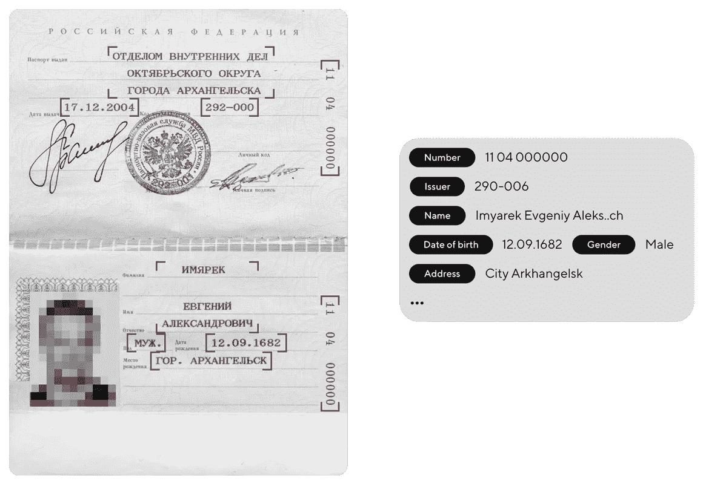
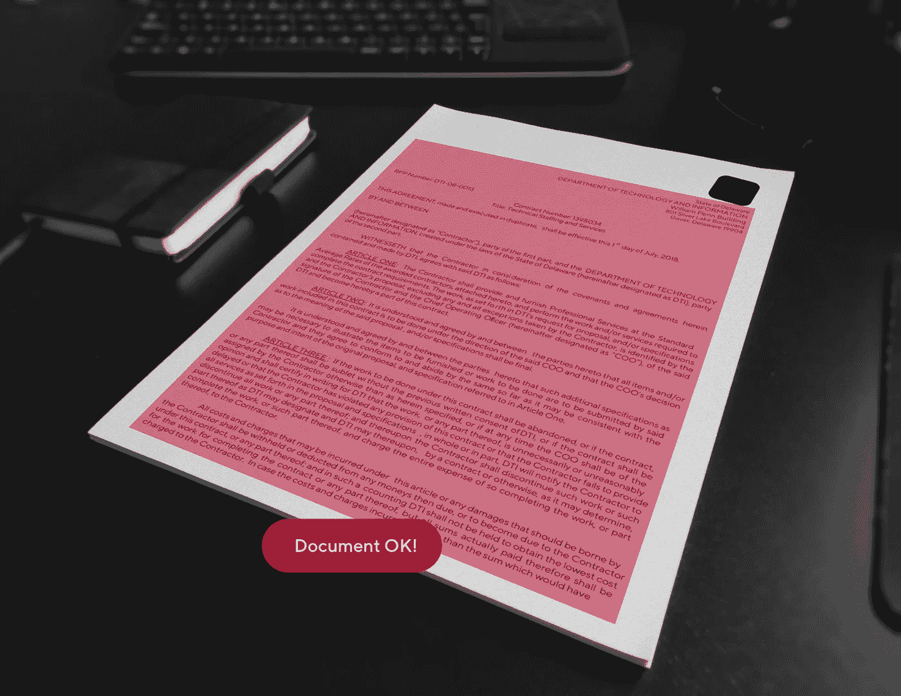

# 当使用人工智能自动化文档处理时，预期会有什么结果

> 原文：<https://medium.com/hackernoon/what-results-to-expect-when-using-ai-to-automate-documents-processing-b44151feb563>

## *什么是 OCR，为什么文书自动化*很少使用*，以及我们在开发自己的 RPA 解决方案的过程中学到了什么。*

现在人工智能覆盖越来越多的领域。它检查比萨饼的准备情况，搜索罪犯，并分析大爆炸的起源。在本文中，我们将讨论一个更加日常的用例:如何自动化文档流并将处理时间减少到几秒钟，以及为什么如果不这样做，几乎任何公司的发展都可能停止。

# **作为 RPA 一部分的 OCR 那是什么？**

随着文书工作的增加——无尽的文档准备、合同、填充、协议和表格，后台办公室的成本也在增加。反过来，这个部门不仅需要管理，还需要一大笔钱。机器人流程自动化(RPA)可以在不改变结构的情况下优化所有流程，从而大幅降低您的费用。基于 RPA 的技术的核心是光学字符识别，简单地说就是 OCR。

让我们想象一下你正在贷款。你的护照被快速扫描，数据被自动检查，几分钟后，你的申请被批准。如果我们不再需要员工执行常规操作，例如手动将数据输入系统，这就成为可能。这正是 OCR 技术的工作原理。它可以识别图片，在一秒钟内将它分成单独的字段，提取必要的数据，并自动将其输入表单、合同、CRM、应用程序等。这样，手动工作量保持在最低水平，而与文档处理相关的所有流程都大大加快了速度。

因此，该技术降低了后台成本，直到完全关闭该部门，同时提高了运营商的满意度:现在他们可以将更多的时间投入到客户身上。

# 用例

在日常生活中，OCR 被用于各种情况。以下是其中的一些:

*   银行卡自动读取；
*   即时护照识别；
*   自动填充您的在线帐户中的付款数据；
*   将数据快速输入合同；
*   核对不同来源的客户数据；
*   CRM 的自动完成；
*   还有更多。稍后，我们将回到这一点。

现在，让我们来谈谈这项技术的缺点。

# 文本识别准确性

OCR 的第一个变体是 1950 年在美国发明的。到今天，它由不同的市场参与者代表，但在我们自己的技术发展和客户发展的过程中，我们意识到现有的解决方案并不适合每一个客户。原因如下。

目前，比方说，在一个 ID 中，文本识别的质量不超过 85%。当处理模糊、光线照射或有褶皱的图片时，该算法仍然会出错。所有这些因素都影响质量并干扰系统正确识别文本。为了改进它，我们在技术中实现了两个新特性。

*   **语境分析。**接收的文本结果另外通过神经网络运行，该神经网络被训练为考虑上下文并自动纠正错误。这非常类似于当你搜索某个东西时，搜索引擎如何纠正错别字。
*   **人类在回路中。**系统提取的文本被传送给船上合格的众包工作人员进行验证。它们补充了人工智能的工作，并消除了可能的错误。该算法与人工工作的结合将任何文本的识别准确率从 85%提高到 99%。蛋糕上的樱桃是手动验证解决了手写文本的问题:它教会算法找到并纠正错误，随着时间的推移，识别的质量提高了，而成本保持不变。

# 数据安全

当我们使用人在回路的概念和文本被我们的能力所识别时，数据传输及其适当存储的问题就出现了。如何向客户保证数据安全？我们使用匿名，避免数据存储在我们的服务器上。这也可以使用客户的服务器和员工来完成。

这里有一个例子。该算法将照片模糊化，并在客户端将护照分成几个字段。信息以匿名的形式到达我们的服务器:不可能确定哪个字段属于某个特定的人。这些字段被单独识别，并使用 HTTPS 加密发送回客户端。整个过程不到一秒钟。

您可以通过 REST API 连接该技术——这非常简单，因为几乎所有系统都支持它。

# 简单地

作为 RPA 的一部分，OCR 降低了后台成本，并可以显著提高公司绩效。即使当人工智能处理个人数据时，你也不必担心结果，因为有一些解决方案可以保证完全的数据安全和高达 99%的文本识别质量。这项技术适用于各种日常情况，我们将在下一篇文章中详细介绍。