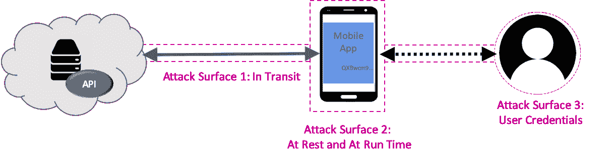
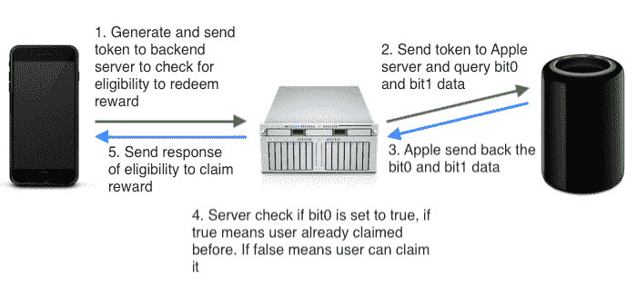
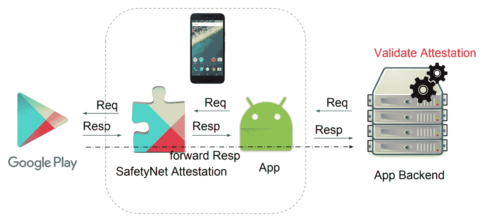

# DeviceCheck 和 SafetyNet 在 App 认证中起什么作用？

> 原文：<https://medium.com/hackernoon/what-role-do-devicecheck-and-safetynet-play-in-app-authentication-a0c525599d19>

## 内置 Android 和 iOS 移动安全检查

iOS 和 Android 都提供内置的设备级检查，有助于防止移动应用程序滥用。在 iOS 上， [DeviceCheck](https://developer.apple.com/documentation/devicecheck) 提供了一种将每个应用的一些信息与每个设备相关联的方法，在 Android 上， [SafetyNet](https://developer.android.com/training/safetynet) 设备认证试图确保设备在安全的环境中运行。这些都是有用的功能，但它们只是深入的移动应用和 API 保护方案的一小部分。

# 相信我！

对于今天几乎所有有用的应用程序，通过 API 与远程服务交互是主要的操作模式。虽然安全问题似乎经常集中在用户身份验证上，但是必须考虑所有可能的攻击面，以确保安全的 API 事务。

从 API 服务的角度来看，所有 API 调用都必须受到应用程序和服务之间的安全通道的保护。尽管 [TLS](https://www.cloudflare.com/learning/ssl/transport-layer-security-tls/) 对信道进行加密，但聪明的攻击者可能会危及设备或网络上的证书授权，因此难以实现和维护的[证书锁定](https://www.owasp.org/index.php/Certificate_and_Public_Key_Pinning)应该用来防止中间人攻击。

其次，API 服务必须确信设备上运行的应用程序是可信的。所有假冒或篡改的应用程序必须被拒绝。进行 API 调用时，最常见的应用程序身份验证形式是古老的(也是易受攻击的)静态 API 密钥。无论隐藏得多么好，如果黑客攻击 API 服务足够有价值，API 密钥就会被窃取，要么通过在应用程序中进行逆向工程，要么通过在未固定的通道中观察它。

可靠的篡改检测技术是必不可少的，关于应用程序真实性的决定应该总是在应用程序本身之外做出，以防检查本身被篡改或绕过。[远程移动应用证明技术](https://approov.io/product)可以防范假冒和篡改的应用。应用程序的包、安装的代码和运行时环境都是篡改的潜在攻击面。

如果你有一个安全的通道和一个可信的应用程序，那么终于到了担心如何使用像 [OAuth2](https://oauth.net/2/) 和 [OIDC](https://openid.net/connect/) 这样的协议结合生物识别和/或[多因素认证](https://en.wikipedia.org/wiki/Multi-factor_authentication)来正确认证和授权用户的时候了。但是不要忘记，用户身份验证的强度取决于其他因素。例如，标准的 OAuth2 使用秘密进行应用认证，这不足以防止假冒应用窃取用户凭证信息。

从长远来看，应用程序认证是当今移动 API 安全链中最薄弱的环节。那么，iOS 上的 [DeviceCheck](https://developer.apple.com/documentation/devicecheck) 和 Android 上的 [SafetyNet](https://developer.android.com/training/safetynet) 在帮助应用认证方面做得如何呢？

# iOS 设备检查

DeviceCheck 为开发人员提供了一种识别设备的可靠方法，并且可以为每个应用程序存储有关设备的两位信息。即使删除并重新安装应用程序、用户使用不同的凭据登录或执行系统重置，这些标记也会保留。典型的标志可能包括“该设备曾被入侵过吗？”或者“此应用的免费推广期是否已用于此设备?”？。

Source: [Uniquely identify iOS device using DeviceCheck](https://fluffy.es/devicecheck-tutorial/)

DeviceCheck API 生成一个临时令牌，向 Apple 唯一标识设备。您的 API 服务将这个令牌与来自 Apple 的认证密钥相结合，请求或更新由每个设备位标识的标志，并维护一个时间戳来指示它们上次被修改的时间。

DeviceCheck 实现向用户保证了他们的隐私，即使是在唯一地识别设备时。开发者只收到一个短暂的令牌，而不是设备序列号或任何其他识别信息。类似地，苹果存储了标志和时间戳，但是不知道标志是如何被解释的。

从应用程序认证的角度来看，这些标志可以用来识别受损的设备或应用程序，但仍由开发人员来确定应用程序的真实性。由于应用程序和设备条件经常变化，存储最后一次真实性检查的能力只有很小的价值。

[DeviceCheck 和 approv](https://info.approov.io/device-security)提供了有关 DeviceCheck 如何与最先进的应用认证系统进行比较的更多信息。

# 安卓安全网

在 Android 上，SafetyNet 作为 Google Play 服务的一部分安装在 Google 批准的 Android 设备上。它由四个 API 组成:

*   SafetyNet 证明 API —将设备环境与已知设备配置文件进行比较，以确定设备是否是根设备或有潜在危害。
*   SafetyNet 安全浏览 API:检查 URL 是否与 Google 已知的恶意 URL 相匹配。
*   SafetyNet reCAPTCHA API:分析用户与应用程序的交互，以提供关于用户是否实际上是机器人的置信度估计。
*   SafetyNet 验证应用程序 API:检查设备上是否安装了任何已知的恶意应用程序。

Source: [Inside Android SafetyNet Attestation](https://www.mulliner.org/collin/publications/InsideAndroidsSafetyNetAttestation_mulliner44con.pdf)

使用设备证明 API 时，应用程序会调用设备证明程序，设备证明程序会向 Google Play 服务发送运行时间测量值。谷歌评估这些信息，并向应用程序提供密码安全评估。然后，应用程序将评估转发给 API 服务进行验证。评估决策是在应用程序之外做出的，这是一种良好的做法，应用程序可以使用评估决策来关闭移动银行应用程序，如果它运行在根或非标准的电话设置上。

应用程序不仅要不断评估设备的健康状况，还要评估应用程序本身的健康状况。安全网提供有限但有效的运行时检查；然而，大多数应用程序将需要额外的，更多的应用程序特定的检查。SafetyNet 通过报告应用程序签名提供了一些针对假冒或篡改应用程序的保护，但完整的应用程序证明提供了更多针对零时差和更多动态漏洞的保护。另请注意，使用安全网需要访问 Google Play 服务。

[SafetyNet 和 approv](https://info.approov.io/device-security)提供了有关 SafetyNet 如何与最先进的应用程序认证系统进行比较的更多信息。

# 更进一步

DeviceCheck 和 SafetyNet 是移动 API 深度安全防御方法的潜在有用部分。DeviceCheck 使您能够将您的应用程序或设备标记为不可信，如果您可以通过其他方式检测到这一点。SafetyNet 为设备的运行时环境提供了更加结构化的检查。这两种服务都可以增强，但不能替代可靠的应用证明技术。

要更深入地了解以移动 API 为重点的安全性，请查看 OWASP AppSec California 2019 的[防止移动应用和 API 滥用演示](https://hackernoon.com/preventing-mobile-app-and-api-abuse-a3c50c72efc2)。

感谢阅读！有关移动 API 安全性的更多信息，请查看[www . approv . io](https://approov.io)。