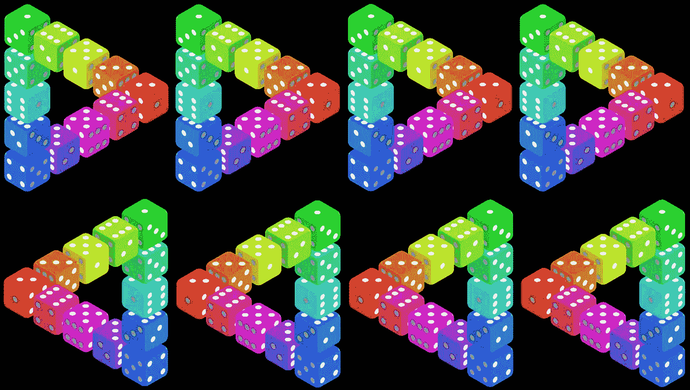
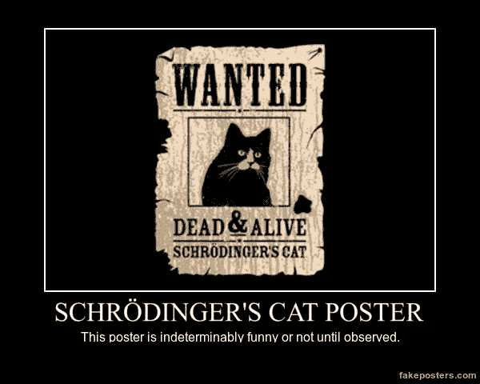
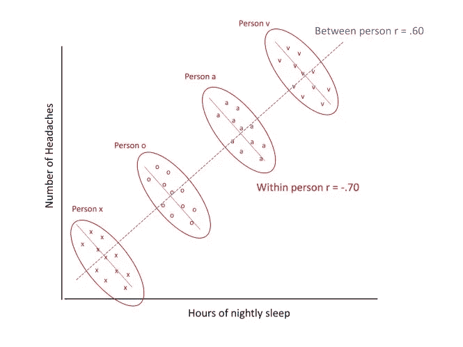
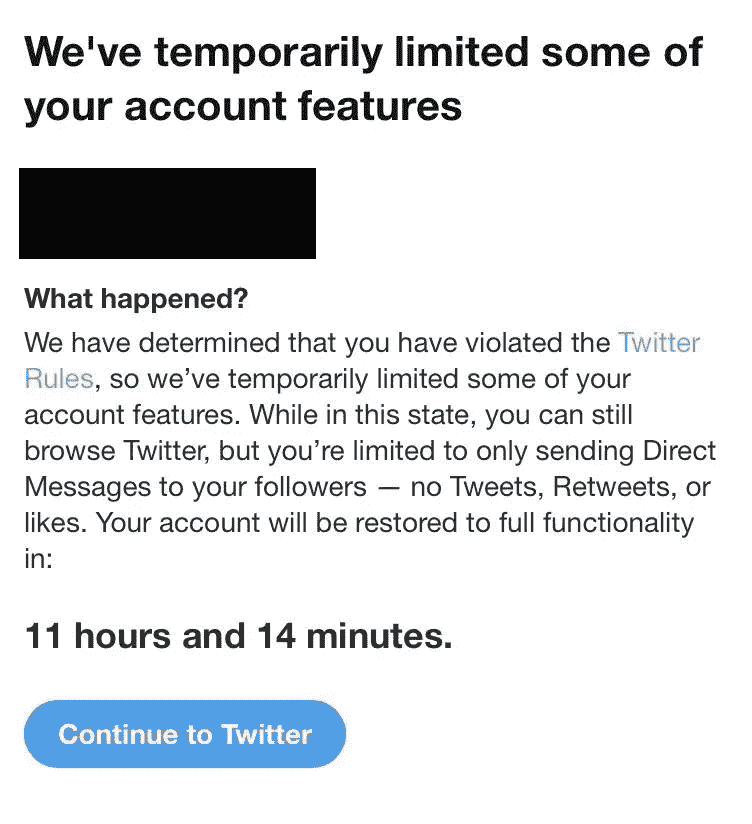

# 薛定谔的猫教会我如何做人

> 原文：<https://medium.com/hackernoon/what-schrodingers-cat-taught-me-about-being-human-2985c6755818>

## 机器学习的伦理应用

当我年轻的时候，我相信心理学家拥有这种不可思议的、有点神秘的能力，能够读懂人的思想，明白人在想什么，下一步打算做什么。现在我是一名心理学家，人们经常问我“你在读我的心思吗？”事实上，这种问题太常见了，以至于我和我的心理学朋友们都表示同情，并构造了一个开玩笑的回答:“你没有为此付给我足够的钱。”

但对于那些对我厚颜无耻的回答不满意的人，这里有一个直截了当的回答:不。事实证明，心理学家不知道人类在想什么，我们实际上也非常不擅长预测行为。部分问题在于，我们只和我们的主题一样复杂——除非它比苍蝇稍微复杂一点，否则一只苍蝇怎么可能完全理解自身的本质？然而，更大的问题是，我们正试图理解一个似乎表现为概率性而非确定性的主题。

你们中的许多人可能对薛定谔的猫很熟悉——在你打开盒子并观察它处于这种或那种状态之前，它是既活又死的。人类行为也是如此。我们可以猜测一个人在某个特定的时刻是慷慨还是贪婪，但我们永远无法确定，直到我们真正打开谚语中的盒子并观察其行为。对于那些相信人类能动性的人来说，这是有意义的。对于那些认为人类是复杂的、决定论的机器的人来说，这和量子力学一样是反直觉的。两种不同的状态和行为怎么可能同时为真？

在我的专长道德心理学领域，学者们一直在努力应对所谓的“情境主义挑战”:如果人类的行为随着情境的变化而剧烈变化，道德品质如何成为一个有意义的概念？或者换一种说法，如果每个人的行为都在道德地图上，怎么谈英雄和反派？

这又回到了概率上。人类是概率性的，不是确定性的。当我们用概率曲线来概念化行为时，我们开始对个体有了更准确的了解。

如果一个人在我们第一次见面时不诚实，我们很容易认为这个人是不诚实的。但最重要的是要记住，在统计世界中，一个数据点是没有上下文的。观察者不知道这种不诚实是不幸的侥幸，是特有的，还是与更恶劣的不诚实历史相比，实际上是异乎寻常的温和。

一旦收集了各种环境和时间的数据，得到的概率曲线实际上对于描述一个人是诚实还是不诚实非常有用。性格好的人，在不同的情况下，他们的诚实程度会有所波动，但是平均来说，在不同的情况下，他们会比其他人更诚实。这听起来可能很明显(圣人有其倒霉的日子，罪人有其好日子)，但社会经常背叛这种对人性的理解。

魔鬼在细节中，细微差别就这么简单:统计数据有利于描述人类行为，而不是预测人类行为。有什么区别？

人类行为最好从概率上考虑，但是做一个预测需要将这一系列的可能性压缩成一个单一的猜测。它迫使你折叠概率曲线，并预言一旦盒子被打开，猫*的未来状态将会是什么。在社会科学中，这通常意味着将概率曲线折叠到该人行为的平均值，并猜测该值。或者更糟(也更常见)把所有人的行为曲线(不是个性化的，而是一般化的)塌缩成所有人行为的平均值。*

This image illustrates how aggregated data from all people may machine-learn a result (the blue line) which is exactly opposite of the result when only personal data is considered during machine learning (the short red lines). This is called the Yule-Simpson Effect.

当赌注微不足道时，这是可以的。例如，当网飞把我和相似的人放在一起，然后正确地猜测我会喜欢 Sharknado，这没什么大不了的。但是，当风险非同小可时，它在伦理上是可疑的。

例如，在招聘前评估的情况下，仅仅因为一个人在个性或性格测试中的统计分数就将他排除在招聘阵容之外，这可能是不道德的。当我们分解统计逻辑时，就更容易明白为什么了:*在这个问题上回答 X 的人中有一些*后来做了 Y，而*在这个问题上没有回答 X 的人中有一些(但更少)*后来做了 Y。

这应该抛出危险信号——这似乎不公平！毕竟——如果你是一个回答问题“不正确”的人，但从来不会造成问题，而他们雇用了一个回答问题“正确”的人，但却继续造成问题，那该怎么办？

想象一下网上类似的情况。假设过去的 Yelp 研究显示，当 10 个或更多的新帐户在一个小时内对同一家企业留下积极的评论时，90%的情况都代表 sybil 攻击(即企业创建了一堆虚拟帐户来人为提高他们的评论)。因此，Yelp 实现了一种算法来检测何时有 10 个新账户对一家企业进行评级，然后自动阻止该企业涉嫌违规。允许这样的算法完全不被人类检查是道德的吗？民生危在旦夕。

社交媒体大规模应对的一个问题是网络欺凌。如果一种算法能够自动检测并删除欺凌帖子，或许好处大于成本(特别是对于那些手动整理此类帖子的科技巨头来说)。但是，一个算法完全基于过去的欺凌行为自动禁止一个用户，这有什么可原谅的吗？自动化数字流放的概念困扰着我。

我提出这些情景是为了描绘一幅社会如何真正超越对个人的统计描述，在观察薛定谔的猫之前对一个人的行为做出假设，并且这种假设是有道德成本的。

现在，对我的分析的一个非常可怕的批评是务实的:“因为错误而抛弃预测就等于把婴儿和洗澡水一起扔掉。与统计数据对赌是不明智的。”毫无疑问，放弃统计洞察力将是虚无主义的。但是为了使统计预测合乎道德，它们也必须是理性的和相关的。

当人工智能被用于重要的决策时，它的发现应该基于人类的理论和事实。也就是说，人工智能的假设(例如，这个企业正在进行 sybil 攻击)，不仅应该从经验上，而且应该从理性上得到人类的支持。审查人员可能会查看该案例，发现该企业已经有一千个正面评论，因此没有必要执行 sybil 攻击。快速的在线搜索可能会产生今天在该企业举行的大型活动，在这种情况下，10 条评论并不值得大惊小怪。

Precogs from *The Minority Report*

人类评论者为带有利害关系的机器学习增加了令人惊讶的元素。(我在这里指的是一个代理人，而不是一个没有决策权并遵循上级下达的协议的人。)人类必须永远娱乐少数派报告。

当统计预测严重影响决策时，应该负责任地去做。在可能的情况下，统计分析中的数据应该只根据个人的行为来预测未来的行为。不要说“大多数回答 X 的人做 Y，因此我们假设你会做 Y，因为你回答了 X”，统计应该集中在这个人过去回答了 X 多少，以及这个人后来在过去做了 Y 多少。不要假设每个人都和其他人一样。这不是真的。你应该有尽可能多的最近时间点的个人数据。

此外，尽管有相反的格言，人们确实会改变。扩展到最后一点，数据应该相对较新。如果网飞用我 10 年前的评分，我会讨厌大部分的推荐。更重要的是，罪犯和吸毒者可以改过自新。憎恨者可以学会爱。使用最近的数据提供了一个恢复和救赎的途径。

最后但同样重要的是，我相信救赎的途径应该随时可用。总之，我认为不应该禁止用户使用平台，也不应该阻止求职者在下一次机会重新申请。当然，在恶意网络欺凌或类似情况下，必须以合理的方式重建信任。也许一个人对一个平台的访问权限是有限的，但根据他最近的行为，访问权限会被重新获得或进一步限制。这是一个要求很高的过程。然而，在我看来，这些选择是不道德的。

人类是概率性的，不是确定性的。如果我们想要保持开放的心态，我们就不能预言生死，然后把盒子钉死。我们必须实际观察薛定谔的猫。

我正在用[时代](https://era.eco/#step1)构建去中心化网络的平等主义基础设施。*如果你喜欢这篇文章，如果你为它鼓掌，分享它，并在* [***推特***](https://twitter.com/ambercazzell) *上与我联系，这将意味着很多！也可以订阅我的*[***YouTube***](https://www.youtube.com/channel/UCJsTKB06gr8smQQIkbIXc9Q)**频道！**